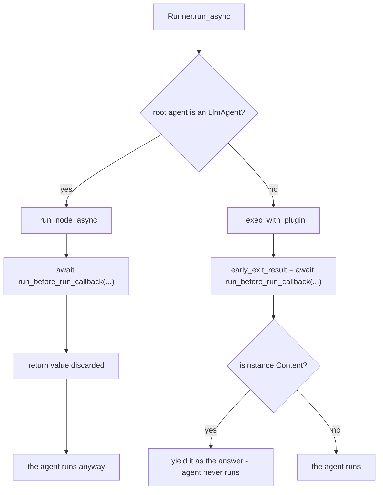

# 5.1 — The door documented to stop the run, and does not

## One-line answer

`before_run_callback` returning a `types.Content` is documented to halt the request and answer with
that content — and on an `LlmAgent` root, which is every agent Sutra has, the return value is
**discarded** and the agent runs anyway.

---

## The story

A shop on a corner with two ways in.

The main entrance faces the road. There is a proper door there, a shutter, and a hook for the
`CLOSED` board. Round the side there is a gap in the wall into the lane, which is how the staff come
and go and, over the years, how most regulars come and go too, because the lane is where everyone
parks.

The owner hangs the `CLOSED` board and goes for lunch. The board is real, the hook is real, and if
you walk up from the road you turn around and leave.

Nobody walks up from the road.

The board is not broken. It is doing exactly what a board does, on the entrance it is hanging on, and
the entrance it is hanging on is not the one being used. Finding that out requires walking round the
side, which nobody does, because why would you check whether the front door is the front door.

---

## The idea in plain language

`adk.dev/plugins/` documents `before_run_callback` like this:

> *"Return a `types.Content` object to **halt execution**."*

And `BasePlugin`'s own docstring in the installed package agrees:

> *"Returning a value to halt execution of the runner and ends the runner with that event. Return
> `None` to proceed normally."*

Two sources, one claim. It is a perfectly reasonable thing for the hook to do, and it is the obvious
place to put admission control — a maintenance window, a blocked user, a tripped circuit breaker.

**It does not happen when the root agent is an `LlmAgent`.**

The reason is that `Runner.run_async` has two code paths and only one of them uses the return value:

| root agent | path taken | `before_run_callback`'s return |
| --- | --- | --- |
| `LlmAgent` (chat or task mode) | `_run_node_async` | **awaited and discarded** |
| a `BaseNode` that is not a `BaseAgent` | `_run_node_async` | **awaited and discarded** |
| any other `BaseAgent` | `_exec_with_plugin` | honoured — the run halts |

In `_run_node_async` the call is written as a bare statement:

```text
await ic.plugin_manager.run_before_run_callback(invocation_context=ic)
```

No assignment. Nothing to check. Whereas `_exec_with_plugin` assigns it to `early_exit_result`, tests
`isinstance(early_exit_result, types.Content)`, and yields it as an event instead of running the
agent.

There is a comment in the runner that explains why the two paths exist, and it reads as a migration
in progress: *"remove … after all agents are refactored to use the node runtime path (requires adding
tracing and plugins to it)."* So this is a half-finished port, not a decision — the node path is newer,
and the plugin early-exit has not been carried across to it yet.

**Which means the hook works on the agent shapes you are least likely to have, and not on the one
every Sutra agent has.** Sutra's desk is an `LlmAgent`. Every agent in the plan through Phase 8 is an
`LlmAgent`. If you put a maintenance-window check in `before_run_callback`, it will run, it will
return its refusal, it will log whatever you log — and the request will proceed exactly as if you had
written nothing.

This is Day 13's discovery repeated one layer up, and the pattern is worth naming because it is now
twice: **at both layers, the return-value rule as documented and the return-value rule as implemented
differ, and neither difference produces an error.** Yesterday the gap was an empty dict falling
between two tests. Today it is an entire return value dropped on one of two code paths. Both times the
symptom is the same: your code ran, and nothing happened.

---

## Why Sutra needs it

**Because admission control has to go somewhere else.** Phase 10's safety work and Day 70's quota
gate both want to refuse a request before it starts. That refusal cannot live in
`before_run_callback` while Sutra's agents are `LlmAgent`s. The working alternatives are
`on_user_message_callback`, which genuinely does replace the message, or the model door, which
genuinely does short-circuit.

**Because you will read this hook in somebody else's code and believe it.** A plugin with a
`before_run_callback` returning a refusal looks like a working guard in review. It passes the eye
test. Knowing this makes you check the root agent type instead.

**Because Principle 14 says the plan is amended when reality changes.** If a later ADK release
finishes the port and the node path starts honouring this return, that is a behaviour change in a
pinned dependency — and the correct response is to amend before adapting, not to quietly delete this
part.

---

## The mechanism

The same plugin, the same `App`, two root agents.

```python
# lab/halt.py - the documented halt, on two root agent types. Zero model calls.
import asyncio
from collections.abc import AsyncGenerator

from google.adk.agents import BaseAgent, LlmAgent
from google.adk.apps import App
from google.adk.events import Event
from google.adk.plugins import BasePlugin
from google.adk.runners import Runner
from google.adk.sessions import InMemorySessionService
from google.genai import types
from stateless import ReactiveModel


def lookup_ticket(ticket_id: str) -> dict:
    """Look up a support ticket by its id."""
    return {"status": "ok", "ticket_id": ticket_id}


class Closed(BasePlugin):
    """Admission control: the desk is shut, so no request should run."""

    def __init__(self) -> None:
        super().__init__(name="closed")

    async def before_run_callback(self, *, invocation_context):
        return types.Content(role="model", parts=[types.Part(text="the desk is closed.")])


class Echo(BaseAgent):
    """A hand-written agent. Not an LlmAgent, so the runner takes its other path."""

    async def _run_async_impl(self, ctx) -> AsyncGenerator[Event, None]:
        yield Event(
            invocation_id=ctx.invocation_id,
            author=self.name,
            content=types.Content(role="model", parts=[types.Part(text="the desk answered.")]),
        )


async def drive(label: str, root: BaseAgent) -> None:
    print(f"  {label}")
    app = App(name="sutra", root_agent=root, plugins=[Closed()])
    runner = Runner(app=app, session_service=InMemorySessionService())
    session = await runner.session_service.create_session(app_name=app.name, user_id="u")
    async for event in runner.run_async(
        user_id="u",
        session_id=session.id,
        new_message=types.Content(role="user", parts=[types.Part(text="hi")]),
    ):
        for part in (event.content.parts if event.content else []) or []:
            if part.text:
                print(f"      {event.author}: {part.text}")


async def main() -> None:
    await drive(
        "a. root is an LlmAgent",
        LlmAgent(
            name="desk",
            model=ReactiveModel(model="scripted"),
            instruction="x",
            tools=[lookup_ticket],
        ),
    )
    await drive("b. root is a hand-written BaseAgent", Echo(name="echo"))


asyncio.run(main())
```

**Line by line:**

- `Closed.before_run_callback` returns a `types.Content` and nothing else — the smallest possible
  admission control, written exactly the way both docstrings describe.
- `class Echo(BaseAgent)` with `_run_async_impl` — a hand-written agent, about as small as one can be.
  It exists only to be a root agent that is **not** an `LlmAgent`, because that is the variable under
  test. A `SequentialAgent` would also work and is deprecated in 2.7.1 in favour of `Workflow`, so
  building the demonstration on it would be teaching a class the framework is retiring.
- `yield Event(...)` rather than returning a list — 1.x → 2.x **trap #3** (plan §5.1). A custom agent
  is an async generator that yields events as they happen.
- `print(f"      {event.author}: ...")` — the author is the tell. If the halt worked, the text comes
  from `model` (the runner synthesising an event from your content). If it did not, the text comes from
  the agent, by its own name.
- Both cases use the **same** `Closed` plugin class and the same `App` construction, so the only
  difference between them is the type of the root agent.
- `drive` takes `BaseAgent` as the parameter type, which is the common supertype of both roots and is
  what makes the two calls genuinely the same code path in the script.

The output:

```text
  a. root is an LlmAgent
      desk: KB-104: duplicate charge, refund issued.
  b. root is a hand-written BaseAgent
      model: the desk is closed.
```

In **b** the halt worked. The author is `model`, the text is the plugin's, and `Echo` never ran.

In **a** the halt did not work. The author is `desk` — the agent itself — and `the desk is closed.`
appears nowhere. The plugin ran. Its return value was thrown away. The model was called, the tool was
called, and the customer got a normal answer from a desk that was supposed to be shut.



Verified against the installed `google-adk` 2.7.1 on 2026-08-29, by running this script and by reading
`runners.py`: `_run_node_async` calls `run_before_run_callback` as a bare `await` statement, while
`_exec_with_plugin` assigns the result to `early_exit_result` and yields it as an event. The
documented behaviour is from `adk.dev/plugins/` and from `BasePlugin.before_run_callback`'s own
docstring in the same install.

---

## When it breaks

**💥 It does not break. That is the entire problem.**

```text
(no error, no warning, no log line - the guard runs and the request proceeds)
```

There is nothing to search for. The plugin's own code executed and returned. From inside the plugin,
everything worked.

**💥 You test it and the test passes.** If your test drives a `Runner` over anything other than an
`LlmAgent` root — including some test doubles — the halt works there and not in production. A test
that constructs the same root agent type as production is the only test that would have caught this,
which is a general rule worth taking away from the specific bug.

**💥 You migrate a working guard and it stops working.** The worst version: this hook was doing its
job on a `SequentialAgent` root; somebody simplifies the application to a single `LlmAgent`, which is
a clean refactor with no warnings; the maintenance-window guard silently switches off. Nothing in the
diff touches the plugin.

---

## In production

**What a professional writes instead of the teaching version** puts admission control at a door whose
return value is definitely used, and says why in the docstring:

```python
async def on_user_message_callback(
    self, *, invocation_context, user_message
) -> types.Content | None:
    """Admission control. NOT before_run_callback: its return is discarded on LlmAgent roots."""
    if not self._closed():
        return None
    return types.Content(role="model", parts=[types.Part(text="the desk is closed.")])
```

**Line by line:**

- The docstring names the hook **not** used and why. Without it, the next person moves this to
  `before_run_callback` because that is where admission control obviously belongs, and re-introduces
  the bug. A comment that prevents a plausible future edit is worth more than one describing the
  present code.
- `on_user_message_callback` is chosen because its return value genuinely takes effect on every path —
  you measured that in [2.2](../02-the-fourteen-doors/2.2-the-four-doors-an-agent-cannot-have.md).
  Note what it does though: it **replaces the user's message**, it does not halt the run. The agent
  still runs, on your text instead of theirs. That is a different behaviour and it has to be designed
  for, not assumed.
- `return None` first on the open path, for
  [3.1](../03-the-rule-at-this-layer/3.1-is-not-none-and-this-time-it-means-it.md)'s reason: at this
  layer any non-`None` value takes effect, so the carry-on path is stated explicitly and early.
- The annotation `types.Content | None` documents both outcomes at the signature, so a reader knows
  the hook can return something without reading the body.

If you need a genuine stop rather than a rewrite, the honest option is `before_model_callback`
returning an `LlmResponse`: that short-circuit is used on every path, and it stops the model call
rather than the run. The agent still starts, and the difference matters if starting an agent has side
effects of its own.

**What degrades at scale** is that this is a version-pinned fact. It is true of `google-adk` 2.7.1 on
the day this was written. The runner comment says the node path is unfinished, so a later release may
well honour the return — at which point a guard somebody wrote as a no-op suddenly starts halting
requests. That is why the check below belongs in the test suite rather than in your memory.

**The failure that only shows with real traffic** is a circuit breaker that never opens. During an
incident, the thing supposed to shed load returns its refusal on every request and sheds nothing,
while your dashboards show the breaker "tripping" because the plugin is logging that it tripped. You
will believe the breaker is working and look elsewhere for hours.

**The review comment a senior engineer leaves:** *"This is admission control in `before_run_callback`
with an `LlmAgent` root — the return is discarded on that path, so this guard does nothing. Move it to
`on_user_message_callback`, and add a test that asserts the request is actually refused rather than
asserting the hook ran."*

**The interview question:** *"Have you ever found framework behaviour that contradicted its own
documentation?"* — "Yes, and recently. ADK's plugin `before_run_callback` is documented, in the guide
and in the class's own docstring, to halt the request if you return a `Content`. It does — but only on
one of the runner's two code paths. With an `LlmAgent` as the root agent, which is the common case,
the call is a bare `await` with the return value discarded, so the guard runs and the request proceeds
anyway with no error. I found it by writing a test that asserted the *outcome* rather than that the
hook fired, and I confirmed it by reading the runner, where there is a comment saying the node path is
mid-migration. The practical lesson I took is that for anything security- or availability-critical, the
test has to assert the effect, because a hook that runs and does nothing looks identical from inside
the hook."

---

## Check yourself

```bash
cd days/day-14-plugins-one-layer-up/lab && uv run python halt.py
```

Record what **your** version does. If case **a** now prints `the desk is closed.`, the port has landed
in your ADK — stop, read Principle 14, and amend the plan before you change any code.

**Answer out loud, without scrolling up:**

> Say what happens to `before_run_callback`'s return value when the root agent is an `LlmAgent`, and
> name the hook you would use for admission control instead.

---

**Next:** [5.2 — The bill that never prints](5.2-the-bill-that-never-prints.md)
