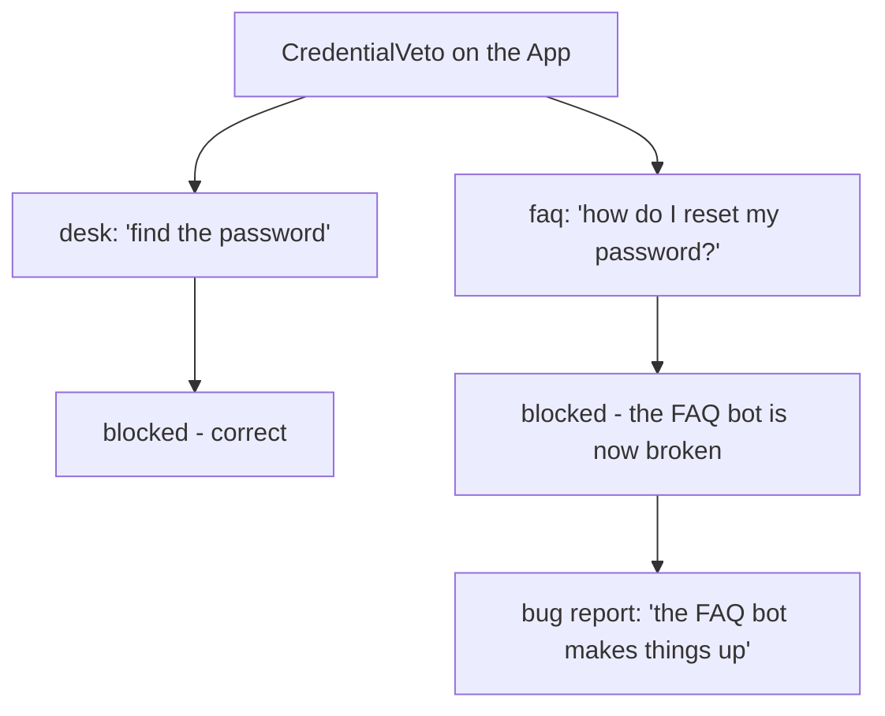

# 6.1 — 💥 The rule that broke an agent nobody was looking at

## One-line answer

Promoting a correct per-agent policy to an application-wide plugin applies it to agents it was never
written for — so a guard that was right for the triage desk silently disables the one agent whose
actual job is the thing being blocked.

---

## The story

A housing society puts up a notice: **no deliveries after 9pm.**

It is a reasonable notice. There had been a run of late-night food-delivery riders buzzing every flat
because they could not find the right one, and residents complained, and the committee acted.

On the third floor there is a nurse who works nights. Her medicines come from the chemist after her
shift starts, because that is the only window she is home to receive them. She was not the problem the
notice was written for. She is not mentioned in it. She was not at the meeting.

The notice does not know any of that. It is one line on a board at the gate, and it applies to
everything that arrives after nine.

When her delivery is turned away, she calls the chemist and shouts at the chemist. The chemist checks
their system, which says out for delivery, and shrugs. It takes her a fortnight to work out that the
thing stopping her medicines is a piece of paper downstairs that has nothing to do with either of them.

The committee was right about the riders. The notice was still wrong, because a rule aimed at one
behaviour was written at a scope that covers every behaviour.

---

## The idea in plain language

Yesterday you built a guard on the desk:
[13/3.2](../../../day-13-callbacks-four-doors/parts/03-the-tool-doors/3.2-refusing-a-tool-call-honestly.md)'s
`block_forbidden_queries`, which refuses knowledge-base searches containing credential terms. It was
the right rule. A triage agent reading customer tickets has no business searching for anybody's
password, and if it tries, something has gone wrong.

Today gave you an argument that sounds obviously correct: *a security rule should not depend on
somebody remembering to attach it.* [1.1](../01-where-a-plugin-lives/1.1-the-rule-nobody-has-to-remember.md)
made exactly that case. So you move the guard into a plugin, where it covers every agent — including
agents added next quarter.

And then Sutra grows a second agent. A self-service FAQ agent, whose single most common job is
answering *"how do I reset my password?"* from the knowledge base.

Its query contains the word `password`. Your rule blocks it.

Now count the ways this is hard to find:

**The FAQ agent's code is correct.** Its instruction is right, its tools are right, its schema is
right. Somebody debugging it will read all three and find nothing.

**The FAQ agent does not import the plugin.** There is no reference, anywhere in that agent's file, to
the thing stopping it. `grep` for the agent's name finds nothing in the plugin either.

**Nothing raises.** The guard returns a dict. That is a successful tool result as far as the runtime is
concerned. No traceback, no log at error level.

**The bug report will not mention any of this.** It will say *"the FAQ bot has started making things
up about password resets."* Which is true — the model got `{"status": "blocked", ...}`, had nothing to
answer from, and did what models do with nothing.

The insight is one sentence: **put the mechanism where the policy's scope is.** The desk's rule was
about the desk's job. The scope of "this agent should not chase credentials" is one agent, and it does
not become an application-wide truth just because it is a security rule.

The test from [1.1](../01-where-a-plugin-lives/1.1-the-rule-nobody-has-to-remember.md) still works, and
running it honestly gives the right answer here. *If somebody adds an agent next quarter and forgets
this rule, is that a bug or a choice?* For "never send credentials to a model provider" — a bug, so it
is a plugin. For "this agent must not search for credentials" — a **choice**, because the next agent
might be the FAQ bot, whose whole purpose is the thing you are banning.

---

## Why Sutra needs it

**Because Sutra's build brief asks you to make this exact call today.** The hub's `TODO(me)` asks
which of Day 13's two callbacks belongs in a plugin. One of them does. The other is this trap, and the
day would be teaching you to walk into it if it stopped at section 4.

**Because Phase 8 adds five agents at once.** A researcher, a writer and a critic all get every plugin
the application has, on the day they are created, without anybody reviewing whether the plugins suit
them.

**Because Phase 10 is going to want global rules.** Days 66–72 add real security controls, and some of
them genuinely belong at the application layer. Knowing which ones is the skill, and it is learned by
getting it wrong once, deliberately, here.

---

## The mechanism

Two agents, one plugin, three runs.

```python
# lab/blast_radius.py - one global veto, two agents, one of them wrecked. Zero model calls.
import asyncio

from google.adk.agents import LlmAgent
from google.adk.apps import App
from google.adk.plugins import BasePlugin
from google.adk.runners import Runner
from google.adk.sessions import InMemorySessionService
from google.genai import types
from stateless import ReactiveModel

FORBIDDEN = ("password", "credential", "api key")


def search_kb(query: str) -> dict:
    """Search the knowledge base."""
    print(f"        >> search_kb actually ran: {query!r}")
    return {"status": "ok", "hits": ["KB-104: reset flow"]}


def blocked(reason: str, next_step: str, by: str) -> dict:
    """Day 13's refusal shape, plus who refused."""
    return {"status": "blocked", "reason": reason, "next": next_step, "blocked_by": by}


class CredentialVeto(BasePlugin):
    """A desk policy, promoted to application law. This is the mistake."""

    def __init__(self) -> None:
        super().__init__(name="credential_veto")

    async def before_tool_callback(self, *, tool, tool_args, tool_context):
        haystack = " ".join(str(value) for value in tool_args.values()).lower()
        if not any(term in haystack for term in FORBIDDEN):
            return None
        return blocked(
            reason="credential-related lookups are not permitted",
            next_step="ask a human agent",
            by=self.name,
        )


def desk() -> LlmAgent:
    """Triage. Should NOT go looking for credentials."""
    return LlmAgent(
        name="desk",
        model=ReactiveModel(model="scripted", chain=["search_kb"]),
        instruction="x",
        tools=[search_kb],
    )


def faq() -> LlmAgent:
    """Self-service FAQ. Answering 'how do I reset my password' IS its job."""
    return LlmAgent(
        name="faq",
        model=ReactiveModel(model="scripted", chain=["search_kb"]),
        instruction="x",
        tools=[search_kb],
    )


async def drive(label: str, agent: LlmAgent, question: str, plugins: list[BasePlugin]) -> None:
    print(f"    {label}")
    app = App(name="sutra", root_agent=agent, plugins=plugins)
    runner = Runner(app=app, session_service=InMemorySessionService())
    session = await runner.session_service.create_session(app_name=app.name, user_id="u")
    async for event in runner.run_async(
        user_id="u",
        session_id=session.id,
        new_message=types.Content(role="user", parts=[types.Part(text=question)]),
    ):
        for part in (event.content.parts if event.content else []) or []:
            if part.function_response:
                print(f"        the model was told: {part.function_response.response}")


async def main() -> None:
    print("  WITHOUT the plugin")
    await drive("a. faq: how do I reset my password?", faq(), "password reset", [])
    print("  WITH the plugin")
    await drive("b. desk: find the customer's password", desk(), "password", [CredentialVeto()])
    await drive("c. faq: how do I reset my password?", faq(), "password reset", [CredentialVeto()])


asyncio.run(main())
```

**Line by line:**

- `FORBIDDEN` as a tuple of plain substrings — deliberately naive, exactly as it was on Day 13. The
  point of the part is the **scope** of the rule, not the quality of the detector; a smarter detector
  would still be wrong at this layer, and building one here would hide that.
- `haystack = " ".join(str(value) for value in tool_args.values()).lower()` — every argument value,
  flattened. This is what makes the guard fire on the FAQ agent: its `query` argument carries the
  user's own words, and those words legitimately contain `password`.
- `if not any(...): return None` — the carry-on path first, per
  [3.1](../03-the-rule-at-this-layer/3.1-is-not-none-and-this-time-it-means-it.md). Note that at this
  layer returning `None` also lets the *agent's* callbacks run; a falsy dict here would stop
  everything.
- `blocked(..., by=self.name)` — Day 13's three-field refusal with a fourth field added: **who
  refused**. That single field is the difference between a fortnight of debugging and one grep, and it
  is the only mitigation in this part that survives the redesign.
- `desk()` and `faq()` are functions returning fresh agents rather than module constants, so each run
  gets its own and there is no chance a leftover callback from one explains the other's behaviour.
- The two agents are **identical apart from their names**. That is on purpose: the difference between
  them is not in their code at all, it is in what their users legitimately ask. A reviewer comparing
  the two files would find nothing, which is the whole failure.
- Case **a** runs the FAQ agent with `plugins=[]` first, to establish that it works. Without that
  line, case **c** would only show a blocked agent, not a *broken* one.
- `question` is passed through to the model, which puts it in `query` — see `stateless.py` in
  [2.2](../02-the-fourteen-doors/2.2-the-four-doors-an-agent-cannot-have.md). A model searches with
  the user's words, which is exactly why the collision happens in reality.

The output:

```text
  WITHOUT the plugin
    a. faq: how do I reset my password?
        >> search_kb actually ran: 'password reset'
        the model was told: {'status': 'ok', 'hits': ['KB-104: reset flow']}
  WITH the plugin
    b. desk: find the customer's password
        the model was told: {'status': 'blocked', 'reason': 'credential-related lookups are not permitted', 'next': 'ask a human agent', 'blocked_by': 'credential_veto'}
    c. faq: how do I reset my password?
        the model was told: {'status': 'blocked', 'reason': 'credential-related lookups are not permitted', 'next': 'ask a human agent', 'blocked_by': 'credential_veto'}
```

Case **b** is the rule working. The desk went looking for a password and was stopped. This is the
behaviour you wanted and it is genuinely valuable.

Case **c** is the same rule, the same line of code, doing real damage. `>> search_kb actually ran` is
**absent** — the FAQ agent's core function is disabled. Compare it with case **a**, where the identical
question worked.

The two blocks are byte-for-byte identical apart from the agent. That is what "one rule, every agent"
means when the rule was written for one agent.



Verified against the installed `google-adk` 2.7.1 on 2026-08-29 by running this script.

---

## The exercise

Three steps, and the third is the one that matters.

**Step 1 — feel it.** Run the script. Look at case **c** and case **a** side by side. Then open
`faq()` and try to find, in that function, anything that would explain the difference. There is
nothing there, and sitting with that is the point of the exercise.

**Step 2 — make it worse, then say why.** Change `blocked(...)` to return
`{"status": "ok", "hits": []}` instead. Run it again. The FAQ agent now confidently tells the customer
there is no article about password resets — which is a lie your own system invented, delivered in the
voice of your product. Write one sentence on why a dishonest refusal is worse than a broken agent.
This is [13/3.2](../../../day-13-callbacks-four-doors/parts/03-the-tool-doors/3.2-refusing-a-tool-call-honestly.md)'s
argument, and the blast radius is now the whole application.

**Step 3 — `TODO(me)`: decide the real split, and write it down.** Sutra has two rules in play:

| Rule | Which layer? Why? |
| --- | --- |
| never send credential *values* to a model provider | `TODO(me)` |
| this triage desk must not *search* for credentials | `TODO(me)` |

Fill in both rows with the layer and one sentence of justification each, using the question from
[1.1](../01-where-a-plugin-lives/1.1-the-rule-nobody-has-to-remember.md). Then answer the harder
follow-up: **what would have caught this in CI?** There is no test in Sutra's suite today that would
have gone red. Name the assertion, and note which agent it has to be written against.

**Then remove the plugin** and confirm the FAQ agent heals.

---

## When it breaks

**💥 The refusal with no `blocked_by`.**

```text
the model was told: {'status': 'blocked', 'reason': 'credential-related lookups are not permitted'}
```

This is the version that costs a fortnight. The refusal is honest — it says it was blocked and why —
and it does not say **who** blocked it. With one plugin and one agent callback both capable of
producing a refusal, that transcript does not tell you which file to open.

**💥 The FAQ agent's own tests still pass.** No error text, because a test that drives the agent
directly, without the application's plugins, is testing an agent that no longer exists in production.
This is [1.2](../01-where-a-plugin-lives/1.2-the-app-is-what-plugins-belong-to.md)'s
`InMemoryRunner` trap wearing a different coat: the tests exercise a different `App` from the one that
ships.

**💥 The rule that is right today and wrong in six months.** No error at any point. `FORBIDDEN`
containing `"api key"` is uncontroversial until somebody adds an agent that helps developers rotate
their API keys. The rule did not change and did not need to; the application grew a legitimate use for
the banned word.

---

## In production

**What a professional writes instead of the teaching version** scopes the rule inside the plugin
rather than choosing between "one agent" and "all agents":

```python
CREDENTIAL_SEARCH_EXEMPT = frozenset({"faq"})


async def before_tool_callback(self, *, tool, tool_args, tool_context) -> dict | None:
    if tool_context.agent_name in CREDENTIAL_SEARCH_EXEMPT:
        return None
    ...
```

**Line by line:**

- `tool_context.agent_name` — the plugin can see which agent it is acting on, so "application-wide
  with exceptions" is available and does not require moving the rule back down a layer.
- `frozenset` rather than a list — immutable, so nothing can append to it at runtime, and membership
  is a hash lookup rather than a scan.
- The exemption is checked **first** and returns `None`, so the exempt path is one line and cannot
  fall through into the blocking logic.
- The constant is named for the exemption, not for the agents. `CREDENTIAL_SEARCH_EXEMPT` says what
  membership means; a name like `SPECIAL_AGENTS` would require reading the code to find out.

Be honest about what that costs, though: an allow-list is a second place to update when an agent is
added, which is the exact maintenance burden plugins were supposed to remove. It is the right answer
when the rule really is near-universal with a known exception. When the exceptions outnumber the
rule's natural scope, that is the signal the rule was never application-wide, and it belongs back on
the agents that want it.

**What degrades at scale** is that plugins are invisible from the place people debug. An engineer
debugging an agent opens the agent's file. Nothing in it mentions any plugin, and there is no
framework-level "here is what is installed above you". Teams that run many plugins end up printing the
installed plugin list at startup and putting the plugin's name in every value it returns, which is
what `blocked_by` is doing here.

**The failure that only shows with real traffic** is the partial block. A rule that fires on 2% of
queries does not break an agent; it degrades it. The agent works in every demo, works in every test,
and quietly fails for one slice of real users — the slice whose vocabulary happens to intersect your
`FORBIDDEN` list. Nobody reports "the bot is broken" because for almost everybody it is not.

**The review comment a senior engineer leaves:** *"This moves a desk-specific rule to the application
layer. What happens to the FAQ agent, whose top query is 'reset my password'? If this has to be
global, it needs an agent allow-list and every refusal needs `blocked_by`."*

**The interview question:** *"Tell me about a time a change that made the system safer made it
worse."* — "I promoted a per-agent security rule to an application-wide plugin — a triage agent
shouldn't be searching for customer credentials, and I didn't want that rule to depend on somebody
remembering to attach it to each new agent. Correct instinct, wrong scope. Sutra also had a
self-service FAQ agent whose single most common query was 'how do I reset my password', and the plugin
blocked it. Nothing raised, because a refusal is a valid tool result, and the FAQ agent's own code was
perfect, so it was invisible from the file anyone would open. It got reported as the bot
hallucinating. Two things came out of it. First, the scope test: if somebody adds an agent next
quarter and forgets this rule, is that a bug or a choice? 'Never send credential values to a provider'
is a bug. 'This desk shouldn't search for credentials' is a choice, so it stays on the desk. Second,
every refusal my code generates now names the component that produced it — that field turns a
fortnight of bisecting into one grep."

---

## Check yourself

```bash
cd days/day-14-plugins-one-layer-up/lab && uv run python blast_radius.py
```

Then add `CREDENTIAL_SEARCH_EXEMPT` as above, confirm case **c** heals while case **b** stays blocked,
and decide whether you would ship that or move the rule back to the desk.

**Answer out loud, without scrolling up:**

> Say what the bug report for this failure will actually claim, and name the one field in the refusal
> that makes it findable.

---

**Next:** [7.1 — The plugins ADK already ships](../07-in-production/7.1-the-plugins-adk-already-ships.md)
