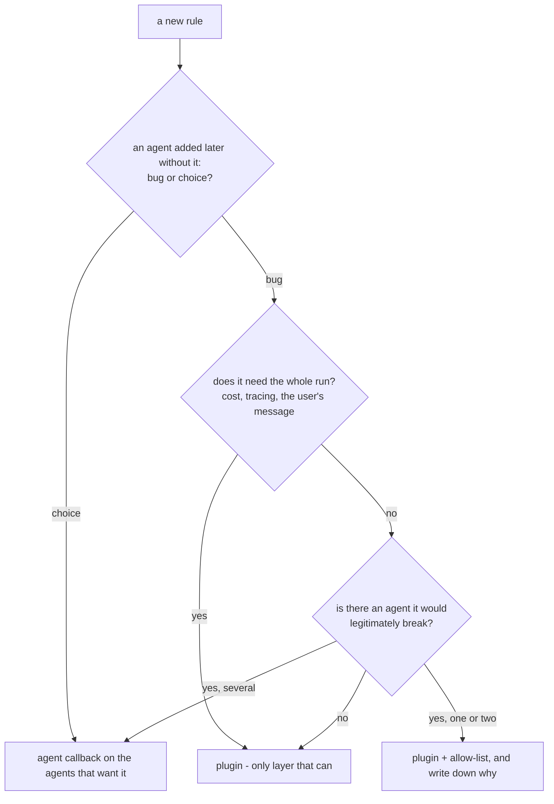

# 7.3 — Which layer does this rule belong to

## One-line answer

One question decides it — *if somebody adds an agent next quarter and forgets this rule, is that a bug
or a choice?* — and the answer is written down next to the code, because the layer is a decision and an
undocumented decision gets reversed by the next person.

---

## The story

A family with two children and a fridge door.

Some rules go on the fridge, on a piece of paper, for everyone: shoes off at the door, nobody uses the
gas when they are alone in the house. They are written because they apply to whoever is in the house
— including the cousin who visits in the summer and the new help who starts in March. Nobody is told
them individually, because being told individually is exactly the part that fails.

Other things are said to one child. *You specifically need to be back before dark, because you have a
history of not being.* That is not a house rule. Putting it on the fridge would be unfair to the other
one and would not actually be the rule anyone meant.

The mistake that causes arguments is not picking wrong once. It is picking without saying why, so that
six months later nobody can remember whether "back before dark" was a house rule that got relaxed or a
personal rule that got forgotten — and the argument is then about memory rather than about the rule.

---

## The idea in plain language

You now have two places to put a rule and you have felt both failure modes.

Put it too **low** — on one agent — and every agent added later is uncovered, silently, and coverage
depends on somebody remembering. That is [1.1](../01-where-a-plugin-lives/1.1-the-rule-nobody-has-to-remember.md).

Put it too **high** — on the application — and it applies to agents it was never written for, silently,
and breaks the one whose job is the thing you banned. That is
[6.1](../06-failure-lab/6.1-the-rule-that-broke-an-agent-nobody-was-looking-at.md).

Both failures are silent. Neither raises. So the decision cannot be made by trying it and seeing.

**The question that decides it:** *if somebody adds an agent next quarter and forgets this rule, is
that a bug or a choice?*

If it is a **bug** — the new agent is wrong, always, no exceptions — the rule is a property of the
system and belongs in a plugin.

If it is a **choice** — the new agent might legitimately want the opposite — the rule is a property of
one agent's job and belongs in a callback on that agent.

Run it over the rules Sutra actually has:

| Rule | Bug or choice? | Layer |
| --- | --- | --- |
| never send credential **values** to a provider | bug — no agent may ever do this | plugin |
| trace every model call | bug — a gap in a trace is worse than no trace | plugin |
| count every model call against quota | bug — an unmetered agent breaks the router | plugin |
| this triage desk must not **search** for credentials | choice — the FAQ agent legitimately does | agent callback |
| this desk trims its knowledge-base results to 188 characters | choice — another agent's results are not its business | agent callback |
| this desk speaks in the support persona | choice — obviously per agent | agent instruction |

The two credential rows are the interesting pair, because they read almost the same and land in
different places. *Never transmit a credential value* is about the boundary between Sutra and the
outside world, and it is true of every agent that will ever exist here. *Do not search for
credentials* is about what one agent's job is, and
[6.1](../06-failure-lab/6.1-the-rule-that-broke-an-agent-nobody-was-looking-at.md) is what happens
when you cannot tell them apart.

There is a third answer, and it should be used with suspicion: **a plugin with an agent allow-list.**
It is right when a rule really is near-universal with a named exception. It is wrong — and it is a
signal you asked the question badly — when the list keeps growing, because a rule with five exceptions
was never a property of the system.

And the last rule is about writing rather than architecture: **the decision goes next to the code.**
Not in a commit message, not in your head. A plugin's docstring says who it applies to and why it is
not a callback; a security callback's docstring says why it is not a plugin. Both sentences exist to
survive the next person's reasonable instinct to move it.

---

## Why Sutra needs it

**Because the build brief asks you to make this call today.** The hub's `TODO(me)` asks which of Day
13's two callbacks belongs in a plugin. One does and one does not, and the day has now shown you the
cost of getting either direction wrong.

**Because Phase 8 makes the cost real.** Days 53–59 add a researcher, a writer and a critic. Every
rule you place today is applied — or not applied — to three agents nobody has written yet, on the day
they are created, with nobody reviewing the fit.

**Because Phase 10 is a phase of new rules.** Days 66–72 add prompt-injection defences, output
filtering, a quota gate and an escalation path. Each one is this question asked again, and a phase
that answers it by instinct will produce both failure modes in the same week.

---

## The mechanism

There is no new API in this part. The mechanism is a written decision, and the shape it takes in code
is a docstring that answers the question before anybody asks it.

```python
# sutra/plugins.py
class RunLedger(BasePlugin):
    """Counts model and tool calls per invocation, for every agent in the app.

    Layer: PLUGIN. If an agent added next quarter is not metered, the Day 70
    quota router reads low and sheds load it did not need to shed - that is a
    bug, not a choice, so coverage cannot depend on anyone remembering to
    attach this. It also needs the run-level doors, which agents do not have.
    """
```

```python
# sutra/desk/callbacks.py
def block_forbidden_queries(tool, args, tool_context) -> dict | None:
    """Refuses credential searches from the triage desk.

    Layer: AGENT CALLBACK, deliberately not a plugin. A self-service FAQ agent's
    most common query is "how do I reset my password", and this rule would
    disable it with no error anywhere. The application-wide rule is the narrower
    "never transmit a credential value", which is a different check.
    """
```

**Line by line:**

- Both docstrings open with what the thing does and then state `Layer:` explicitly. A reader deciding
  whether to move this code finds the previous decision before they make a new one.
- The plugin's docstring names the **consequence** of under-coverage — the router reads low — rather
  than saying "this is important". A justification a reader can check is one they can also disagree
  with on evidence, which is the point.
- The callback's docstring names the **specific agent** that would break. `6.1`'s failure took a
  fortnight to find because nothing anywhere connected the rule to the agent it damaged; one sentence
  in the right file is the whole fix.
- *"which is a different check"* on the last line does the most work in the least space: it stops the
  reader concluding that Sutra has no application-wide credential rule and going off to add one.
- Neither docstring mentions this day, a part number or a lesson. The repo is read by people who have
  not done the curriculum, and a docstring that cites a lesson is a docstring that has stopped
  explaining itself.

The decision as a flowchart, for the next rule rather than for these two:



---

## When it breaks

**💥 The rule that is a bug today and a choice next year.** No error. `FORBIDDEN` containing
`"api key"` is uncontroversial until somebody adds an agent that helps developers rotate their API
keys. Nothing changed about the rule; the application grew a legitimate use for the banned word. The
mitigation is the allow-list plus the docstring, and the honest position is that the decision has a
shelf life.

**💥 The allow-list nobody can justify.**

```python
CREDENTIAL_SEARCH_EXEMPT = frozenset({"faq", "onboarding", "dev_tools", "docs_bot"})
```

Four exemptions is the answer to a question that was asked wrong. When the list approaches the number
of agents, the rule is not application-wide and the fix is to move it back down, not to keep appending.

**💥 The decision that was made and not written.** No error, and it reverses within two quarters. A
reviewer sees a security rule on one agent, correctly observes that new agents will not have it, moves
it to a plugin, and re-creates [6.1](../06-failure-lab/6.1-the-rule-that-broke-an-agent-nobody-was-looking-at.md)'s
failure — having done exactly what a good reviewer should do with the information available.

---

## In production

**What a professional writes instead of the teaching version** does not rely on a docstring alone for
a decision that matters. They write the test that encodes it:

```python
def test_the_faq_agent_can_still_search_for_password_articles() -> None:
    """The credential guard is desk-scoped on purpose. This test is the fence."""
    app = build_app(root_agent=faq_agent())
    result = asyncio.run(search_through(app, "how do I reset my password"))
    assert result["status"] == "ok", "a global credential veto has been reintroduced"
```

**Line by line:**

- The test name states the guarantee in words, so a failure in CI reads as the broken promise rather
  than as an assertion number.
- `build_app(root_agent=...)` — the **real** application factory from
  [1.2](../01-where-a-plugin-lives/1.2-the-app-is-what-plugins-belong-to.md), so the test sees whatever
  plugin list production sees. Constructing a bespoke `App` here would test a system nobody runs.
- The assertion message names the cause, not the symptom. Somebody who has just moved a guard into a
  plugin reads *"a global credential veto has been reintroduced"* and knows immediately what they did.
- The docstring says *"this test is the fence"* — it exists to fail, and it protects a decision rather
  than a behaviour. A future reader tempted to delete a test that seems to assert something trivial is
  told why it is there.

**What degrades at scale** is that the number of these decisions grows with the product of agents and
rules, and nobody re-reads them. Teams that run many agents end up with a single document listing
every application-wide rule and its justification, reviewed when an agent is added — because the
review that matters is not "is this plugin correct" but "is this plugin correct **for the agent we are
about to add**".

**The failure that only shows with real traffic** is the rule that is right for 98% of agents. It does
not break anything visibly; it degrades one agent for one slice of its users, and that agent's owner
files a bug against their own agent. Both failure modes in this day —
[6.1](../06-failure-lab/6.1-the-rule-that-broke-an-agent-nobody-was-looking-at.md)'s over-reach and
[1.1](../01-where-a-plugin-lives/1.1-the-rule-nobody-has-to-remember.md)'s under-coverage — are
partial in production and total only in demos.

**The review comment a senior engineer leaves:** *"This is a new plugin with no statement of scope. Add
one line saying which agents it applies to and why an agent added later must have it — otherwise the
next person moves it and we cannot tell whether that is a fix or a regression."*

**The interview question:** *"How do you decide whether a cross-cutting concern belongs in framework
middleware or in the individual component?"* — "One question: if somebody adds a component next quarter
and forgets this rule, is that a bug or a choice? If it is a bug, it goes in the middleware, because
coverage should be a property of the system and not of somebody's memory. If it is a choice, it stays
on the component, because the next component might legitimately want the opposite. I have made both
mistakes. Leaving a rule too low means new agents are silently uncovered. Pushing it too high meant a
security rule written for a triage agent disabled a FAQ agent whose most common query was 'reset my
password' — no error anywhere, and invisible from that agent's own file. The thing I do differently
now is write the decision next to the code and back it with a test, because both failure modes are
silent, and without the note the next reviewer reverses the call for perfectly good reasons."

---

## Check yourself

Open `sutra/plugins.py` and `sutra/desk/callbacks.py` and confirm each carries one sentence saying
which layer it is on and why. Then:

```bash
uv run python -m pytest tests/test_plugins.py -q -m "not live" && ./m depth 14
```

**Answer out loud, without scrolling up:**

> Give the one question that decides the layer, and say which of Sutra's two credential rules goes
> where.

---

**Next:** the parts are done. Now read where the idea came from:
[papers/01 — Aspect-oriented programming](../../papers/01-aspect-oriented-programming.md).
