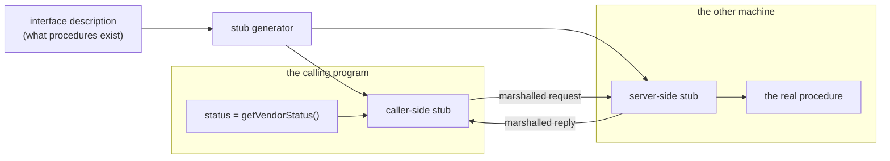

# Paper 01 — Implementing remote procedure calls

> **Implementing remote procedure calls**
> `doi:10.1145/2080.357392` · 1984 · ACM Transactions on Computer Systems 2(1), 39–59
> <https://doi.org/10.1145/2080.357392>
> Record opened and title copied on 2026-08-30.

**Read this after the parts.** Section 4 had you generate working tools from a document you did not
write. This is the paper that proposed doing that, forty years earlier, and the half of its proposal
that the field threw away is the half that explains
[6.1](../parts/06-failure-lab/6.1-the-crate-that-arrived-empty.md).

## One-line answer

It proposed that calling a procedure on another machine should look like calling one locally, with the
connecting code **generated from an interface description** rather than written by hand — and the
generation survived completely while the looking-like-a-local-call did not.

## The story

Giving somebody directions to your house, before anybody had a map on their phone.

You did it on the telephone, and you did it differently every time. Past the church, second left after
the postbox, it is the one with the blue gate — no, the *other* blue gate. If the person was coming
from the north you gave different directions than if they were coming by train. You knew the way
perfectly and you were still bad at this, because describing a route is a completely different skill
from knowing one.

And everybody who visited had to be told separately. Twelve visitors, twelve phone calls, twelve
slightly different sets of instructions, and at least two people ringing from a lay-by. The knowledge
existed. It was in your head, and getting it into somebody else's was manual work that had to be
redone from scratch for every single person.

Then the address became something a machine could read. You stopped describing the route. You gave
five characters and a number, and the describing — which was always the error-prone part — was done
by something that does not get bored or forget the postbox.

## The idea in plain language

In 1984, getting one program to ask another program on a different machine to do something meant
writing the conversation by hand. You decided how to lay the arguments out as bytes, wrote the code to
send them, wrote the code on the other side to take them apart again, and wrote both halves of the
error handling. Every call, every program, every time — and both halves had to agree exactly, forever,
including after somebody added an argument.

The paper's proposal has three parts:

- **Write the interface once**, in a description that says what procedures exist, what arguments they
  take and what they return. This is an **interface description** — the same job an OpenAPI document
  does in [4.1](../parts/04-machine-packed/4.1-the-manual-the-service-publishes.md).
- **Generate the connecting code from it.** The paper calls the generated pieces **stubs**: on the
  caller's side, a thing that looks like an ordinary procedure and secretly does the network work; on
  the other side, a matching thing that unpacks the request and calls the real procedure. Turning
  arguments into bytes and back is **marshalling**.
- **Make the call look ordinary.** The programmer writes `status = getVendorStatus()` and nothing
  else. The paper's word for this goal is **transparency**: the remote call should be, as far as
  possible, indistinguishable from a local one.

Three terms defined, because all three are still in daily use:

- **RPC** — remote procedure call. Asking another machine to run a procedure and give you the answer.
- **Stub** — the generated code that makes that look like a normal call.
- **Binding** — finding out *which* machine to talk to, at run time, rather than hard-coding it. The
  paper spends real effort here; `servers[0].url` in
  [4.3](../parts/04-machine-packed/4.3-where-each-part-of-a-tool-comes-from.md) is the modest
  descendant.

## Why Sutra needs it

[4.2](../parts/04-machine-packed/4.2-spec-in-tools-out.md) is this paper. `OpenAPIToolset` is a stub
generator; each `RestApiTool` it produces is a stub; the OpenAPI document is the interface
description; `httpx` does the marshalling. You built the thing before you read the proposal, which is
Principle 4 at the scale of a day.

It matters again, more literally, in **Phase 5**. MCP is an RPC protocol — it even uses JSON-RPC, a
direct descendant — and `MCPToolset` generates tools from a description a server sends back. Day 32
will feel like an application of something you have already done twice.

And it explains a failure you have already seen. The paper's transparency goal is exactly what makes
[6.1](../parts/06-failure-lab/6.1-the-crate-that-arrived-empty.md) possible: when a remote call is
made to look like a local one, a *remote* failure has nowhere to appear except as a local silence.

## The mechanism

The paper's structure, as a shape you can hold:



Read it in two passes. **At build time**, one description goes into a generator and two pieces of code
come out — one for each side. **At call time**, the calling program touches only its own stub, and
everything to the right of it is machinery nobody wrote by hand.

Four decisions the paper made, and what became of each:

| The paper's decision | Why | Where it is now |
| --- | --- | --- |
| generate stubs from an interface description | hand-written marshalling is repetitive and gets out of step | gRPC, OpenAPI generators, `OpenAPIToolset` |
| the call site looks like a local call | so that using a remote procedure needs no new skill | **abandoned** — see *In production* |
| bind to a server at run time, not compile time | you cannot know the machine in advance | service discovery, `servers[0].url`, MCP connection parameters |
| build a transport protocol for the job | general-purpose ones were too slow for small calls | mostly abandoned; HTTP won on ubiquity |

The paper's own emphasis is worth noting, because it is not what it is remembered for. Its
measurements and much of its length are about **performance** — how few packets a call can take, how
to avoid setting up a connection each time. The stub generation is presented almost as the obvious
part. The obvious part is what survived.

## The paper in one demo

The paper's contribution, stripped to nothing else: **a caller that is built from an interface
description rather than written by hand**, with a switch that turns the generation off.

No ADK, no model, no network beyond `127.0.0.1`, no dependencies. Two files.

```text
lab/papers/implementing-remote-procedure-calls/
├── service.py   # a service, and the interface description it publishes about itself
└── client.py    # stubs generated from that description - or written by hand, with SPEC=0
```

**`service.py`** — three operations, and a description of them.

```python
"""The service, and the manual it publishes about itself.

Three endpoints, plus `/openapi.json` - the machine-readable description of the
other three. `/maintenance` was added after the hand-written client was written.
"""

from __future__ import annotations

import json
from http.server import BaseHTTPRequestHandler, HTTPServer

PORT = 8765

DATA = {
    "/status": {"state": "degraded", "since": "09:10Z"},
    "/incidents": {"open": 1, "latest": "EU auth cluster errors"},
    "/maintenance": {"window": "Sunday 02:00-04:00Z", "affects": "eu-west"},
}

OPERATIONS = [
    ("/status", "getStatus", "Current platform status."),
    ("/incidents", "getIncidents", "Open incidents right now."),
    ("/maintenance", "getMaintenance", "The next scheduled maintenance window."),
]

SPEC = {
    "openapi": "3.0.0",
    "info": {"title": "Vendor status API", "version": "1.0.0"},
    "servers": [{"url": f"http://127.0.0.1:{PORT}"}],
    "paths": {
        path: {
            "get": {
                "operationId": operation_id,
                "description": description,
                "responses": {"200": {"description": "ok"}},
            }
        }
        for path, operation_id, description in OPERATIONS
    },
}


class Handler(BaseHTTPRequestHandler):
    """Serves the three endpoints, and the spec that describes them."""

    def do_GET(self) -> None:
        body = SPEC if self.path == "/openapi.json" else DATA.get(self.path)
        if body is None:
            self.send_error(404)
            return
        payload = json.dumps(body).encode()
        self.send_response(200)
        self.send_header("Content-Type", "application/json")
        self.send_header("Content-Length", str(len(payload)))
        self.end_headers()
        self.wfile.write(payload)

    def log_message(self, fmt: str, *args: object) -> None:
        """Silence the access log; the client's output is the experiment."""


def serve_forever() -> None:
    """Run until the process ends. Started on a daemon thread by client.py."""
    HTTPServer(("127.0.0.1", PORT), Handler).serve_forever()
```

**Line by line:**

- `DATA` and `OPERATIONS` as two separate constants — the data the service holds, and the description
  of how to reach it. Keeping them apart is the paper's separation made visible: one is the service,
  the other is the interface.
- `SPEC` built from `OPERATIONS` by a comprehension — so the description **cannot** drift from the
  list it was built from. In a real service these are written by different people at different times,
  which is the whole of [5.2](../parts/05-where-it-bites/5.2-a-crate-that-never-changes-its-mind.md);
  here they are joined on purpose, so the demo is about generation and not about drift.
- `/openapi.json` served by the same handler as the data — the service publishes its own manual. This
  is the one line that makes the demo about the paper rather than about a config file.
- `self.send_error(404)` for anything unknown — an honest failure. A demo that returned an empty
  object for every path would let a broken client look like a working one.
- `log_message` overridden with only a docstring — the access log would double the output and the
  measurement is the client's list of operations, not the traffic.
- `serve_forever` as a plain function with no return — it is started on a daemon thread by the
  client, so one command runs the whole demo.

**`client.py`** — the stubs, generated or hand-written.

```python
"""Call the service twice: once from its published manual, once from wrappers a person wrote.

SPEC=1 python client.py    # read /openapi.json, build one caller per operation
SPEC=0 python client.py    # use the wrappers written by hand, last quarter
"""

from __future__ import annotations

import json
import os
import threading
import urllib.request
from collections.abc import Callable

import service

BASE = f"http://127.0.0.1:{service.PORT}"
Callers = dict[str, Callable[[], dict]]


def fetch(url: str) -> dict:
    """One GET, decoded as JSON. The only network code in the demo."""
    with urllib.request.urlopen(url) as response:
        return json.load(response)


def from_spec() -> Callers:
    """One caller per operation, built from the manual the service publishes."""
    spec = fetch(f"{BASE}/openapi.json")
    base = spec["servers"][0]["url"]
    callers: Callers = {}
    for path, methods in spec["paths"].items():
        for method, operation in methods.items():
            if method == "get":
                url = f"{base}{path}"
                callers[operation["operationId"]] = lambda url=url: fetch(url)
    return callers


def by_hand() -> Callers:
    """The wrappers a person wrote. `/maintenance` did not exist that quarter."""
    return {
        "getStatus": lambda: fetch(f"{BASE}/status"),
        "getIncidents": lambda: fetch(f"{BASE}/incidents"),
    }


def main() -> None:
    threading.Thread(target=service.serve_forever, daemon=True).start()

    spec_driven = os.environ.get("SPEC", "1") == "1"
    callers = from_spec() if spec_driven else by_hand()

    mode = "from the manual" if spec_driven else "hand-written"
    print(f"SPEC={'1' if spec_driven else '0'}  ({mode})")
    print(f"  operations known: {len(callers)}")
    for name in sorted(callers):
        print(f"    {name} -> {callers[name]()}")

    published = {
        methods["get"]["operationId"] for methods in fetch(f"{BASE}/openapi.json")["paths"].values()
    }
    for name in sorted(published - set(callers)):
        print(f"    {name} -> never called; nobody wrote a wrapper for it")


if __name__ == "__main__":
    main()
```

**Line by line:**

- `Callers = dict[str, Callable[[], dict]]` — a type alias naming the thing both halves produce. It is
  what makes `from_spec` and `by_hand` interchangeable, which is what makes the ablation a fair test:
  the rest of the program cannot tell which one it got.
- `from_spec()` is the **stub generator**, and it is nine lines. It reads the description, walks the
  operations, and produces one callable per operation named by its `operationId`. Nothing in it knows
  anything about status, incidents or maintenance.
- `lambda url=url: fetch(url)` — the default argument is the closure fix. Without it every generated
  caller would capture the same `url` variable, which after the loop holds the last one, and all three
  stubs would fetch `/maintenance`. This is the same late-binding trap Day 14's paper demo met, and it
  is why the parameter exists.
- `by_hand()` is the **ablation**: the same interface, produced by a person, frozen at the moment they
  wrote it. Two entries, because `/maintenance` did not exist then. This is not a strawman — it is
  exactly what hand-written wrappers do, which is stay correct and stop being complete.
- `os.environ.get("SPEC", "1") == "1"` — one environment variable turns the paper's contribution off.
  Everything else in the program is identical between runs, including the service.
- `threading.Thread(..., daemon=True)` — the service runs in the same process so the demo is **one
  command**. `daemon=True` means it dies with the program and needs no shutdown code, which would be a
  file you could delete and still have the claim land.
- The final loop compares what the service **publishes** against what the client **knows**, and prints
  the difference. This is the measurement: it is the only line that can tell you something is missing,
  and in the hand-written case it is the only place the missing operation appears at all.

**Run it both ways:**

```bash
cd days/day-15-toolsets-and-openapi/lab/papers/implementing-remote-procedure-calls
SPEC=1 uv run python client.py
SPEC=0 uv run python client.py
```

**Line by line:**

- `cd` into the demo's own directory first, because `client.py` does `import service` and that resolves
  against the working directory. Two plain files, no packaging — a `pyproject.toml` here would be a
  file you could delete and still have the claim land.
- `SPEC=1` written out even though it is the default, so the two commands differ by exactly one
  character and read as one experiment rather than two invocations.
- `SPEC=1` **first**: the feature, then its absence. Reversed, the second run looks like an addition
  rather than the removal of an ablation.

```text
SPEC=1  (from the manual)
  operations known: 3
    getIncidents -> {'open': 1, 'latest': 'EU auth cluster errors'}
    getMaintenance -> {'window': 'Sunday 02:00-04:00Z', 'affects': 'eu-west'}
    getStatus -> {'state': 'degraded', 'since': '09:10Z'}

SPEC=0  (hand-written)
  operations known: 2
    getIncidents -> {'open': 1, 'latest': 'EU auth cluster errors'}
    getStatus -> {'state': 'degraded', 'since': '09:10Z'}
    getMaintenance -> never called; nobody wrote a wrapper for it
```

**Three operations against two, and the same two produce byte-identical results in both runs.** The
service did not change. The hand-written client is not wrong about anything it knows — it is simply
missing an operation nobody got round to wrapping, and it cannot tell you that. The generated client
gained `getMaintenance` without a line being written, because the description gained it.

Turn the switch off and you have proved that the third operation came from the generator rather than
from anything else in the program. Verified by running both commands on 2026-08-30.

## When it breaks

The paper's proposal has held up unusually well, and it has one famous crack.

**Transparency is not achievable, and pretending otherwise is the problem.** A local procedure call
either returns or raises, quickly, and cannot half-happen. A remote one can be slow, can fail after
the work was done, and can leave the caller unable to tell whether it happened at all — the network
went away between the work and the answer. That last case has no local equivalent. The paper knows
this and discusses it; what it could not anticipate is how thoroughly programmers would take
"looks like a local call" as permission to *think* about it like one.

**Latency does not hide.** A local call is nanoseconds and a remote one is milliseconds — six orders
of magnitude, disguised by identical syntax. A loop that calls a local procedure a thousand times is
nothing; the same loop through a stub is a minute. Nothing at the call site says which one you are
looking at.

**The measurements are of one system on one network.** The performance work is on the authors' own
implementation, on a local network of the day. The specific numbers stopped being useful long ago;
the design reasoning did not.

**Its transport did not survive.** Building a purpose-made protocol for small calls was right in 1984
and is not what happened. HTTP won, at some real cost in efficiency, because it goes through firewalls
and because everything speaks it. Every descendant in the table above rides on HTTP.

## In production

**What survived, completely: generating the connecting code from an interface description.** It is so
ordinary now that most people using it do not know it has a name or a paper.

| Where | The interface description | The generated stub |
| --- | --- | --- |
| gRPC | a `.proto` file | generated client and server classes |
| OpenAPI generators | an OpenAPI document | a typed client library |
| **ADK, today** | the OpenAPI document from [4.1](../parts/04-machine-packed/4.1-the-manual-the-service-publishes.md) | `RestApiTool` |
| MCP (Phase 5) | the server's tool list, over JSON-RPC | the tools `MCPToolset` builds |
| GraphQL | the schema | generated typed queries |

Note the fourth row. When Day 32 arrives, `MCPToolset` is this table's newest entry, and the thing
that is new about MCP is not the mechanism — it is that the description arrives from a running process
rather than a file, and that the process may belong to a stranger.

**What did not survive: transparency.** The industry spent the 1990s building systems that tried hard
to make a remote call indistinguishable from a local one, and then spent the 2000s undoing it. What
replaced it is the opposite instinct: make the remoteness **visible**. Modern remote calls are
`async`, so the call site is syntactically marked. They take timeouts. They return errors that name
the network. The whole design of `async`/`await` — including the `async def get_tools` you have been
writing all day — is the field's settled answer to a lesson this paper's goal taught it the hard way.

Which brings the day round to where it started. `RestApiTool` catches its HTTP failure, turns it into
a sentence, and hands it to the model as an ordinary result
([4.5](../parts/04-machine-packed/4.5-one-key-for-the-whole-crate.md)); and a toolset that cannot load
contributes zero tools with one `WARNING`
([6.1](../parts/06-failure-lab/6.1-the-crate-that-arrived-empty.md)). Both of those are *transparency*
— the remote failure made to look like an ordinary local outcome — reappearing in a framework written
in 2026, in the layer directly above the one the field learned to make honest. The paper's best idea
and its worst idea are both in your `tools` list, and they arrived together.

## Check yourself

Run both halves of the demo:

```text
$ cd days/day-15-toolsets-and-openapi/lab/papers/implementing-remote-procedure-calls
$ SPEC=1 uv run python client.py
$ SPEC=0 uv run python client.py
```

Then add a fourth operation to `service.py`'s `OPERATIONS` and `DATA`, and run both again without
touching `client.py`. One of the two runs finds it.

Then delete `url=url` from the lambda in `from_spec` and explain the result before you look at it.

Out loud: **what did this paper actually claim, and what do we do differently now?** The answer has
two halves, and the second one is a word this day has met three times.

---

Back to the hub: [Day 15 — LESSON.md](../LESSON.md)
