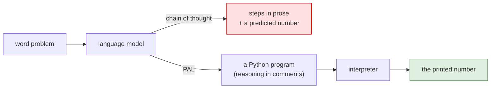

# Paper 01 — PAL: Program-aided Language Models

> **PAL: Program-aided Language Models**
> `arXiv:2211.10435` · 2022
> <https://arxiv.org/abs/2211.10435>
> Record opened and title copied on 2026-09-03.

**Read this after the parts.** Section 5 had you switch on code execution and watch a model write a
program instead of an answer. This is the paper that proposed doing that, four years before it became
a flag, and the half of its proposal that the field kept.

## One-line answer

PAL claimed that a language model should be asked to write a **program** as its reasoning, and that
the answer should come from running that program — keeping the reading and decomposing with the model
and moving the solving to an interpreter.

## The story

Everyone has lost marks on a question they understood.

The problem is set out on the page. You read it twice, you spot what it is asking, you write down the
right expression — the one the mark scheme wants, the one that shows you understood the situation. So
far, full marks.

Then there is the long division at the bottom of the page, in the last five minutes, with the
invigilator walking past. You carry a digit wrong. The final line says 43.7 and the answer is 47.3,
and the whole question is worth two marks out of six because the working was right and the number was
not.

Everybody who has sat an exam knows that feeling, and everybody knows the fix is not *"concentrate
harder on the arithmetic"*. The fix, once you are allowed one, is a calculator: keep the thinking,
hand over the sums.

## The idea in plain language

By late 2022 the field had a technique for making models reason: show them a few worked examples where
the answer is preceded by the steps, and they will produce steps too. That is chain-of-thought
prompting, taught on [Day 2](../../day-02-llm-mechanics/LESSON.md), and it worked well enough to be
everywhere.

It had a specific and irritating failure. The paper's own summary of it: models "often make logical and
arithmetic mistakes in the solution part, even when the problem is decomposed correctly." The model
sets the problem up beautifully and then gets 17 × 43 wrong, because — as
[Day 2](../../day-02-llm-mechanics/LESSON.md) established — it is predicting the next token rather
than calculating, and a number is a token like any other.

PAL's proposal is one move. Keep asking the model to produce the reasoning steps, but require those
steps to be **a Python program**. The model reads the problem and writes code. The code is then run,
and whatever it prints is the answer. In the paper's words, the program is passed to "a standard Python
interpreter, but this can be any solver, interpreter or a compiler."

Two words for the two halves, because the rest of this document keeps using them:

- **decomposition** — turning a messy sentence into the operations that answer it. This stays with the
  model, which is the thing that is good at it.
- **solving** — actually doing the operations. This moves to the interpreter, which is the thing that
  cannot get it wrong.

That is the whole idea, and its neatness is the reason it spread: nothing about the model changes, no
training is involved, and the only thing that moves is where the last step happens.

## Why Sutra needs it

Because [5.4](../parts/05-code-that-runs/5.4-the-estimate-and-the-measurement.md) is this paper as a
one-line instruction, and section 5 of this day is this paper as a platform feature.

When Sutra's coder agent is told *"you answer numeric questions by writing and running Python code,
never by doing arithmetic in your head"*, that sentence is PAL. When
`BuiltInCodeExecutor` adds `{"code_execution":{}}` to a request
([5.2](../parts/05-code-that-runs/5.2-the-executor-that-executes-nothing.md)), that is PAL with the
prompt engineering absorbed into the platform. Reading this after building it is the point: you have
already seen the mechanism work, so what is left to learn is which parts of the original proposal
survived, and that is a more useful thing to know than the proposal itself.

It matters again on Day 79, where evals begin. A computational answer produced by a program is
checkable against a program you write yourself, which makes it one of the few things in an agent
system with a hard pass or fail.

## The mechanism

The paper's method, written out rather than summarised.

**1. The exemplars are programs.** A few-shot prompt is a handful of solved examples put in front of
the real question. In chain-of-thought the solution is prose. In PAL the solution is Python, and the
natural-language reasoning is carried **in comments**: the paper prompts the model "to generate NL
intermediate steps using comment syntax (e.g. `# ...` in Python) such they will be ignored by the
interpreter."

So a single exemplar looks like a small annotated program: a comment restating a fact from the
question, then a line of code assigning it to a variable, and so on to a final expression. The
reasoning is still there and still visible; it has simply been moved to where an interpreter will skip
it.

**2. The variable names carry meaning.** For mathematical problems the paper drops explicit comments
and relies on "meaningful variable names in the prompt, to ease the model's grounding of variables to
the entities they represent." `money_initial` rather than `x`. This turns out to matter, and *When it
breaks* returns to it.

**3. The model writes a program for the new question.** Given the exemplars, the model produces a
program of the same shape for the question you actually asked — comments and code interleaved.

**4. An interpreter runs it, and its output is the answer.** Not the model's last line. The program's
printed result.



**What it bought.** On GSM8K, a benchmark of grade-school word problems, PAL using Codex reached
**72.0%** against chain-of-thought's **65.6%**, and the abstract states it surpassed "PaLM-540B which
uses chain-of-thought by absolute 15% top-1" — a much larger model, beaten by moving one step to an
interpreter. With majority voting over forty samples the paper reports **80.4%**. The evaluation covers
"13 mathematical, symbolic, and algorithmic reasoning tasks."

Read those numbers as an argument about **architecture**, not about a leaderboard. The claim that
matters is that a smaller model with an interpreter beat a far larger model without one, on the
category of problem where the larger model's extra size was being spent on arithmetic it could not do
reliably.

## The paper in one demo

The paper's contribution, and nothing else: the same model, the same questions, with the interpreter on
and off.

```text
days/day-16-built-in-tools-with-brakes/lab/papers/program-aided-language-models/
├── questions.py   # three problems whose answers are known exactly
└── pal.py         # the model, with an interpreter or without it
```

Two files. There is no framework, no argument parser and no output formatting, because none of those
would change what the demo proves.

```python
# questions.py
"""Three word problems whose answers are known exactly, and nothing else.

The answers are computed here, in ordinary Python, so the scoring in pal.py compares
the model against arithmetic rather than against another model.
"""

from __future__ import annotations

QUESTIONS: list[tuple[str, float]] = [
    (
        "A support desk received 1,284 tickets in March and 1,517 in April. "
        "17% of April's tickets were reopened at least once. "
        "How many more reopened tickets were there in April than the 143 in March?",
        round(1517 * 0.17) - 143,
    ),
    (
        "An incident started at 09:12 and was resolved at 14:03 the same day. "
        "During it, 46 customers were affected, each losing 3.5 hours of service on average. "
        "What is the total customer-hours lost, rounded to the nearest whole number?",
        round(46 * 3.5),
    ),
    (
        "A vendor's contract promises 99.9% uptime per 30-day month. "
        "The vendor was down for 61 minutes this month. "
        "By how many minutes did they exceed their allowance?",
        round(61 - 30 * 24 * 60 * 0.001),
    ),
]
```

**Line by line:**

- Each entry is `(question, expected)` — the question as text, and the answer as an **expression** the
  file evaluates itself. Writing `round(1517 * 0.17) - 143` rather than `115` means the ground truth is
  computed by the same kind of process the model is being asked to imitate, and it cannot drift from
  the question when somebody edits the numbers.
- The questions are Sutra-shaped on purpose — tickets, incidents, an uptime clause — so the demo reads
  like the work rather than like a textbook.
- The third question is the one to watch. Its allowance is `30 * 24 * 60 * 0.001`, which is 43.2, and
  the answer is 17.8 before rounding. Numbers that are not round are where mental arithmetic goes
  quietly wrong.
- No imports beyond `__future__`. This file is data.

```python
# pal.py
"""PAL (arXiv:2211.10435) in one file: the same model, with and without an interpreter.

The paper's contribution and nothing else: the model reads the problem and writes a
PROGRAM, and the solving is done by running that program. The ablation turns the
interpreter off, so the model must produce the number itself.

    cd days/day-16-built-in-tools-with-brakes/lab/papers/program-aided-language-models
    PAL=1 uv run python pal.py     # the paper: program + interpreter
    PAL=0 uv run python pal.py     # the ablation: prose only

Three questions, one model call each: 3 of the free tier's 20 requests per run.

Execution happens in the provider's sandbox (BuiltInCodeExecutor), never here -
SEC-01, docs/adr/ADR-0009-code-execution-policy.md. The paper simply ran the code
it generated; the field added the sandbox afterwards, which is day 16 section 6.
"""

from __future__ import annotations

import os
import re

from google.adk.agents import Agent
from google.adk.code_executors import BuiltInCodeExecutor
from google.adk.runners import InMemoryRunner
from google.genai import types
from google.genai.errors import ClientError
from questions import QUESTIONS

from sutra.config import load_env, require_free_tier

MODEL = "gemini-3.7-flash"
PAL = os.environ.get("PAL", "1") == "1"

PROGRAM = (
    "You solve word problems by WRITING AND RUNNING a Python program. "
    "Write the program, run it, and let it print the answer. "
    "Then state the printed number on its own as the last line of your reply. "
    "Never compute a number yourself."
)
PROSE = (
    "You solve word problems by reasoning them through step by step in words. "
    "You have no calculator and no code. "
    "State the final number on its own as the last line of your reply."
)

agent = Agent(
    name="pal_demo",
    model=MODEL,
    instruction=PROGRAM if PAL else PROSE,
    code_executor=BuiltInCodeExecutor() if PAL else None,
)

NUMBER = re.compile(r"-?\d[\d,]*(?:\.\d+)?")


def last_number(text: str) -> float | None:
    """The last number in the reply, which is where both instructions put the answer."""
    found = NUMBER.findall(text)
    return float(found[-1].replace(",", "")) if found else None


def ask(question: str) -> tuple[str, str | None]:
    """One question, one run. Returns the reply text and the program, if there was one."""
    runner = InMemoryRunner(agent=agent)
    session = runner.session_service.create_session_sync(app_name=runner.app_name, user_id="pal")
    reply, program = "", None
    for event in runner.run(
        user_id="pal",
        session_id=session.id,
        new_message=types.Content(role="user", parts=[types.Part(text=question)]),
    ):
        for part in (event.content.parts if event.content else []) or []:
            if part.executable_code is not None:
                program = part.executable_code.code
        if event.is_final_response() and event.content:
            reply = "".join(p.text or "" for p in event.content.parts).strip()
    return reply, program


def main() -> None:
    load_env()
    require_free_tier()

    print(f"PAL={'1 (program + interpreter)' if PAL else '0 (prose only)'}  model={MODEL}")
    correct = answered = 0
    try:
        for question, expected in QUESTIONS:
            reply, program = ask(question)
            print("\n---", question.split(".")[0][:60], "...")
            if not reply:
                # An empty reply is an outage, not a wrong answer. Scoring it as wrong
                # would be a fabricated result (Principle 10); ADK logs the traceback above.
                print("NO ANSWER - the model call failed; see the traceback above")
                continue
            answered += 1
            got = last_number(reply)
            ok = got is not None and abs(got - expected) < 0.5
            correct += ok
            print("program written:", "yes" if program else "no")
            if program:
                print(program)
            print(f"expected {expected} | got {got} | {'OK' if ok else 'WRONG'}")
    except ClientError as error:
        if error.code == 429:
            print("429: the free tier is spent for today. No score, and none invented.")
            raise SystemExit(1) from error
        raise

    print(
        f"\nscore: {correct}/{answered} answered ({len(QUESTIONS)} asked) with PAL={'1' if PAL else '0'}"
    )


if __name__ == "__main__":
    main()
```

**Line by line:**

- `PAL = os.environ.get("PAL", "1") == "1"` — **the ablation switch**, and the only difference between
  the two runs. It changes exactly two things below.
- `PROGRAM` and `PROSE` — the two instructions. `PROSE` says *"You have no calculator and no code"*
  because without that the model, given no executor, still narrates as if it had computed something;
  the ablation has to be an honest version of the pre-PAL setup, not a crippled one.
- `code_executor=BuiltInCodeExecutor() if PAL else None` — the second thing the switch changes. With the
  executor, the platform runs the program the model writes; without it, there is no interpreter
  anywhere and the number must come out of the model.
- `NUMBER` and `last_number` — the scoring reads the **last** number in the reply, which is where both
  instructions ask for the answer. Crude, and deliberately identical for both arms, so the ablation is
  not decided by the parser.
- `abs(got - expected) < 0.5` — a tolerance, because a correct answer may arrive as `17.8` or `18`
  depending on where the rounding happened.
- `if part.executable_code is not None: program = ...` — capturing the program from the event stream
  ([5.3](../parts/05-code-that-runs/5.3-reading-the-code-and-its-output.md)). This is what makes the
  difference between the arms *visible* rather than merely scored.
- `if not reply: ... continue` — an empty reply means the call failed, and it is reported as an outage
  rather than scored as a wrong answer. Scoring an outage would be fabricating a result (Principle 10),
  and on the day this was run it mattered: the free tier returned `503 UNAVAILABLE` more than once.
- `except ClientError ... error.code == 429` — the quota path, the same shape as every other script in
  this day.
- `from questions import QUESTIONS` — a bare import, so the demo must be run from its own directory.

Both runs, on 2026-09-03, against `gemini-3.7-flash` on the free tier. **The paper's arm:**

```text
PAL=1 (program + interpreter)  model=gemini-3.7-flash

--- A support desk received 1,284 tickets in March and 1,517 in  ...
NO ANSWER - the model call failed; see the traceback above

--- An incident started at 09:12 and was resolved at 14:03 the s ...
program written: yes
customers = 46
avg_hours = 3.5
total_customer_hours = customers * avg_hours
print(round(total_customer_hours))

expected 161 | got 161.0 | OK

--- A vendor's contract promises 99 ...
program written: yes
print(f"{exceeded_minutes:.1f}")

expected 18 | got 17.8 | OK

score: 2/2 answered (3 asked) with PAL=1
```

**The ablation:**

```text
PAL=0 (prose only)  model=gemini-3.7-flash

--- A support desk received 1,284 tickets in March and 1,517 in  ...
NO ANSWER - the model call failed; see the traceback above

--- An incident started at 09:12 and was resolved at 14:03 the s ...
NO ANSWER - the model call failed; see the traceback above

--- A vendor's contract promises 99 ...
program written: no
expected 18 | got 17.8 | OK

score: 1/1 answered (3 asked) with PAL=0
```

**Read this honestly, because the honest reading is the lesson.** On the questions that were answered,
both arms got the number right. Three questions and a flaky afternoon are not an accuracy experiment,
and this demo does **not** reproduce the paper's fifteen-point gap.

What the switch does change, visibly and every time, is the line that says `program written`. With
`PAL=1` the answer arrives with the program that produced it, and you can read
`customers = 46`, `avg_hours = 3.5` and check the model's *understanding of the question* rather than
its arithmetic. With `PAL=0` the same number arrives with nothing behind it, and your only options are
to trust it or to redo it.

That is the part of the paper that is still true in 2026, and the part the ablation actually
demonstrates. The accuracy gap has narrowed because models got much better at exactly the arithmetic
PAL was routing around; the auditability has not narrowed at all.

`TODO(me)` — re-run both arms on a quieter afternoon, with harder numbers (compound growth over
several months is the classic discriminator), and record in your notes whether the accuracy gap appears
at all on a 2026 model. That is a genuinely open question, and your three questions are a better
experiment than an assumption.

## When it breaks

**It needed a model that could write code.** The paper is explicit that its advantage depends on code
modelling ability: with a weaker text model (`text-davinci-001`), it reports that chain-of-thought
performs **better** than PAL. In 2022 that was a real constraint, because writing correct Python was a
specialised skill. It is the limitation that has aged best in one direction and worst in the other:
every current general model writes Python competently, so the constraint is gone — and it means the
paper's result was, in part, a fact about Codex rather than about programs.

**It needed meaningful variable names.** Removing them causes what the paper calls substantial
degradation. That is a strange, fragile-sounding dependency, and it says something real about the
mechanism: the program is not just a calculation, it is *the reasoning encoded as names*. `money_initial`
grounds a variable to an entity in the problem; `x` does not.

**It was measured on thirteen mathematical, symbolic and algorithmic tasks.** That is the domain where a
problem has a program. A question about whether a customer's complaint is angry has no program, and
nothing in this paper claims otherwise. Reaching for code execution on a question that is not
computational costs you a model call and gets you a program that formats an opinion.

**And it assumed you could just run the code.** The paper hands generated Python to "a standard Python
interpreter" and says no more about it, because in 2022 the model was solving a benchmark on somebody's
research machine. That assumption is precisely what
[6.1](../parts/06-blast-radius/6.1-the-executor-that-runs-it-here.md) demonstrates you cannot make in
a product: model inputs are attacker-reachable, so generated code is untrusted, and running it where
your credentials live gives it your credentials. The paper is not wrong about this; it is silent, and
the field filled the silence with sandboxes. Sutra's version of that silence being filled is SEC-01
([6.3](../parts/06-blast-radius/6.3-the-rule-sutra-writes-down.md)).

## In production

**What survived: the architecture.** *Decompose with the model, solve with an interpreter* is now the
default design for any quantitative question in an agent system, and it is no longer something you
prompt for. It is a switch: `{"code_execution":{}}`
([5.2](../parts/05-code-that-runs/5.2-the-executor-that-executes-nothing.md)), one line in a request.
The idea won so completely that it stopped being visible — which is the strongest form of a paper
surviving, and the reason this document exists at all. A reader who meets code execution as a feature
learns a feature. A reader who meets it as this paper's proposal learns what the feature is *for*.

**What survived: the reason.** The argument for the split — the model is good at reading a messy
problem and bad at guaranteeing a calculation — is a fact about how these models work, not about how
good they are, so it does not expire as models improve.

**What did not survive: the prompting.** Nobody hand-writes eight annotated program exemplars any more.
An instruction-tuned model needs one sentence — *"answer numeric questions by writing and running
Python"* — and the platform supplies the interpreter. The paper's careful few-shot format, the comment
syntax, the meaningful variable names: all absorbed into instruction tuning and platform features. The
fragility it measured is not something you can even observe today, because you no longer write the
part that was fragile.

**What did not survive: the model requirement.** Codex is gone, and "use a code model for reasoning" is
not advice anyone gives in 2026.

**What did not survive: the sampling.** The 80.4% number comes from majority voting over forty samples.
Forty calls per question is not a technique available to a system with twenty free requests a day
([4.4](../parts/04-newspaper-or-cabinet/4.4-two-meters-one-call.md)), and it is rarely available to a
paid one either once latency is counted. Benchmarks buy accuracy with samples; products cannot.

**What the field added: containment.** The paper's one-line answer to *where does the code run* became
an entire discipline, and it is the reason this day is called *with brakes*.

**The interview question** this paper answers well: *"why would you give a language model a code
interpreter?"* The answer that shows you have read it rather than heard of it: *"because decomposition
and solving are different jobs and only one of them is a job for a token predictor. PAL measured that
in 2022 with a smaller model beating a much larger one; today it is a flag on a request, and the part
that still pays is that the program is auditable."*

## Check yourself

```bash
cd days/day-16-built-in-tools-with-brakes/lab/papers/program-aided-language-models
PAL=1 uv run python pal.py
PAL=0 uv run python pal.py
```

Then open the paper's abstract and find the sentence about what LLMs get wrong "even when the problem
is decomposed correctly" — that clause is the entire motivation.

**Out loud, without scrolling up:** what did PAL actually claim, and what do we do differently now? A
complete answer names the split it proposed, the one thing about it that is now a platform switch, and
the one thing the paper never addressed that you spent section 6 on.
