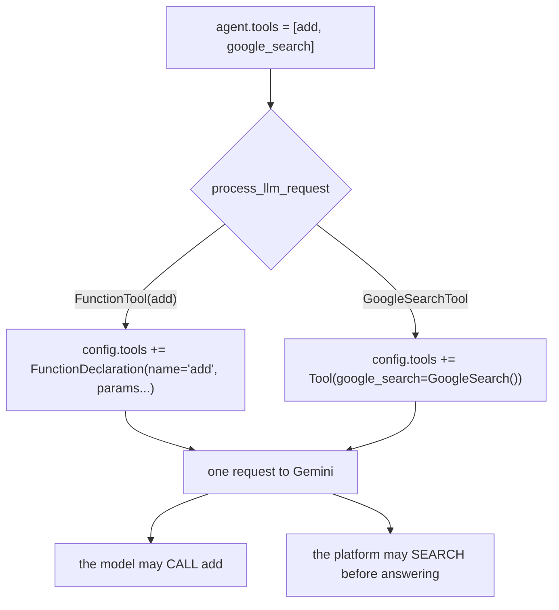

# 1.2 — An object with a placeholder name

## One-line answer

`google_search` carries a name and a description like every other tool, and **the model is never
shown either of them**, because a built-in tool sends no function declaration at all — it edits the
request instead.

## The story

The visitor book at the reception desk.

You sign in: your name, who you are here to see, the time you arrived. Everyone does it. The book has
been on that desk for years, and the pen is chained to it.

Then the guard turns the monitor towards you, types your name into the system and prints a pass with
a barcode. The barcode is what opens the inner door. The lift reads it, the meeting room floor reads
it, and when you leave, the barcode is what tells the building you have gone.

Nobody reads the book. It is not a fake — your handwriting really is in it, on today's page, and if
you wrote nonsense nothing would happen at all. The book is a slot that exists because the desk has
always had one. The access came from somewhere else entirely, and you watched it happen.

## The idea in plain language

Every tool in ADK is an object with a `name` and a `description`, because `BaseTool` — the class all
tools inherit from — has those two fields. That is the shape of the box.

For an ordinary tool the two fields are the whole point. A function tool's name is what the model
writes when it wants to call it, and its description is what the model reads to decide whether it
should. On [Day 11](../../../day-11-tool-context/LESSON.md) you spent a whole part on the wording of
a description, because that wording is the interface.

A built-in tool has to fit into the same box, and it has nothing to put in either field. The model is
not going to *call* `google_search`, so there is no name for it to write. The model does not have to
be *persuaded* to search, so there is no description for it to weigh. But the box has two slots, and
pydantic wants strings, so the library puts the same word in both:

```
name = "google_search"
description = "google_search"
```

A description that repeats the name is a placeholder. It is the visitor book: a real entry in a real
field that nothing downstream reads. The installed package says so in a comment on the line above it
— *"Name and description are not used because this is a model built-in tool"* — which is a rare and
welcome thing to find in a library.

So what does the object do, if not describe itself?

Every tool has a method called `process_llm_request`. For a function tool, ADK's default version of
that method attaches the tool's **function declaration** — the machine-readable description of the
name and the arguments — to the outgoing request. `GoogleSearchTool` overrides the method and does
something else entirely: it appends a `Tool(google_search=GoogleSearch())` object to the request's
own tool list, and never mentions a declaration.

That single override is the difference between the two kinds of tool. One adds a *thing the model may
call*. The other switches the *call itself* into a different mode.

## Why Sutra needs it

Because the first instinct on Day 66, when injection defence starts, will be to look at the
description.

Sutra's entire defensive posture so far runs through wording. The instruction
([Day 6](../../../day-06-instructions-and-personas/LESSON.md)), the tool descriptions
([Day 11](../../../day-11-tool-context/LESSON.md)), the callbacks that inspect arguments before a
tool runs ([Day 13](../../../day-13-callbacks-four-doors/LESSON.md)). All of those work because the
model reads what you wrote and behaves accordingly.

None of that reaches a built-in. You cannot make the model search more carefully by improving
`google_search`'s description, because the model never sees it. You cannot narrow what it searches by
rewording anything, because there is no wording in the request. The only levers you have on a
built-in tool are **which agent holds it** and **what you do with the result**, and both of those are
architecture rather than prose. That is why sections 2 and 3 exist and why they are the long ones.

## The mechanism

Put the two kinds of tool side by side and print what each one declares:

```python
# days/day-16-built-in-tools-with-brakes/lab/placeholder.py
"""What a built-in tool declares about itself. Zero model calls."""

from google.adk.tools import FunctionTool, google_search


def add(a: int, b: int) -> int:
    """Add two numbers."""
    return a + b


hand_written = FunctionTool(func=add)

print("google_search.name        :", repr(google_search.name))
print("google_search.description :", repr(google_search.description))
print("google_search declaration :", google_search._get_declaration())
print("add.name                  :", repr(hand_written.name))
print("add.description           :", repr(hand_written.description))
print("add declaration           :", hand_written._get_declaration())
```

**Line by line:**

- `from google.adk.tools import FunctionTool, google_search` — both come from the same package,
  because both are tools. That they arrive through the same door is exactly what makes the difference
  easy to miss.
- `def add(a: int, b: int) -> int:` with a docstring — the Day 10 shape. The type hints become the
  argument schema and the docstring becomes the description, which is why both are mandatory and not
  decoration.
- `FunctionTool(func=add)` — the wrapper that turns a plain function into a tool object. Day 10 built
  this by hand first, so nothing here is a mystery.
- `google_search._get_declaration()` — an underscore-prefixed method, and yes, calling it from a lab
  script is reaching past the front door on purpose. This is a measurement, not a pattern to copy:
  the whole claim of this part is about what does and does not end up in the request, and this is the
  method that decides. `BaseTool`'s own docstring for it says a declaration is *"Required if subclass
  uses the default implementation of `process_llm_request`"* and *"Otherwise, can be skipped, e.g.
  for a built-in GoogleSearch tool for Gemini"* — the library naming today's exact case.
- `repr(...)` rather than the bare value — so an empty string and a missing value cannot look the
  same in the output.

Measured on `google-adk` 2.7.1 on 2026-09-03:

```text
google_search.name        : 'google_search'
google_search.description : 'google_search'
google_search declaration : None
add.name                  : 'add'
add.description           : 'Add two numbers.'
add declaration           : description='Add two numbers.' name='add' parameters=None parameters_json_schema={'properties': {'a': {'title': 'A', 'type': 'integer'}, 'b': {'title': 'B', 'type': 'integer'}}, 'required': ['a', 'b'], 'title': 'addParams', 'type': 'object'} response=None response_json_schema=None behavior=None
```

Two objects of the same base class. One has a schema the model will read and one has `None`.

The picture is worth holding, because everything in section 2 follows from it:



The left branch describes a function. The right branch changes the call. They are not the same kind
of thing, and section 2 is about what happens when you put both in one request anyway.

## When it breaks

**You try to improve the description, the way you would for any other tool.**

```python
google_search.description = "Search the public web for current facts. Use for outages and versions."
```

**Line by line:**

- The assignment succeeds. `description` is an ordinary pydantic field on `BaseTool` and nothing
  stops you writing to it. There is no error, no warning and no log line.
- Nothing changes in any request, because `GoogleSearchTool.process_llm_request` never reads the
  field. The model is not shown the sentence you just wrote.
- Worse, `google_search` is a **module-level singleton** — one object, imported by everything. If this
  assignment were in a module that Sutra imports, every agent in the process would carry the mutated
  object, and a reviewer reading the agent definition would see no sign of it.

The failure here has no error text, which is what makes it worth naming. You wrote a sentence, you
felt like you had tuned something, and the request went out byte-for-byte identical. The way to
notice is the measurement in the mechanism: if `_get_declaration()` is `None`, nothing you write on
that object is going anywhere.

**You pass the same singleton twice**, perhaps because two helpers each appended it to a list:

```python
Agent(name="x", model="gemini-3.7-flash", tools=[google_search, google_search])
```

**Line by line:**

- Two entries, one object — `google_search` is a singleton, so the list holds the same instance at
  both positions.
- ADK constructs the agent without complaint. There is no duplicate check on the `tools` list.
- The request then carries the search tool twice, and `len(self.tools) > 1` is now true, which quietly
  changes what ADK does with it — [2.2](../02-one-at-a-time/2.2-a-flag-that-does-not-lift-the-wall.md)
  is where that becomes visible. The error, when it comes, comes from the API, and it will not mention
  your list.

## In production

**Treat a built-in tool as configuration, not as an interface.**

The practical rule that follows is about where these objects are allowed to appear. In a real system,
`google_search` is imported in exactly one module — the one that defines the agent that holds it —
and never assigned to, never mutated, never re-exported. Anything else and you have a global object
with mutable fields, imported by many modules, whose mutations are invisible in review and untestable
in isolation. That is a shape teams grow out of for good reasons.

**The review comment** on a diff that touches `google_search.description` is short: *"the model never
reads this, and it is a shared object."* The comment that matters more is on a diff that does not
touch it at all: *"how do we constrain what this searches, if not with words?"* The honest answer is
that you cannot constrain it from inside the agent, so the constraint has to be structural — a
dedicated agent, holding only this, with an instruction narrow enough that the questions it is asked
are already the right shape.

**What changes at scale** is that observability has to compensate for the missing declaration.
Function tools give you a name and arguments in every trace, so a dashboard can count calls to
`lookup_ticket` and alert on a spike. A built-in gives you nothing on the way out: no tool name, no
arguments, no call event. The only evidence that a search happened arrives *afterwards*, attached to
the response as grounding metadata, which is why section 3 treats that metadata as instrumentation
and not just as citations.

**The interview question**: *"how do you tune a built-in tool's behaviour?"* The naive answer is
"prompt it better". The answer that survives follow-up is *"you cannot address it directly at all —
it has no declaration, so the model never negotiates with it. You tune the agent that holds it and
the handling of what it returns."*

## Check yourself

```bash
cd days/day-16-built-in-tools-with-brakes/lab
uv run python placeholder.py
```

The line to stare at is `google_search declaration : None`.

**Out loud, without scrolling up:** a teammate asks you to make the agent search more carefully by
rewriting the tool's description. Explain, in two sentences, why that change would have no effect,
and say what you would change instead.
