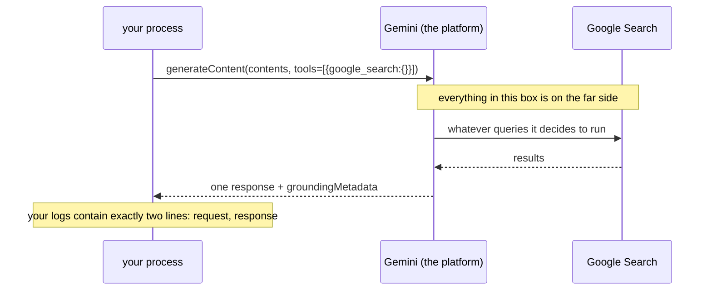

# 1.3 — The request that leaves your process

## One-line answer

Switching on web search adds exactly one thing to the outgoing request — `{"google_search":{}}` — and
your process never contacts a search engine at all, which is why nothing about the search appears in
your logs, your traces or your network tab.

## The story

The counter at the chemist.

You hand over the slip. The person behind the counter reads it, says "one moment", and walks through
the doorway at the back. You cannot see the shelves. You do not know how many boxes they moved, which
shelf it was on, whether they checked a second time, or whether they asked a colleague.

They come back with a box and put it on the counter. If the box is right, everything about the trip
behind the partition was fine. If it is wrong, you will find out at home, and you will have exactly
one piece of evidence about what happened back there: the box in your hand.

The whole transaction is a slip in and a box out. Every question you might want to ask about the
middle is a question about a room you were never in.

## The idea in plain language

Sutra's model calls have had the same shape since [Day 5](../../../day-05-first-adk-agent/LESSON.md).
Your process builds a request, sends it to Gemini over HTTPS, and reads the response. When a tool is
involved, that shape gets *longer*: the model replies "call `lookup_ticket` with these arguments",
your process runs the function, and you send a second request carrying the result. Two round trips,
and the middle step happens on your machine, where you can log it, time it and break on it.

A built-in tool does not lengthen the exchange. It changes one field inside the first request.

Concretely, the request carries a `config` object, and `config.tools` is a list. A function tool puts
a **declaration** in that list: a name, a description and an argument schema, so the model knows what
it may ask for. `google_search` puts something else there: a `Tool` whose only field is an empty
`GoogleSearch()`. On the wire that is four words of JSON, `{"google_search":{}}`, with nothing inside
the braces because there is nothing to configure.

That empty object is a **permission**, not a description. It tells the platform that for this call,
the model may consult Google Search before it answers. Whether it searches, how many searches it
runs, what it types into them and how it weighs the results are all decided on the other side of the
partition. Your process sits and waits for one response, exactly as it does for a request with no
tools at all.

Two consequences follow immediately, and both matter more than they look:

- **Nothing about the search is in your logs.** No outbound request to a search engine, no latency
  measurement, no failure you can retry. If your observability comes from instrumenting your own
  process — which is all any of it is — the search is invisible to it.
- **You cannot intervene in the middle.** Day 13's callbacks fire around *your* tool calls, and
  Day 14's plugins wrap *your* runner. Neither can sit between the model and its search, because there
  is no point in your process where that gap exists.

## Why Sutra needs it

Because Day 84's observability work — traces that show where the time went and what a run touched —
will have a hole in it exactly the size of every grounded answer, and it is better to know that now
than to discover it while chasing a slow request.

There is a nearer reason too. On [Day 13](../../../day-13-callbacks-four-doors/LESSON.md) you built
`before_tool_callback` as Sutra's inspection point: the door every tool call passes through, where
arguments can be checked and a call can be refused. It is the mechanism the whole safety story leans
on from Phase 10 onwards. A built-in tool never passes through that door, so a plan of the form *"we
will inspect queries before they go out"* is not implementable for search — and
[4.3](../04-newspaper-or-cabinet/4.3-the-question-that-left-the-building.md) is where that becomes a
privacy decision rather than a technical curiosity.

## The mechanism

Watch the request change. This is the built-in tool's entire effect, in five lines:

```python
# days/day-16-built-in-tools-with-brakes/lab/the_request.py
"""The one thing switching on search does to the outgoing request. Zero model calls."""

import asyncio

from google.adk.models.llm_request import LlmRequest
from google.adk.tools import google_search


async def main() -> None:
    request = LlmRequest(model="gemini-3.7-flash")
    print("before:", request.config.tools)

    await google_search.process_llm_request(tool_context=None, llm_request=request)

    print("after :", request.config.tools)
    print("json  :", request.config.tools[0].model_dump_json(exclude_none=True))


asyncio.run(main())
```

**Line by line:**

- `from google.adk.models.llm_request import LlmRequest` — the object ADK fills in before every call.
  You are building one by hand here because that is the only way to see the mutation on its own,
  without a runner, a session or a key in the way.
- `LlmRequest(model="gemini-3.7-flash")` — a bare request. `config` already exists with defaults, and
  `config.tools` is `None` until something adds to it.
- `await google_search.process_llm_request(...)` — the method from
  [1.2](1.2-an-object-with-a-placeholder-name.md), called directly. In a real run ADK calls it for
  you, once per tool, just before the request goes out. It is `async`, hence `await` and hence
  `asyncio.run`.
- `tool_context=None` — allowed here because `GoogleSearchTool.process_llm_request` never touches the
  tool context; read its body and the argument is unused. A function tool would not tolerate this, and
  that difference is the point rather than a shortcut.
- `model_dump_json(exclude_none=True)` — the serialisation the SDK does on its way out, with every
  unset field dropped. What is left is what crosses the network.

Measured on `google-adk` 2.7.1 and `google-genai` 2.19.0 on 2026-09-03:

```text
before: None
after : [Tool(
  google_search=GoogleSearch()
)]
json  : {"google_search":{}}
```

That is the whole switch. An empty object inside a named field, and the meaning is *you may search*.

Where the work happens, drawn once so the rest of the day can refer to it:



Compare that with the Day 10 shape, where the middle of the picture is your own code and every arrow
crosses your process. Here, the middle is a box you cannot open, and the last note is the honest
summary of what your instrumentation will see.

## When it breaks

**You go looking for the search in your traces, because something took a long time.**

There is no error text for this one, which is exactly the problem. A grounded call simply takes
longer than an ungrounded one, and your span shows a single model call with a bigger duration. There
is no child span, no HTTP client event, no retry.

The measurement that tells you what actually happened is on the way back, not the way out: the
response carries `grounding_metadata`, and inside it `web_search_queries` — the queries the platform
chose to run. Printing that field is the closest thing to a log line the search will ever give you,
and section 3 builds the helper that does it.

**You attach a `before_tool_callback` and it never fires.**

Also silent, also correct. Day 13's callback fires when the model asks *you* to run a tool. The model
never asks you to run this one, so the callback has nothing to fire on. The check that proves it
costs nothing:

```python
def before_tool(tool, args, tool_context):
    print("callback saw:", tool.name)  # never printed for google_search
    return None
```

**Line by line:**

- `def before_tool(tool, args, tool_context)` — Day 13's signature, unchanged.
- `print("callback saw:", tool.name)` — the line that stays quiet. Add this callback to the searcher
  agent, run a grounded question, and the only output is the answer.
- `return None` — Day 13's "carry on" contract: returning `None` lets the call proceed, while
  returning a dict replaces the tool's result. Both are irrelevant here, because there is no call.

## In production

**Assume every grounded answer is an unobserved span, and instrument the edges instead.**

A team that has run this in production ends up recording three things around each grounded call,
because the middle is unavailable: the queries the platform reported (`web_search_queries`), the
number of sources that came back, and the wall-clock duration of the call. That is enough to answer
the questions that actually get asked in an incident — *did it search at all, did it find anything,
and was it slow* — and no amount of engineering on your side will get you more than that.

**What degrades at scale** is your retry policy. Everywhere else in Sutra, a failed tool call is
retryable in isolation: the model's request is still in hand, so you can run the function again. A
grounded call fails as a whole. There is no way to retry "just the search", so a transient failure on
the far side costs you the entire model call, including the tokens you already spent building the
request. Day 72's backoff work has to treat these calls as more expensive to retry than ordinary
ones, and the reason is here, in the shape of the exchange.

**The review comment** on a change that adds grounding to a hot path: *"this call is now
un-instrumentable in the middle and un-retryable in part. Is the caller's timeout still right, and
does the dashboard know why this endpoint got slower?"*

**The interview question**: *"your grounded endpoint's latency doubled. How do you find out why?"* The
answer that shows experience starts by naming what you cannot see — no search span, no per-query
timing — and moves to what you can: the reported queries, the source count, and a comparison against
the same prompt with grounding off.

## Check yourself

```bash
cd days/day-16-built-in-tools-with-brakes/lab
uv run python the_request.py
```

Expect `{"google_search":{}}` on the last line.

**Out loud, without scrolling up:** a colleague asks you to log every search query the agent makes,
before it is sent. Say why you cannot, and name the one field that gives you the nearest honest
answer.
