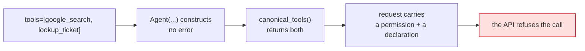

# 2.1 — One built-in, and nothing else

## One-line answer

On the Gemini API, an agent holding `google_search` or code execution may hold **no other tools at
all**, and the rule is not enforced by ADK: your agent builds, your request goes out, and the
platform is what refuses it.

## The story

The kitchen in the old flat had one socket that worked.

The kettle lived in it. When you wanted toast you unplugged the kettle, plugged in the toaster, and
plugged the kettle back afterwards. Everyone who lived there learned this in the first week, and
after that nobody thought about it.

Then someone brought an extension lead home. Four sockets from the one that worked. Kettle, toaster,
microwave, phone charger, all at once, and for about two seconds it was a better kitchen.

The fuse went. Not the extension lead's fuse — the one in the box by the front door, which took the
fridge and the hall light with it, in the dark, with a wet towel over the toaster.

The socket was never the limit. The wiring behind the wall was, and the extension lead did not add
any wiring. It just made it easy to ask for more than the wall had.

## The idea in plain language

Here is the rule, quoted from `adk.dev/tools/limitations/`, read on 2026-09-03:

> use of specific tools within an agent excludes the use of any other tools in that agent

The page names where it applies: **Code Execution with the Gemini API**, **Google Search with the
Gemini API**, and Agent Search. And it adds a second restriction on the same page:

> Built-in tools cannot be used within a sub-agent, with the exception of `GoogleSearchTool` and
> `VertexAiSearchTool` in ADK Python because of the workaround mentioned above

Read plainly: an agent may hold `google_search`, **or** it may hold Sutra's own tools. Not both. And
you cannot dodge the rule by pushing the built-in down into a sub-agent, which is the first thing
most people try.

Why does such a rule exist at all? [1.2](../01-switched-on/1.2-an-object-with-a-placeholder-name.md)
already gave the reason, and it is worth saying in one sentence: a built-in is not a function offered
to the model, it is a **mode the call runs in**. Function calling is another mode. Asking the
platform for both in one request is asking for a call that is two different kinds of call, and the
contract for that call does not allow it.

The part that trips people is where the rule *lives*. It is not in the Python library. ADK will
happily construct an agent with `tools=[google_search, lookup_ticket]`, resolve both tools, build a
request containing both, and send it. Nothing in your process objects, because from your process's
point of view nothing is wrong: a list has two things in it. The refusal comes back from the API, at
run time, on a call that has already cost you the request.

This is the wall's real shape, and it is why the rest of section 2 is about arranging your agents so
that you never lean on it.

## Why Sutra needs it

Because the obvious design for Sutra's desk is now illegal, and it is better to find that out here
than in Phase 8.

The desk agent from [Day 5](../../../day-05-first-adk-agent/LESSON.md) already holds Sutra's own
tools. It is the natural home for everything: it reads tickets, it looks things up, it will one day
check a vendor. The natural next line is `tools=[lookup_ticket, search_kb, google_search]`, and that
line cannot work.

So the architecture has to change instead, and it changes in a direction the plan was already going.
Phase 8 (Days 53–59) builds Sutra as a **graph of specialists**: a triage node, a researcher node, a
writer node, each holding what it needs and nothing else. The Researcher is the one that reaches the
public web. Today's constraint pushes you into that structure a phase and a half early, and it is
worth noticing that this happens often: a platform limit and a good design frequently point the same
way, because both are answers to the question *what should one component be responsible for*.

## The mechanism

The wall is not in ADK, so the way to see it is to watch ADK not object. This script builds the
illegal agent and prints exactly what would be sent:

```python
# days/day-16-built-in-tools-with-brakes/lab/the_wall.py
"""ADK builds the forbidden agent without complaint. Zero model calls unless LIVE=1."""

import asyncio
import os

from google.adk.agents import Agent
from google.adk.models.llm_request import LlmRequest
from google.adk.tools import google_search


def lookup_ticket(ticket_id: str) -> dict:
    """Look up a support ticket by its identifier."""
    return {"id": ticket_id, "status": "open"}


mixed = Agent(
    name="sutra_mixed",
    model="gemini-3.7-flash",
    instruction="Triage tickets. Check the public web when it matters.",
    tools=[google_search, lookup_ticket],  # the line the platform will refuse
)


async def main() -> None:
    resolved = await mixed.canonical_tools()
    print("resolved tools:", [(type(t).__name__, t.name) for t in resolved])

    request = LlmRequest(model=mixed.model)
    for tool in resolved:
        await tool.process_llm_request(tool_context=None, llm_request=request)
    print("request tools :", len(request.config.tools), "entries")
    print("permission    :", request.config.tools[0].model_dump_json(exclude_none=True))
    print(
        "declarations  :", [d.name for d in (request.config.tools[-1].function_declarations or [])]
    )

    if os.environ.get("LIVE") == "1":
        from google.adk.runners import InMemoryRunner
        from google.genai import types

        from sutra.config import load_env, require_free_tier

        load_env()
        require_free_tier()
        runner = InMemoryRunner(agent=mixed)
        session = runner.session_service.create_session_sync(
            app_name=runner.app_name, user_id="day16"
        )
        for event in runner.run(
            user_id="day16",
            session_id=session.id,
            new_message=types.Content(role="user", parts=[types.Part(text="Is GitHub up?")]),
        ):
            print("EVENT:", event.author, event.content)


asyncio.run(main())
```

**Line by line:**

- `def lookup_ticket(...) -> dict:` — a stand-in for Sutra's real tool, kept in the lab so this script
  never depends on the state of `sutra/tools.py`.
- `tools=[google_search, lookup_ticket]` — the forbidden pair. Note that the agent is constructed at
  import time and **no exception is raised**. If ADK were going to stop you, this is where it would.
- `await mixed.canonical_tools()` — the resolution step from
  [15.2.1](../../../day-15-toolsets-and-openapi/parts/02-when-asked/2.1-the-wrapper-adk-actually-calls.md):
  the method ADK itself calls to turn the `tools` list into real tool objects. Calling it directly is
  how you see what the agent will actually offer.
- `for tool in resolved: await tool.process_llm_request(...)` — doing by hand what ADK does before
  every call, so the finished request is visible without a key.
- `request.config.tools[-1].function_declarations` — the *last* entry, because `lookup_ticket`'s
  declaration is appended after the search tool's empty permission. This is the line that shows the
  request carrying both kinds of thing at once.
- `if os.environ.get("LIVE") == "1":` — the only branch in this file that can spend a request, and it
  is off unless you ask for it. Everything above runs on a machine with no key at all.
- `load_env()` and `require_free_tier()` — Day 1's loader and Day 5's guard, imported *inside* the
  branch so that the zero-request path never touches configuration.

Measured on `google-adk` 2.7.1 on 2026-09-03, with `LIVE` unset:

```text
C:\...\.venv\Lib\site-packages\google\adk\models\llm_request.py:273: UserWarning: [EXPERIMENTAL] feature FeatureName.JSON_SCHEMA_FOR_FUNC_DECL is enabled.
  declaration = tool._get_declaration()
resolved tools: [('GoogleSearchTool', 'google_search'), ('FunctionTool', 'lookup_ticket')]
request tools : 2 entries
permission    : {"google_search":{}}
declarations  : ['lookup_ticket']
```

Two entries in the request: one permission and one declaration. Everything on your side is content.
The `UserWarning` is ADK telling you that function declarations are being built as JSON Schema rather
than the older format; it is unrelated to today and appears whenever a function tool is in the room.



Four green steps and one red one, and the red one is the only step that is not in your process.

## When it breaks

**The refusal arrives from the platform, on a call you have already paid for.**

To capture it, run the same script with a key present and one live call enabled:

```bash
cd days/day-16-built-in-tools-with-brakes/lab
LIVE=1 uv run python the_wall.py     # spends 1 of the day's 20 free requests
```

`TODO(me)` — paste the exact error under this line, verbatim, including the status code and the
message body. It is one of the five error strings this day is worth remembering, and a paraphrase is
useless to the person who will search for it later.

This document does not print it, and the reason is worth stating rather than hiding: on the day this
part was written, the free tier's daily allowance had already been spent, so the call never reached
the exclusivity check. What came back instead is the error you meet first whenever you are near the
ceiling, and it is the subject of [7.1](../07-failure-lab/7.1-the-spare-that-does-not-fit.md), where
it is reproduced in full. Principle 10 governs here: a missing transcript is fixed by one run, and an
invented one is a lie that survives for years.

**What you must not conclude from a green run.** If you run the mixed agent and it answers, do not
file the rule as "not real". Check which tool was used. A model that never chose to search will
produce a perfectly good answer from a request the platform was willing to serve, and the failure is
waiting for the first question that needs the web.

## In production

**The rule is a design constraint, so encode it where designs are written down, not where errors are
caught.**

In a real system this becomes a rule about agent definitions: an agent that holds a built-in holds
nothing else, and that is checked by a test rather than by a code review
([8.1](../08-in-production/8.1-testing-a-built-in-without-spending-a-request.md) writes it). The test
is three lines and it fails at commit time instead of at request time, which is the difference
between a constraint you designed around and a constraint that pages you.

**What changes at scale** is who breaks it. Nobody adds `google_search` to an agent that already has
six tools on purpose. It happens when two people extend the same agent in the same sprint, or when a
toolset from [Day 15](../../../day-15-toolsets-and-openapi/LESSON.md) expands to a second entry, or
when a shared "helper agent" grows a capability for one caller and inherits a built-in from another.
The list on a mature agent is rarely written in one place, and this rule cares about the resolved
list, not the written one.

**The review comment**: *"this agent now has a built-in and two function tools. Split it — a searcher
that holds only search, and the desk that holds our tools — or tell me which of the three you are
dropping."*

**The interview question**: *"you added web search to an agent and it started failing. What is the
first thing you check?"* The answer that lands is not "the API key". It is *"what else is on that
agent's tool list, because on the Gemini API a built-in cannot share an agent, and ADK will not stop
you"*.

## Check yourself

```bash
cd days/day-16-built-in-tools-with-brakes/lab
uv run python the_wall.py
```

Zero requests, and an agent that should not exist, built without a single complaint.

**Out loud, without scrolling up:** state the exclusivity rule in one sentence, then say which layer
enforces it and which layer does not.
