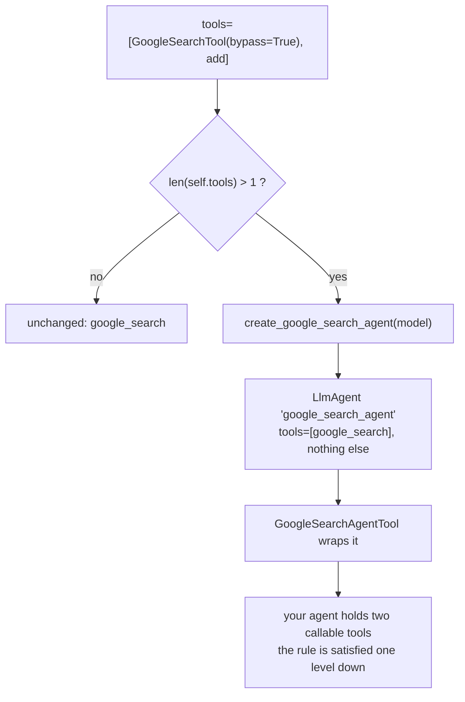

# 2.2 — A flag that does not lift the wall

## One-line answer

`bypass_multi_tools_limit=True` does not remove the exclusivity rule: it silently replaces your search
tool with a **hidden agent wrapped as a tool**, under a different name, with its own model call — and
it only does that when the agent's `tools` list has more than one entry.

## The story

The express lane at the supermarket.

Ten items or fewer, one sign, one lane, and a queue of people who have counted. You get to the front
and the assistant says "I'll take you at till nine", and walks you two lanes over.

You are served, and quickly. But you are not in the express lane any more. Till nine is an ordinary
till with an ordinary conveyor belt, your receipt says nine at the top, and if you had been meeting
someone "at the express lane", they are still standing there.

Nothing was refused and nothing was explained. A rule you thought you had satisfied was quietly
converted into a different arrangement that produces a similar outcome, and the only evidence is a
number printed at the top of a receipt you were not planning to read.

## The idea in plain language

ADK offers a flag that looks like the answer to section 2's problem:

```
GoogleSearchTool(bypass_multi_tools_limit=True)
```

Read the name and you would expect it to switch off the platform rule from
[2.1](2.1-one-built-in-and-nothing-else.md). It cannot. The rule belongs to the Gemini API, and a
Python keyword argument has no authority there.

What the flag actually does is written in the installed package, in `llm_agent.py`, above the code
that reads it: *"Wrap google_search tool with AgentTool if there are multiple tools because the
built-in tools cannot be used together with other tools"*, followed by *"TODO: Remove once the
workaround is no longer needed."* The flag is not a permission. It is a **request for a rewrite**, and
the rewrite is the pattern [2.3](2.3-the-specialist-you-write-yourself.md) has you build by hand.

Here is the rewrite in words. When your agent has more than one entry on its `tools` list and one of
them is a `GoogleSearchTool` with the flag set, ADK:

1. builds a **second agent** you never wrote, called `google_search_agent`, whose model is your
   model, whose instruction is a fixed English sentence about performing searches, and whose only
   tool is `google_search` — an agent that satisfies the exclusivity rule perfectly;
2. wraps that agent in an `AgentTool`, which is the ADK object that makes an agent callable *as a
   tool* by another agent;
3. puts that wrapper on your list in place of the search tool, under the name
   **`google_search_agent`**, with the description *"An agent for performing Google search using the
   `google_search` tool"*.

Your agent now holds two ordinary function-shaped tools. The exclusivity rule is satisfied because
nothing on the list is a built-in any more. The built-in is one level down, inside an agent that has
nothing else.

Three consequences fall out of that, and none of them is visible in your code:

- **The tool the model sees has a different name.** Not `google_search`. Anything that matched on the
  old name — an instruction that says "use google_search", a test, a log filter, a callback that
  checks `tool.name` — is now looking for something that is not there.
- **A search costs an extra model call.** The wrapper runs a whole agent: your model is called again,
  inside the tool call, to decide what to search for and to summarise what came back. On a free tier
  metered in requests per day, one grounded answer can now cost two or three of them.
- **It does nothing unless there is a second entry.** The condition in `llm_agent.py` is
  `multiple_tools = len(self.tools) > 1`, and it counts **entries you wrote**, not resolved tools. A
  lone `GoogleSearchTool(bypass_multi_tools_limit=True)` stays exactly what it was.

## Why Sutra needs it

Because this flag is the shortcut Sutra deliberately does not take, and a decision to not use
something is only worth anything if you can say what it does.

Sutra is heading for a graph of specialists (Phase 8), where the Researcher is a node with a name, an
instruction Sutra wrote, and a budget Sutra counts. The flag produces a specialist too — but one
with an instruction you did not write, a name you did not choose, a model call you did not budget,
and no way to change any of the three. It is the right tool for someone adding search to an existing
agent under time pressure. It is the wrong tool for a system whose whole design is *"every capability
is held by something with a name"*.

There is also a version story. That `TODO: Remove once the workaround is no longer needed` in ADK's
own source is a promise that this behaviour is temporary. Code that depends on the wrapper's name,
its call count or its shape is depending on something the maintainers have said out loud they intend
to delete. Principle 14 applies: build on the thing that is documented to stay.

## The mechanism

Three agents, one difference between them, and the resolved tool list printed for each:

```python
# days/day-16-built-in-tools-with-brakes/lab/bypass.py
"""What bypass_multi_tools_limit actually does. Zero model calls."""

import asyncio

from google.adk.agents import Agent
from google.adk.tools.google_search_tool import GoogleSearchTool


def add(a: int, b: int) -> int:
    """Add two numbers."""
    return a + b


async def show(agent: Agent) -> None:
    tools = await agent.canonical_tools()
    print(f"{agent.name} (entries={len(agent.tools)}):")
    for tool in tools:
        declaration = tool._get_declaration()
        description = None if declaration is None else declaration.description
        print("   ", (type(tool).__name__, tool.name, description))


async def main() -> None:
    alone = Agent(
        name="bypass_alone",
        model="gemini-3.7-flash",
        tools=[GoogleSearchTool(bypass_multi_tools_limit=True)],
    )
    with_other = Agent(
        name="bypass_with_other",
        model="gemini-3.7-flash",
        tools=[GoogleSearchTool(bypass_multi_tools_limit=True), add],
    )
    no_flag = Agent(
        name="no_flag",
        model="gemini-3.7-flash",
        tools=[GoogleSearchTool(), add],
    )
    for agent in (alone, with_other, no_flag):
        await show(agent)


asyncio.run(main())
```

**Line by line:**

- `from google.adk.tools.google_search_tool import GoogleSearchTool` — the **class**, from its own
  module. `google.adk.tools` exports the ready-made instance `google_search`, and that instance has
  the flag off. To set the flag you must build your own object, which is a design choice worth
  noticing: the shortcut is available but never the default.
- `GoogleSearchTool(bypass_multi_tools_limit=True)` — keyword-only; the constructor's signature is
  `def __init__(self, *, bypass_multi_tools_limit=False, model=None)`, so a positional argument is
  rejected.
- `tools=[...]` with one entry in `alone` and two in `with_other` — the same tool object, the same
  flag, and the only difference is the length of the list. That is the whole experiment.
- `no_flag` — the control. Same two entries, flag off, so nothing is rewritten and you can see what
  the rewrite changed.
- `tool._get_declaration()` — from [1.2](../01-switched-on/1.2-an-object-with-a-placeholder-name.md):
  `None` for a built-in, a real declaration for anything the model can call. Printing it here is what
  makes the rewrite visible, because the wrapper **has** a declaration and the built-in does not.
- `await agent.canonical_tools()` — resolution, again. The rewrite happens inside this call, not in
  the constructor, so an agent's `tools` attribute keeps showing what you wrote while the model is
  offered something else.

Measured on `google-adk` 2.7.1 on 2026-09-03:

```text
bypass_alone (entries=1):
    ('GoogleSearchTool', 'google_search', None)
bypass_with_other (entries=2):
    ('GoogleSearchAgentTool', 'google_search_agent', 'An agent for performing Google search using the `google_search` tool')
    ('FunctionTool', 'add', 'Add two numbers.')
no_flag (entries=2):
    ('GoogleSearchTool', 'google_search', None)
    ('FunctionTool', 'add', 'Add two numbers.')
```

Read the three blocks in order. The flag alone changes nothing. The flag with a companion changes the
class, the name and the declaration. No flag with a companion changes nothing, which is why the
request in 2.1 went out illegal.



## When it breaks

**You set the flag on the shared instance instead of building your own.**

```python
from google.adk.tools import google_search

google_search.bypass_multi_tools_limit = True  # works, and reaches every agent in the process
```

**Line by line:**

- The assignment succeeds: it is a plain attribute, set in `__init__` and never frozen.
- `google_search` is the module-level singleton from
  [1.2](../01-switched-on/1.2-an-object-with-a-placeholder-name.md). One object, imported everywhere.
- So every agent in the process that holds `google_search` **and one other entry** now silently gains
  a hidden sub-agent and an extra model call, including agents in other modules written by other
  people. Nothing in their code changed, and nothing in yours says so.

**Your instruction names the wrong tool, and the model stops searching.**

There is no error text for this, because from the model's side nothing is wrong. An instruction that
says *"when asked about outages, use the `google_search` tool"* now refers to a tool that is not on
the list — the list has `google_search_agent` instead. A model asked to use a tool it cannot see does
the reasonable thing: it answers from memory, fluently, with no indication that a search never
happened. The tell is in the response, not in an exception: no grounding metadata, no sources, and an
answer that is confidently three months out of date.

**Your tests pass and your traces change shape.** A Day 13 `before_tool_callback` that skips
`google_search` by name now sees a call named `google_search_agent`, and whatever the callback was
protecting is no longer protected.

## In production

**Prefer the version you wrote to the version a flag wrote for you.**

The flag's failure mode is not that it is broken; it works, and for a small application it is a
reasonable choice. The failure mode is that it is **invisible**: an extra agent, an extra model call
and a renamed tool, none of which appear in your repository. When the request budget goes up by half
and nobody changed anything, this is a place to look.

**What changes at scale** is the accounting. Two teams sharing a model quota, one of which flipped a
flag, will see the shared meter move for reasons that are not in either team's diff. This is exactly
the class of problem Day 24's per-provider accounting exists to make visible, and today is the first
time Sutra meets a feature that spends requests without a call site.

**The review comment**: *"this flag adds a hidden agent and a second model call per search, and
renames the tool the model sees. If we want a search specialist, let us write one we can name,
instruct and budget."*

**The interview question**: *"ADK has a flag to let a built-in tool coexist with other tools — what
does it do?"* The answer that shows you have read past the name: *"it does not lift the platform's
rule, it applies the agent-as-tool workaround for you. You get a hidden sub-agent, an extra model
call, and a different tool name."*

## Check yourself

```bash
cd days/day-16-built-in-tools-with-brakes/lab
uv run python bypass.py
```

Compare the first block with the second, and say what the difference between those two agents was in
your source code.

**Out loud, without scrolling up:** a colleague says the flag "turns off the limitation". Correct
them in two sentences, and name the two costs the flag adds.
