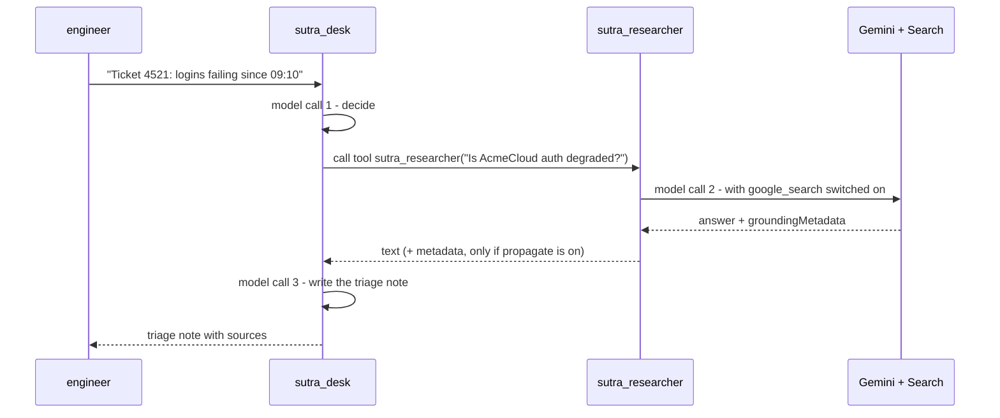

# 2.3 — The specialist you write yourself

## One-line answer

Sutra satisfies the exclusivity rule by giving the built-in an agent of its own and offering that
agent to the desk as a tool — and the one argument that decides whether the citations survive the
handover defaults to **off**.

## The story

You cannot book the skin clinic yourself.

You go to your own doctor, describe the mark on your arm, and they write a referral. Weeks later you
see the specialist, who looks properly, orders a test, and writes back. Then you sit in your own
doctor's room again and hear the summary: *"they are happy it is nothing, no action needed."*

That summary is useful and it is also thin. Somewhere there is a letter with the test result on it,
the actual measurements, the name of the thing that was ruled out. Sometimes it is scanned into your
file and you can ask for a copy. Sometimes only the summary is entered, and when a different doctor
asks two years later what the test actually said, there is nothing in the file to read. The care was
the same either way. What survived the handover was not.

## The idea in plain language

Section 2 has established the shape of the problem: an agent holding a built-in may hold nothing
else, and the flag from [2.2](2.2-a-flag-that-does-not-lift-the-wall.md) solves it by building a
hidden agent behind your back. This part builds the same thing deliberately.

The pattern has two pieces.

**A specialist agent.** One agent whose entire tool list is `[google_search]`, with a name you chose
and an instruction you wrote. It satisfies the rule by construction, because there is nothing else on
it to conflict with.

**An `AgentTool`.** ADK's wrapper that makes an agent callable *as a tool* by another agent. The
desk's `tools` list then holds Sutra's own functions plus one entry that is, from the model's point
of view, an ordinary tool: it has a name, it has a description, you call it with a request and it
returns text. Underneath, calling it runs the specialist's whole turn — its own model call, its own
search, its own answer — and hands back the result.

Two facts about `AgentTool` that you can only learn by reading the installed package, and both change
how you use it:

- **The tool's name and description come from the agent, not from you.** `AgentTool.__init__` ends
  with `super().__init__(name=agent.name, description=agent.description)`. The `description` field on
  your specialist agent — which most agents leave empty, because nothing else reads it — is now the
  sentence the desk's model uses to decide whether to consult the specialist at all. An empty
  description is a specialist nobody refers to.
- **Citations do not survive the handover unless you ask.** The constructor takes
  `propagate_grounding_metadata`, and it defaults to `False`. With it off, the desk receives the
  specialist's *text* and nothing else: no source list, no URLs, nothing to show a reader. With it
  on, the metadata is placed in session state under the key `temp:_adk_grounding_metadata`, where the
  parent's flow picks it up. That is the scanned letter versus the one-line summary.

The `temp:` prefix in that key is not decoration; it is a real scope with a real lifetime, and it is
the whole subject of [Day 17](../../../day-17-state-scopes-and-lifetimes/LESSON.md) tomorrow. For
today it is enough to know that ADK is passing the citations through a piece of shared state rather
than through the return value, because the return value of a tool is a string and a string cannot
carry a source list.

## Why Sutra needs it

Because this is the shape Sutra keeps, and it is worth being explicit that Sutra is choosing it.

From today, `sutra/builtin_tools.py` holds two agents that are not the desk: a researcher that owns
web search and nothing else, and a coder that owns code execution and nothing else. The desk keeps
its own tools and gains one referral it can make. When Phase 8 (Days 53–59) turns Sutra into a graph,
the Researcher node already exists, already has an instruction, and already has a budget line —
because a platform constraint made you build it a phase early.

The alternative was the flag, and the argument against it was made in
[2.2](2.2-a-flag-that-does-not-lift-the-wall.md): it produces an agent with an instruction you did
not write and a name you did not choose. The argument *for* writing it yourself is this part's
finding — the specialist's `description` is what gets it used, and the propagation flag is what
decides whether an answer arrives with its evidence. Both are decisions, and neither is available to
you if the wrapper is generated.

## The mechanism

```python
# days/day-16-built-in-tools-with-brakes/lab/specialist.py
"""The referral pattern: a search specialist offered to the desk as a tool. Zero model calls."""

import asyncio

from google.adk.agents import Agent
from google.adk.tools import google_search
from google.adk.tools.agent_tool import AgentTool


def lookup_ticket(ticket_id: str) -> dict:
    """Look up a support ticket by its identifier."""
    return {"id": ticket_id, "status": "open"}


searcher = Agent(
    name="sutra_researcher",
    model="gemini-3.7-flash",
    description="Answers questions about the current public web, with sources.",
    instruction="Search before answering. Report what the sources say.",
    tools=[google_search],  # one entry, and it stays one entry
)

desk = Agent(
    name="sutra_desk",
    model="gemini-3.7-flash",
    instruction="Triage tickets.",
    tools=[lookup_ticket, AgentTool(agent=searcher, propagate_grounding_metadata=True)],
)


async def main() -> None:
    print("searcher entries:", len(searcher.tools))
    for tool in await searcher.canonical_tools():
        print("   searcher ->", type(tool).__name__, tool.name)
    for tool in await desk.canonical_tools():
        declaration = tool._get_declaration()
        description = None if declaration is None else declaration.description
        print("   desk ->", type(tool).__name__, tool.name, "|", description)
    referral = desk.tools[1]
    print("propagate flag  :", referral.propagate_grounding_metadata)
    print("skip_summarization:", referral.skip_summarization)


asyncio.run(main())
```

**Line by line:**

- `description="Answers questions about the current public web, with sources."` — on the *agent*, and
  this is the load-bearing line of the file. `AgentTool` copies it into the tool's description, so
  this sentence is what the desk's model reads when deciding whether to refer. Every other agent in
  Sutra so far has left `description` empty because nothing read it. Here, it is the interface.
- `tools=[google_search]` — the specialist's whole list. One entry, so the exclusivity rule is
  satisfied and [2.2](2.2-a-flag-that-does-not-lift-the-wall.md)'s rewrite never triggers.
- `AgentTool(agent=searcher, ...)` — the **constructor**, not `AgentTool.create(...)`. The adk.dev
  limitations page names `AgentTool.create()` as the workaround; that classmethod **does not exist in
  the installed `google-adk` 2.7.1**, and calling it raises `AttributeError`. The page and the package
  disagree, exactly as they did on
  [15.5.1](../../../day-15-toolsets-and-openapi/parts/05-where-it-bites/5.1-the-page-and-the-package-disagree.md),
  and the package is what runs.
- `propagate_grounding_metadata=True` — keyword-only, and off by default. This is the scanned letter.
  Without it the desk gets prose with no sources, and section 3's entire apparatus has nothing to
  read.
- `desk.tools[1]` — reaching into the list to print the wrapper's own flags, because the interesting
  configuration is on the wrapper rather than on either agent.
- `skip_summarization` — printed to show it exists and is `False`. When `False`, the desk's model
  writes its own sentence around the specialist's answer, which is the behaviour you want for triage
  and the behaviour you must *not* have if you need the specialist's words verbatim.

Measured on `google-adk` 2.7.1 on 2026-09-03:

```text
searcher entries: 1
   searcher -> GoogleSearchTool google_search
   desk -> FunctionTool lookup_ticket | Look up a support ticket by its identifier.
   desk -> AgentTool sutra_researcher | Answers questions about the current public web, with sources.
propagate flag  : True
skip_summarization: False
```

The desk holds two ordinary callable tools. Nothing on its list is a built-in, so nothing about the
desk violates the rule, and the built-in is one level down where it is alone.



Three model calls for one triaged ticket. That is the price of the pattern, it is not hidden, and on
a free tier of 20 requests per day it is a number you have to plan around rather than discover.

## When it breaks

**You copy the workaround from the documentation.**

```text
AttributeError: type object 'AgentTool' has no attribute 'create'
```

`adk.dev/tools/limitations/`, read on 2026-09-03, offers `AgentTool.create()` as the first workaround.
The installed 2.7.1 has no such classmethod — `hasattr(AgentTool, "create")` is `False`. Use the
constructor. This is Principle 8 doing its job: the page is checked, and then the package is checked,
and where they disagree the day records the disagreement instead of quietly picking one.

**Your specialist is never consulted.**

No error, no log line, and the desk simply answers from memory. The cause is almost always an empty
`description` on the specialist agent: `AgentTool` copied `""` into the tool's description, and the
model has no reason to prefer an unexplained tool over its own knowledge. The check is the second
block of the measured output above — if the text after the `|` is empty, that is your bug.

**The answer arrives with no sources, and section 3's helper prints nothing.**

Also silent. `propagate_grounding_metadata` defaults to `False`, so the specialist's citations were
dropped at the handover. Worse, the officially *recommended* composition has the same problem:
ADK 2.7.1's `AgentTool` docstring says direct use is discouraged and suggests attaching the sub-agent
with `mode='single_turn'` and `sub_agents=[...]` instead, which makes ADK wrap it for you — as
`_SingleTurnAgentTool(sub_agent)`, constructed with no propagation argument, so the flag is `False`
and the metadata is dropped. The recommended route loses the receipts. That is a real trade-off in a
pinned version, not a bug you can fix, and it is why Sutra uses the constructor today and states the
reason in the module docstring.

## In production

**Name the specialist for the question it answers, and write its description as if it were an API.**

In a real system the researcher's `description` is reviewed more carefully than its instruction,
because the description is what makes the difference between a capability that is used and one that
quietly is not. A useful shape is *what it answers, what it does not, and what it returns*: "Answers
questions about the current public state of the internet — vendor status, outages, published
versions. Not for anything about our own tickets or customers. Returns a short answer with sources."
The middle sentence is a routing rule aimed at the desk's model, and it is the cheapest defence you
have against [4.3](../04-newspaper-or-cabinet/4.3-the-question-that-left-the-building.md)'s privacy
failure.

**What degrades at scale is the call count.** One referral is three model calls, and a desk that
refers on every ticket has tripled its request budget for a capability used on a minority of them.
The mitigations are all architectural: a narrower description so the desk refers less often, a cheaper
model on the specialist (Flash-Lite has the higher daily allowance, per Addendum 02 §5), or a graph
where the routing decision is a node rather than a model choice — which is where Phase 8 goes.

**What fails only under real traffic** is the referral loop. A specialist that is itself allowed to
refer, directly or through a chain, will eventually be handed a question it refers onwards, and
`AgentTool` gives you no depth limit for free. Keep specialists leaf-shaped: they hold their built-in
and nothing that can delegate.

**The review comment**: *"the researcher has no description, so nothing will call it; and propagation
is off, so if anything does, we lose the sources."*

**The interview question**: *"how do you use a built-in tool alongside your own tools?"* The complete
answer names the pattern (a specialist agent, wrapped as a tool), the cost (an extra model call per
consultation) and the trap (citations are dropped at the boundary unless you turn propagation on).

## Check yourself

```bash
cd days/day-16-built-in-tools-with-brakes/lab
uv run python specialist.py
```

Then delete the `description=` line from `searcher`, run it again, and read what the desk is now
offered.

**Out loud, without scrolling up:** describe the referral pattern in three sentences, and say which
single argument decides whether a grounded answer keeps its sources.
