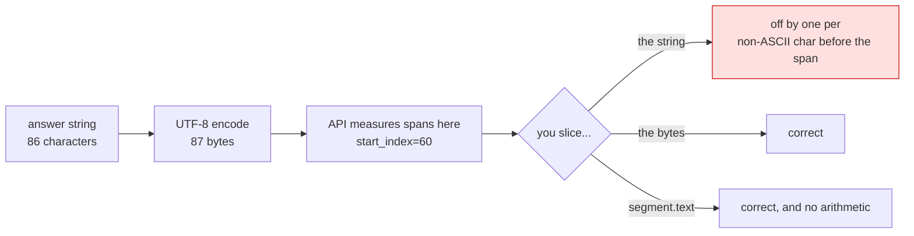

# 3.2 — The offsets are in bytes

## One-line answer

`grounding_supports[].segment` says which span of the answer a source backs up, and its
`start_index` and `end_index` are **positions in the UTF-8 bytes, not in the Python string** — so
slicing the answer with them highlights the wrong words the moment a single accented character
appears earlier in the text.

## The story

The curtains were measured in inches and the pattern was printed in centimetres.

Not a hard mistake to make. The tape had both scales on it, one on each edge, and the numbers were
written on the back of an envelope with no unit next to them. Everything was measured properly. The
cutting was careful. The seam allowance was correct for the fabric.

The finished curtains were short. Not comically short — short enough that they looked fine on the
rail and stopped an inch above the sill, so the first person to see them said "lovely", and the
second person, three days later, said "are those meant to be that length?"

Nobody misread a number. The numbers were right in the system they were written in and wrong in the
system they were used in, and the gap between the two was small enough to survive being looked at.

## The idea in plain language

[3.1](3.1-where-the-sources-are.md) listed the four fields of grounding metadata and skipped over the
third. This is that field.

`grounding_supports` is the join between the answer and the sources. Each entry has:

- `grounding_chunk_indices` — a list of positions into `grounding_chunks`. `[0, 2]` means *the first
  and third sources back this up*.
- `segment` — which part of the answer is being backed up.
- `confidence_scores` — one score per index, from 0 to 1.

`segment` is where the trap is. It carries `text`, which is the span written out in full, and it also
carries `start_index` and `end_index`. The obvious thing to do with two indices and a string is to
slice the string, and that is the bug, because the type's own documentation in `google-genai` 2.19.0
says what those numbers count:

> Output only. Start index in the given Part, **measured in bytes**. Offset from the start of the
> Part, inclusive, starting at zero.

Python strings are not measured in bytes. `len("Zürich")` is 6, because Python counts characters, and
`len("Zürich".encode("utf-8"))` is 7, because `ü` takes two bytes in UTF-8. Every non-ASCII character
before your span pushes the byte offsets one or more positions further along than the character
offsets, and slicing with the wrong one silently trims or shifts the highlight.

The reason it survives review is that it works. It works perfectly on English text with straight
quotes, which is most of what you test with. It breaks on a customer name with an accent, on a curly
apostrophe copied out of a web page, on a euro sign, on any Devanagari or CJK text at all — and it
breaks by a small amount, so the highlight looks almost right.

**The safe move is to not slice at all.** `segment.text` already contains the span. Use it, and the
indices become what they are best used for: ordering the supports, and detecting overlaps.

## Why Sutra needs it

Because Sutra's interface is a triage note that an engineer reads, and the first genuinely useful
thing you can build on top of grounding metadata is a note where each claim shows the source behind
it.

That feature needs the supports. Naively, it needs to cut the answer into spans and attach a link to
each — which means slicing, which means this bug, on the first ticket containing a customer called
Müller or a quotation mark pasted from a browser.

There is a second reason, and it arrives on Day 84 with observability. A "citation coverage" metric —
what fraction of the answer's characters are backed by at least one source — is a genuinely good
signal about a grounded system, and it is computed from exactly these offsets. Compute it against
character positions and it will be quietly wrong for every answer containing a non-ASCII byte, in the
direction of looking better than it is.

## The mechanism

The whole bug, in a file with no ADK, no network and no key:

```python
# days/day-16-built-in-tools-with-brakes/lab/byte_offsets.py
"""Why a grounding segment's start_index and end_index are not string positions."""

ANSWER = "Zürich's status page says the EU auth cluster is degraded. Logins fail intermittently."

# What the API reports for the second sentence: offsets into the UTF-8 BYTES.
target = "Logins fail intermittently."
raw = ANSWER.encode("utf-8")
start = raw.index(target.encode("utf-8"))
end = start + len(target.encode("utf-8"))
print("segment start_index:", start, " end_index:", end)

print("characters in answer:", len(ANSWER), " bytes in answer:", len(raw))
print("naive  ANSWER[start:end] ->", repr(ANSWER[start:end]))
print("correct byte slice       ->", repr(raw[start:end].decode("utf-8")))
```

**Line by line:**

- `ANSWER = "Zürich's ..."` — one non-ASCII character, `ü`, sitting near the front. That is the entire
  setup. Everything after it is displaced by one byte.
- `raw = ANSWER.encode("utf-8")` — the bytes the API measured against. This is the string as it
  travelled, and the numbers in `segment` are positions in *this*.
- `raw.index(target.encode("utf-8"))` — locating the sentence the way the platform would, in bytes, so
  the two indices are exactly what a real `segment` would carry for that span.
- `len(ANSWER)` against `len(raw)` — 86 against 87. One character of difference, which is the whole
  fault.
- `ANSWER[start:end]` — the naive slice. Python starts counting one position late, so the first
  character of the sentence is eaten.
- `raw[start:end].decode("utf-8")` — the correct move if you must use the indices: slice the bytes,
  then decode. Note the decode can itself raise if a span happens to start or end in the middle of a
  multi-byte character, which is another argument for using `segment.text` and not slicing at all.

Measured with the pinned Python 3.12 on 2026-09-03:

```text
segment start_index: 60  end_index: 87
characters in answer: 86  bytes in answer: 87
naive  ANSWER[start:end] -> 'ogins fail intermittently.'
correct byte slice       -> 'Logins fail intermittently.'
```

One missing `L`. In a rendered note it looks like a highlight that starts a fraction too late, and
nobody files a bug about that.



## When it breaks

**It does not raise.** That is the finding. The naive slice returns a string, the string looks
plausible, and the test you wrote with English sample text passes forever.

When it does raise, it raises here:

```text
UnicodeDecodeError: 'utf-8' codec can't decode byte 0xbc in position 0: invalid start byte
```

That is the byte-slice path landing mid-character: `start` fell between the two bytes of `ü`
(`0xc3 0xbc`), so the slice begins with the second half of a character and `decode` refuses. It means your offsets and your bytes have
drifted apart — usually because the text was modified after the API measured it, which is the next
failure.

**You trimmed the answer, and every offset is now wrong.** Stripping whitespace, collapsing newlines
or prefixing `"Sutra: "` all change the byte positions of everything after the edit. The metadata was
measured against the text as it was returned. If the text is going to be rewritten, the highlighting
has to be computed **before** the rewrite, or the supports have to be carried alongside the original.

## In production

**Use `segment.text`. Keep the indices for ordering, not for cutting.**

The version a professional writes does not slice at all: it walks the supports in order, uses
`segment.text` as the quoted span, and uses the indices only to sort them and to detect overlaps —
because the platform can and does return supports that overlap, and rendering them naively produces
nested or duplicated highlights.

**What changes at scale** is the language mix. An English-only product ships this bug and never sees
it. The first support desk in Germany, India or Japan sees it on day one, in every answer, and it
arrives as a vague report that "the highlighting is off", which is expensive to trace back to a unit
mismatch in a field nobody reads.

**The review comment** on a diff that slices an answer with grounding offsets: *"these are byte
offsets and that is a Python string. Use `segment.text`, or encode first."*

**The interview question** is a good one precisely because it is small: *"you are given an answer, a
list of sources and a list of spans with start and end offsets. How do you render the citations?"*
The answer that shows you have read the API says the offsets are in bytes, that the text of the span
is already provided, and that spans can overlap.

## Check yourself

```bash
cd days/day-16-built-in-tools-with-brakes/lab
uv run python byte_offsets.py
```

Then remove the `ü` from `ANSWER`, run it again, and watch both lines agree — which is exactly how
this bug hides.

**Out loud, without scrolling up:** say what `start_index` counts, and give the one-line reason it is
safer to use `segment.text` than to slice.
