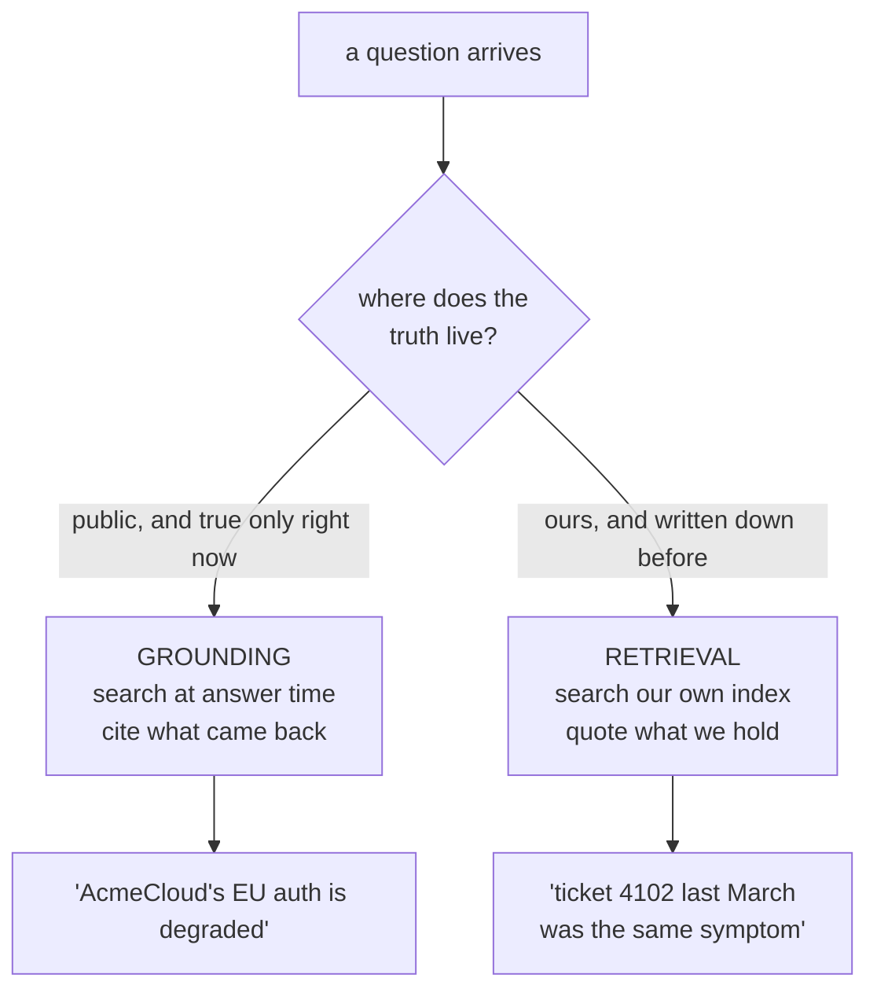

# 4.1 — Two questions that sound the same

## One-line answer

**Grounding** answers a question about the live public world by looking it up at the moment of
answering; **retrieval** answers a question about your own private records by searching a collection
you keep — and the only thing that decides which one a question needs is where the truth physically
lives.

## The story

Two questions on the same Saturday morning, in the same kitchen, in the same tone of voice.

*"Is the chemist open?"* You do not know, and neither does anyone in the house, because it depends on
whether they changed the Saturday hours again. Somebody looks it up. There is no version of this
question that is answered by thinking harder, and no drawer in the house that contains the answer.

*"Where's the warranty card for the washing machine?"* Nobody outside the house can help with this
one. It is somewhere — the folder in the cupboard, the pile on the shelf, the drawer nobody has
opened since the move. Looking it up online is not a worse way of finding it; it is not a way of
finding it at all.

Both questions start with a word like *where* or *is*. Both are asked in the same voice. One sends
somebody to their phone and the other sends somebody to the cupboard, and getting that backwards
wastes the morning: you cannot ring the chemist about your own paperwork, and you cannot find your
paperwork by ringing the chemist.

## The idea in plain language

Sutra is about to hold both kinds of lookup, and they are different organs.

**Grounding** means the model consults the live public web while it is answering, and cites what it
found. The word is used because the answer is *grounded* in something outside the model, rather than
in what the model happened to absorb during training. Two properties define it:

- the source is **public and live** — the state of the world at the moment of the call;
- the query **leaves your building**, because the search happens on someone else's machines
  ([1.3](../01-switched-on/1.3-the-request-that-leaves-your-process.md)).

**Retrieval** means searching a collection **you** keep — your tickets, your knowledge base, your past
resolutions — and putting what you find into the model's context so it can answer from it. The full
name it usually travels under is retrieval-augmented generation, and Sutra builds it in Phase 7 (Days
46–52), where the machinery is embeddings and a vector index: text turned into numbers so that
"cannot log in" can match "authentication failing" without the two sharing a word. Two properties
define it too:

- the source is **private and yours** — as fresh as the last time you indexed it, and no fresher;
- the query **can stay inside** — a local index answers without telling anyone what you asked.

Neither can substitute for the other, and the reason is not quality. It is location. A public search
engine has never seen ticket 4521 because ticket 4521 is in your database. Your index has never seen
this morning's outage because this morning has not been indexed by anyone, least of all you.

The mental model worth keeping is the one this section is named after: **grounding reads the
newspaper, retrieval reads your filing cabinet.** They are both reading. One tells you what happened
in the world today; the other tells you what your organisation has already written down. An assistant
who only ever reads the newspaper knows nothing about your business, and an assistant who only ever
reads the cabinet is confidently, politely three months out of date.



## Why Sutra needs it

Because the Researcher that Phase 8 builds will hold both, and the only thing standing between a good
Researcher and an expensive one is the routing decision at the top of that diagram.

There is a nearer reason too. Sutra's whole reason to exist, stated on
[Day 1](../../../day-01-bootstrap-and-map/LESSON.md), is a triage desk that answers *"what is this
ticket about, and have we seen it before?"*. That sentence contains one question of each kind. *What
is this about* often needs the world: is the vendor down, is this a known bug in a released version,
did something change this week. *Have we seen it before* is the filing cabinet, always, and no amount
of web search will ever answer it.

Today closes AG-07 by naming the distinction. Phase 7 builds the second organ. Between the two, every
day that adds a lookup has to answer the routing question, and a system that never asked it ends up
with one lookup used for everything and wrong half the time.

## The mechanism

There is no code in this part, which is deliberate: the mechanism here is a decision, and writing it
as code before you can make it by hand would hide it. The decision is a single question asked of the
question:

**Could this have been true yesterday and false today, in a place we do not control?**

If yes, it is a grounding question. Nothing you own can be trusted about it, because whatever you
wrote down about it was written before the change.

If no — if the answer is fixed in something your organisation has already recorded — it is a
retrieval question, and sending it outside is both useless and a disclosure.

Three worked examples, in Sutra's own language:

| The question | Where the truth lives | Which organ | Why the other one fails |
| --- | --- | --- | --- |
| "Is AcmeCloud's login service degraded right now?" | AcmeCloud's public status page, this minute | grounding | your index has nothing about a change made an hour ago |
| "Have we seen this stack trace before?" | your own resolved tickets | retrieval | the web has never seen your tickets, and asking discloses them |
| "Is this version of the library affected by that bug?" | public release notes and advisories | grounding | your notes are as current as the last time somebody updated them |

The fourth row is the one to hold on to, because it is the common case and it has no clean answer:
*"Why is this customer's integration failing?"* is **both**. The failure is in your logs and the cause
may be a vendor change published this morning. A Researcher that treats it as one kind of question
answers half of it confidently. This is why Phase 8's graph has a routing node rather than a single
tool, and it is worth noticing now, while the two organs are still separable in your head.

## When it breaks

**The filing-cabinet question sent to the newspaper.**

Ask a grounded agent *"have we seen ticket 4521 before?"* and it will not fail. It will search the
public web for something like `ticket 4521 support`, find pages belonging to entirely unrelated
companies, and produce a fluent answer about somebody else's ticket system. There is no error, the
citations are real, and the answer is nonsense — the most expensive shape of failure in this
curriculum, because everything about it looks healthy.

**The newspaper question sent to the filing cabinet.**

Ask a retrieval-only agent *"is AcmeCloud down?"* and it answers from the last thing it indexed. If
the index contains March's incident review, the agent will describe March's incident in the present
tense. Again no error, again a confident answer, and this time with an internal citation that makes it
look better sourced than the grounded version.

Both failures have the same root and the same tell: **an answer whose sources are the wrong kind of
source.** Reading the citations is not just about honesty
([3.1](../03-receipts/3.1-where-the-sources-are.md)); it is the fastest routing check you have.

## In production

**Route explicitly, and log which organ answered.**

A grown-up version of this has three things a first version does not. First, the routing decision is
written down somewhere a person can read: an instruction, a description, or a graph edge, not an
accident of which tool was on the list. Second, every answer records which organ produced it, so
"the agent is answering from stale data" is a query rather than an argument. Third, there is a
defined behaviour for the both-kinds question, because it is the most common real question and the
default behaviour is to silently pick one.

**What changes at scale** is that the two organs have different failure curves. Grounding degrades
when the world is noisy: a breaking incident produces contradictory pages, and the model has to
choose. Retrieval degrades when the index is stale or too big: more documents mean more plausible
near-matches, and the answer drifts towards whatever is most similar rather than most correct. A
system with both needs monitoring for both, and they are not the same alert.

**The review comment**: *"this agent has web search and our knowledge base on the same list. What
decides which one a question goes to, and where is that written?"*

**The interview question**: *"when do you use web search and when do you use RAG?"* The answer that
separates people who have shipped this from people who have read about it is not the definition. It is
*"by where the truth lives — and the interesting case is the question that needs both, which is most
of them."*

## Check yourself

```bash
grep -rn "AG-07" docs/CURRICULUM_INDEX.md
```

That is the ID this part closes, and the row tells you which day owns it.

**Out loud, without scrolling up:** give one Sutra question that only grounding can answer, one that
only retrieval can answer, and one that needs both. Say what goes wrong if each is routed to the
other organ.
