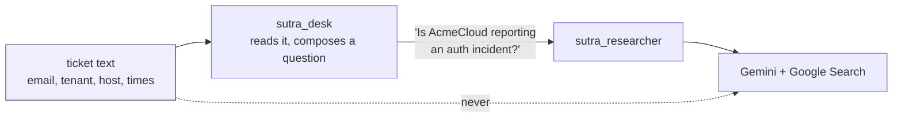

# 4.3 — The question that left the building

## One-line answer

Grounding turns part of your prompt into a search query on somebody else's machines, you have no
callback that can inspect it first, and the only reliable control is to never hand the specialist
anything you would not be willing to have searched.

## The story

The open-plan office, four o'clock, someone renewing their insurance on the phone.

They are not being careless. They have stepped slightly away from their desk, they are speaking
quietly, and they have angled themselves towards the window. Then the person on the phone asks for the
card number, and there is no quiet way to say sixteen digits. They say them in groups of four, twice,
because the first time was not heard.

Nobody in the room was listening. Nobody wrote anything down. Almost certainly nothing happened.

But the number was said out loud in a room with eleven other people and an open door, and there is no
version of the afternoon where it can be unsaid. Whatever happens next is somebody else's decision,
not theirs. The information left the room, and the room was the only thing they controlled.

## The idea in plain language

Two facts from earlier in the day meet here and become a policy.

**First: the query is composed on the far side.** Switching on `google_search` sends a permission, not
a query ([1.3](../01-switched-on/1.3-the-request-that-leaves-your-process.md)). The model decides
what to type into the search, and it decides it from the text you sent — the question, the
instruction, and whatever conversation history is in the request. So a ticket body pasted into a
grounded agent is not merely *sent to Gemini*, which was already true of every model call Sutra has
ever made. Some of it may be turned into a **search query**, which is a different destination with
different retention, and you find out which words afterwards, by reading `web_search_queries`.

**Second: there is no door to inspect it at.** Day 13's `before_tool_callback` fires when the model
asks your process to run a tool. Nothing asks your process here, so nothing fires
([1.3](../01-switched-on/1.3-the-request-that-leaves-your-process.md) measured this). There is no
supported hook between the model deciding on a query and the search happening. You cannot filter what
you cannot see.

Add the standing constraint from Addendum 02 §7, recorded on 2026-08-12: free tiers may use prompts
and responses to improve the provider's products, and Sutra's rule from that day is *never feed real
personal or employer data through free endpoints*. Sutra's ticket data is synthetic precisely so this
rule costs nothing to keep.

Put the three together and the control that remains is a shape, not a filter: **the desk composes a
question, and only the question goes.** The specialist never receives the ticket. It receives a
sentence like *"Is AcmeCloud reporting an authentication incident right now?"* — which contains a
public vendor's name and nothing of yours, and which is exactly what you would be content to see in a
search log.

Redaction is the tempting alternative, and it is worth building once to see why it is second best.

## Why Sutra needs it

Because Sutra's inputs are the most sensitive text a support system holds, and Phase 14 makes this
repository public.

A ticket contains a customer's email address, their hostnames, their tenant name, the error they are
getting, and sometimes a screenshot's worth of pasted logs. It is exactly the kind of text a
well-meaning agent will summarise into a search box. The failure is not dramatic: no breach, no
alert, just a support system that has been quietly asking a search engine about its customers'
infrastructure for eight months.

This also sets up Day 66, where the direction reverses. Today the risk is your data going out.
On Day 66 it is somebody else's instructions coming in, on a page the model searched for and read. The
grounded call is the one place in Sutra where both directions of that boundary exist, which is why
SEC-01's written policy — [6.3](../06-blast-radius/6.3-the-rule-sutra-writes-down.md) — covers this
edge as well as the code-execution one.

## The mechanism

Two things, side by side: the redaction you could do, and the composition Sutra does instead.

```python
# days/day-16-built-in-tools-with-brakes/lab/redact.py
"""What Sutra is allowed to send outwards. Zero model calls."""

import re

TICKET = """From: ops-desk@northwind-logistics.example
Subject: [#4521] Nobody on my team can log in since 09:10

Since about 09:10 our whole team gets "invalid credentials" on the AcmeCloud
console. Our tenant is northwind-prod, host 10.4.19.7. Card ending 4417 was
charged twice yesterday as well.
"""

EMAIL = re.compile(r"[\w.+-]+@[\w-]+\.[\w.-]+")
IPV4 = re.compile(r"\b(?:\d{1,3}\.){3}\d{1,3}\b")
TICKET_ID = re.compile(r"#\d+")
DIGITS = re.compile(r"\b\d{4,}\b")


def redact(text: str) -> str:
    """Replace the four things that must never leave, in a fixed order."""
    text = EMAIL.sub("<email>", text)
    text = IPV4.sub("<host>", text)
    text = TICKET_ID.sub("<ticket>", text)
    return DIGITS.sub("<number>", text)


QUESTION = "Is AcmeCloud reporting an authentication incident right now?"

print("--- the ticket as it arrived ---")
print(TICKET)
print("--- redacted, if you insisted on sending it ---")
print(redact(TICKET))
print("--- what Sutra actually sends ---")
print(QUESTION)
```

**Line by line:**

- `TICKET` — a synthetic ticket, with a `.example` domain, which is the reserved domain that cannot
  resolve. Synthetic data is not a convenience here; it is Addendum 02 §7's rule made structural.
- `EMAIL`, `IPV4`, `TICKET_ID`, `DIGITS` — four patterns, in rough order of how obviously they identify
  someone. Four is enough to make the point and nowhere near enough for a real filter.
- `DIGITS` last, matching any run of four or more digits — deliberately blunt, because a redactor that
  only removes things it recognises removes less than you think.
- `redact(text)` returning a new string rather than editing in place: the original ticket must survive
  untouched, because it is what the engineer actually works from.
- `QUESTION` — nine words, containing one public vendor name. This is the whole alternative design:
  the desk reads the ticket and composes a question; the ticket itself never travels.

```bash
cd days/day-16-built-in-tools-with-brakes/lab
uv run python redact.py
```

**Line by line:**

- No key, no request, no network. The subject of this part is what *would* be sent, so nothing needs
  to be.

Measured on 2026-09-03:

```text
--- the ticket as it arrived ---
From: ops-desk@northwind-logistics.example
Subject: [#4521] Nobody on my team can log in since 09:10

Since about 09:10 our whole team gets "invalid credentials" on the AcmeCloud
console. Our tenant is northwind-prod, host 10.4.19.7. Card ending 4417 was
charged twice yesterday as well.

--- redacted, if you insisted on sending it ---
From: <email>
Subject: [<ticket>] Nobody on my team can log in since 09:10

Since about 09:10 our whole team gets "invalid credentials" on the AcmeCloud
console. Our tenant is northwind-prod, host <host>. Card ending <number> was
charged twice yesterday as well.

--- what Sutra actually sends ---
Is AcmeCloud reporting an authentication incident right now?
```

Read the middle block carefully, because it is the argument. The redactor did its job — the address,
the ticket number, the host and the card digits are gone — and the text still contains
**`northwind-prod`**, which is the customer's tenant name, and **`09:10`**, which is the start of
their incident. A search for those two strings together identifies the customer to anyone who cares.

That is the general result, not a bug in these four patterns: a redactor removes what it was told to
recognise, and what identifies people is usually the combination of things nobody listed. The third
block is the design that does not have this problem, because nothing of the customer's was in the
sentence to begin with.



The dotted line is the policy. Everything else is mechanism.

## When it breaks

**There is no error text for this failure, and that is the whole difficulty.**

A grounded agent handed a whole ticket answers well. The search query it composed is plausible, the
sources are real, the triage note is good, and the only trace of what was disclosed is a field you
have to go and read:

```python
print(event.grounding_metadata.web_search_queries)
```

**Line by line:**

- `web_search_queries` is a list of strings — the queries the platform actually ran
  ([3.1](../03-receipts/3.1-where-the-sources-are.md)).
- It arrives **after** the search. This is an audit record, not a control: it tells you what left, once
  it has left.
- Print it on every grounded call in development. It is the only feedback loop you have on what your
  agent is disclosing, and reading it once changes how you write instructions.

**The near miss that looks like a success.** A specialist that follows its instruction and replies *"I
cannot answer questions about your internal systems"* has still received the question. If the desk
passed the ticket text, the disclosure already happened at the moment the specialist's model call was
made — the refusal came afterwards and protects nothing. The boundary is the referral, not the reply.

## In production

**Make the boundary structural, and put a person's name on it.**

The version a professional writes has the desk compose a question and pass a *question*, with the type
system helping where it can: the researcher's input is a `str` question, never a ticket object, and
nothing in the researcher's module imports the ticket model. That is a boundary a reviewer can see in
the imports rather than one they have to trust.

**What changes at scale** is that this becomes a legal question with an owner. A support product
handling data for customers in the EU, in health, or in finance will have a data-processing agreement
that says which third parties may receive customer data, and "our agent's search queries" is either in
that document or is a problem. The engineering decision made today — question in, not ticket in — is
what makes the answer to that question a short one.

**What fails only under real traffic** is the long tail of the composition step. The desk composes a
question with a model, and a model asked to summarise a ticket into a search query will sometimes
include the tenant name because it seemed relevant. Sampling `web_search_queries` in production is the
only way to know how often, and it is worth an alert when a query contains anything matching your own
customer identifiers.

**The review comment**: *"this passes `ticket.body` to the researcher. The researcher's input should be
a question we composed, and the ticket should not be reachable from that module at all."*

**The interview question**: *"what leaves your building when an agent uses web search?"* The answer
that shows you have thought about it names three things: the model call itself, whatever the model
chose to type into the search, and the fact that you only learn the second one afterwards.

## Check yourself

```bash
cd days/day-16-built-in-tools-with-brakes/lab
uv run python redact.py
```

Read the redacted block and find the two things still in it that identify the customer.

**Out loud, without scrolling up:** explain why Sutra sends a composed question rather than a redacted
ticket, and name the field that tells you afterwards what was actually searched for.
