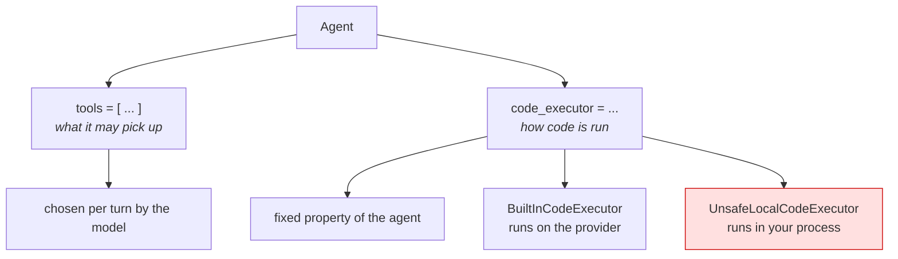

# 5.1 — An executor is not a tool

## One-line answer

Code execution is not something you put on the `tools` list: it is `code_executor=`, a property of the
agent describing **how generated code is run**, and the two fields refuse each other's values loudly
in one direction and produce an illegal request quietly in the other.

## The story

The kitchen has a drawer and it has an oven.

The drawer holds the things you pick up: the whisk, the peeler, the wooden spoon. You choose one for
the job in front of you, use it, put it back. If a friend is cooking at your house you can hand them
the whisk, and if the whisk is missing you can borrow one.

The oven is not in the drawer. It is in the wall. You do not choose it for a particular sauce; it is
part of what the kitchen *is*. You cannot hand it to anyone, you cannot borrow one for the evening,
and when you move house it stays. Everything you cook in it is shaped by the fact that this kitchen
has that oven.

Both are equipment. Only one of them is a thing you pick up.

## The idea in plain language

Everything on Sutra's `tools` list so far has been a thing the model picks up. It is described in the
request, the model chooses it or does not, and the choice is made fresh on every turn
([Day 4](../../../day-04-tools-by-hand/LESSON.md)).

Code execution is not shaped like that. When it is switched on, the model does not "call a tool
called run_python". It writes a block of code as part of its answer, and something runs that block and
feeds the result back so it can continue. The thing that runs it is the **code executor**, and in ADK
it is a property of the agent:

```
Agent(..., code_executor=BuiltInCodeExecutor())
```

Not `tools=[BuiltInCodeExecutor()]`. The distinction is not a naming quirk; it is the difference
between *what an agent can use* and *how something is performed*. A tool is picked up per turn. An
executor is in the wall.

Three practical consequences:

- **Only one executor per agent.** `code_executor` is a single field, not a list. An agent runs code
  one way or it does not run code.
- **The executor is swappable, and swapping it changes where the code runs, not what the model does.**
  ADK ships several: `BuiltInCodeExecutor` (the provider runs it, [5.2](5.2-the-executor-that-executes-nothing.md)),
  `UnsafeLocalCodeExecutor` (your own process runs it,
  [6.1](../06-blast-radius/6.1-the-executor-that-runs-it-here.md)), and container-, GKE- and
  Vertex-based ones behind an extras install. The agent's instruction is identical in every case. The
  blast radius is not.
- **The exclusivity rule still applies**, and this is the trap. Because the executor is not on the
  `tools` list, an agent with a code executor *and* a tool list looks legal to ADK and to you. On the
  Gemini API it is not: `adk.dev/tools/limitations/`, read 2026-09-03, names Code Execution as one of
  the built-ins whose use *"excludes the use of any other tools in that agent"*.

## Why Sutra needs it

Because the second built-in of the day is the one with the larger blast radius, and everything in
section 6 depends on the reader understanding that the executor is a **swappable component with a
default you chose**.

If code execution felt like a tool, the natural question would be "should this agent have it?". Because
it is an executor, the real question is the one Sutra has to answer today: *"where does generated code
run, and what can it reach from there?"*. That question has a written answer by the end of section 6
(SEC-01), and the reason it can have one is that the answer is a single field on a single agent.

The nearer reason is Sutra's own work. A ticket that says *"here are ninety response times, which of
these are outliers?"* is arithmetic, and [5.4](5.4-the-estimate-and-the-measurement.md) is about why a
language model must not do arithmetic in its head. The coder agent is how Sutra answers that question
honestly.

## The mechanism

Two fields, four combinations, and what each one does:

```python
# days/day-16-built-in-tools-with-brakes/lab/executor_not_tool.py
"""tools= and code_executor= are not interchangeable. Zero model calls."""

from google.adk.agents import Agent
from google.adk.code_executors import BuiltInCodeExecutor
from google.adk.tools import google_search

MODEL = "gemini-3.7-flash"


def show(label: str, build) -> None:
    """Run one construction and report what happened, without stopping the script."""
    try:
        agent = build()
    except Exception as error:  # noqa: BLE001 - the point of this script is which error
        print(f"{label}: {type(error).__name__}")
        print("   ", str(error).splitlines()[0])
        return
    print(
        f"{label}: built. tools={[t.name for t in agent.tools if hasattr(t, 'name')]} "
        f"executor={type(agent.code_executor).__name__ if agent.code_executor else None}"
    )


show(
    "executor in code_executor",
    lambda: Agent(name="coder", model=MODEL, code_executor=BuiltInCodeExecutor()),
)

show(
    "executor in tools        ",
    lambda: Agent(name="wrong1", model=MODEL, tools=[BuiltInCodeExecutor()]),
)

show(
    "tool in code_executor    ",
    lambda: Agent(name="wrong2", model=MODEL, code_executor=google_search),
)

show(
    "both built-ins, one agent",
    lambda: Agent(
        name="both", model=MODEL, tools=[google_search], code_executor=BuiltInCodeExecutor()
    ),
)
```

**Line by line:**

- `def show(label, build)` — each case is passed as a lambda so a failing construction does not stop
  the ones after it. Four experiments, one run.
- `except Exception as error:  # noqa: BLE001` — a deliberately broad catch with the reason written
  next to it, because the subject of the script is *which* exception each mistake produces. Everywhere
  else in Sutra this would be a bug (Principle 10); the `noqa` marks it as a measurement, and the
  comment is what makes the marker acceptable in review.
- `str(error).splitlines()[0]` — pydantic validation errors are several lines long; the first line
  carries the count and the model name, which is what identifies the mistake.
- `Agent(name="coder", ..., code_executor=BuiltInCodeExecutor())` — the correct shape. No `tools` at
  all.
- `tools=[BuiltInCodeExecutor()]` — the mistake almost everyone makes once, because every other
  capability so far went on that list.
- `code_executor=google_search` — the mirror-image mistake, and the one that proves the fields are
  typed rather than conventional.
- The fourth case is the quiet one: both built-ins on one agent, which **constructs successfully**.
  Nothing in ADK objects, and the platform is what refuses it later.

```bash
cd days/day-16-built-in-tools-with-brakes/lab
uv run python executor_not_tool.py
```

**Line by line:**

- Four constructions, no key, no request.

Measured on `google-adk` 2.7.1 on 2026-09-03:

```text
executor in code_executor: built. tools=[] executor=BuiltInCodeExecutor
executor in tools        : ValidationError
    3 validation errors for LlmAgent
tool in code_executor    : ValidationError
    1 validation error for LlmAgent
both built-ins, one agent: built. tools=['google_search'] executor=BuiltInCodeExecutor
```

The two wrong-field mistakes fail at construction. The genuinely dangerous one — both built-ins on one
agent — is the line that says `built`.



## When it breaks

**The executor on the tools list:**

```text
pydantic_core._pydantic_core.ValidationError: 3 validation errors for LlmAgent
tools.0.callable
  Input should be callable [type=callable_type, input_value=BuiltInCodeExecutor(optim...), input_type=BuiltInCodeExecutor]
tools.0.is-instance[BaseTool]
  Input should be an instance of BaseTool [type=is_instance_of, ...]
tools.0.is-instance[BaseToolset]
  Input should be an instance of BaseToolset [type=is_instance_of, ...]
```

Three errors for one mistake, and they are worth reading rather than skimming: they are the three
things a `tools` entry is allowed to be — a callable, a `BaseTool`, or a `BaseToolset` — which is
exactly the list from
[15.1.1](../../../day-15-toolsets-and-openapi/parts/01-crate-not-list/1.1-one-line-many-tools.md). The
executor is none of them, and pydantic reports the failure against each accepted shape in turn.

**The tool in the executor field:**

```text
pydantic_core._pydantic_core.ValidationError: 1 validation error for LlmAgent
code_executor
  Input should be a valid dictionary or instance of BaseCodeExecutor [type=model_type, input_value=<google.adk.tools.google_...>, input_type=GoogleSearchTool]
```

One error, one accepted shape: `BaseCodeExecutor`. The asymmetry between three and one is the type
system describing the asymmetry in the concept.

**Both built-ins on one agent — and no error at all.** The request that goes out carries two
permissions:

```text
config.tools -> [Tool(
  code_execution=ToolCodeExecution()
), Tool(
  google_search=GoogleSearch()
)]
```

Measured on 2026-09-03 by running both processors against one request. The Gemini API refuses this
combination for the same reason it refuses a built-in beside a function tool
([2.1](../02-one-at-a-time/2.1-one-built-in-and-nothing-else.md)), and the refusal arrives at call
time. Sutra's answer is the same as before: two agents, one capability each.

## In production

**Treat `code_executor` as a deployment decision, not a code decision.**

The version a professional writes does not hard-code the executor in the agent definition. It reads it
from configuration — provider sandbox in production, and never anything else without a written
exception — because the field is the entire security boundary
([6.3](../06-blast-radius/6.3-the-rule-sutra-writes-down.md)) and a security boundary that is one
constructor argument deep is one careless commit from moving.

**What changes at scale** is who sets it. In a small system one person writes the agent and knows what
the field means. In a larger one, agents are assembled from configuration and a default executor gets
inherited by agents nobody reviewed for it. The check that survives that is a test asserting which
executor class is in use, which is why
[8.1](../08-in-production/8.1-testing-a-built-in-without-spending-a-request.md) writes one.

**The review comment**: *"this agent has `tools` and a `code_executor`. On the Gemini API those cannot
coexist — and separately, which of the two does this agent actually need?"*

**The interview question**: *"in ADK, why is code execution not a tool?"* The answer worth giving names
both halves: a tool is offered to the model and chosen per turn, while an executor describes how the
code the model writes is run — so it is one per agent, it is swappable, and swapping it is the whole
of your sandboxing story.

## Check yourself

```bash
cd days/day-16-built-in-tools-with-brakes/lab
uv run python executor_not_tool.py
```

Two errors and two successes. Say out loud which of the two successes you would refuse in review.

**Out loud, without scrolling up:** explain the difference between `tools=` and `code_executor=` using
something in your own kitchen, then say which field decides where generated code runs.
