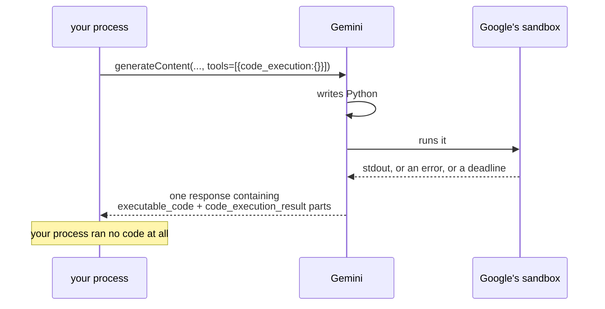

# 5.2 — The executor that executes nothing

## One-line answer

`BuiltInCodeExecutor.execute_code()` returns `None` and runs nothing: its entire local job is to add
`{"code_execution":{}}` to the outgoing request, because the code runs inside Google's sandbox and
never touches your machine.

## The story

The button at the pedestrian crossing.

You press it. Nothing in the button does anything — no gate opens, no light changes, nothing under your
finger is connected to the traffic. The button is a way of telling a box on a pole that somebody is
waiting.

The box decides. It has its own timings, it knows about the junction two streets away, and on a busy
road it will make you wait through a cycle no matter how many times you press. On a quiet road at
night it changes almost at once and it feels like the button did it.

Everyone knows how to use the button and almost nobody could say what it does. That is fine for
crossing a road. It is not fine when the box on the pole is running code that somebody's model wrote.

## The idea in plain language

There is a natural assumption to make about a class called `BuiltInCodeExecutor`: that it executes
code. It does not. The installed source of `built_in_code_executor.py` in `google-adk` 2.7.1 is short
enough to summarise honestly:

- `execute_code(...)` has a body of `pass`, with a comment above it — *"Execution is delegated to the
  model, so there is nothing to run here. A direct caller gets None; raising instead would change
  that."* Call it and you get `None`.
- `process_llm_request(...)` appends `types.Tool(code_execution=types.ToolCodeExecution())` to the
  request's tool list, and raises `ValueError` if the model is not a Gemini model.

That is the whole class. It is the same shape as `google_search`
([1.2](../01-switched-on/1.2-an-object-with-a-placeholder-name.md)): an object whose real work is one
line added to a request, and whose apparent job happens somewhere you cannot see.

ADK's flow agrees. In `flows/llm_flows/_code_execution.py`, the pre-processing step checks
`isinstance(code_executor, BuiltInCodeExecutor)`, calls `process_llm_request`, and **returns
immediately** — skipping the whole local-execution machinery: the retry counter, the code-block
delimiters, the data-file handling. The post-processing step has a matching branch whose only job is
to save any **image** the sandbox produced into the artifact service. Nothing else on this side runs.

So where does the code actually run? On Google's machines, in their sandbox, as part of answering the
request. Two facts about that sandbox are readable from the SDK's own type definitions rather than
from marketing:

- the language enum has exactly one real value, documented as *"Python >= 3.10, with numpy and simpy
  available"* — so the sandbox has a fixed, small library set and you cannot install into it;
- the outcome enum has an `OUTCOME_DEADLINE_EXCEEDED` value, documented as *"Code execution ran for
  too long, and was cancelled"* — so the sandbox has a time bound, enforced by them, with no argument
  for you to set.

**This is today's containment story, and it is a good one:** the code never touches your laptop, your
repository, your `.env` or your network. Not because you configured a boundary well, but because there
is no path from that code to your machine at all. Section 6 is what happens when you choose an
executor where that sentence stops being true.

## Why Sutra needs it

Because SEC-01 — the policy Sutra writes down in
[6.3](../06-blast-radius/6.3-the-rule-sutra-writes-down.md) — needs a default that is safe on the day
it is written, and this is it.

A policy that says *"generated code runs in a sandbox"* is only worth the sentence if there is a
sandbox today, in the code Sutra actually runs, rather than a plan to add one. `BuiltInCodeExecutor`
gives Sutra that for free: from today, the answer to *"where does model-written code execute?"* is
*"on the provider's machines, never in our process"*, and it is enforced by the fact that our process
has no execution path at all.

It also sets up Day 71's work honestly. When Sutra eventually needs code to run *near* its own data,
the change will be a different executor, and the reason that change is dangerous is exactly the
property this part establishes: today's safety is structural, and swapping the field swaps it out.

## The mechanism

```python
# days/day-16-built-in-tools-with-brakes/lab/executes_nothing.py
"""What BuiltInCodeExecutor does locally: nothing, plus one line on the request."""

from google.adk.code_executors import BuiltInCodeExecutor
from google.adk.models.llm_request import LlmRequest

executor = BuiltInCodeExecutor()

print("execute_code() ->", repr(executor.execute_code(None, None)))

request = LlmRequest(model="gemini-3.7-flash")
print("before:", request.config.tools)
executor.process_llm_request(request)
print("after :", request.config.tools)
print("json  :", request.config.tools[0].model_dump_json(exclude_none=True))

try:
    executor.process_llm_request(LlmRequest(model="groq/llama-3.3-70b-versatile"))
except ValueError as error:
    print("non-gemini ->", type(error).__name__ + ":", error)
```

**Line by line:**

- `executor.execute_code(None, None)` — passing `None` for both arguments, which would be absurd for a
  real executor and is harmless here because the body never touches them. That is the measurement: the
  method that sounds like the whole class ignores its inputs and returns nothing.
- `repr(...)` — so `None` is visible as `None` rather than as an empty line.
- `executor.process_llm_request(request)` — **not** `await`. Unlike a tool's
  `process_llm_request` ([1.3](../01-switched-on/1.3-the-request-that-leaves-your-process.md)), the
  executor's version is a plain synchronous method, because it does nothing that could block.
- `model_dump_json(exclude_none=True)` — the wire form of the switch, the same trick as
  [1.3](../01-switched-on/1.3-the-request-that-leaves-your-process.md).
- The `try` block with a Groq model string — the guard inside `process_llm_request`. It is the same
  shape of failure as the search tool's, and it is the seed of the day's failure lab
  ([7.1](../07-failure-lab/7.1-the-spare-that-does-not-fit.md)).

```bash
cd days/day-16-built-in-tools-with-brakes/lab
uv run python executes_nothing.py
```

**Line by line:**

- No key, no request, no network — the whole point being that the local half of code execution is
  inert.

Measured on `google-adk` 2.7.1 on 2026-09-03:

```text
execute_code() -> None
before: None
after : [Tool(
  code_execution=ToolCodeExecution()
)]
json  : {"code_execution":{}}
non-gemini -> ValueError: Gemini code execution tool is not supported for model groq/llama-3.3-70b-versatile
```

`{"code_execution":{}}` — the second empty object of the day, next to `{"google_search":{}}` from
[1.3](../01-switched-on/1.3-the-request-that-leaves-your-process.md). Two capabilities, two
permissions, no arguments either way.



## When it breaks

**You call the executor yourself and get nothing.**

```text
execute_code() -> None
```

Not an exception — a `None` where a `CodeExecutionResult` was expected, which then fails somewhere
else as an `AttributeError` on `.stdout`. The comment in the source is explicit that this is
deliberate: *"A direct caller gets None; raising instead would change that."* If you are calling
`execute_code` directly, you have mistaken the built-in executor for a local one.

**You point it at a non-Gemini model.**

```text
ValueError: Gemini code execution tool is not supported for model groq/llama-3.3-70b-versatile
```

The guard is `is_gemini_model(llm_request.model)`. This matters more than it looks, because
[Day 9](../../../day-09-four-free-providers/LESSON.md) taught swapping providers as a routine move and
Addendum 02's quota router (Day 70) is built on doing it automatically. A built-in does not travel with
the swap. [7.1](../07-failure-lab/7.1-the-spare-that-does-not-fit.md) is that failure in full.

**The sandbox refuses your library.** There is no local error for this one: the code comes back with an
`OUTCOME_FAILED` and an `ImportError` in its output, because the sandbox has the library set it has —
documented in the SDK as Python 3.10 or later with numpy and simpy — and nothing you do on your side
adds to it. An agent instructed to "use pandas" may write pandas code that cannot run.

## In production

**Do not build local infrastructure for something that runs remotely.**

The mistake this part prevents is a whole category: timeouts, retry counters and resource limits
written around code that your process never executes. `BaseCodeExecutor` has an `error_retry_attempts`
field and a `timeout_seconds` field, and for the built-in executor **both are ignored** — the flow
returns before reading them. Time spent tuning those is time spent on a dial that is not connected.
What you can control is what the model is asked to compute, and what you do with the answer.

**What changes at scale** is that the sandbox's limits become your product's limits. A deadline you did
not set and cannot see means a fraction of your computational answers come back as
`OUTCOME_DEADLINE_EXCEEDED` under load, and the only mitigations available are on your side of the
line: smaller inputs, simpler questions, and an honest message when the sandbox gives up.

**The review comment**: *"this wraps the code executor in a retry loop. The built-in executor runs
nothing locally, so this is retrying a model call — is that what we mean?"*

**The interview question**: *"where does the code an LLM writes actually run?"* The answer that shows
you looked: *"with the built-in executor, on the provider's machines — the class in the SDK executes
nothing, it just adds a flag to the request. Which means my containment story is the provider's, and
the day I need something else, that is a one-field change with a very large blast radius."*

## Check yourself

```bash
cd days/day-16-built-in-tools-with-brakes/lab
uv run python executes_nothing.py
```

The first line is the finding: `execute_code() -> None`.

**Out loud, without scrolling up:** say what `BuiltInCodeExecutor` does on your machine, and name the
two things the SDK's own type definitions tell you about the sandbox on the other end.
