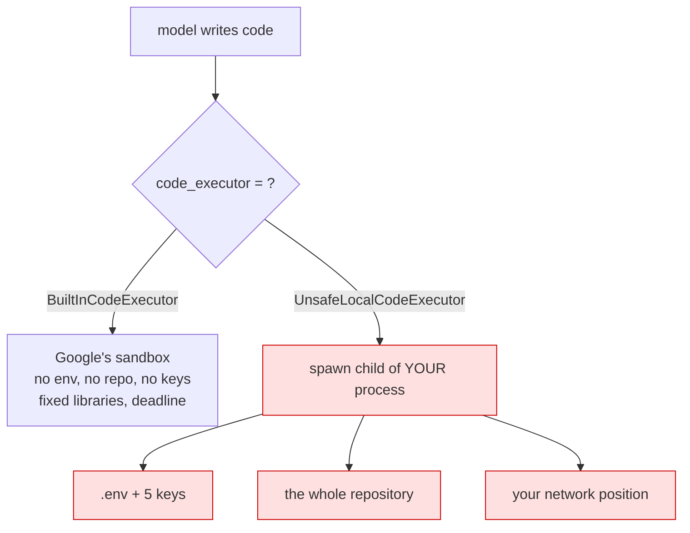

# 6.1 — The executor that runs it here

## One-line answer

ADK ships an executor that runs model-written code **in your own process**, and one field changed on
one agent gives that code your working directory, your environment variables and your `.env` — which
is why *where code runs* is a policy decision and not a configuration preference.

## The story

Somebody in the coffee shop asked to print a boarding pass.

Their laptop was out of battery, the flight was in the morning, and it was two minutes of your time.
You turned your laptop round and pushed it across the table.

They were entirely honest and they printed the boarding pass. But for those two minutes they were
sitting in *your* session. Your email was open in the next tab. Your browser would have filled in any
password they asked for. Your documents folder was two clicks away, your bank was one saved login
away, and none of it required them to break anything, because you had already opened all of it and
then handed over the keyboard.

You did not give them access to a printer. You gave them access to everything you had access to, and
trusted that printing was all they wanted.

## The idea in plain language

[5.2](../05-code-that-runs/5.2-the-executor-that-executes-nothing.md) established the good news:
`BuiltInCodeExecutor` runs nothing locally, so the code the model writes cannot reach your machine.

ADK ships a second executor in the same package. Its name is `UnsafeLocalCodeExecutor`, its docstring
is *"A code executor that unsafely execute code in the current local context"*, and it does exactly
what the name says. Reading the installed source of `unsafe_local_code_executor.py` in
`google-adk` 2.7.1:

- it spawns a child process with `multiprocessing.get_context("spawn")`;
- inside that process, it calls **`exec(code, globals_, globals_)`** on the string the model produced;
- it captures stdout with `redirect_stdout` and returns it as a `CodeExecutionResult`.

The library is being honest, in the name and in the docstring, and it is worth being clear-eyed about
what the honesty covers. A `spawn` child process is a real process boundary: it does not inherit your
Python objects or your open file handles. What it *does* inherit is the two things that matter here —
the **environment**, including every key `load_env()` put there, and the **working directory**,
including `.env` itself and the whole repository.

So the containment story changes completely, and the diff that changes it is one line:

```
code_executor=BuiltInCodeExecutor()      # runs on Google's machines
code_executor=UnsafeLocalCodeExecutor()  # runs here, as you
```

This is **AG-32**, agent sandboxing and execution isolation, in its most concrete possible form. The
question is not *"is generated code dangerous?"* — the interesting version is *"what can it reach from
where it runs?"*, and today Sutra can answer that precisely for both options.

One more thing has to be said plainly, because it is the reason this is a policy and not a
preference. The model's inputs are not trustworthy. A ticket is text a stranger wrote, and from Day 66
onwards Sutra treats it as potentially hostile. So generated code is untrusted by construction — not
because the model is malicious, but because the model can be *persuaded*, and the thing doing the
persuading is the input your product exists to read.

## Why Sutra needs it

Because Sutra is about to have both executors available, and the safe one is safe by accident of a
default rather than by any decision anyone has written down.

Today's default is provider-side execution, which is why today is the right day to write SEC-01
([6.3](6.3-the-rule-sutra-writes-down.md)). The rule has to exist *before* the first time somebody
needs local execution — for a plotting library the sandbox lacks, for a file the sandbox cannot reach,
for a test that runs faster locally — because at that moment the change looks like a one-word edit
and the reviewer has nothing to point at.

There is a Day 71 reason as well. That day drills sandbox providers for real, alongside computer use,
which is the largest blast radius in the plan. Everything that day does is a variation on this one
field, and the vocabulary — isolation, credentials, egress, disposability — is set here.

## The mechanism

Do not skip running this one. It is the most persuasive thirty lines in the day, and it costs nothing:

```python
# days/day-16-built-in-tools-with-brakes/lab/unsafe.py
"""What generated code can reach when the executor is local. Zero model calls."""

from google.adk.code_executors import UnsafeLocalCodeExecutor
from google.adk.code_executors.code_execution_utils import CodeExecutionInput

from sutra.config import load_env

# Pretend this arrived from a model. It did not: you wrote it, so nothing here is
# a real attack - it is the same access a real one would have.
PRETEND_MODEL_OUTPUT = """
import os, pathlib

key = os.environ.get("GOOGLE_API_KEY", "")
print("GOOGLE_API_KEY visible:", bool(key), "| length:", len(key))

env = pathlib.Path(".env")
print(".env readable:", env.exists())
if env.exists():
    names = [line.split("=")[0] for line in env.read_text().splitlines() if "=" in line]
    print("variables it could have read:", names)

print("working directory:", pathlib.Path.cwd().name)
print("files it can see :", len(list(pathlib.Path.cwd().iterdir())))
"""


def main() -> None:
    load_env()  # exactly what sutra/desk/agent.py does at import
    executor = UnsafeLocalCodeExecutor()
    result = executor.execute_code(None, CodeExecutionInput(code=PRETEND_MODEL_OUTPUT))
    print("--- stdout from the executed code ---")
    print(result.stdout.strip())
    print("--- stderr ---")
    print(result.stderr.strip() or "(empty)")


if __name__ == "__main__":
    main()
```

**Line by line:**

- `PRETEND_MODEL_OUTPUT` — a string you wrote, deliberately, so that nothing in this lab is an actual
  attack. The access it demonstrates is not pretend; only the origin is.
- `print("... length:", len(key))` — the length, never the value. This lab proves the key is reachable
  and does not put it on your screen or in your scrollback, and that habit is worth keeping in every
  diagnostic you ever write.
- `names = [line.split("=")[0] ...]` — the variable **names** from `.env`, not the values. Same rule.
  The list is the finding: those are the credentials the code could have read in full.
- `load_env()` **before** constructing the executor — because that is what Sutra's real agent module
  does at import time (Day 5). Without this line the environment looks clean and the demonstration
  understates the problem.
- `CodeExecutionInput(code=...)` — the dataclass the executor takes. Here it is being called directly,
  with `None` for the invocation context, because the point is the executor and not a run.
- `if __name__ == "__main__":` — **required**, not decoration. The executor uses the `spawn` start
  method, so the child re-imports this module; without the guard, the module-level code runs again in
  the child and the process forks endlessly.

```bash
cd days/day-16-built-in-tools-with-brakes/lab
uv run python unsafe.py
```

**Line by line:**

- Run from `lab/`, and notice in the output that the working directory the executed code reports is the
  **repository root** — `uv run` sets it, and the code inherits it.

Measured on `google-adk` 2.7.1 on 2026-09-03, on the machine this repository lives on:

```text
--- stdout from the executed code ---
GOOGLE_API_KEY visible: True | length: 53
.env readable: True
variables it could have read: ['GOOGLE_API_KEY', 'GOOGLE_GENAI_USE_VERTEXAI', 'GROQ_API_KEY', 'OPENROUTER_API_KEY', 'GEMINI_API_KEY']
working directory: sutra
files it can see : 25
--- stderr ---
(empty)
```

Five credentials, the repository, and a clean exit. Nothing raised, nothing was logged, and from the
agent's point of view the code ran successfully — because it did.



## When it breaks

**The failure is that it does not break.** Read the measured output again: no exception, no warning,
`stderr` empty. A local executor doing the worst thing you can imagine looks exactly like a local
executor computing a median.

The failures it *does* produce are all about the wrong things:

**Without the `__main__` guard, the script never returns.** Measured on 2026-09-03: the same code with
the guard removed produced no output and no error, and had to be killed from another terminal. The
`spawn` start method re-imports the module inside the child process, so the module-level call to
`execute_code` runs again there, and again in its child. It is the first thing most people hit here,
it is about your script's shape rather than about security, and it teaches the important fact by
accident: the executed code runs in a **child of your process**.

**`ValueError: Cannot set 'stateful=True' in UnsafeLocalCodeExecutor.`**

Raised by the constructor. The class overrides `stateful` and `optimize_data_file` as frozen `False`,
so a caller cannot ask it to keep state between executions. A small mercy, and the only guard rail
this class has.

**The code hangs and never returns.** `timeout_seconds` defaults to `None`, and the executor waits on
its result queue with that timeout — so `while True: pass` waits for ever. That is
[6.2](6.2-what-a-sandbox-has-to-be.md)'s subject, along with what a bound would have to cover.

## In production

**The answer to "where does generated code run?" belongs in a document, not in a constructor
argument.**

That is the whole of [6.3](6.3-the-rule-sutra-writes-down.md), and this part is the evidence behind
it. The practical controls a team puts around this field are three: the default is provider-side, any
other value requires a written exception, and a test asserts the class in use so the exception cannot
arrive quietly ([8.1](../08-in-production/8.1-testing-a-built-in-without-spending-a-request.md)).

**What changes at scale** is who is running the process. On your laptop the blast radius is your
laptop. In a container in production it is a service account, a mounted secret, a database
credential, and a network position inside your perimeter — which is worse in every dimension except
the one people worry about. "It is only in the container" is not containment; the container is where
the interesting credentials are.

**What fails only under real traffic** is the assumption that generated code is generated from your
prompt. Under real traffic the input contains customer text, and from Day 66 that text is a channel an
attacker can write to. The executor does not know the difference, and there is no version of *"the
model would not write that"* that survives contact with an adversary who is writing the model's
input.

**The review comment**: *"this changes the executor to the local one so the plotting library works.
That gives ticket-derived code our five API keys and the repository. What is the containment story,
and who signed it off?"*

**The interview question**: *"an agent needs to run code. Where do you run it?"* The answer that shows
you have thought about it does not start with a product name. It starts with *"not in the process that
holds the credentials"*, and then talks about what the sandbox must not have.

## Check yourself

```bash
cd days/day-16-built-in-tools-with-brakes/lab
uv run python unsafe.py
```

Read the list of variable names in the output and say, out loud, what each of those keys can do.

**Out loud, without scrolling up:** name the two things a `spawn` child process inherits from its
parent, and say which single line of an agent definition decides whether model-written code can see
them.
