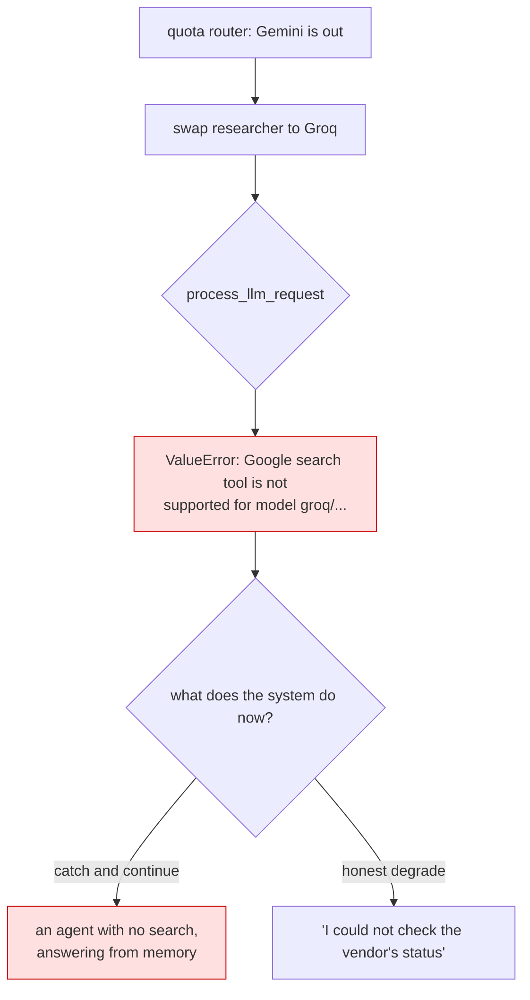

# 7.1 — 💥 The spare that does not fit

## One-line answer

Sutra's whole resilience story is *"if one provider is out, swap to another"* — and a built-in tool
does not travel with the swap: the fallback provider raises `ValueError` at the moment the primary
runs out, which is the only moment the fallback exists for.

## The story

The spare was in the boot the whole time.

Two years of driving, a spare wheel under the floor, checked once at a service and forgotten. That is
what a spare is for: you do not think about it, and then one evening on a wet road you hear the noise
and pull over, and the whole point of those two years is the next fifteen minutes.

Jack out, wheel off, spare out. And the spare is a space-saver — narrower, and rated for a much lower
speed than the road you are on. It is not the wrong wheel; it fits, it will get you somewhere. But the
somewhere it will get you is a garage in the morning, not the place you were going tonight, and that
was decided years ago by whoever specified the car.

Nobody lied to you. You had a spare. You had never asked what the spare could do.

## The idea in plain language

This is the day's deliberate failure, and it is deliberate in a second sense too: everything that
produces it is something Sutra was told to do.

[Day 9](../../../day-09-four-free-providers/LESSON.md) built the four-provider story: the same agent,
run against Gemini, Groq, OpenRouter `:free` or a local Ollama, with LiteLLM as the translator. Addendum
02 §6 turns that into a plan — the quota router, arriving on Day 70, watches each provider's headroom
and sends work to whoever has some. It is a good plan and Sutra is going to build it.

Today's two capabilities are the exception nobody wrote down. `google_search` and `BuiltInCodeExecutor`
are **Gemini features**, not ADK features. Their `process_llm_request` methods check the model and
raise when it is not a Gemini one — you saw the code executor's version in
[5.2](../05-code-that-runs/5.2-the-executor-that-executes-nothing.md). So the searcher agent cannot be
run on the fallback provider at all. Not degraded: refused.

And the timing is the cruel part. The swap happens because the primary is exhausted, which means the
failure arrives during a Gemini quota exhaustion, which is to say on a busy day, which is to say
exactly when somebody is waiting for an answer about whether a vendor is down.

### 🎬 The scene

It is the afternoon of an incident. Tickets are arriving faster than usual because a vendor's login is
failing, and every one of them makes the desk want to check the vendor's status page.

The first several work. Then Gemini's daily allowance runs out — twenty requests, and a grounded
triage costs three of them ([4.4](../04-newspaper-or-cabinet/4.4-two-meters-one-call.md)) — and the
quota router does what it was built to do: it swaps the researcher's model to Groq, which has
headroom.

### 😬 The naive fix

*"Fine, the router handles this. Groq is fast and it is free. We will be a bit slower to answer and
nobody will notice."*

### 💥 Why it fails

The researcher does not answer more slowly. It does not answer at all, and the traceback names a tool
rather than a quota:

```text
ValueError: Google search tool is not supported for model groq/llama-3.3-70b-versatile
```

That is the measured error, from `google_search.process_llm_request`, and the second measured error is
the one that caused the swap in the first place. Both are reproduced in *When it breaks* exactly as
they arrived.

### 💡 The insight

**A fallback is only a fallback for the capabilities both sides have.** Provider swapping trades on an
assumption — that a model is a model — and a built-in tool is precisely the thing that breaks the
assumption, because it is not part of the model at all. It is part of the platform the model is served
from.

Which means the resilience plan has to be written per capability, not per agent: *the classifier can
fail over to Groq; the researcher cannot fail over at all, and must degrade honestly instead.*

## Why Sutra needs it

Because Day 70 builds the quota router, and it will route the researcher into a wall unless somebody
tells it not to.

The router's rule today would be *"send this call to whoever has headroom"*. The rule it actually needs
is *"send this call to whoever has headroom **and can do this**"*, and that second clause requires a
per-agent record of which capabilities are provider-specific. Today is where that record gets its first
entry, and the day's build brief asks you to write it down rather than remember it.

There is also a Phase 8 consequence. If the researcher cannot fail over, then the graph needs a defined
behaviour for *"the researcher is unavailable"* — and the answer must not be "carry on without it",
because [Day 15's failure lab](../../../day-15-toolsets-and-openapi/parts/06-failure-lab/6.1-the-crate-that-arrived-empty.md)
already showed what an agent does when its tools quietly vanish: it answers anyway, confidently, and
the run looks clean.

## The mechanism

Reproduce both halves without spending anything:

```python
# days/day-16-built-in-tools-with-brakes/lab/swapped.py
"""The fallback that cannot do the job. Zero model calls."""

import asyncio

from google.adk.code_executors import BuiltInCodeExecutor
from google.adk.models.llm_request import LlmRequest
from google.adk.tools import google_search

GEMINI = "gemini-3.7-flash"
FALLBACK = "groq/llama-3.3-70b-versatile"  # Day 9's speed lane


async def main() -> None:
    for model in (GEMINI, FALLBACK):
        request = LlmRequest(model=model)
        try:
            await google_search.process_llm_request(tool_context=None, llm_request=request)
            BuiltInCodeExecutor().process_llm_request(request)
            print(
                f"{model}: ok -> {[t.model_dump_json(exclude_none=True) for t in request.config.tools]}"
            )
        except ValueError as error:
            print(f"{model}: {type(error).__name__}: {error}")

    try:
        from google.adk.models.lite_llm import LiteLlm
    except ImportError as error:
        print("LiteLlm not installed here:", str(error).splitlines()[0])
        return
    print("LiteLlm available; the agent-level run is the same failure, one layer up:", LiteLlm)


asyncio.run(main())
```

**Line by line:**

- The loop runs the **same two built-ins** against two model strings, which is the entire experiment.
  Nothing else differs.
- `LlmRequest(model=model)` — going straight at the request rather than through a runner, because the
  check that fails happens while the request is being built. Reproducing this failure needs no key and
  no network, which is worth knowing: you can test provider compatibility in CI.
- `FALLBACK = "groq/llama-3.3-70b-versatile"` — Day 9's speed lane, written as the string LiteLLM
  expects. The `is_gemini_model` check looks at exactly this string.
- `except ValueError` — the specific type both built-ins raise. Catching it here is a measurement; in
  `sutra/` it would be a bug, because swallowing it is how you get an agent that silently stops
  searching (Principle 10).
- The `try: from google.adk.models.lite_llm import LiteLlm` at the end — LiteLLM is Day 9's install and
  may not be present on every machine. If it is, the agent-level failure is the same one at the same
  place, because ADK resolves an agent's model to a string before these checks run.

```bash
cd days/day-16-built-in-tools-with-brakes/lab
uv run python swapped.py
```

**Line by line:**

- Two model strings, no key, no request, no quota.

Measured on `google-adk` 2.7.1 on 2026-09-03:

```text
gemini-3.7-flash: ok -> ['{"google_search":{}}', '{"code_execution":{}}']
groq/llama-3.3-70b-versatile: ValueError: Google search tool is not supported for model groq/llama-3.3-70b-versatile
LiteLlm not installed here: LiteLLM support requires: pip install google-adk[extensions]
```

One provider gets two capabilities. The other gets an exception before a single token is sent.



## When it breaks

Both errors, verbatim, in the order you meet them.

**First, the 429 that triggers the swap.** This is the real traceback tail from an attempted run on
2026-09-03, on the free tier, with the day's twenty requests already spent:

```text
  File "...\.venv\Lib\site-packages\google\adk\models\google_llm.py", line 308, in generate_content_async
    raise _ResourceExhaustedError(ce) from ce
google.adk.models.google_llm._ResourceExhaustedError:
On how to mitigate this issue, please refer to:

https://google.github.io/adk-docs/agents/models/google-gemini/#error-code-429-resource_exhausted


429 RESOURCE_EXHAUSTED. {'error': {'code': 429, 'message': 'You exceeded your current quota, please check your plan and billing details. For more information on this error, head to: https://ai.google.dev/gemini-api/docs/rate-limits. To monitor your current usage, head to: https://ai.dev/rate-limit. ', 'status': 'RESOURCE_EXHAUSTED', 'details': [{'@type': 'type.googleapis.com/google.rpc.Help', 'links': [{'description': 'Learn more about Gemini API quotas', 'url': 'https://ai.google.dev/gemini-api/docs/rate-limits'}]}]}}
```

Three things to notice. The class is **private** — `_ResourceExhaustedError` — so you cannot catch it by
name; catch `google.genai.errors.ClientError` and test `error.code == 429`, which is what
[3.1](../03-receipts/3.1-where-the-sources-are.md)'s script does. The message says nothing about
*which* quota, so a daily ceiling and a per-minute ceiling are indistinguishable from the text. And ADK
has helpfully attached a documentation link, which is the only part of this message that will still be
useful at 11pm.

**Second, the swap's own error:**

```text
ValueError: Google search tool is not supported for model groq/llama-3.3-70b-versatile
```

A plain `ValueError`, raised while assembling the request, before any provider is contacted. The code
executor's version has the same shape: `Gemini code execution tool is not supported for model
groq/llama-3.3-70b-versatile`.

**Third — and this is the one to be afraid of — the failure you get if you handle the second error
badly.** Catching the `ValueError` and continuing gives you an agent with no search, which does not
become cautious. It becomes a language model with an opinion about a vendor's status, delivered in the
same confident register as the four correct answers before it. Day 15's failure lab is the same
lesson from a different direction, and the fact that two consecutive days arrive at it from
independent starting points is the point: **capability loss is silent unless you make it loud.**

## In production

**Write down which capabilities are provider-specific, and give each one a defined degradation.**

The version a professional writes has three parts. A record — a table, a constant, a field on the agent
— saying which agents can fail over and which cannot. A degradation for the ones that cannot, which is
almost always *say what you could not check*, not *answer anyway*. And an alert, because an agent that
has stopped being able to search is a capability outage even though nothing is throwing.

The sentence Sutra will use is worth writing now, because the value of it is that it is boring:
*"I could not check AcmeCloud's status page — search was unavailable. Everything below is from the
ticket alone."*

**What changes at scale** is that this becomes a procurement question. Multi-provider strategies are
sold on the promise that models are interchangeable, and they are, right up to the point where your
product depends on something only one platform offers. Grounding, code execution, file search, computer
use and the long-context tiers are all platform features wearing model clothes. The migration cost of a
system is measured in those, not in prompts.

**What fails only under real traffic** is the correlation. A quota exhaustion and an incident are not
independent events — the incident is what caused the traffic that exhausted the quota — so the
capability you lose is the one you needed for the tickets that are arriving. Any test of the fallback
path that runs on a quiet day is testing the wrong day.

**The review comment**: *"the router can move this agent to Groq. That agent holds a Gemini built-in, so
the move raises. Either exclude it from routing or define what it does when it cannot search."*

**The interview question**: *"you have a multi-provider fallback. What does it not cover?"* The answer
that shows scar tissue: *"anything that is a platform capability rather than a model capability. Ours
was web search — the fallback provider raised on the request, during a quota exhaustion, in the middle
of the incident that caused it."*

## Check yourself

```bash
cd days/day-16-built-in-tools-with-brakes/lab
uv run python swapped.py
```

Then edit `FALLBACK` to `"ollama_chat/llama3.1:8b"` — Addendum 02's fully-local lane — and confirm you
get the same refusal.

**Out loud, without scrolling up:** explain why a provider swap does not carry a built-in tool, and say
what the researcher should tell an engineer when it cannot search.
