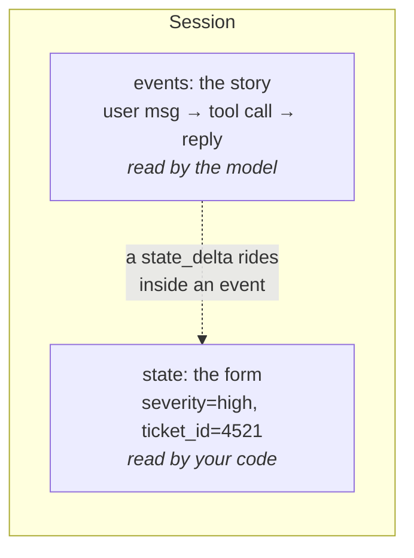

# 1.1 — The transcript is not a database

## One-line answer

A session's history is a story written for a model to read; **state** is a small labelled form
attached to it, written for your code to read — and the difference decides whether "this ticket is
high severity" is a fact you can look up or a sentence you have to search for.

## The story

The pharmacy label on the bottle.

You had a whole conversation at the counter. How to take it, what to avoid, what to do if it makes you
drowsy, whether it matters that you take something else in the mornings. Useful, detailed, and gone
from your head by Thursday.

The label survives. It is small and dull and it has boxes: the name, the dose, how many times a day,
the date it was dispensed, how long it lasts. When you are standing in the kitchen at ten to eight
wondering whether you already took one, you do not replay the conversation. You look at the label.

Nobody would suggest printing the whole conversation on the bottle. And nobody would suggest replacing
the label with a note saying *"the pharmacist explained it clearly"*.

## The idea in plain language

Since [Day 8](../../../day-08-sessions-and-services/LESSON.md), Sutra's conversations have lived in a
**session**: a container holding a list of **events** — every message, every tool call, every reply,
in order. That list is the transcript, and it is the right shape for one job: giving a model the
context it needs to produce the next turn.

It is the wrong shape for almost everything else.

Suppose the triage step decided this ticket is high severity. Where does that fact live? In the
transcript, inside a sentence, somewhere among a few thousand tokens: *"Ticket 4521 looks high
severity: logins failing for a whole team."* To use it, something has to find it and read it out of
prose — which means either a model call (tokens, quota, a chance of being wrong) or a regular
expression over English (worse).

**State** is the other place. Every session carries `session.state`: a small dictionary of keys and
values, sitting beside the events rather than inside them. The triage step puts `severity: "high"`
there, and now the fact is a lookup. No tokens, no parsing, no ambiguity.

Two words, defined precisely, because the rest of the day hangs on them:

- a **session** is the whole conversation container — one user, one thread, many turns
  ([Day 8](../../../day-08-sessions-and-services/LESSON.md));
- an **invocation** is *one* of those turns end to end: one user message arriving, every tool call it
  triggers, and the final answer that goes back. A session holds many invocations, and
  [2.2](../02-four-lifetimes/2.2-an-invocation-is-not-a-session.md) is entirely about that distinction
  because one of the four state scopes is measured in invocations.

The division of labour is worth stating as a rule, because it is the rule the whole of Phase 3 is
built on:

| | The transcript (events) | State |
| --- | --- | --- |
| Written for | the model | your code |
| Shape | prose, in order, append-only | keys and values |
| Cost to read | tokens, on every turn | free |
| Answers | *"what was said?"* | *"what is true?"* |
| Fails by | being long | being stale |

The last row is not a throwaway. A transcript cannot be wrong about what was said — it is the record.
State can be wrong in the way any cached fact can be wrong, and the rest of this day is largely about
the mechanisms that keep it honest.

## Why Sutra needs it

Because from Day 19 the subject is what earns a place in the context window, and the answer is
impossible while every fact lives in prose.

Concretely: Phase 8 builds Sutra as a graph, where a triage node decides a severity and a writer node
uses it. If the severity is a sentence, the writer node has to be given the whole transcript to find
it, which is tokens Sutra does not have on a free tier
([Day 16, 4.4](../../../day-16-built-in-tools-with-brakes/parts/04-newspaper-or-cabinet/4.4-two-meters-one-call.md)).
If it is a state key, the writer node is handed one string.

There is a nearer one too. Phase 3's gate is *"state survives restarts; budgets enforced"*. You cannot
make something survive a restart until you can say exactly what it is and where it lives, and
"somewhere in the conversation" is not an answer.

## The mechanism

State is a dictionary on the session, and the honest way to meet it is to look at one after a run has
put something in it:

```python
# days/day-17-state-scopes-and-lifetimes/lab/what_state_is.py
"""A session's two halves: the story, and the form stapled to it. Zero model calls."""

import asyncio

from google.adk.events import Event, EventActions
from google.adk.sessions import InMemorySessionService


async def main() -> None:
    service = InMemorySessionService()
    session = await service.create_session(app_name="sutra", user_id="u1")

    print("state at the start :", dict(session.state))
    print("events at the start:", len(session.events))

    fact = Event(author="triage", actions=EventActions(state_delta={"severity": "high"}))
    await service.append_event(session=session, event=fact)

    print("state after one fact:", dict(session.state))
    print("events after one fact:", len(session.events))
    print("the fact, looked up  :", session.state["severity"])


asyncio.run(main())
```

**Line by line:**

- `InMemorySessionService()` — Day 8's store, the one that keeps everything in a dictionary in this
  process. Nothing today needs a database, and [7.2](../07-in-production/7.2-what-belongs-in-state.md)
  says exactly what changes when one arrives on Day 47.
- `await service.create_session(...)` — sessions are created through the **service**, never
  constructed directly, because the service is what knows about storage.
- `dict(session.state)` — `state` is a `State` object rather than a plain dictionary
  ([1.3](1.3-the-pad-and-the-rail.md) explains why), and wrapping it in `dict()` is the readable way to
  print it.
- `Event(author="triage", actions=EventActions(state_delta={...}))` — an event whose only cargo is a
  state change. This is the third of the three safe write paths, taught properly in
  [3.3](../03-three-safe-writes/3.3-writing-from-outside-a-run.md); it appears here because it is the
  shortest way to put a fact in state without a model.
- `await service.append_event(...)` — the write. Note what it is *not*: it is not
  `session.state["severity"] = "high"`. That assignment is the day's failure lab
  ([6.1](../06-failure-lab/6.1-the-write-that-was-never-written.md)), and it is the natural thing to
  reach for, which is why it gets a part to itself.
- `session.state["severity"]` — the payoff, and the whole argument of this part: one lookup, no model,
  no parsing.

```bash
cd days/day-17-state-scopes-and-lifetimes/lab
uv run python what_state_is.py
```

**Line by line:**

- Every script today runs from inside `lab/`, the convention since Day 15, because later ones import
  the scripted-model double by bare name.
- No key is read and no request is made — the entire day costs nothing until
  [7.1](../07-in-production/7.1-testing-state-without-a-model.md), which also costs nothing.

Measured on `google-adk` 2.7.1 on 2026-09-03:

```text
state at the start : {}
events at the start: 0
state after one fact: {'severity': 'high'}
events after one fact: 1
the fact, looked up  : high
```

One event, one key. The story got one line longer and the form got one box filled in, and those are
two different things that happened at the same moment.



The dotted arrow is the part people miss and the reason section 3 exists: **state does not change
beside the history, it changes through it.** Every write is carried by an event, which is what keeps
the record complete (Principle 12: everything is a trace).

## When it breaks

**You put the fact only in the prose, and later something has to go and find it.**

There is no error. There is a model call that did not need to happen, and an answer that is
occasionally wrong:

```text
User: what severity did you give ticket 4521?
Sutra: I believe it was medium — the login issue affected several users.
```

The transcript says "high". The model, asked to recall from a long history, produced something
plausible. This is the failure that makes people think agents are unreliable, and it is not a model
failure at all: it is a design that stored a fact where facts are not stored.

**You put a large object in state and the next thing that touches it fails.** State is small and
serializable by design, and [1.2](1.2-what-may-live-in-state.md) is the part about what happens when
you ignore that.

**You write to `session.state` directly and the write disappears.** No error either, and it is the
single most common way to lose a day to this API. It has its own part
([6.1](../06-failure-lab/6.1-the-write-that-was-never-written.md)) because it deserves one.

## In production

**Every fact a later step needs is a state key, decided when the fact is produced.**

The rule a professional applies is: if code will branch on it, it is state; if only a human or a model
will read it, prose is fine. *Severity*, *ticket id*, *whether a human approved*, *which provider
answered*, *how many retries* — all state. *The explanation of why* — prose.

The practical version of getting this wrong is not subtle. A system that keeps its facts in prose has
to re-read the whole conversation to make any decision, which means its cost per turn grows with the
length of the conversation, which means it gets slower and more expensive exactly as a session becomes
valuable.

**What changes at scale** is that state becomes an interface between components. In a graph
(Phase 8), one node's output key is another node's input, and the set of keys is effectively a schema
that several parts of the system agree on — which is why ADK 2.x lets you declare it
([5.1](../05-a-schema-for-state/5.1-declaring-the-boxes.md)) and why undeclared keys are a real source
of drift.

**The review comment** on a diff that stores a decision in the reply text: *"a later step needs this.
Put it in state at the moment it is decided, not in a sentence somebody has to parse."*

**The interview question**: *"where does an agent keep what it has worked out?"* The answer that shows
experience separates the two stores by reader — the transcript for the model, state for the code — and
mentions the third thing that does not belong in either: files, which are artifacts, and which are
tomorrow's subject.

## Check yourself

```bash
cd days/day-17-state-scopes-and-lifetimes/lab
uv run python what_state_is.py
```

One event, one key, and a fact you can look up.

**Out loud, without scrolling up:** name two facts Sutra produces that belong in state and one that
belongs only in the transcript, and say what it costs to get the first kind wrong.
