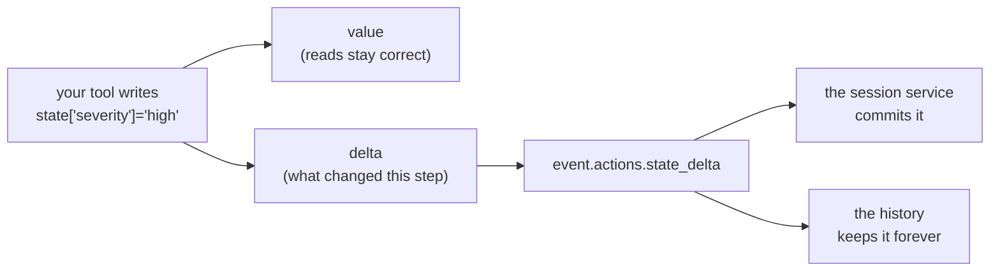

# 1.3 — The pad and the rail

## One-line answer

`session.state` is not a dictionary: it is a `State` object holding **two** dictionaries — what is
already committed and what you have changed but not yet committed — and the second one is exactly what
travels inside the next event.

## The story

The order pad in a small café.

The waiter takes your order on a pad: two coffees, one with oat milk, the eggs without toast. It is
written down, it is right, and the kitchen has never heard of it. Everything on that pad is a plan
until the sheet is torn off and clipped to the rail above the pass.

That is the moment the order becomes real. Before it, the waiter can cross something out and nobody
downstream ever knows. After it, the kitchen is cooking, and a change is a conversation rather than a
scribble.

Which is why a good waiter clips the sheet up before doing anything else, and why the worst thing that
can happen in a café is a pad full of correct orders that nobody ever hung on the rail.

## The idea in plain language

Reading `session.state` looks exactly like reading a dictionary, so most people assume it is one. It is
a small class called `State`, and its whole job is to keep two things apart:

- **the value** — the state as it stands, everything committed so far;
- **the delta** — the keys you have written during the current step, which have not been committed yet.

Writing goes to both, so reading is always up to date. But the delta is kept separately for one
reason: when the current step finishes, the framework takes the delta and puts it in the event it is
about to append, as `event.actions.state_delta`
([3.1](../03-three-safe-writes/3.1-writing-from-inside-a-tool.md) watches this happen). The event goes
into the history, the service applies the delta to storage, and the delta is cleared.

That is the rail. Your writes are on the pad until an event carries them, and *"which writes are on
this pad"* is precisely the question `has_delta()` answers.

The rest of the class is small enough to know completely, and worth knowing because it is what your
tools will use:

| What you write | What it does |
| --- | --- |
| `state["k"] = v` | writes to the value **and** the delta |
| `state["k"]` | reads the delta first, then the value — so you always see your own write |
| `"k" in state` | true if either half has it |
| `state.get("k", default)` | the same, with a fallback instead of a `KeyError` |
| `state.setdefault("k", v)` | reads if present; otherwise writes, **which puts it in the delta** |
| `state.update({...})` | many keys at once, all into both halves |
| `state.to_dict()` | one merged dictionary, delta winning |
| `state.has_delta()` | whether anything is pending |

Two of those rows have teeth. `setdefault` looks like a read and is a **write** when the key is
missing, so a helper that "just defaults" a key produces a state change in the history. And
`to_dict()` gives you a copy: mutating it changes nothing, which is a good way to spend an hour if you
have not read this part.

## Why Sutra needs it

Because Day 22's structured logging and Day 84's tracing both want to answer *"what changed during
this step?"*, and the delta is the only place that question has a cheap answer.

The whole state, on every event, would be a snapshot: correct and useless, because finding what
changed means diffing two snapshots. The delta is the diff, recorded at the moment it happened, by the
component that made it. When [7.3](../07-in-production/7.3-state-as-a-trace.md) reconstructs *when*
severity became high, it reads deltas, not snapshots.

There is a nearer reason. Understanding that a write is pending until an event carries it is what makes
[6.1](../06-failure-lab/6.1-the-write-that-was-never-written.md) obvious rather than mysterious: the
forbidden write is a write with **no event to ride on**, and once you have seen the pad and the rail,
that sentence explains itself.

## The mechanism

`State` can be built directly, which is the clearest way to see both halves at once:

```python
# days/day-17-state-scopes-and-lifetimes/lab/pad.py
"""The two halves of a State object: what is committed, and what is pending. Zero model calls."""

from google.adk.sessions.state import State

committed = {"severity": "low", "ticket_id": 4521}
pending: dict[str, object] = {}

state = State(value=committed, delta=pending)

print("has_delta at the start:", state.has_delta())
print("severity              :", state["severity"])

state["severity"] = "high"
state["escalated"] = True

print("has_delta after writes:", state.has_delta())
print("the pending delta     :", pending)
print("to_dict()             :", state.to_dict())
print("'escalated' in state  :", "escalated" in state)
print("get('nothing', 'n/a') :", state.get("nothing", "n/a"))
print("setdefault('owner')   :", state.setdefault("owner", "unassigned"))
print("the pending delta now :", pending)
```

**Line by line:**

- `committed` and `pending` as **named local dictionaries** passed into the constructor. That is the
  trick that makes the delta visible: `State` keeps references to the two dictionaries you handed it,
  so printing `pending` afterwards shows exactly what the framework would harvest.
- `State(value=..., delta=...)` — the real constructor, the same one ADK uses when it builds the state
  for a run. Nothing here is a stand-in.
- `state["severity"] = "high"` on a key that already exists, and `state["escalated"] = True` on one
  that does not — both land in the delta, because the delta is *what changed in this step*, not *what
  is new*.
- `print("the pending delta", pending)` — the pad. Two entries after two writes.
- `state.to_dict()` — the merged view, with the delta on top: `severity` reads `high`, and
  `ticket_id` survives from the committed half.
- `state.setdefault("owner", "unassigned")` — printed **before** the last line on purpose, so the next
  line can show what it did. It returns `"unassigned"` like a read, and the delta now has three
  entries.

```bash
cd days/day-17-state-scopes-and-lifetimes/lab
uv run python pad.py
```

**Line by line:**

- No session and no service: `State` is a plain object and can be examined on its own, which is also
  why [7.1](../07-in-production/7.1-testing-state-without-a-model.md) can test state logic without a
  runner.

Measured on `google-adk` 2.7.1 on 2026-09-03:

```text
has_delta at the start: False
severity              : low
has_delta after writes: True
the pending delta     : {'severity': 'high', 'escalated': True}
to_dict()             : {'severity': 'high', 'ticket_id': 4521, 'escalated': True}
'escalated' in state  : True
get('nothing', 'n/a') : n/a
setdefault('owner')   : unassigned
the pending delta now : {'severity': 'high', 'escalated': True, 'owner': 'unassigned'}
```

Read the first and last lines together. The object started with nothing pending and ends with three
pending keys, one of which was added by a call that looks like a read.



## When it breaks

**You mutate `to_dict()` and nothing happens.**

```python
snapshot = tool_context.state.to_dict()
snapshot["severity"] = "high"  # changes a copy, and nothing else
```

**Line by line:**

- `to_dict()` builds a **new** dictionary from the two halves. It is a snapshot, not a view.
- The assignment succeeds, because a dictionary is a dictionary. No error, no warning.
- Nothing reaches the delta, so nothing reaches the event, so nothing is ever committed. The write is
  gone in exactly the way [6.1](../06-failure-lab/6.1-the-write-that-was-never-written.md)'s is, one
  layer earlier.
- The fix is one character of difference in how you write it: `tool_context.state["severity"] = "high"`.

**A "read" writes.** `setdefault` on a missing key puts an entry in the delta, which puts a state change
in the history, attributed to whatever component happened to call it. That is correct behaviour and
occasionally a surprise in a trace: a component that only ever reads a key appears in
[7.3](../07-in-production/7.3-state-as-a-trace.md)'s history as having changed it.

**`KeyError` on a key you are sure you wrote.**

```text
KeyError: 'severity'
```

Two ordinary causes and one interesting one. Ordinary: the key was never written, or it was written
with a prefix and read without one — `state["user:reply_style"]` and `state["reply_style"]` are
different keys ([2.1](../02-four-lifetimes/2.1-the-prefix-is-the-lifetime.md)). Interesting: the write
happened in a *previous invocation* under a `temp:` prefix, which never persisted
([2.4](../02-four-lifetimes/2.4-why-temp-exists.md)). Use `state.get(key, default)` wherever the key is
genuinely optional, and let it raise where its absence is a bug.

## In production

**Read state through one accessor per key, and write it in one place.**

The version a professional writes does not sprinkle string literals through the codebase. Keys are
module constants — `SEVERITY = "severity"` — for the same reason Day 15's allowlist was a named
constant: a reviewer needs to be able to find every writer of a key with one grep, and a typo in a
literal is a silent new key rather than an error. ADK 2.x can catch some of those for you
([5.1](../05-a-schema-for-state/5.1-declaring-the-boxes.md)), and constants catch the rest.

**What changes at scale** is that the delta becomes the interesting object rather than the state. In a
long session the state is large and mostly unchanging; what an operator wants to see in a trace is the
three keys that moved during the turn that went wrong. Systems that log the whole state per event are
paying a lot to hide the useful information inside the unchanging part.

**What fails only under concurrency** is the assumption that your delta is the only one. Two components
writing the same key inside one invocation both write to the same delta, last writer wins, and no
error is raised — which is fine when you intended it and invisible when you did not. Namespacing keys
by owner is the cheap defence.

**The review comment**: *"this reads `to_dict()`, edits it, and expects the change to stick. Write
through `state[...]` instead."*

**The interview question**: *"how does a state change get from a tool into storage?"* The answer that
shows you have looked: *"the write goes into a pending delta, the framework attaches that delta to the
event it is about to append, and the session service applies it — so every change is in the history,
attributed and timestamped."*

## Check yourself

```bash
cd days/day-17-state-scopes-and-lifetimes/lab
uv run python pad.py
```

Then add `print(committed)` at the end, and explain why `escalated` is in it even though nothing has
been committed.

**Out loud, without scrolling up:** describe what the delta is for, and name the one method on `State`
that writes when it looks like it reads.
