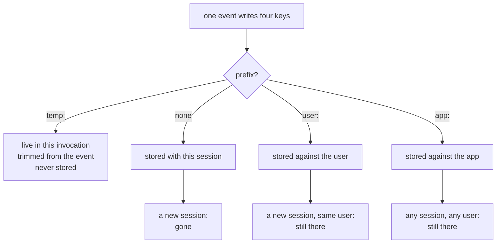

# 2.1 — The prefix is the lifetime

## One-line answer

Four prefixes, four lifetimes, chosen **by the name of the key alone**: no prefix means this
conversation, `user:` means this person everywhere, `app:` means everyone, and `temp:` means this one
question and then it is gone.

## The story

The shared fridge at work, and the labels on things.

Somebody's lunch has a name and today's date on masking tape. The big bottle of milk on the door has
no name because it is everybody's, bought out of the tea fund. There is a jar of something at the back
with a name and no date, which is why it is still there in March.

And every Friday afternoon somebody empties the fridge, and they do not open anything or ask anybody.
They read the labels. Named and dated and this week: it goes back. Named and undated: it is a
judgement call, and the judgement is usually the bin. Unnamed and unlabelled: the bin, always,
regardless of what it is.

The label is not a description of the food. The label decides what happens to it on Friday.

## The idea in plain language

A state key's name has a special first part, and ADK reads it. From `adk.dev/sessions/state/`, read on
2026-09-03, and confirmed against the constants in the installed package
(`State.APP_PREFIX`, `State.USER_PREFIX`, `State.TEMP_PREFIX`):

| Prefix | Scope | Lives until | A Sutra example |
| --- | --- | --- | --- |
| *(none)* | this session | the session is deleted | `severity`, `ticket_id` |
| `user:` | every session belonging to this user | the user's data is deleted | `user:reply_style` |
| `app:` | every session, every user | the app's data is deleted | `app:refund_window_days` |
| `temp:` | this **invocation** only | the invocation ends — **never persisted** | `temp:raw_search` |

The important word in that table is *chosen*. `user:reply_style` does not *describe* a key that
happens to be about a user; the prefix is what **makes** it user-scoped. Rename the key to
`reply_style` and it becomes an ordinary session key that dies with the conversation, with no error
and no warning anywhere.

That is why the prefix is worth more attention than its size suggests. It is one of the few places in
this whole curriculum where a **naming convention is enforced by the runtime**. Elsewhere a name is a
label on a thing; here the name *is* the thing.

Two of the four have a subtlety each, and they get parts of their own:

- `temp:` is measured in **invocations**, not sessions, and the difference is bigger than it sounds —
  [2.2](2.2-an-invocation-is-not-a-session.md);
- `user:` and `app:` are not stored on the session at all, which is what lets them appear in a session
  that did not exist when they were written — [2.3](2.3-where-user-and-app-live.md).

## Why Sutra needs it

Because Sutra's next few days each need a different one of these, and picking the wrong prefix
produces a bug that only appears in a *second* conversation.

The concrete list, from the plan: a triage decision belongs to one ticket and one conversation, so no
prefix. An engineer's preference for short answers should follow them to tomorrow's tickets, so
`user:`. The refund window is a company fact that every conversation shares, so `app:`. A raw search
result being handed from one tool to the next is worth nothing after this question is answered, so
`temp:`.

Get the first one wrong — write `severity` as `user:severity` — and the desk will happily apply this
ticket's severity to the next ticket that engineer opens. Nothing raises. The only symptom is an agent
that seems to remember things it should not.

## The mechanism

One event writing one key per scope, and then four different vantage points on the result:

```python
# days/day-17-state-scopes-and-lifetimes/lab/scopes.py
"""Four keys, four lifetimes, measured against each other. Zero model calls."""

import asyncio

from google.adk.events import Event, EventActions
from google.adk.sessions import InMemorySessionService

APP = "sutra"


async def main() -> None:
    service = InMemorySessionService()
    first = await service.create_session(app_name=APP, user_id="engineer_a")

    written = {
        "severity": "high",  # no prefix - this conversation
        "user:reply_style": "short",  # this engineer, any conversation
        "app:refund_window_days": 30,  # everyone
        "temp:raw_search": "a big blob",  # this invocation only
    }
    event = Event(author="triage", actions=EventActions(state_delta=written))
    await service.append_event(session=first, event=event)

    print("1 the session we just wrote to :", dict(first.state))
    print("2 the event's delta, afterwards:", event.actions.state_delta)

    same = await service.get_session(app_name=APP, user_id="engineer_a", session_id=first.id)
    print("3 the same session, re-fetched :", dict(same.state))

    second = await service.create_session(app_name=APP, user_id="engineer_a")
    print("4 a new session, same engineer :", dict(second.state))

    other = await service.create_session(app_name=APP, user_id="engineer_b")
    print("5 a new session, another person:", dict(other.state))


asyncio.run(main())
```

**Line by line:**

- One `written` dictionary with **one key per scope**, so the only variable in the experiment is the
  prefix. Everything else — the service, the event, the moment of writing — is identical.
- `Event(author="triage", ...)` — the author is a label that ends up in the history. Naming it after
  the component that made the decision is what makes
  [7.3](../07-in-production/7.3-state-as-a-trace.md) possible later.
- `await service.append_event(...)` — the commit. Everything after this line is observation.
- Print 1 uses `first`, the session object the write went through. Print 3 asks the **service** for the
  same session again, which is a different question and, as you are about to see, a different answer.
- Print 4 creates a **new** session for the same user. Print 5 creates one for a different user. Those
  two lines are the whole of `user:` and `app:`.
- Everything is `await`ed against the async API rather than the `_sync` variants, because the async
  ones are the real interface and the sync ones exist for convenience.

```bash
cd days/day-17-state-scopes-and-lifetimes/lab
uv run python scopes.py
```

**Line by line:**

- One process, one service, no key, no model, no network.

Measured on `google-adk` 2.7.1 on 2026-09-03:

```text
1 the session we just wrote to : {'temp:raw_search': 'a big blob', 'severity': 'high', 'user:reply_style': 'short', 'app:refund_window_days': 30}
2 the event's delta, afterwards: {'severity': 'high', 'user:reply_style': 'short', 'app:refund_window_days': 30}
3 the same session, re-fetched : {'severity': 'high', 'app:refund_window_days': 30, 'user:reply_style': 'short'}
4 a new session, same engineer : {'app:refund_window_days': 30, 'user:reply_style': 'short'}
5 a new session, another person: {'app:refund_window_days': 30}
```

Five lines, and every one of them is a lifetime:

- **Line 1** has all four keys. During the invocation, everything you wrote is readable, including the
  `temp:` one.
- **Line 2** has three. The event's own delta **no longer contains the `temp:` key** — the service
  removed it on the way past, so it is not in the history and will never be persisted.
- **Line 3** has three. Ask the service for this session again and `temp:` is gone.
- **Line 4** has two. A new conversation with the same engineer keeps `user:` and `app:` and loses
  `severity`, which belonged to the other conversation.
- **Line 5** has one. A different engineer gets only the `app:` key.



## When it breaks

**A key comes back empty in a new conversation and there is no error.**

The most common shape of this bug: a preference written as `reply_style` instead of
`user:reply_style`. It works all through the conversation where it was set, which is the conversation
you tested in, and it is absent from every conversation afterwards. There is nothing to catch: both
names are valid keys, and one of them simply has a shorter life.

**A key follows a user somewhere you did not intend.** The mirror image, and the more embarrassing
one. Writing `user:severity` instead of `severity` means the next ticket that engineer opens starts
with the previous ticket's severity already set. If the instruction templates that key into the prompt
([4.1](../04-state-in-the-prompt/4.1-state-steers-the-next-turn.md)), the desk will assert a severity
before it has read anything.

**Everything vanishes when the process stops.** Not a prefix bug at all, and worth saying here so it is
never confused with one: with `InMemorySessionService`, *all four* scopes live in dictionaries in this
process, so a restart empties them equally. The scopes still behave correctly **relative to each
other** — which is what the measurement above shows — and durability arrives with
`DatabaseSessionService` on Day 47. Phase 3's gate says *state survives restarts*; today establishes
what state means, and that day makes it survive.

## In production

**Choose the prefix when you name the key, and write the choice down beside it.**

The practical version is a module of constants where every key's scope is visible at a glance:

```python
SEVERITY = "severity"  # session: this ticket only
REPLY_STYLE = "user:reply_style"  # user: follows the engineer
REFUND_WINDOW = "app:refund_window_days"  # app: the same for everyone
RAW_SEARCH = "temp:raw_search"  # invocation: handed between tools
```

**Line by line:**

- Constants rather than literals, so `grep REPLY_STYLE` finds every reader and writer.
- The comment on each line states the lifetime in words, because the prefix is easy to read past and
  the consequence of getting it wrong is a bug in a *later* conversation.
- Sorted by shrinking lifetime, which is the order a reviewer thinks in: what outlives the request,
  what outlives the conversation, what outlives the user.

**What changes at scale** is that `app:` becomes a configuration channel, and configuration channels
need owners. A value that every user's every conversation reads is a global variable with a network
attached: changing it changes behaviour for everyone at once, with no deploy and no review. Teams that
use `app:` state seriously end up putting a write path behind something — an admin action, a migration,
a test — rather than letting any tool write it.

**What fails only under real traffic** is the user scope's identity. `user:` keys are stored against the
`user_id` you passed to the session service, so the moment your `user_id` changes shape — an email
becoming an internal id, a tenant prefix being added — every user-scoped key silently belongs to a
different person. Migrations of that kind are a real event, and the fact that state is keyed on
`user_id` is worth knowing before one happens.

**The review comment**: *"this is a per-ticket fact stored under `user:`. It will leak into the next
conversation."*

**The interview question**: *"how would you keep a user preference across conversations in ADK?"* The
answer that shows you have used it names the prefix, says that the prefix is what makes it so, and adds
the caveat that with an in-memory service it still dies with the process.

## Check yourself

```bash
cd days/day-17-state-scopes-and-lifetimes/lab
uv run python scopes.py
```

Then remove the `user:` prefix from `reply_style`, run it again, and watch line 4 lose a key.

**Out loud, without scrolling up:** name the four scopes and what each one outlives. Then say which one
Sutra should use for a triage severity, and what goes wrong with each of the other three.
