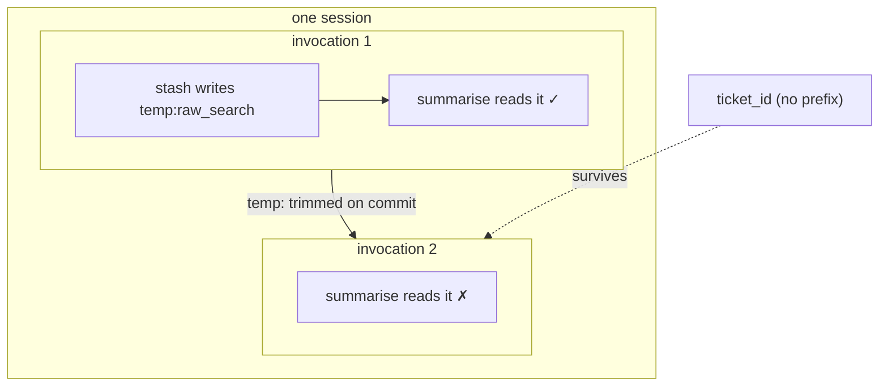

# 2.2 — An invocation is not a session

## One-line answer

An **invocation** is one user message answered end to end — every tool call and model call in between
— and a session holds many of them, which is why `temp:` state can be handed from one tool to the next
and is gone by the time the next question arrives.

## The story

You ring the council about the bins.

The call lasts a while. You give your address, they look something up, you are put on hold, somebody
else picks up, and by the end you have three separate things sorted: the missed collection, the new
recycling box, and the date the street is being resurfaced.

While they check the resurfacing date, they say a road name and a number out loud and you write it on
the back of an envelope, because you will need it in about ninety seconds when they ask which end of
the street you live on. Then that question is finished, and the envelope means nothing. You do not
carry it to the recycling box question. You certainly do not keep it after you hang up.

The call is one thing. The three questions inside it are three things. And the envelope belongs to one
question, not to the call.

## The idea in plain language

Two words that get used interchangeably and must not be:

- A **session** is the whole conversation — one user, one thread, many turns
  ([Day 8](../../../day-08-sessions-and-services/LESSON.md)). It is the thing with an id you can come
  back to tomorrow.
- An **invocation** is **one turn, end to end**: one user message goes in, and everything that happens
  because of it — the model calls, the tool calls, the callbacks, the final reply — is inside that one
  invocation. Every event produced along the way carries the same `invocation_id`.

So a session is a call and an invocation is a question inside it. One `runner.run(...)` is one
invocation, however many model calls and tool calls it takes.

That distinction is not academic, because one of the four state scopes is measured in invocations. A
`temp:` key is:

- **visible** to everything in the same invocation — the second tool can read what the first one wrote;
- **removed from the event's delta** before it is committed, so it never reaches storage;
- **absent** by the time the next user message arrives, even in the same session.

Which is exactly the envelope. Useful for the rest of this question, meaningless afterwards, never
filed.

## Why Sutra needs it

Because Phase 8's graph runs several nodes inside a single invocation, and the whole design depends on
knowing that they share a scratch space that does not outlive the turn.

Concretely: the triage node produces a raw classification, the researcher node produces a page of
search results, and the writer node produces the note. The intermediate products are large, they are
worth nothing tomorrow, and they must not be written to storage on every turn
([1.2](../01-form-not-story/1.2-what-may-live-in-state.md) is why). That is `temp:`, and it only works
if you can say precisely when it dies.

You have already seen the framework using it for exactly this. On
[Day 16](../../../day-16-built-in-tools-with-brakes/parts/02-one-at-a-time/2.3-the-specialist-you-write-yourself.md),
grounding metadata was passed from a wrapped specialist agent back to its caller through the state key
`temp:_adk_grounding_metadata`. Same mechanism, in ADK's own code: a bulky intermediate, handed between
components inside one turn, never persisted.

## The mechanism

One session, two questions, and a tool that reports whether the `temp:` key is still there:

```python
# days/day-17-state-scopes-and-lifetimes/lab/one_invocation.py
"""One session, two questions, and what temp: does between them. Zero model calls."""

from google.adk.agents import Agent
from google.adk.runners import InMemoryRunner
from google.adk.tools import ToolContext
from google.genai import types
from scripted import ScriptedModel, call, text


def stash(tool_context: ToolContext) -> dict:
    """Leave a bulky intermediate for the next tool in this invocation."""
    tool_context.state["temp:raw_search"] = {"hits": 42}
    tool_context.state["ticket_id"] = 4521
    return {"stashed": True}


def summarise(tool_context: ToolContext) -> dict:
    """Read what the previous tool left, and report what is still visible."""
    raw = tool_context.state.get("temp:raw_search")
    return {"temp_visible": raw is not None, "ticket_id": tool_context.state.get("ticket_id")}


agent = Agent(
    name="two_tools",
    model=ScriptedModel(
        model="scripted",
        replies=[
            [call("stash")],
            [call("summarise")],
            [text("done")],
            [call("summarise")],  # turn 2 asks the same tool, and stashes nothing
            [text("done")],
        ],
    ),
    tools=[stash, summarise],
)

runner = InMemoryRunner(agent=agent)
session = runner.session_service.create_session_sync(app_name=runner.app_name, user_id="u1")


def ask(question: str, label: str) -> None:
    ids = set()
    for event in runner.run(
        user_id="u1",
        session_id=session.id,
        new_message=types.Content(role="user", parts=[types.Part(text=question)]),
    ):
        ids.add(event.invocation_id)
        for part in (event.content.parts if event.content else []) or []:
            if part.function_response is not None:
                print(f"{label} {part.function_response.name} ->", part.function_response.response)
    print(f"{label} invocation ids in this turn: {len(ids)}")


ask("triage ticket 4521", "turn 1:")
ask("and again", "turn 2:")

after = runner.session_service.get_session_sync(
    app_name=runner.app_name, user_id="u1", session_id=session.id
)
print("state at the end   :", dict(after.state))
print("invocations in this session:", len({e.invocation_id for e in after.events}))
```

**Line by line:**

- `from scripted import ScriptedModel, call, text` — Day 13's test double, copied into this lab by the
  hub's setup step. It reads its replies off a list, so this whole file makes **no model calls**: the
  subject is state, not intelligence.
- `stash` writes two keys — one `temp:`, one plain — so every later line can compare their fates side
  by side.
- `summarise` **reads** and reports. It is deliberately a tool rather than a print statement, because
  the claim being tested is about what a tool sees, and a tool sees state through its own
  `ToolContext` ([Day 11](../../../day-11-tool-context/LESSON.md)).
- `tool_context.state.get("temp:raw_search")` — `get` rather than `[...]`, because the whole point is
  that the key is legitimately absent on the second turn, and a `KeyError` would end the run instead of
  reporting the fact.
- The `replies` list is five turns long and is **not** reset between questions: turns 1 and 2 read
  successive entries, which is how one double serves two invocations.
- `ids.add(event.invocation_id)` — collecting the invocation id off every event of a turn. If the
  concept is real, this set has exactly one element per `run(...)`.
- Two calls to `ask(...)` against the **same `session.id`** — one session, two invocations. That is the
  experiment.

```bash
cd days/day-17-state-scopes-and-lifetimes/lab
uv run python one_invocation.py
```

**Line by line:**

- Runs from `lab/` because of the bare `from scripted import ...`.
- Zero requests: the model is a list.

Measured on `google-adk` 2.7.1 on 2026-09-03 (framework log lines removed):

```text
turn 1: stash -> {'stashed': True}
turn 1: summarise -> {'temp_visible': True, 'ticket_id': 4521}
turn 1: invocation ids in this turn: 1
turn 2: summarise -> {'temp_visible': False, 'ticket_id': 4521}
turn 2: invocation ids in this turn: 1
state at the end   : {'ticket_id': 4521}
invocations in this session: 2
```

Four findings in seven lines:

1. **Inside one invocation, `temp:` is shared.** The second tool read what the first one wrote —
   `temp_visible: True` — without either of them knowing about the other.
2. **Across invocations, it is gone.** The identical tool, one turn later, in the same session, sees
   `temp_visible: False`.
3. **The plain key survived** both times: `ticket_id` is still 4521 on turn 2 and still in state at the
   end.
4. **One turn is one invocation.** Two questions, two ids, however many tool calls each took.



## When it breaks

**A tool cannot find what the previous turn left, and there is no error.**

```text
{'temp_visible': False}
```

That is the whole symptom: a `get` returning `None`, or a `KeyError` if you used square brackets. The
cause is always the same — a value that needs to outlive the turn was written with a `temp:` prefix. The
fix is to drop the prefix, and the question to ask before you do is
[1.2](../01-form-not-story/1.2-what-may-live-in-state.md)'s: is this small enough to keep for the whole
conversation?

**`KeyError: 'temp:raw_search'`** — the same bug written with brackets instead of `get`. Preferable, in
fact: it fails at the read rather than silently producing a different answer.

**The value is there in your test and missing in production.** The nastiest version, and it comes from
testing a multi-tool flow inside one `run(...)` call and then splitting it across two turns in the real
interface. Nothing about the code changed; the invocation boundary moved.

## In production

**Use `temp:` for handoffs inside a turn, and never for anything a user could refer to.**

The rule of thumb that survives review: if a human could plausibly say *"the one you found a minute
ago"*, it must not be `temp:`. Anything a later turn can be asked about belongs in session state, with
the size discipline that implies. `temp:` is for the machinery — the raw response, the intermediate
list, the parsed blob — not for the results.

**What changes at scale** is that the invocation becomes your unit of accounting as well as your unit
of scope. Requests, tokens, tool calls and latency are all measured per invocation, and the
`invocation_id` on every event is what joins them together in a trace (Day 84). A team that has this
straight can answer *"what did that one question cost?"*; a team that measures per session cannot,
because a session is an arbitrary number of questions.

**What fails only under real traffic** is the assumption that one invocation means one agent. In a
graph, several nodes run inside one invocation and share `temp:` — which is the feature. It also means
two nodes can collide on a `temp:` key with no warning at all, and the collision only happens when both
nodes are on the path, which may be an uncommon branch.

**The review comment**: *"this hands the parsed result to the next step through `temp:`. Is the next
step guaranteed to be in the same invocation, or could a user turn come between them?"*

**The interview question**: *"what is the difference between a session and an invocation?"* The answer
that shows you have built something: *"a session is the conversation, an invocation is one question
answered end to end — and it matters because scratch state, cost accounting and tracing are all
per-invocation."*

## Check yourself

```bash
cd days/day-17-state-scopes-and-lifetimes/lab
uv run python one_invocation.py
```

The line to stare at is turn 2's `temp_visible: False`.

**Out loud, without scrolling up:** define an invocation without using the word "invocation", and say
what `temp:` state is good for given that definition.
