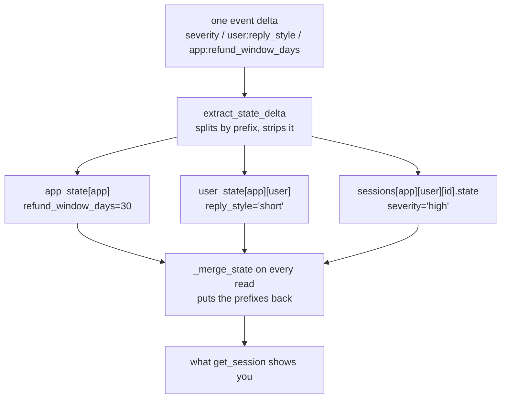

# 2.3 — Where `user:` and `app:` live

## One-line answer

`user:` and `app:` keys are **not stored on the session at all**: the service keeps them in separate
places, strips the prefix on the way in, and re-attaches it every time a session is fetched — which is
why a brand-new conversation already knows things and why deleting a session deletes none of them.

## The story

The library card and the opening hours.

The card is yours. It has your number on it, and it works at the branch near work as well as the one
near home, because the thing that knows about you is the library, not the building. Nobody has to copy
your borrowing record between branches; there is no record *in* a branch to copy.

The opening hours are the library's. They are printed on the door of every branch, and they change for
everybody at once when the council changes them.

And when the small branch on the high street closes for good, neither of those things is affected. Your
card still works. The hours still apply. The building was never where any of it was kept.

## The idea in plain language

[2.1](2.1-the-prefix-is-the-lifetime.md) showed that a new session already contains the `user:` and
`app:` keys. The obvious explanation — that they are copied from the previous session — is wrong, and
the real mechanism is worth knowing because it explains four otherwise-odd behaviours.

Reading the installed `InMemorySessionService` in `google-adk` 2.7.1, the service holds three separate
stores:

- `self.sessions[app][user][session_id]` — the sessions themselves, each with its own plain state;
- `self.user_state[app][user]` — one dictionary per user;
- `self.app_state[app]` — one dictionary per application.

When an event's delta arrives, a helper called `extract_state_delta` splits it three ways by prefix,
**removes the prefix**, and files each part in the right store. When you fetch or create a session,
`_merge_state` walks the user and app stores and copies their contents onto the session's state
**with the prefix put back**.

So the prefixed keys you see on a session are a **view**, assembled at read time. That single fact
explains all four behaviours:

- a **new session** has them, because it is assembled the same way;
- **deleting a session** does not touch them, because they were never in it;
- a **different user** sees the `app:` keys and not the `user:` ones, because those stores are keyed
  differently;
- and the stored form is **unprefixed**, which is what a database-backed service will put in its user
  and app tables on Day 47.

## Why Sutra needs it

Because Sutra will eventually want to answer *"what do we know about this engineer?"* without loading a
conversation, and the shape of the answer is decided by where the data actually lives.

It also settles a question that comes up the first time somebody asks for a "forget me" feature.
Deleting a user's sessions removes their conversations and **not** their preferences, because those
live in the user store. A deletion that only removes sessions is not a deletion, and knowing that today
is much cheaper than discovering it during a privacy review.

There is a Phase 8 consequence too. When several agents in a graph write `user:` keys, they are all
writing into the same per-user dictionary — one namespace, shared by every node, with no ownership.
That is fine when it is designed and a mess when it is discovered.

## The mechanism

Reaching into the service's own attributes is the clearest way to see the three stores. This is a
measurement, not a pattern to copy — production code should go through the service's methods:

```python
# days/day-17-state-scopes-and-lifetimes/lab/where_user_lives.py
"""user: and app: keys are not stored on the session at all. Zero model calls."""

import asyncio

from google.adk.events import Event, EventActions
from google.adk.sessions import InMemorySessionService

APP = "sutra"


async def main() -> None:
    service = InMemorySessionService()
    session = await service.create_session(app_name=APP, user_id="engineer_a")
    await service.append_event(
        session=session,
        event=Event(
            author="desk",
            actions=EventActions(
                state_delta={
                    "severity": "high",
                    "user:reply_style": "short",
                    "app:refund_window_days": 30,
                }
            ),
        ),
    )

    print("the service's app_state :", service.app_state)
    print("the service's user_state:", service.user_state)
    print("stored on the session   :", service.sessions[APP]["engineer_a"][session.id].state)

    await service.delete_session(app_name=APP, user_id="engineer_a", session_id=session.id)
    fresh = await service.create_session(app_name=APP, user_id="engineer_a")
    print("after deleting the session, a new one:", dict(fresh.state))

    try:
        print(await service.get_user_state(app_name=APP, user_id="engineer_a"))
    except NotImplementedError as error:
        print("get_user_state ->", type(error).__name__ + ":", str(error).splitlines()[0])


asyncio.run(main())
```

**Line by line:**

- One event writing one key per scope, as in [2.1](2.1-the-prefix-is-the-lifetime.md), so the two parts
  can be read against each other.
- `service.app_state` and `service.user_state` — the service's own attributes, printed raw. This is the
  only place in this curriculum that reaches past a public method on purpose, and it earns it: the
  claim is about *where* data is, and no public method will tell you that.
- `service.sessions[APP]["engineer_a"][session.id].state` — the session as the service stores it,
  rather than the merged view you get from `get_session`. The difference between this line and
  [2.1](2.1-the-prefix-is-the-lifetime.md)'s line 3 is the whole part.
- `await service.delete_session(...)` then `create_session(...)` — the destructive test. If the
  prefixed keys were on the session, this would lose them.
- `get_user_state` inside a `try` — it is defined on the base service and not every implementation
  supports it, so the base class raises `NotImplementedError` with an explanation. The in-memory
  service does implement it, and the `try` is what makes the script portable to one that does not.

```bash
cd days/day-17-state-scopes-and-lifetimes/lab
uv run python where_user_lives.py
```

**Line by line:**

- One process, one service, no model, no network.

Measured on `google-adk` 2.7.1 on 2026-09-03:

```text
the service's app_state : {'sutra': {'refund_window_days': 30}}
the service's user_state: {'sutra': {'engineer_a': {'reply_style': 'short'}}}
stored on the session   : {'severity': 'high'}
after deleting the session, a new one: {'app:refund_window_days': 30, 'user:reply_style': 'short'}
{'reply_style': 'short'}
```

Read the first three lines together and the mechanism is complete. `refund_window_days` is filed under
the app **without its prefix**. `reply_style` is filed under the app and then the user, also without
its prefix. And the session — the thing you were writing to — contains exactly one key: `severity`.

The fourth line is the consequence: the session is deleted, a new one is created, and both prefixed
keys are back, because they were somewhere else the whole time. The fifth is the same data read
directly from the user store, in its stored, unprefixed form.



## When it breaks

**You delete a user's sessions and call it deletion.**

No error, and a real problem. `delete_session` removes a conversation. The user store is untouched, so
every preference, name and setting written under `user:` is still there, and the next session that user
opens will show them. A deletion feature has to clear the user store as well, and on Day 47's database
service that is a second table.

**Two components fight over one `user:` key.** Also silent. The per-user dictionary is one namespace
shared by every agent in the app, so `user:context` written by a triage node and `user:context` written
by a research node are the same key. Prefix your keys by owner — `user:desk.reply_style` — if more than
one component writes them.

**`NotImplementedError` from `get_user_state`, on a service that does not implement it.**

The in-memory service does — the run above printed `{'reply_style': 'short'}` — so this is an error you
meet when you change service, not one you meet today. The base class in `base_session_service.py`
raises it with the class name filled in and the fallback spelled out:

> `<ServiceName> does not support get_user_state. To read user state, enumerate sessions via
> list_sessions and call get_session on each result to access the merged state.`

Worth reading rather than skipping, because it names the workaround: if a service cannot hand you the
user store directly, you read a session and take the merged view.

## In production

**Treat `user:` and `app:` as small databases with no schema and no owner, and give them both.**

The version a professional writes has one module that owns every `user:` key — reading, writing, and
naming them — rather than tools writing them wherever it is convenient. The reason is not tidiness: it
is that these keys outlive every conversation, so a bad value written once is a bad value for ever, and
there is no natural moment when it gets cleaned up.

**What changes at scale** is that `app:` becomes shared mutable configuration for the whole
application. Every session of every user reads it, so a write is a global change with no deploy, no
review and no rollback. Teams that use it seriously either make it read-only at run time — written by
a migration or an admin path — or accept that they have a feature flag system without any of the
safety a feature flag system usually has.

**What fails only under real traffic** is the identity question. These stores are keyed by `app_name`
and `user_id`. Change either — rename the app, migrate user ids from email addresses to internal
identifiers — and every user-scoped key belongs to somebody who no longer exists. The data is not lost;
it is simply unreachable, which is worse, because nothing errors and the users just seem to have
forgotten their preferences.

**The review comment**: *"this writes `user:` state from a tool. Which module owns that key, and what
clears it when the user asks to be forgotten?"*

**The interview question**: *"if user-scoped state is visible in a new session, where is it stored?"*
The answer that shows you have read the code: *"not on the session — the service keeps a per-user store
and merges it into each session it hands out, with the prefix added back on read."*

## Check yourself

```bash
cd days/day-17-state-scopes-and-lifetimes/lab
uv run python where_user_lives.py
```

Compare line 3 with line 4 and say, in one sentence, why line 4 has two keys that line 3 does not.

**Out loud, without scrolling up:** a colleague asks you to delete everything the system knows about
one engineer. Say which stores you have to clear and why deleting their conversations is not enough.
