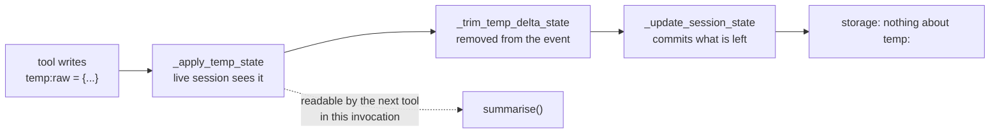

# 2.4 — Why `temp:` exists

## One-line answer

`temp:` is the answer to a cost problem, not a tidiness one: a bulky intermediate written as ordinary
state is carried by every later read and write of that session for ever, and the same twelve turns
measured here cost 57,530 bytes of state kept and 2 bytes shredded.

## The story

The back of the envelope.

You are working out whether the new job is worth it. Salary, minus the extra travel, plus the thing
they said about the bonus, times eleven months because of the unpaid week. There are six numbers on
the envelope and two crossings-out, and at the end there is one number that matters, which you write
in a text message to somebody who cares.

Then the envelope goes in the bin. Not because it is untidy — because it has done its job. Nobody
files their long division. If you kept every envelope you ever worked a sum on, you would need a
drawer for them, and the drawer would make the one number you actually wanted harder to find, not
easier.

## The idea in plain language

Everything Sutra writes to ordinary session state is kept, and *kept* is a stronger word than it looks.

State travels with the session. Every time the session is read, all of it is read. On a persistent
service — Day 47's `DatabaseSessionService` — every commit writes it, and every fetch of that
conversation pulls it back. A key you needed for one step between two tools is not free once it has
been used; it is a permanent passenger on every turn of that conversation.

`temp:` is the exception the framework builds in. From
[2.1](2.1-the-prefix-is-the-lifetime.md)'s measurement, and from the source of
`base_session_service.py`, the sequence when an event is appended is exact:

1. `_apply_temp_state` copies any `temp:` keys into the **live** session state, so the rest of this
   invocation can read them;
2. `_trim_temp_delta_state` **removes** those keys from the event's delta;
3. `_update_session_state` applies what is left.

So a `temp:` value is real while the turn is running and leaves no trace anywhere afterwards: not in
the event, not in the history, not in storage.

The framework uses this itself. On
[Day 16](../../../day-16-built-in-tools-with-brakes/parts/02-one-at-a-time/2.3-the-specialist-you-write-yourself.md),
grounding metadata came back from a wrapped specialist agent through the key
`temp:_adk_grounding_metadata` — a bulky structure, handed between two components inside one turn,
deliberately not persisted. That is precisely the use this prefix is for, in ADK's own code.

## Why Sutra needs it

Because Phase 8's graph passes large intermediates between nodes, and Phase 7's memory work depends on
sessions staying small enough to load.

The concrete shape: the researcher node produces a page of search results, the writer node needs three
lines of it, and the ticket ends. On a fifty-turn conversation with ordinary state keys, every one of
those pages is still being loaded on turn fifty. On a free tier where the whole point is fitting
inside quotas ([Addendum 02](../../../../docs/02_ADDENDUM_ZERO_BUDGET_MODELS.md)), that is not an
abstraction — it is the difference between a session that loads and one that does not.

## The mechanism

The cost, measured rather than asserted. Twelve turns, each stashing the same intermediate, once under
an ordinary key and once under `temp:`:

```python
# days/day-17-state-scopes-and-lifetimes/lab/the_cost_of_keeping.py
"""What a bulky intermediate costs when it is kept, and what temp: saves. Zero model calls."""

import asyncio
import json

from google.adk.events import Event, EventActions
from google.adk.sessions import InMemorySessionService

BLOB = {"results": [{"title": f"result {i}", "snippet": "x" * 200} for i in range(20)]}
TURNS = 12


async def size_after(prefix: str) -> int:
    """Run TURNS invocations that each stash the blob under `prefix`, then measure."""
    service = InMemorySessionService()
    session = await service.create_session(app_name="sutra", user_id="u1")
    for turn in range(TURNS):
        await service.append_event(
            session=session,
            event=Event(
                author="research",
                actions=EventActions(state_delta={f"{prefix}raw_{turn}": BLOB}),
            ),
        )
    stored = await service.get_session(app_name="sutra", user_id="u1", session_id=session.id)
    return len(json.dumps(dict(stored.state)))


async def main() -> None:
    kept = await size_after("")
    shredded = await size_after("temp:")
    print(f"one blob, serialised          : {len(json.dumps(BLOB)):>7} bytes")
    print(f"session state after {TURNS} turns, kept : {kept:>7} bytes")
    print(f"session state after {TURNS} turns, temp: : {shredded:>7} bytes")


asyncio.run(main())
```

**Line by line:**

- `BLOB` — twenty small results with a two-hundred-character snippet each. Not enormous: this is
  deliberately a *modest* search result, so the number at the end is not a straw man.
- `TURNS = 12` — a short conversation. A support thread that goes back and forth a dozen times is
  ordinary.
- `size_after(prefix)` runs the **same** experiment twice with one character of difference, which is
  what makes the comparison honest.
- `f"{prefix}raw_{turn}"` — a distinct key per turn, because that is what really happens: each turn's
  intermediate is its own key, and they accumulate.
- `await service.get_session(...)` before measuring — measuring the **stored** session rather than the
  in-memory object, because the stored one is what a database would hold and what a later turn will
  load.
- `len(json.dumps(...))` — bytes as JSON, the honest proxy for what persistence costs.

```bash
cd days/day-17-state-scopes-and-lifetimes/lab
uv run python the_cost_of_keeping.py
```

**Line by line:**

- No model, no network. The cost of state is a property of state.

Measured on `google-adk` 2.7.1 on 2026-09-03:

```text
one blob, serialised          :    4783 bytes
session state after 12 turns, kept :   57530 bytes
session state after 12 turns, temp: :       2 bytes
```

Two bytes is `{}`. The same twelve turns, with one prefix, produce a session whose state is empty
because nothing needed to survive them.

And the 57,530 is the number to hold on to. That is not the cost of *storing* the intermediates once —
it is the size of the object that gets loaded, parsed, and written back on **every subsequent turn** of
that conversation, to carry results nobody will ever read again.



## When it breaks

**You use `temp:` for something a later turn needs, and the failure is a silent absence.**

```text
{'temp_visible': False}
```

Measured in [2.2](2.2-an-invocation-is-not-a-session.md), and the only symptom you get. The rule that
prevents it: if a human could refer to it in their next message — *"the one you found earlier"* — it is
not `temp:`.

**You avoid `temp:` because it seems risky, and the session grows.** The opposite failure, and it has
no error message either. It shows up as a conversation that gets slower the longer it runs, and on a
persistent service as a row that keeps growing. The number above is what it looks like after twelve
turns with one modest intermediate per turn.

**You try to find the value in the history and it is not there.** Correct, and worth internalising: the
trim happens before the event is stored, so a `temp:` write is invisible to
[7.3](../07-in-production/7.3-state-as-a-trace.md)'s audit trail. That is a feature — the bulky blob is
not in your logs either — and it means `temp:` is exactly the wrong place for anything you might have
to explain afterwards.

## In production

**Default to `temp:` for anything produced by one step and consumed by the next.**

The practical rule a professional applies: a value goes in ordinary state only if you can answer
*"which later turn reads this?"* with a specific turn. Everything else is a handoff, and handoffs are
`temp:`. The bias is worth having because the two failures are asymmetric — a missing `temp:` key
fails immediately and loudly during development, while an over-kept key fails slowly and expensively in
production.

**What changes at scale** is that the size of state becomes a latency budget. Every turn loads it, so
state size is on the critical path of every response, and it grows monotonically unless something
prunes it. Teams that have hit this add a state-size assertion to their tests — *this session's state
stays under a few kilobytes* — which is a cheap check that catches the whole class.

**What fails only under real traffic** is the long conversation. Development sessions are three turns
long. Real support threads are dozens, and the cost of a kept intermediate is linear in turns and paid
on every one of them. The measurement above is twelve turns; multiply by four for a busy thread.

**The review comment**: *"this key is read once, by the next tool, in the same turn. Make it `temp:`
and it will not be in every future load of this session."*

**The interview question**: *"you have a prefix for state that is never persisted. What is it for?"*
The answer that shows you have paid the bill: *"handing intermediates between steps in one turn without
buying them a permanent seat — because ordinary state is loaded and written on every later turn of the
conversation."*

## Check yourself

```bash
cd days/day-17-state-scopes-and-lifetimes/lab
uv run python the_cost_of_keeping.py
```

Then change `TURNS` to `50` and read the first number again.

**Out loud, without scrolling up:** give one Sutra value that should be `temp:` and one that must not
be, and say what each mistake would cost.
