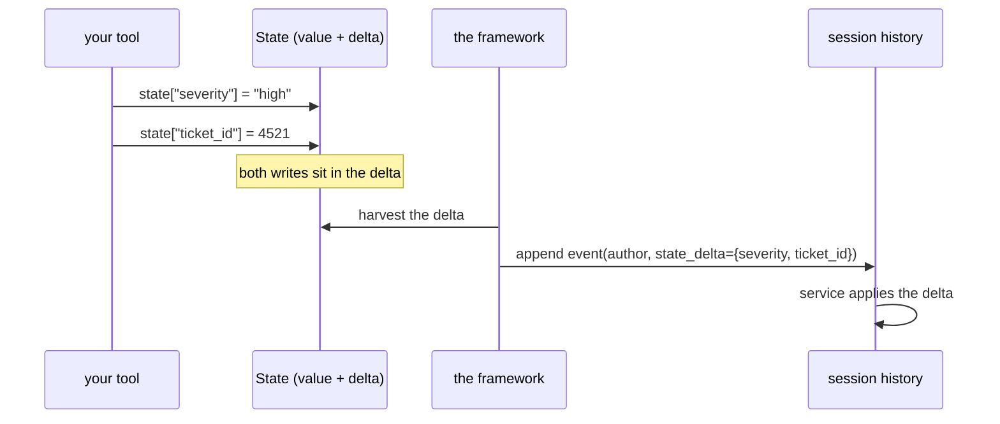

# 3.1 — Writing from inside a tool

## One-line answer

Inside a tool or a callback you write state with an ordinary assignment —
`tool_context.state["severity"] = "high"` — and the framework collects your writes into the event it
is about to append, so the change is recorded, attributed and committed without you doing anything
else.

## The story

The handheld scanner in the delivery van.

The driver does not ring the depot to say a parcel has been delivered. They scan the barcode at the
door, press the button that means *delivered*, and get on with the round. The record updates because
the scan *is* the update — there is no second step, no form at the end of the day, no chance of a
delivery being made and never recorded because the driver was busy.

And the depot gets more than "delivered". It gets which van, which driver, what time, and where the
scanner was standing. None of that was typed. It came along with the scan because the scan happened
inside a system that already knew all of it.

## The idea in plain language

[Day 11](../../../day-11-tool-context/LESSON.md) gave every tool an optional last argument: a
`ToolContext`, which ADK passes in when the tool asks for it. [Day 13](../../../day-13-callbacks-four-doors/LESSON.md)
gave callbacks a `CallbackContext`. Both carry `.state`, and both hand you the same `State` object from
[1.3](../01-form-not-story/1.3-the-pad-and-the-rail.md).

So the everyday way to write state is an assignment:

```
tool_context.state["severity"] = "high"
```

There is no save, no commit and no `append_event`. When the step finishes, the framework takes the
pending delta from that state object, attaches it to the event it emits for the step, and the session
service applies it. Your write is in the history, attributed to the agent that made it, in the same
order as everything else.

Three consequences worth stating, because they are what make this the *everyday* path rather than one
of three equal options:

- **Attribution is free.** The event carries an author, so the record already knows which component
  changed the key ([7.3](../07-in-production/7.3-state-as-a-trace.md) uses this).
- **Ordering is free.** The delta rides on an event, and events are ordered, so *"was the severity set
  before or after the vendor check?"* is answerable.
- **One event per step, not per key.** Two writes in the same tool arrive in one delta together. That
  matters when two keys must not be seen apart — a status and a reason, for instance.

## Why Sutra needs it

Because every tool Sutra writes from now on produces facts a later step needs, and this is where they
go.

The immediate case is the triage decision. `sutra/state.py` — today's build — gives the desk a
`record_triage` tool whose entire job is to put `severity` and `ticket_id` into state at the moment the
model decides them, so that Phase 8's writer node can read them instead of re-reading the conversation
([1.1](../01-form-not-story/1.1-the-transcript-is-not-a-database.md)).

The later case is bigger. Day 21's error handling and Day 24's budgets both work by writing counters
into state from inside callbacks — *how many retries, how many requests, which provider* — and all of
them use exactly this path.

## The mechanism

One run, one tool, one callback, and the deltas each of them produced:

```python
# days/day-17-state-scopes-and-lifetimes/lab/in_a_tool.py
"""A tool writes state, and the framework puts the write in the event. Zero model calls."""

from google.adk.agents import Agent
from google.adk.agents.callback_context import CallbackContext
from google.adk.runners import InMemoryRunner
from google.adk.tools import ToolContext
from google.genai import types
from scripted import ScriptedModel, call, text


def record_triage(severity: str, ticket_id: int, tool_context: ToolContext) -> dict:
    """Record this ticket's triage decision so later steps can read it."""
    tool_context.state["severity"] = severity
    tool_context.state["ticket_id"] = ticket_id
    return {"recorded": severity}


def stamp_the_run(callback_context: CallbackContext) -> None:
    """A callback writes state too - same object, same rules (Day 13)."""
    callback_context.state["last_agent"] = callback_context.agent_name


agent = Agent(
    name="sutra_triage",
    model=ScriptedModel(
        model="scripted",
        replies=[
            [call("record_triage", severity="high", ticket_id=4521)],
            [text("Ticket 4521 is high severity: a whole team cannot log in.")],
        ],
    ),
    instruction="Triage the ticket.",
    tools=[record_triage],
    before_agent_callback=stamp_the_run,
)

runner = InMemoryRunner(agent=agent)
session = runner.session_service.create_session_sync(app_name=runner.app_name, user_id="u1")

for event in runner.run(
    user_id="u1",
    session_id=session.id,
    new_message=types.Content(
        role="user", parts=[types.Part(text="Ticket 4521: nobody can log in")]
    ),
):
    if event.actions and event.actions.state_delta:
        print(f"event by {event.author}: state_delta = {event.actions.state_delta}")

stored = runner.session_service.get_session_sync(
    app_name=runner.app_name, user_id="u1", session_id=session.id
)
print("state after the run:", dict(stored.state))
print("events in history  :", len(stored.events))
```

**Line by line:**

- `def record_triage(severity: str, ticket_id: int, tool_context: ToolContext) -> dict:` — the Day 11
  shape. `tool_context` is **last** and type-annotated; ADK fills it in and does **not** show it to the
  model, so the model sees a two-argument tool.
- Two assignments, no save. That is the entire write path.
- `return {"recorded": severity}` — the tool still returns something for the model to read. The state
  write and the tool result are different channels: one is for your code, one is for the conversation.
- `stamp_the_run(callback_context)` — a `before_agent_callback` from
  [Day 13](../../../day-13-callbacks-four-doors/LESSON.md), writing through the same `.state`. It is
  here to prove that "inside a tool" is really "inside anything ADK gives a context to".
- `callback_context.agent_name` — using a value the context already knows, which is the closest thing
  in this file to the scanner recording the van.
- `if event.actions and event.actions.state_delta:` — both halves are needed: an event may have no
  actions at all, and most events have actions with an empty delta.
- The final `get_session_sync` — re-reading through the service rather than trusting the session object
  you were holding. [6.1](../06-failure-lab/6.1-the-write-that-was-never-written.md) is about why that
  distinction matters.

```bash
cd days/day-17-state-scopes-and-lifetimes/lab
uv run python in_a_tool.py
```

**Line by line:**

- The scripted model means this whole run costs **no requests**: the replies come from a list
  (Day 13's double, copied into today's lab by the hub's setup).

Measured on `google-adk` 2.7.1 on 2026-09-03 (framework log lines removed):

```text
event by sutra_triage: state_delta = {'last_agent': 'sutra_triage'}
event by sutra_triage: state_delta = {'severity': 'high', 'ticket_id': 4521}
state after the run: {'last_agent': 'sutra_triage', 'severity': 'high', 'ticket_id': 4521}
events in history  : 5
```

Two deltas, and the second one carries **both** of the tool's keys because they were written in the
same step. Five events in the history for one turn — the user message, the callback's, the tool call,
the tool result, and the reply — and the state changes are distributed among them rather than
appended at the end.



## When it breaks

**The tool has no context, so there is nothing to write through.**

```text
TypeError: record_triage() missing 1 required positional argument: 'tool_context'
```

Raised when you call the function yourself in a test without passing one. ADK injects the argument at
run time based on the **annotation**, so a parameter named `tool_context` with no `: ToolContext`
annotation is treated as an ordinary argument the model must supply — which produces a much stranger
failure: the model is asked for a `tool_context` string.

**The write happens and nothing is recorded.** The one case where this path fails silently: if the tool
raises after writing, the event may never be emitted, and a delta with no event is a write that never
happened ([1.3](../01-form-not-story/1.3-the-pad-and-the-rail.md)'s pad, never clipped to the rail).
Write state **after** the work that can fail, not before.

**Two tools in one turn write the same key.** No error, last writer wins, and both writes are in the
history as separate events — which at least means
[7.3](../07-in-production/7.3-state-as-a-trace.md) can show you what happened, unlike most silent
overwrites.

## In production

**Write state at the moment the fact becomes true, and write it once.**

The version a professional writes has one function that owns each fact — `record_triage` writes
`severity` and nothing else does — and calls it from wherever the decision is made. The alternative,
where three tools each set `severity` when they happen to know it, produces a key whose value depends
on which path the conversation took, and no test finds that.

**What changes at scale** is that these writes become your event stream in the operational sense. Every
state change is an event with an author and a timestamp, so a system that writes its facts through this
path gets an audit log for free, and a system that writes them another way has to build one.

**What fails only under real traffic** is ordering across agents. In a graph, two nodes running in the
same invocation both write through their own contexts, and the order of their events is the order the
runtime scheduled them. If two nodes write keys that must agree, they need one owner, not two writers
and a hope.

**The review comment**: *"this tool returns the severity to the model but never writes it to state. The
next step will have to read it out of prose."*

**The interview question**: *"how does a tool record something the rest of the system needs?"* The answer
that shows you have used the framework: *"through the context's state — the framework folds the writes
into the event it emits for that step, so the change is committed, ordered and attributed without a
save call."*

## Check yourself

```bash
cd days/day-17-state-scopes-and-lifetimes/lab
uv run python in_a_tool.py
```

Two deltas, one of them with two keys in it. Say which step produced which.

**Out loud, without scrolling up:** describe what happens between `state["severity"] = "high"` and the
value being readable in the next turn.
