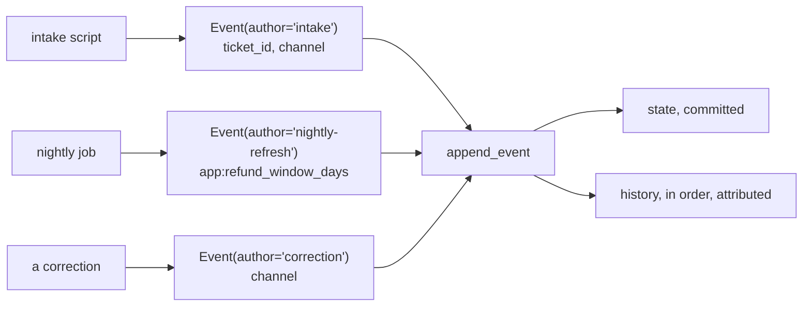

# 3.3 — Writing from outside a run

## One-line answer

When no agent is running — a script, a nightly job, an intake process — you write state by building an
event whose only cargo is the change and appending it through the session service, which keeps the
write inside the history exactly like every other one.

## The story

The night porter's logbook.

Nobody is on reception at three in the morning. A delivery arrives, and the porter who signs for it
does not wake anybody or leave a note on a screen. They open the book on the desk, write the date, the
time, what arrived and who took it, and sign it.

The book is the same book the day staff use. The entry is in the same handwriting-and-ink format as
every other entry, in order, between the one before it and the one after. In the morning nobody has to
be told about the delivery — it is in the record, in its place, and the record is the thing everybody
already reads.

## The idea in plain language

The first two write paths both happen *during* a run: a tool or callback writing through its context
([3.1](3.1-writing-from-inside-a-tool.md)), and the agent's own answer via `output_key`
([3.2](3.2-the-carbon-copy.md)). Plenty of state changes do not happen during a run at all:

- an intake process that creates a session for a new ticket and stamps it with the ticket's id;
- a nightly job that refreshes an `app:` setting for everybody;
- a human clicking *approve* in an interface, which is where Day 62's approval work lands;
- a migration that fixes a key that was written wrongly.

For those, you build the event yourself:

```
event = Event(author="intake", actions=EventActions(state_delta={"ticket_id": 4521}))
await session_service.append_event(session=session, event=event)
```

Three parts, each doing something:

- **`EventActions(state_delta={...})`** — the cargo. `state_delta` is the same field the framework
  fills in for you during a run ([1.3](../01-form-not-story/1.3-the-pad-and-the-rail.md)), so this is
  not a special back door; it is the same door, opened by hand.
- **`Event(author=...)`** — the envelope, and the author is the part people leave as `"user"` out of
  habit. It is the only attribution the record will ever have for this change, so it should name the
  thing that made it: `"intake"`, `"nightly-refresh"`, `"approval-ui"`.
- **`append_event`** — the commit. This is what applies the delta to storage, trims any `temp:` keys
  ([2.4](../02-four-lifetimes/2.4-why-temp-exists.md)) and puts the event in the history.

It looks ceremonial next to `session.state["k"] = v`, and the ceremony is the entire point: the change
is timestamped, attributed and ordered against everything else that has happened in that conversation.
The version without ceremony is the day's failure lab
([6.1](../06-failure-lab/6.1-the-write-that-was-never-written.md)).

## Why Sutra needs it

Because Sutra's tickets arrive from outside a conversation, and that is where the ticket's identity
should be written.

The shape Phase 8 will use: an intake step creates the session and appends one event carrying
`ticket_id`, `channel` and `received_at`. When the desk's first invocation runs, those facts are
already in state — the agent never has to be told them in prose, and the instruction can template them
straight into the prompt ([4.1](../04-state-in-the-prompt/4.1-state-steers-the-next-turn.md)).

It matters again on Day 62, when a human approves an action. The approval is a fact produced by a
person, outside any run, and it has to be recorded somewhere a later invocation can read and an auditor
can check. That is this path, and it is worth having built it once on a quiet day.

## The mechanism

Three writes from outside a run: a session stamped at intake, an `app:` setting refreshed for everyone,
and a correction — each an event with an author of its own.

```python
# days/day-17-state-scopes-and-lifetimes/lab/from_outside.py
"""Writing state with no agent running. Zero model calls."""

import asyncio

from google.adk.events import Event, EventActions
from google.adk.sessions import InMemorySessionService

APP = "sutra"


async def write(service: InMemorySessionService, session, author: str, delta: dict) -> None:
    """One state change, as an event, attributed to whoever made it."""
    await service.append_event(
        session=session,
        event=Event(author=author, actions=EventActions(state_delta=delta)),
    )


async def main() -> None:
    service = InMemorySessionService()
    session = await service.create_session(app_name=APP, user_id="engineer_a")

    await write(service, session, "intake", {"ticket_id": 4521, "channel": "email"})
    await write(service, session, "nightly-refresh", {"app:refund_window_days": 30})
    await write(service, session, "correction", {"channel": "web"})

    stored = await service.get_session(app_name=APP, user_id="engineer_a", session_id=session.id)
    print("state:", dict(stored.state))
    print()
    for event in stored.events:
        if event.actions and event.actions.state_delta:
            print(f"{event.author:16} {event.actions.state_delta}")


asyncio.run(main())
```

**Line by line:**

- `async def write(...)` — a three-line helper, because in a real system this shape is used in several
  places and a helper is where the author argument stops being optional in practice.
- `Event(author=author, ...)` — the author is a **parameter**, not a constant, so each caller has to say
  who it is. That is the difference between a history you can read afterwards and one where everything
  was done by `"user"`.
- `EventActions(state_delta=delta)` — the only field set. This event has no content, no tool call and no
  reply: it exists solely to carry a change.
- Three calls with three different authors, and the third one deliberately **overwrites** `channel`,
  because corrections are a real thing that happens and the history is where they become visible.
- `await service.get_session(...)` at the end — reading back through the service, which is the only
  reading that proves anything ([6.1](../06-failure-lab/6.1-the-write-that-was-never-written.md)).
- The loop over `stored.events` prints the audit trail: who changed what, in order.
  [7.3](../07-in-production/7.3-state-as-a-trace.md) builds on exactly this.

```bash
cd days/day-17-state-scopes-and-lifetimes/lab
uv run python from_outside.py
```

**Line by line:**

- No agent, no runner, no model. This whole path exists for the case where none of those are present.

Measured on `google-adk` 2.7.1 on 2026-09-03:

```text
state: {'ticket_id': 4521, 'channel': 'web', 'app:refund_window_days': 30}

intake           {'ticket_id': 4521, 'channel': 'email'}
nightly-refresh  {'app:refund_window_days': 30}
correction       {'channel': 'web'}
```

The state shows `channel` as `web`. The history shows that it was `email` at intake and was corrected
afterwards, by something calling itself `correction`. Both facts are available because the write went
through an event, and neither would be if it had not.



## When it breaks

**You append an event to a session object you fetched a while ago.**

The service applies the delta to the object you pass in, so a stale session gets a correct-looking
update and the newest revision may not have it. Persistent services guard against this: the base
service's `append_event` documents that it raises `StaleSessionError` *"when a persistent
implementation detects that the supplied session has been superseded by a newer stored revision"*. The
in-memory service does not detect it, so this is a bug that appears when you move to a database — fetch
the session immediately before appending.

**The author is `"user"` and the history becomes useless.** No error, and it costs you the one thing
this path was buying. Six months later the question is *"what set this key?"* and the answer is
*"the user did"*, six times.

**A later run logs a warning about your author.**

```text
Event from an unknown agent: intake, event id: 93794098-...
```

Measured on 2026-09-03 by running an agent over a session that already contained an `intake` event. The
runtime walks the history and notices an author that is not one of its agents. It is a warning, not an
error, the run proceeds normally, and it is worth recognising: it means *"a human or a script wrote
this"*, which is exactly what you intended.

**A partial event silently does nothing.**

```python
Event(author="intake", partial=True, actions=EventActions(state_delta={"ticket_id": 4521}))
```

**Line by line:**

- `partial=True` marks an event as an intermediate chunk of a streaming response.
- The first line of `append_event` is `if event.partial: return event` — the event is handed straight
  back, **no delta applied, nothing appended**.
- You will not set this deliberately; you can inherit it by copying an event you captured from a stream
  and re-appending it, which is a real pattern in replay code.

## In production

**Give every out-of-band write an author, and make the author a constant.**

The version a professional writes has the authors defined in one place — `INTAKE = "intake"` — for the
same reason state keys are constants: the history is queried by author when something goes wrong, and a
typo produces a second, silent identity.

**What changes at scale** is that this path becomes the integration surface. Anything outside the agent
that needs to affect a conversation — a webhook, a support tool, a human action — writes through it, so
it deserves the treatment an API gets: one helper, validated inputs, and an author per caller rather
than per developer.

**What fails only under concurrency** is the read-modify-write. Two out-of-band writers that both read
a counter and write it back will lose one increment, and neither will notice; `append_event` applies a
delta, it does not merge. Where two writers are possible, give each its own key, or make the write
idempotent, or serialise it somewhere upstream.

**The review comment**: *"this appends an event with `author='user'`. Name the component — in six months
that field is the only thing telling us where this value came from."*

**The interview question**: *"how do you set state when no agent is running?"* The answer that shows you
know the framework: *"build an event whose actions carry the state delta and append it through the
session service — same path as a tool's write, so the change is attributed and in the history rather
than beside it."*

## Check yourself

```bash
cd days/day-17-state-scopes-and-lifetimes/lab
uv run python from_outside.py
```

Read the three history lines and say what the value of `channel` was at intake.

**Out loud, without scrolling up:** name the three safe ways to write state, and say which one you would
use to record a human's approval.
