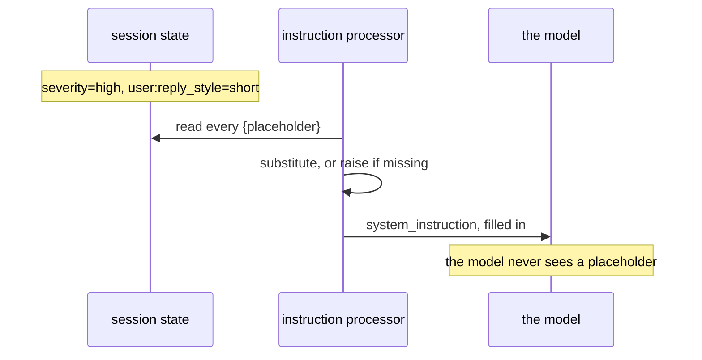

# 4.1 — State steers the next turn

## One-line answer

A `{key}` in an agent's instruction is filled from state before the model sees it, so state is not
only something the conversation writes — it is something that changes what the next turn is told.

## The story

The letter from the dentist.

It opens with your surname, spelled correctly. It says you are due for a check-up, and it names the
month of your last visit. It is a printed letter, identical to eleven thousand others except in three
places, and nobody sat down to write yours.

You know how it works because you have seen the version that goes wrong: the one that begins *"Dear
FIRSTNAME"*, or says your last visit was in a month you were not in the country. The template is fine
in both cases. What changed is the row it was filled from.

The interesting thing about the good version is that the letter does not *contain* your name. It
contains a hole where your name goes, and a system that knows to look it up at the moment of printing.

## The idea in plain language

[Day 6](../../../day-06-instructions-and-personas/LESSON.md) made the instruction Sutra's handbook: a
block of text sent to the model on every call. It has been a constant string ever since.

It does not have to be. ADK fills `{...}` placeholders in an instruction from session state
immediately before the request goes out. So this:

```
instruction="You are Sutra. This ticket is severity {severity}."
```

reaches the model as *"You are Sutra. This ticket is severity high."* — assuming `severity` is in
state. Prefixed keys work too: `{user:reply_style}` and `{app:refund_window_days}` are valid, because
the templating engine accepts a known prefix followed by a valid Python identifier.

That closes a loop the day has been building towards. State is written by tools
([3.1](../03-three-safe-writes/3.1-writing-from-inside-a-tool.md)), by the agent's own answers
([3.2](../03-three-safe-writes/3.2-the-carbon-copy.md)) and from outside
([3.3](../03-three-safe-writes/3.3-writing-from-outside-a-run.md)) — and now it is also **read back
into the prompt**, which means a fact recorded on turn one changes how the model is briefed on turn
four.

Two things to hold on to before the next part goes through the failure modes:

- The substitution happens **on every call**, from the state as it is at that moment. Nothing is
  cached; there is no "compiled" instruction.
- It is a plain text substitution into the system instruction. The model is not told that `high` came
  from state, and there is no structure around it — which is why
  [4.2](4.2-the-brace-that-raises.md) cares a great deal about what happens when a key is missing.

## Why Sutra needs it

Because it is how a preference becomes behaviour without a single line of branching code.

Sutra's engineer prefers short answers. That fact is one `user:` key
([2.3](../02-four-lifetimes/2.3-where-user-and-app-live.md)), written once, and from then on the
instruction says *"the engineer prefers short answers"* in every conversation that engineer opens. No
`if` statement, no second agent, no prompt-selection logic. The alternative — assembling an instruction
string in Python before constructing the agent — works exactly once, because the agent is constructed
before the session exists.

The bigger reason is Phase 8. In a graph, the writer node's instruction reads `{last_triage}`, which
the triage node's `output_key` wrote a moment earlier. The handoff between two agents is a state key on
one side and a placeholder on the other, and neither node knows anything about the other's internals.

## The mechanism

The only honest way to check a substitution is to look at what the model actually received, so this
script uses a model that records its instruction and answers nothing:

```python
# days/day-17-state-scopes-and-lifetimes/lab/steers.py
"""What the model is actually told, once state has been filled in. Zero model calls."""

import asyncio
from collections.abc import AsyncGenerator

from google.adk.agents import Agent
from google.adk.events import Event, EventActions
from google.adk.models import BaseLlm, LlmRequest, LlmResponse
from google.adk.runners import Runner
from google.adk.sessions import InMemorySessionService
from google.genai import types


class Recorder(BaseLlm):
    """A model that answers nothing and keeps the instruction it was sent."""

    seen: str = ""

    async def generate_content_async(
        self, llm_request: LlmRequest, stream: bool = False
    ) -> AsyncGenerator[LlmResponse, None]:
        self.seen = str(llm_request.config.system_instruction)
        yield LlmResponse(content=types.Content(role="model", parts=[types.Part(text="noted")]))


model = Recorder(model="recorder")
agent = Agent(
    name="desk",
    model=model,
    instruction=(
        "You are Sutra. This ticket is severity {severity}. "
        "The engineer prefers {user:reply_style} answers. "
        "Refund window: {app:refund_window_days} days. "
        "Nickname on file: [{nickname?}]"
    ),
)


async def main() -> None:
    service = InMemorySessionService()
    session = await service.create_session(app_name="sutra", user_id="engineer_a")
    await service.append_event(
        session=session,
        event=Event(
            author="intake",
            actions=EventActions(
                state_delta={
                    "severity": "high",
                    "user:reply_style": "short",
                    "app:refund_window_days": 30,
                }
            ),
        ),
    )
    runner = Runner(app_name="sutra", agent=agent, session_service=service)
    async for _ in runner.run_async(
        user_id="engineer_a",
        session_id=session.id,
        new_message=types.Content(role="user", parts=[types.Part(text="triage this")]),
    ):
        pass
    print("the instruction the model received:")
    print(model.seen)


asyncio.run(main())
```

**Line by line:**

- `class Recorder(BaseLlm)` — a second test double, smaller than
  [Day 13](../../../day-13-callbacks-four-doors/LESSON.md)'s scripted model, because this experiment
  needs to inspect the **request** rather than to control the reply.
- `self.seen = str(llm_request.config.system_instruction)` — the instruction as it stands after every
  processor has run. This is the ground truth; anything else is a guess about what the framework did.
- `yield LlmResponse(...)` with one short text part — the run has to complete, so the double has to
  answer something.
- `Runner(app_name=..., agent=..., session_service=service)` rather than `InMemoryRunner` — because the
  session was created on **this** service and pre-loaded with state before the run. `InMemoryRunner`
  makes its own service, which would start empty.
- The instruction contains **four** placeholders on purpose: a plain key, a `user:` key, an `app:` key,
  and an optional one written `{nickname?}` for a key that is not in state.
- The `append_event` before the run is [3.3](../03-three-safe-writes/3.3-writing-from-outside-a-run.md)'s
  path, used here to set the scene without an agent.

```bash
cd days/day-17-state-scopes-and-lifetimes/lab
uv run python steers.py
```

**Line by line:**

- The double means no request leaves the machine; the whole experiment is about the request that would
  have.

Measured on `google-adk` 2.7.1 on 2026-09-03 (framework log lines removed):

```text
the instruction the model received:
You are Sutra. This ticket is severity high. The engineer prefers short answers. Refund window: 30 days. Nickname on file: []

You are an agent. Your internal name is "desk".
```

Three substitutions and one blank. Note two things that were not in your instruction:

- `{nickname?}` became **nothing at all**, because the trailing question mark marks a placeholder as
  optional. Without it, this run would have raised — [4.2](4.2-the-brace-that-raises.md).
- ADK appended a line of its own: *"You are an agent. Your internal name is `desk`."* Your instruction
  is not the whole system instruction, and it never was; the framework adds identity information after
  it. Worth knowing on the day you count tokens.



## When it breaks

**The value lands in the prompt and reads badly.**

No error, and easy to miss because you are reading your template rather than the result. If `severity`
holds `None`, the substitution produces an empty string and the model is told *"This ticket is severity
."*. If it holds a dictionary — which it will if it came from an `output_schema`
([3.2](../03-three-safe-writes/3.2-the-carbon-copy.md)) — the model is told
*"severity {'severity': 'high', 'reason': ...}"*, because the value is passed through `str()`.

The fix is to template values that are already strings, and to keep structured values for code.

**The key is missing and the whole call fails.** That is [4.2](4.2-the-brace-that-raises.md), and it is
the reason this part stops here.

**The instruction was assembled in Python and never updates.**

```python
agent = Agent(name="desk", instruction=f"This ticket is severity {severity}.")
```

**Line by line:**

- An f-string is evaluated **once**, when the agent is constructed, from whatever `severity` happened to
  be in scope at import time.
- The agent then carries that text for the life of the process, for every session and every user.
- It looks identical to the templated version in the source, which is what makes it dangerous: the
  difference is one `f` and one lifetime.

## In production

**Template the facts, not the logic.**

The version a professional writes uses placeholders for values — a severity, a preference, a customer
tier — and keeps *conditional* behaviour out of the instruction. A template that tries to branch
(*"if the user is a VIP, say..."*) is a program written in a language with no tests. When behaviour must
branch, branch in code: choose the instruction, or choose the agent.

**What changes at scale** is that every placeholder becomes a contract between a writer and a reader
that no compiler checks. The key is written by a tool in one module and read by an instruction in
another, and nothing connects them except a string. That is what
[5.1](../05-a-schema-for-state/5.1-declaring-the-boxes.md)'s state schema is for, and it is why the
keys should be constants rather than literals.

**What fails only under real traffic** is the injected value. Everything templated into an instruction
is text the model treats as *your* words — that is what a system instruction is — so a value that came
from a customer's ticket is now indistinguishable from your own policy. Day 66's injection work starts
exactly here: never template raw user-supplied text into an instruction, only values your own code
decided.

**The review comment**: *"this templates `{ticket_body}` into the system instruction. That is the
customer's text, in the position of our policy."*

**The interview question**: *"how does an agent's prompt change as a conversation progresses?"* The
answer that shows you have used it: *"placeholders in the instruction are filled from session state on
every call, so writing a fact changes how the model is briefed next turn — and a missing key raises
rather than degrades."*

## Check yourself

```bash
cd days/day-17-state-scopes-and-lifetimes/lab
uv run python steers.py
```

Then change `{severity}` to `{Severity}` and run it again — the capital letter is a different key.

**Out loud, without scrolling up:** say what a `{key}` in an instruction does and when it does it, and
name the one character that makes a placeholder optional.
