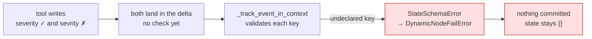

# 5.1 — Declaring the boxes

## One-line answer

`state_schema` lets an agent declare, as a pydantic model, which state keys exist and what type each
one holds — and a write to a key that is not declared raises `StateSchemaError`, which is how a
misspelled key stops being a silent new key.

## The story

The tax form with numbered boxes.

Box 12 is *"income from employment"*. Box 19 is *"expenses you are claiming"*. There is no box for
*"other stuff"*, and you cannot invent box 19b in the margin — or rather you can, and the form comes
back, because the machine that reads it does not have a 19b.

It is irritating exactly once, the first year, when the thing you want to declare does not obviously
fit any box. After that the numbered boxes are the reason the form is quick: you are never wondering
where something goes, and neither is anybody reading it.

The boxes are not there to restrict you. They are there so that two people looking at the same form
mean the same thing by the same number.

## The idea in plain language

Everything so far has treated state as an open dictionary: any key, any value, no declaration
([1.2](../01-form-not-story/1.2-what-may-live-in-state.md) measured how open it is). That is
convenient and it has the failure mode every open dictionary has — a misspelled key is not an error, it
is a **new key**, and the reader of the correctly-spelled one just finds nothing.

ADK 2.x adds an opt-in: `state_schema`. You declare a pydantic model naming the keys and their types,
and attach it to the agent:

```
class DeskState(BaseModel):
    severity: str
    ticket_id: int

agent = Agent(name="desk", model=..., tools=[...], state_schema=DeskState)
```

From then on, writes are checked against the declaration. `state["severity"] = "high"` is fine;
`state["sevrity"] = "high"` raises `StateSchemaError` naming the key **and listing the fields that do
exist**, which is the difference between a five-minute fix and an afternoon.

Two structural facts, from the field's own documentation in `_base_node.py` in `google-adk` 2.7.1:

- the field lives on the **node**, and `LlmAgent` is a node, which is why an ordinary agent accepts it;
- **child nodes inherit** the schema from their parent through the invocation context unless they
  declare their own — so in Phase 8's graph, one declaration covers a subtree.

This is Day 12's argument moved one store to the left. That day put a schema on the way *out* of the
model, so the answer had a shape. Today's schema is on the *working memory* that several components
share, and the reason is the same: a value that more than one component reads needs an agreed shape,
and the agreement should be written down somewhere a machine can check.

## Why Sutra needs it

Because from Phase 8 the desk, the researcher and the writer all read and write the same state, and
the set of keys becomes an interface between them.

Interfaces between components drift. One node starts writing `severity`, another writes `priority`
meaning the same thing, a third reads `severity` and finds nothing on the path where only the second
ran. None of that fails a test today, because there is no declaration to fail against. `state_schema`
is the declaration.

There is a nearer benefit. Sutra's own build today defines the keys in `sutra/state.py`; declaring them
as a model in the same module means the constants and their types live together and the agent enforces
them at run time.

## The mechanism

One agent with a schema, one tool that writes a good key and then a misspelled one:

```python
# days/day-17-state-scopes-and-lifetimes/lab/declared.py
"""A schema for state: what it catches and where. Zero model calls."""

from google.adk.agents import Agent
from google.adk.runners import InMemoryRunner
from google.adk.tools import ToolContext
from google.genai import types
from pydantic import BaseModel
from scripted import ScriptedModel, call, text


class DeskState(BaseModel):
    severity: str
    ticket_id: int


def record(severity: str, tool_context: ToolContext) -> dict:
    """Write one declared key and one that is not declared."""
    tool_context.state["severity"] = severity
    try:
        tool_context.state["sevrity"] = severity  # the typo
        return {"typo_accepted": True}
    except Exception as error:
        return {"typo_rejected": type(error).__name__, "message": str(error).splitlines()[0]}


agent = Agent(
    name="desk",
    model=ScriptedModel(
        model="scripted",
        replies=[[call("record", severity="high")], [text("done")]],
    ),
    tools=[record],
    state_schema=DeskState,
)

runner = InMemoryRunner(agent=agent)
s = runner.session_service.create_session_sync(app_name=runner.app_name, user_id="u1")
for event in runner.run(
    user_id="u1",
    session_id=s.id,
    new_message=types.Content(role="user", parts=[types.Part(text="go")]),
):
    for part in (event.content.parts if event.content else []) or []:
        if part.function_response is not None:
            print("tool said:", part.function_response.response)

stored = runner.session_service.get_session_sync(
    app_name=runner.app_name, user_id="u1", session_id=s.id
)
print("state:", dict(stored.state))
```

**Line by line:**

- `class DeskState(BaseModel)` — two fields, two types. This is the whole declaration; there is no
  registration step and no configuration file.
- `state_schema=DeskState` — passed as an ordinary constructor argument. It is inherited from
  `BaseNode`, so it is available on any agent, and it is `None` by default, which is why every earlier
  part in this day was unchecked.
- The tool writes `severity` — declared, correct type — and then `sevrity`, the classic transposition.
- The `try`/`except` around the typo is **the experiment**, not defensive programming: it asks *where*
  the check happens. If the assignment itself validated, the tool would catch its own mistake and
  report it in `typo_rejected`.
- `print("tool said:", ...)` — the tool's return value, which is the only way to see what the tool
  observed from inside.
- The final `get_session_sync` — what was actually committed, which turns out to be the most
  informative line in the output.

```bash
cd days/day-17-state-scopes-and-lifetimes/lab
uv run python declared.py
```

**Line by line:**

- Scripted model, so no requests; the subject is validation, not intelligence.

Measured on `google-adk` 2.7.1 on 2026-09-03 (framework frames trimmed):

```text
  File "...\google\adk\workflow\_node_runner.py", line 336, in _track_event_in_context
    _validate_state_entry(ctx.state._schema, key, value)
  File "...\google\adk\sessions\state.py", line 44, in _validate_state_entry
    raise StateSchemaError(
google.adk.sessions.state.StateSchemaError: Key 'sevrity' is not declared in state schema 'DeskState'. Declared fields: ['severity', 'ticket_id']
google.adk.workflow._errors.DynamicNodeFailError: Dynamic node desk failed
state: {}
```

Three findings, and the second one is the one to remember.

1. **The message is excellent.** It names the offending key, the schema, and every field that does
   exist. That is a fixable error.
2. **The check does not happen at the assignment.** There is no `tool said:` line in the output at all,
   and the tool's `except` never ran: the write went into the delta unchallenged, and the schema was
   applied later, when the runtime tracked the event. Your tool cannot catch this.
3. **The whole step is lost.** The final line is `state: {}` — not even `severity`, which was valid. The
   node failed, so the delta it was carrying was never committed.



## When it breaks

**The error is real and your caller never sees it.**

The traceback above ends up in a background thread, exactly like
[4.2](../04-state-in-the-prompt/4.2-the-brace-that-raises.md)'s `KeyError` and
[3.2](../03-three-safe-writes/3.2-the-carbon-copy.md)'s validation failure: the loop over events
finishes, no answer is produced, and nothing is raised where you could catch it. Three different
mechanisms, one shape — which is why Day 21 exists.

**A key you deliberately want is not in the schema.** The schema is a closed list. The moment a new
component needs a new key, the model has to be updated, and if that model lives in another module the
new component depends on it. That is a real cost, and it is the reason `state_schema` is opt-in rather
than default.

**Prefixed keys are not checked at all.** `user:anything` and `temp:anything` sail through, which is
either a relief or a hole depending on what you expected —
[5.2](5.2-what-the-schema-does-not-do.md) measures it.

## In production

**Declare the schema next to the constants, and treat it as the contract between components.**

The version a professional writes has one module — `sutra/state.py` today — holding the key names, the
schema, and the small helpers that write them. Everything else imports from there. The schema is then
doing three jobs at once: catching typos at run time, documenting the working memory for the next
person, and giving a reviewer one place to look when a new key is proposed.

**What changes at scale** is that the schema becomes a migration surface. A key renamed in the model is
a key that no longer validates, and sessions in storage still hold the old name. That is an ordinary
database migration problem arriving somewhere people do not expect one, and it is much easier to handle
when the set of keys is declared than when it is whatever the code happens to write.

**What fails only under real traffic** is the inherited schema. Child nodes inherit their parent's
schema, so a sub-agent written by someone else, in another module, is validated against your model. The
first symptom is that sub-agent failing on a key it has always written, and the cause is a declaration
it has never heard of.

**The review comment**: *"this adds a state key. Add it to `DeskState` too, or the first write will fail
the node."*

**The interview question**: *"how do you stop agents from writing junk into shared state?"* The answer
that shows you know 2.x: *"declare a state schema on the node — undeclared keys raise — and know that
the check happens when the event is tracked, so the failing step commits nothing at all."*

## Check yourself

```bash
cd days/day-17-state-scopes-and-lifetimes/lab
uv run python declared.py
```

Then fix the typo and run it again: the state should hold `severity`.

**Out loud, without scrolling up:** say what `state_schema` checks, where the check happens, and what
happens to the *valid* keys written in the same step as an invalid one.
