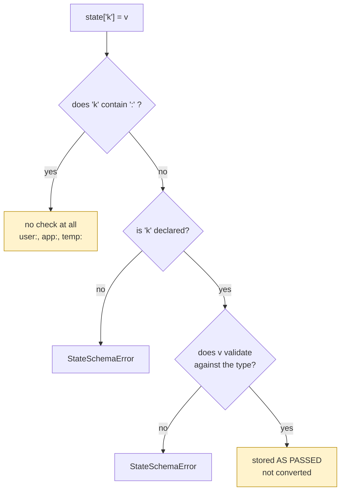

# 5.2 — What the schema does not do

## One-line answer

`state_schema` checks the **name** of every unprefixed key and validates its type without converting
it — so a declared `int` field happily stores the string `"4521"`, and every `user:`, `app:` and
`temp:` key skips the check entirely.

## The story

The bouncer on the door checks the list.

Your name is on it, so you are in. He is very good at that job: the list is long, people try things,
and nobody gets past him who is not on it.

He does not look in your bag. He does not check whether the shoes are the ones the sign asks for. He
does not ask whether the person whose name you gave is actually you. None of that is carelessness — it
is simply not what he was asked to do, and the venue put one person on one door with one list.

The mistake is not his. It is the manager's, on the night they say *"we have a bouncer, so nothing can
go wrong inside"*.

## The idea in plain language

[5.1](5.1-declaring-the-boxes.md) showed the schema catching a misspelled key. This part is the shape
of the hole around that, and it has three parts, all measurable.

**One: prefixed keys are not checked at all.** The validator's first line is a check for `:` in the
key name, and any key containing one returns immediately. So `user:anything`, `app:anything` and
`temp:anything` bypass the schema — not "are validated loosely", but are not looked at. That is
deliberate: the scopes are different stores
([2.3](../02-four-lifetimes/2.3-where-user-and-app-live.md)) with different owners, and a per-agent
model has no authority over the whole application's settings. It also means the two scopes with the
**longest** lives are the two with no declaration.

**Two: types are validated, not coerced.** The check runs pydantic's `TypeAdapter(...).validate_python`
and throws the result away. Pydantic's default mode is lax, so a string like `"4521"` *validates*
against an `int` field — and because the result is discarded, what gets stored is the string you passed
in. The schema says the value is acceptable and does not make it true.

**Three: the failure mode is total and silent.** Established in
[5.1](5.1-declaring-the-boxes.md): one undeclared key fails the whole node, every other write in that
step is lost, and nothing reaches your code.

None of this makes the schema useless. It catches the single most common state bug — a key that does
not exist — with an excellent message. It is worth knowing precisely what else you still have to do
yourself.

## Why Sutra needs it

Because the day Sutra adds `DeskState` is the day somebody assumes state is now type-safe, and the
assumption will be made in a code review rather than in a test.

Concretely: if `ticket_id` is declared `int` and a tool writes the string it read out of an email
subject, the schema passes, the value is stored as a string, and the first thing that compares it to a
number gets a wrong answer with no error. That is a bug the schema was expected to prevent and does
not, so the conversion has to happen where the value is written
([1.2](../01-form-not-story/1.2-what-may-live-in-state.md)'s rule about normalising at the boundary).

And because `user:` keys skip validation, the keys with the longest life in the system — the ones that
follow an engineer across every conversation, for ever — are exactly the ones with no schema at all.
Those need their own discipline, which is why [7.2](../07-in-production/7.2-what-belongs-in-state.md)
gives them one.

## The mechanism

The schema applied directly to a `State` object, so every case can be tried without a run:

```python
# days/day-17-state-scopes-and-lifetimes/lab/schema_holes.py
"""What state_schema checks, and the three things it does not. Zero model calls."""

from google.adk.sessions.state import State, StateSchemaError
from pydantic import BaseModel


class TriageState(BaseModel):
    severity: str
    ticket_id: int


def attempt(label: str, write) -> None:
    try:
        write()
        print(f"{label}: allowed")
    except StateSchemaError as error:
        print(f"{label}: StateSchemaError: {str(error).splitlines()[0]}")


state = State(value={}, delta={}, schema=TriageState)

attempt("severity='high'      ", lambda: state.__setitem__("severity", "high"))
attempt("ticket_id=4521       ", lambda: state.__setitem__("ticket_id", 4521))
attempt("ticket_id='4521'     ", lambda: state.__setitem__("ticket_id", "4521"))
attempt("sevrity='high' (typo)", lambda: state.__setitem__("sevrity", "high"))
attempt("user:reply_style     ", lambda: state.__setitem__("user:reply_style", "short"))
attempt("temp:anything        ", lambda: state.__setitem__("temp:anything", object()))

print("final:", state.to_dict())
```

**Line by line:**

- `State(value={}, delta={}, schema=TriageState)` — the schema goes on the state object itself. In a
  run, ADK builds this for you from the node's `state_schema`
  ([5.1](5.1-declaring-the-boxes.md)); building it directly is what makes each case observable on its
  own.
- `attempt(label, write)` with a lambda — every case has to run even after one fails, and each one is a
  single write so the report is unambiguous.
- `state.__setitem__("severity", "high")` rather than `state["severity"] = "high"` — because a lambda
  cannot contain an assignment. It is the same call.
- The six cases in order: a correct string, a correct int, **an int field given a string**, a
  misspelled key, a `user:` key, and a `temp:` key holding a bare `object()` — which is not
  serializable by any definition ([1.2](../01-form-not-story/1.2-what-may-live-in-state.md)).
- `state.to_dict()` at the end — the crucial line, because it shows what was **stored**, which is not
  the same question as what was allowed.

```bash
cd days/day-17-state-scopes-and-lifetimes/lab
uv run python schema_holes.py
```

**Line by line:**

- No run, no service, no model: a schema check is a property of a write.

Measured on `google-adk` 2.7.1 and pydantic 2.13 on 2026-09-03:

```text
severity='high'      : allowed
ticket_id=4521       : allowed
ticket_id='4521'     : allowed
sevrity='high' (typo): StateSchemaError: Key 'sevrity' is not declared in state schema 'TriageState'. Declared fields: ['severity', 'ticket_id']
user:reply_style     : allowed
temp:anything        : allowed
final: {'severity': 'high', 'ticket_id': '4521', 'user:reply_style': 'short', 'temp:anything': <object object at 0x000002310EE3B100>}
```

The address at the end varies per run; everything else reproduces. Read the last line rather than the
first six. One key was rejected. And the state now contains `ticket_id` as the **string** `'4521'` —
validated against an `int` field and stored unchanged — and a bare Python object under a `temp:` key,
which no database will ever accept.



## When it breaks

**The comparison that should have been true.**

```python
if state["ticket_id"] == 4521:     # False, because state holds "4521"
```

**Line by line:**

- The schema declared `ticket_id: int` and accepted a string, so this comparison is between `str` and
  `int` and is simply `False`.
- Python does not warn about comparing different types with `==`; it returns `False` and moves on.
- The fix is at the write: `state["ticket_id"] = int(value)`. The schema is a check, not a converter,
  and treating it as one is this part's whole subject.

**The type error that does raise.**

```text
StateSchemaError: Value for 'ticket_id' does not match type '<class 'int'>' in 'TriageState': 1 validation error for int
  Input should be a valid integer [type=int_type, input_value=['a', 'list'], input_type=list]
```

That is the second message the validator can produce — the shape of it is in `state.py` — and it fires
for a value pydantic cannot coerce at all, such as a list where an `int` was declared. Lax coercion is
what lets `"4521"` through; it does not let everything through.

**The `user:` key nobody checked.** Silent, permanent, and the worst of the three, because the value
outlives every conversation ([2.3](../02-four-lifetimes/2.3-where-user-and-app-live.md)). A prefixed
key with a typo is a new per-user key that will be there for as long as the user is.

## In production

**Convert at the write, validate at the read, and treat the schema as a spelling checker.**

The version a professional writes has one small function per fact — `record_triage(severity, ticket_id)`
— which converts, validates and writes, and is the only thing that touches those keys. The schema then
does the job it is actually good at: catching the key that does not exist, with a message that names
the ones that do.

**What changes at scale** is that the unchecked scopes need a checked owner. If `user:` and `app:` keys
matter — and they are the ones that last — the discipline has to come from your code: one module owning
them, constants for the names, and a test asserting the set of keys a user's store may contain.

**What fails only under real traffic** is lax coercion meeting real data. Ticket ids arrive from
emails, webhooks and humans, as strings, and every one of them validates against an `int` field. The
first sign is not an exception — it is a lookup that finds nothing for a ticket that plainly exists.

**The review comment**: *"the schema says `int` and this writes whatever the parser returned. Convert
before the write — the schema will not do it for you."*

**The interview question**: *"you have declared a schema for your agent's state. What can still go
wrong?"* The answer that shows you have read the implementation: *"prefixed keys are not checked at
all, types are validated but not converted, and one bad key fails the whole step — so the schema is a
spelling checker with an excellent error message, not a type system."*

## Check yourself

```bash
cd days/day-17-state-scopes-and-lifetimes/lab
uv run python schema_holes.py
```

Look at the type of `ticket_id` in the final line, not at whether it was allowed.

**Out loud, without scrolling up:** name the three things `state_schema` does not do, and say which of
them affects the keys with the longest lifetime.
