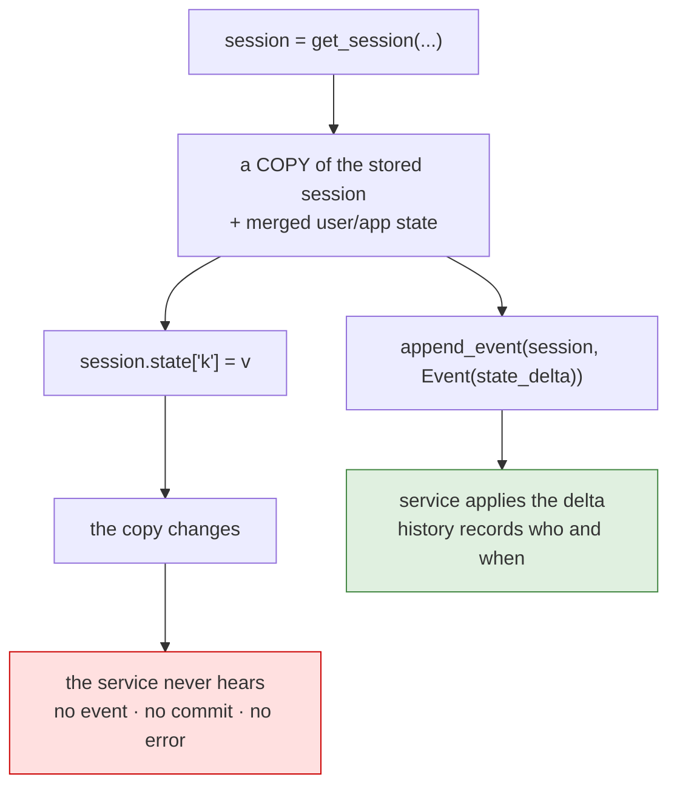

# 6.1 — 💥 The write that was never written

## One-line answer

Assigning to a fetched session's state — `session.state["k"] = v` — is the natural thing to write, and
it changes a **copy**: no event, no commit, no error, and the value is gone the next time anybody asks
the service for that session.

## The story

The note you left on somebody's desk.

They were not in, so you wrote it on a sheet from the pad by the printer: the client rang, they want a
call back, here is the number. You put it in the middle of the desk where nobody could miss it, and you
went home feeling organised.

The cleaner came through at six. The desk was cleared, as it is every evening, because a piece of paper
in the middle of a desk at six in the evening is rubbish.

Nobody did anything wrong. You wrote a real note with real information and put it somewhere that looked
like the right place, and the system that actually moves information around that office — the shared
inbox, the ticket queue — never heard about it. There is no record that you tried.

## The idea in plain language

This is the day's deliberate failure, and it is the one everybody writes at least once, because it is
what a dictionary is for.

You have a session. You want a key set. You write:

```
session = await service.get_session(app_name=..., user_id=..., session_id=...)
session.state["severity"] = "high"
```

Everything about that is reasonable. `session.state` exists, it behaves like a dictionary, and the
assignment succeeds. It is also, in the documentation's own words on `adk.dev/sessions/state/` read on
2026-09-03, the anti-pattern: *"Avoid direct modification … outside managed contexts. This bypasses
event history, breaks persistence, and risks data loss. Only read state this way; always update through
`append_event`, `output_key`, or context objects."*

Two mechanisms make it worse than it looks, and they compound:

**There is no event.** [1.3](../01-form-not-story/1.3-the-pad-and-the-rail.md) established that a write
becomes real when an event carries its delta. This write creates no event, so there is nothing to
commit, nothing in the history, and nothing for
[7.3](../07-in-production/7.3-state-as-a-trace.md) to show you afterwards.

**The object is a copy.** `get_session` on the in-memory service returns a **copied** session with the
user and app stores merged in ([2.3](../02-four-lifetimes/2.3-where-user-and-app-live.md)). So even
the in-process dictionary you just edited is not the one the service keeps. You changed a snapshot.

### 🎬 The scene

Sutra's intake script is being extended. A ticket arrives, the script creates the session, and now
somebody wants the ticket number in state so the desk's instruction can template it
([4.1](../04-state-in-the-prompt/4.1-state-steers-the-next-turn.md)).

The two-line version is written, tested by printing the state immediately afterwards — which prints the
right thing — and merged.

### 😬 The naive fix

*"It printed the value. The state has the key. Nothing else is needed."*

### 💥 Why it fails

The print reads the object that was just edited, so of course it shows the key. Every later read goes
through the service, which never heard about the change. In production the desk's instruction
references `{ticket_id}`, the key is not there, and — per
[4.2](../04-state-in-the-prompt/4.2-the-brace-that-raises.md) — the turn produces **no answer at all**,
with the traceback in a background thread and nothing in your logs pointing at intake.

### 💡 The insight

**A write that produces no event is not a write.** The three safe paths in section 3 differ in who
calls them and look nothing like each other, and they have exactly one thing in common: each ends with
an event carrying a delta. That is the definition, and everything else that mutates a dictionary is a
local variable with a misleading name.

## Why Sutra needs it

Because Sutra is about to have an intake path, an approval path and a nightly job — three places where
somebody holds a session object and wants to change something — and all three are one keystroke away
from this bug.

It also matters for what comes next. Day 47 replaces the in-memory service with a database, and this
failure changes character: today the write is lost when the object is dropped, and then it will be lost
in a way that can also lose *other* writes, because a stale session object appended later carries a
whole out-of-date state with it.

## The mechanism

The forbidden write, next to the correct one, in the same script:

```python
# days/day-17-state-scopes-and-lifetimes/lab/lost_write.py
"""The write that vanishes, and the write that does not. Zero model calls."""

import asyncio

from google.adk.events import Event, EventActions
from google.adk.sessions import InMemorySessionService

APP, USER = "sutra", "engineer_a"


async def main() -> None:
    service = InMemorySessionService()
    session = await service.create_session(app_name=APP, user_id=USER)

    # The tempting way: assign to the session you are holding.
    session.state["severity"] = "high"
    print("right after the assignment :", dict(session.state))

    check = await service.get_session(app_name=APP, user_id=USER, session_id=session.id)
    print("what the service has       :", dict(check.state))
    print("events recorded            :", len(check.events))

    # The correct way: an event carries the change.
    await service.append_event(
        session=session,
        event=Event(author="intake", actions=EventActions(state_delta={"severity": "high"})),
    )

    check = await service.get_session(app_name=APP, user_id=USER, session_id=session.id)
    print()
    print("after append_event         :", dict(check.state))
    print("events recorded            :", len(check.events))


asyncio.run(main())
```

**Line by line:**

- `session.state["severity"] = "high"` — the forbidden line, written exactly as everyone writes it. It
  raises nothing.
- `print("right after the assignment", ...)` — the check that fools people, and the reason this bug
  survives review. It reads the object that was just modified.
- `await service.get_session(...)` — the same question asked of the **service**, which is the only
  authority. Everything after this line is the actual state of the world.
- `len(check.events)` printed both times — because the absence of an event is the mechanism, not a
  side effect. Zero events means nothing happened.
- The `append_event` block is [3.3](../03-three-safe-writes/3.3-writing-from-outside-a-run.md)'s path,
  unchanged, put here so the contrast is in one output rather than one page apart.
- The **same** `session` object is passed to `append_event`. The object is fine to hold; what is not
  fine is to treat editing it as a write.

```bash
cd days/day-17-state-scopes-and-lifetimes/lab
uv run python lost_write.py
```

**Line by line:**

- One service, one session, no model, no network. This failure needs nothing to reproduce, which is
  part of why it is worth reproducing deliberately today.

Measured on `google-adk` 2.7.1 on 2026-09-03:

```text
right after the assignment : {'severity': 'high'}
what the service has       : {}
events recorded            : 0

after append_event         : {'severity': 'high'}
events recorded            : 1
```

The first two lines are the whole failure lab. The same key, one line apart: present in the object you
are holding, absent from the service. No exception was raised, no warning was logged, and the history
records nothing — there is not even evidence that a write was attempted.



## When it breaks

**There is no error text. That is the entire finding**, and it is why this is a failure lab rather than
a trap in a list. Everything you can observe from inside the process that made the write agrees with
you: the object has the key, `in` returns `True`, printing it shows the value.

The observations that disagree all live somewhere else:

| Where you look | What you see |
| --- | --- |
| the session object you edited | the key, with the right value |
| `get_session` afterwards | nothing |
| `session.events` | no event for it |
| the next turn's instruction | `KeyError: Context variable not found` ([4.2](../04-state-in-the-prompt/4.2-the-brace-that-raises.md)) |
| the user | an answer that never arrived |

**The version that will bite later.** On a persistent service the same shape has a second failure. The
base service's `append_event` documents that it raises `StaleSessionError` *"when a persistent
implementation detects that the supplied session has been superseded by a newer stored revision"* — so
holding a session object, editing it locally, and appending an event to it much later can be refused
outright. The in-memory service does not detect staleness, which is why this behaves *worse* on
Day 47 than it does today: the code that quietly did nothing starts raising.

**The cousin of this bug** is [1.3](../01-form-not-story/1.3-the-pad-and-the-rail.md)'s: editing the
dictionary returned by `to_dict()`. Same shape, same silence, one layer earlier.

## In production

**Never hand a session object to code that might write to it.**

The rule a professional applies is that only three things write state — a context, an `output_key`, or
an `append_event` — and everything else receives *values*, not the session. A function that takes a
`Session` parameter and is not the one appending the event is an invitation.

**What changes at scale** is that this becomes the "why is the data wrong?" bug, and it is expensive
because the evidence is in the wrong place. Nothing failed at the moment of the mistake, so the
investigation starts at the reader, hours later, in a different module, with a missing key and no
traceback. The only cheap defence is a test that asserts through the service
([7.1](../07-in-production/7.1-testing-state-without-a-model.md) writes one) rather than through the
object under test.

**What fails only under concurrency** is worse still. Two processes holding copies of the same session
and appending events built from those copies will overwrite each other's keys, because a delta is
applied wholesale and nothing merges. `StaleSessionError` exists precisely because this is a real
failure mode of the pattern this part is about.

**The review comment**: *"this assigns to `session.state` outside a run. It will be silently discarded
— append an event or write through a context."*

**The interview question**: *"you set a value on the session and it is gone next turn. Why?"* The
answer that shows you have debugged it: *"because the assignment produced no event. State changes ride
in events; a direct write edits a copy and never reaches the service — and it fails silently, which is
why it is worth writing a test that reads back through the service rather than through the object you
just wrote to."*

## Check yourself

```bash
cd days/day-17-state-scopes-and-lifetimes/lab
uv run python lost_write.py
```

Two lines, one key, opposite answers. Say which of them your own code would have printed.

**Out loud, without scrolling up:** explain why `session.state["k"] = v` looks like it works, and name
the one thing every real state write has in common.
