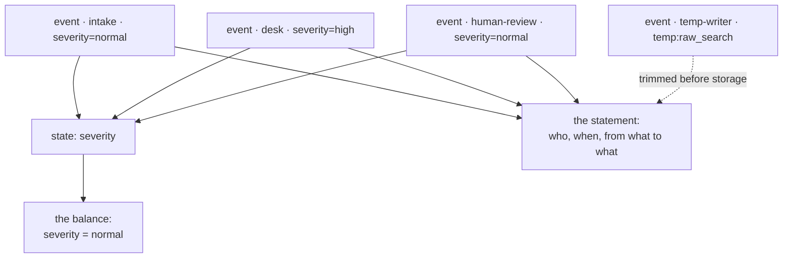

# 7.3 — State as a trace

## One-line answer

Because every state change rides inside an event, the history answers a question the state cannot:
**who set this, when, and what was it before** — and that is the whole payoff for the ceremony of
writing through events.

## The story

The balance and the statement.

The balance is one number and it is the number you check. It tells you what you can spend and nothing
else, and most days it is all anybody wants.

The statement is the other page: every line, dated, with a description. Nobody reads it for pleasure.
You read it on the day the balance is wrong — when it is a hundred less than you expected — and then
the balance is useless, because it cannot tell you which of the last thirty things is the one you did
not recognise. The statement can, in about a minute.

A bank that only kept the balance would be cheaper to run and impossible to trust.

## The idea in plain language

Section 3's three write paths all end the same way: an event, carrying a delta, appended to the
session. That is the ceremony, and this part is what it bought.

Each event carries:

- **`author`** — who made the change: an agent's name, or whatever a script called itself
  ([3.3](../03-three-safe-writes/3.3-writing-from-outside-a-run.md));
- **`timestamp`** — when;
- **`actions.state_delta`** — exactly which keys changed, and to what;
- **`invocation_id`** — which turn it belonged to
  ([2.2](../02-four-lifetimes/2.2-an-invocation-is-not-a-session.md)).

So the history is a statement and the state is a balance. Walking the events and collecting every
delta that mentions one key reconstructs that key's whole life in a few lines of Python, with no extra
logging, no database and nothing you had to remember to instrument. That is Principle 12 — everything
is a trace — arriving as a property of the design rather than as a feature somebody added.

Two limits, both worth knowing before you rely on it:

- **`temp:` keys are not in it.** They are trimmed from the delta before the event is stored
  ([2.4](../02-four-lifetimes/2.4-why-temp-exists.md)), so the audit trail has nothing to say about
  them. That is a feature for size and a gap for forensics, and the way to have both is to write a
  small *summary* of the intermediate to ordinary state if you will ever need to explain it.
- **The direct write is not in it either.** Which is the deepest reason
  [6.1](../06-failure-lab/6.1-the-write-that-was-never-written.md) is a failure lab rather than a style
  preference: it loses the value *and* the record that anybody tried.

## Why Sutra needs it

Because Sutra's whole reason for existing is a support desk, and support desks get asked *"why did you
say that?"* about decisions made weeks ago.

The concrete version: a ticket was escalated, a customer complains, and somebody has to say what the
severity was, when it changed and what changed it. In a system that stores decisions in prose that is
an afternoon of reading. In a system that stores them in state, with the writes carried by events, it
is a loop over `session.events`.

It matters again in three named places. Day 22 builds structured logging — and the deltas are already
the interesting half of what to log. Day 62 adds human approval, whose entire value is an auditable
record of who approved what. And Day 84 builds tracing, where the `invocation_id` on every event is the
key that joins a state change to the model call that caused it.

## The mechanism

Four writes by four different authors, and then the life of one key reconstructed from the history:

```python
# days/day-17-state-scopes-and-lifetimes/lab/who_changed_it.py
"""Reconstructing the life of one state key from the history. Zero model calls."""

import asyncio
from datetime import datetime, timezone

from google.adk.events import Event, EventActions
from google.adk.sessions import InMemorySessionService

APP, USER = "sutra", "engineer_a"


async def write(service, session, author: str, delta: dict) -> None:
    await service.append_event(
        session=session,
        event=Event(author=author, actions=EventActions(state_delta=delta)),
    )


def history_of(session, key: str) -> list[tuple[str, str, object]]:
    """Every change to one key: when, by whom, to what."""
    out = []
    for event in session.events:
        delta = event.actions.state_delta if event.actions else None
        if delta and key in delta:
            when = datetime.fromtimestamp(event.timestamp, tz=timezone.utc).isoformat(
                timespec="seconds"
            )
            out.append((when, event.author, delta[key]))
    return out


async def main() -> None:
    service = InMemorySessionService()
    session = await service.create_session(app_name=APP, user_id=USER)

    await write(service, session, "intake", {"severity": "normal", "ticket_id": 4521})
    await write(service, session, "desk", {"severity": "high"})
    await write(service, session, "temp-writer", {"temp:raw_search": "a blob"})
    await write(service, session, "human-review", {"severity": "normal"})

    stored = await service.get_session(app_name=APP, user_id=USER, session_id=session.id)
    print("severity now:", stored.state["severity"])
    print()
    print("how it got there:")
    for when, author, value in history_of(stored, "severity"):
        print(f"  {when}  {author:14} -> {value}")
    print()
    print("history of the temp key:", history_of(stored, "temp:raw_search"))


asyncio.run(main())
```

**Line by line:**

- `history_of(session, key)` is the whole idea, in nine lines. There is no ADK helper for this and none
  is needed: the data is already in the right shape.
- `event.actions.state_delta if event.actions else None` — most events have no actions at all, so the
  guard comes before the lookup.
- `datetime.fromtimestamp(event.timestamp, tz=timezone.utc)` — the event's timestamp is a Unix float;
  rendering it in UTC with `isoformat` is what makes two entries comparable across machines.
- Four writes with four different authors, one of which is a **correction** — `human-review` setting
  the severity back — because a history is only interesting when something changed twice.
- The `temp-writer` line exists to make the last print meaningful: it writes a `temp:` key that will be
  absent from the record.
- `history_of(stored, "temp:raw_search")` at the end — the limit, printed rather than asserted in
  prose.

```bash
cd days/day-17-state-scopes-and-lifetimes/lab
uv run python who_changed_it.py
```

**Line by line:**

- No model, no network. The audit trail is a property of how the writes were made.

Measured on `google-adk` 2.7.1 on 2026-09-03:

```text
severity now: normal

how it got there:
  2026-09-03T08:41:36+00:00  intake         -> normal
  2026-09-03T08:41:36+00:00  desk           -> high
  2026-09-03T08:41:36+00:00  human-review   -> normal

history of the temp key: []
```

The state says `normal`. The history says it was `normal` at intake, the desk raised it to `high`, and
a human review put it back — which is a completely different story from *"the severity is normal"*, and
the only one that answers a complaint.

The three timestamps are identical because the four writes happen in the same instant in a script; in a
real conversation they are minutes or days apart, and the gaps are usually the interesting part.

And the last line is the limit: the `temp:` key has no history at all, because it never reached
storage.



## When it breaks

**Every author is `"user"` and the trail says nothing.**

No error, and the whole value gone. It happens when out-of-band writes copy an example that used the
default author ([3.3](../03-three-safe-writes/3.3-writing-from-outside-a-run.md)). The trail is still
complete in the sense that every change is there; it just cannot answer *who*, which is the question
that gets asked.

**`AttributeError: 'NoneType' object has no attribute 'state_delta'`**

Reaching into `event.actions` on an event that has none. Most events in a real session are content
without actions, so this is the first exception anybody writing history code meets.

**The value changed and nothing in the history explains it.** Two causes, both covered today: a `temp:`
write, which is invisible by design, or a direct assignment to a session object, which is invisible by
accident ([6.1](../06-failure-lab/6.1-the-write-that-was-never-written.md)). If a key's history does not
account for its current value, one of those two happened.

## In production

**Query the history rather than adding a second log.**

The version a professional writes turns `history_of` into a small module — the life of a key, the
changes in one invocation, the keys one author touched — and uses it in support tooling and in tests.
The alternative, which teams reach for by default, is to log every state change separately as it is
made, producing a second record that can disagree with the first and that nobody maintains.

**What changes at scale** is that the history becomes the expensive part of the session. Events
accumulate for as long as a conversation does, and the audit trail you want for a complaint is the
same data that makes a long session slow to load. That is Day 20's compaction problem — summarising
old events — and the thing to protect when you get there is exactly this: keep the deltas, or accept
that you have lost the ability to answer *when did this change*.

**What fails only under real traffic** is the assumption of one writer. A key written by three
components has a history that reads as a conversation between them, and the sequence often reveals a
loop nobody designed — a value being set, corrected and set again inside one invocation. That is worth
looking for on purpose the first time a system feels "unstable"; the history usually shows it directly.

**The review comment**: *"we log this state change separately. The event already carries it with an
author and a timestamp — read the history instead of writing a second record that can drift."*

**The interview question**: *"how would you find out when an agent's decision changed and what changed
it?"* The answer that shows the design has paid off: *"state changes ride inside events, so the session
history is already an audit log — author, timestamp, and the exact delta. You walk the events for that
key. The gap to know about is scratch state, which is deliberately not recorded."*

## Check yourself

```bash
cd days/day-17-state-scopes-and-lifetimes/lab
uv run python who_changed_it.py
```

Then change the last write's author to `"user"` and read the trail again as if you were investigating a
complaint.

**Out loud, without scrolling up:** say what the session history can tell you that `session.state`
cannot, and name the two kinds of write that leave no trace in it.
