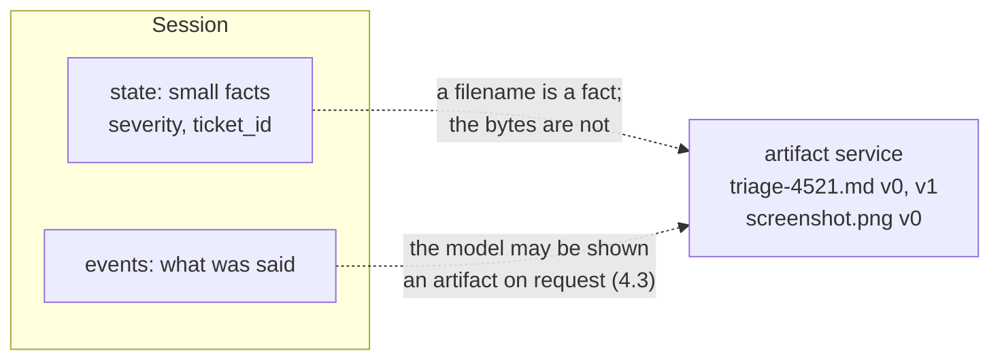

# 1.1 — The thing state cannot hold

## One-line answer

An **artifact** is a named, versioned blob of bytes kept beside the conversation — a screenshot, an
attached log, a generated report — because state is for small serializable facts and bytes are neither
small nor facts.

## The story

The parcel counter at the post office.

Two things happen there and they are not the same thing. You write the address on the label: a
postcode, a house number, a phone number for the courier. Small, structured, and it goes on the
outside where every machine and every person in the chain can read it without opening anything.

And then there is the parcel. Nobody writes the parcel on the label. It goes in the sack, then the
cage, then the van, and the only thing that connects it to you is a tracking number printed on your
receipt — a small structured fact, pointing at a large unstructured thing.

Nobody has ever suggested writing the contents of the parcel on the label, and nobody has ever
suggested putting the address inside the box.

## The idea in plain language

[Day 17](../../../day-17-state-scopes-and-lifetimes/LESSON.md) gave Sutra session state: a small
dictionary beside the conversation, holding facts your code branches on. It also drew a line —
values must be **serializable**, and they must be **small**, because state travels with every read and
write of the session
([17.1.2](../../../day-17-state-scopes-and-lifetimes/parts/01-form-not-story/1.2-what-may-live-in-state.md)).

Real support work walks straight into that line. A customer attaches a log file. An engineer pastes a
screenshot. The desk generates a triage note somebody wants to keep. Those are bytes: hundreds of
kilobytes, not JSON, and not something any later step wants to load on every turn.

**Artifacts** are the other store. An artifact is:

- **bytes with a MIME type** — the payload, plus what kind of thing it is;
- **named** — `triage-4521.md`, `screenshot.png`;
- **versioned** — saving the same name again creates version 1, and version 0 is still there
  ([2.1](../02-versions/2.1-every-save-is-a-new-version.md));
- **scoped** — to a session by default, or to the user for the whole app
  ([3.1](../03-two-scopes/3.1-the-user-filename.md));
- **served by a separate service** — the artifact service is wired onto the runner next to the session
  service, and if it is missing, saving raises ([1.3](1.3-a-separate-wire.md)).

So the division of labour across Sutra's three stores is now complete, and it is worth memorising as a
sentence: **the transcript holds what was said, state holds small facts about it, and artifacts hold
the files.** Each one has a different reader, a different cost and a different lifetime.

| | Transcript | State | Artifacts |
| --- | --- | --- | --- |
| Holds | prose, in order | keys and values | bytes with a MIME type |
| Read by | the model | your code | whoever asks for the file |
| Size | grows with the conversation | must stay small | large is normal |
| Loaded | on every turn | on every turn | only when asked for |

The last row is the one that decides most design arguments. State is on the critical path of every
turn; artifacts are not. That is the whole reason for the second store.

## Why Sutra needs it

Because the tickets Sutra exists to triage come with attachments, and the notes it produces are things
people want to keep.

The immediate case is today's build: the desk generates a triage note, and it should be a file the
engineer can download rather than a paragraph they have to copy out of a chat window. That file is
bytes, it wants a name, and the next version of it should not destroy the first — which is a
one-sentence description of an artifact.

The nearer-term case is Day 20's compaction. When a conversation gets long enough to summarise, the
thing you summarise away has to go somewhere you can still get at it. And the further one is Phase 8:
a graph where a research node produces a document and a writer node consumes it needs a place to put
the document that is not the prompt.

## The mechanism

The smallest possible artifact, saved and read back, with no agent in sight:

```python
# days/day-18-artifacts-that-survive/lab/first_artifact.py
"""One artifact: bytes in, bytes out. Zero model calls."""

import asyncio

from google.adk.artifacts import InMemoryArtifactService
from google.genai import types

APP, USER, SESSION = "sutra", "engineer_a", "s1"

NOTE = "# Triage 4521\nseverity: high\nlogins failing for a whole team\n"


async def main() -> None:
    service = InMemoryArtifactService()

    part = types.Part(inline_data=types.Blob(data=NOTE.encode("utf-8"), mime_type="text/markdown"))
    version = await service.save_artifact(
        app_name=APP, user_id=USER, session_id=SESSION, filename="triage-4521.md", artifact=part
    )
    print("saved as version:", version)

    back = await service.load_artifact(
        app_name=APP, user_id=USER, session_id=SESSION, filename="triage-4521.md"
    )
    print("mime type       :", back.inline_data.mime_type)
    print("bytes           :", back.inline_data.data[:22], "...")
    print(
        "filenames here  :",
        await service.list_artifact_keys(app_name=APP, user_id=USER, session_id=SESSION),
    )


asyncio.run(main())
```

**Line by line:**

- `InMemoryArtifactService()` — the development service: a dictionary in this process, the artifact
  equivalent of `InMemorySessionService`. Two others ship with ADK, and
  [1.3](1.3-a-separate-wire.md) covers which to use when.
- `types.Part(inline_data=types.Blob(...))` — the payload type, and the subject of
  [1.2](1.2-a-part-not-a-file.md). An artifact is not a `bytes` and not a path; it is a `Part`, the
  same class the model's own content is made of.
- `NOTE.encode("utf-8")` — bytes, explicitly. The service stores bytes and does not guess an encoding
  for you.
- `mime_type="text/markdown"` — required in practice, because it is the only thing that tells a reader
  what these bytes are ([1.2](1.2-a-part-not-a-file.md) measures what happens without it).
- `save_artifact(app_name=..., user_id=..., session_id=..., filename=..., artifact=...)` — all
  keyword-only, and the four coordinates are what an artifact is addressed by: an app, a user, a
  session and a name.
- `print("saved as version:", version)` — `save_artifact` **returns an integer**, which is the first
  surprise of the day and the whole of section 2.
- `load_artifact(...)` with no `version` — the latest. Passing `version=0` fetches the first.
- `list_artifact_keys(...)` — the filenames visible from this session, which is how a tool finds out
  what exists.

```bash
cd days/day-18-artifacts-that-survive/lab
uv run python first_artifact.py
```

**Line by line:**

- No key, no network, no model. Artifacts are a store; nothing about them requires a model.

Measured on `google-adk` 2.7.1 on 2026-09-03:

```text
saved as version: 0
mime type       : text/markdown
bytes           : b'# Triage 4521\nseverity' ...
filenames here  : ['triage-4521.md']
```

Version zero, the bytes back exactly as they went in, and a filename that can be listed. That is the
whole store, and everything else today is a property of it.



## When it breaks

**The file goes into a state key, and the day of reckoning is Day 47.**

```text
TypeError: Object of type bytes is not JSON serializable
```

Measured in
[17.1.2](../../../day-17-state-scopes-and-lifetimes/parts/01-form-not-story/1.2-what-may-live-in-state.md)
for other unserializable values, and bytes behave the same way. The in-memory session service accepts
them today; a database-backed one cannot. The base64 variant is worse, because it *does* serialize:
the session then carries a megabyte of text on every turn for ever, and nothing raises.

**The artifact goes into the prompt.** No error either. Reading a 200-kilobyte log and putting its
whole text into the model's context is possible, expensive, and usually wrong — Day 19 and Day 20 are
about exactly what earns a place in that window. Artifacts exist so that bytes can be *addressed*
without being *carried*.

**The filename collides.** Two tools both saving `report.md` are saving versions of the same artifact,
because the filename is the identity ([2.1](../02-versions/2.1-every-save-is-a-new-version.md)). That
is either a feature or a silent overwrite-that-is-not-quite-an-overwrite, depending on whether you
meant it.

## In production

**Put the bytes in the artifact store and the *name* in state.**

The rule that makes the two stores work together: when a tool saves an artifact, it also writes the
filename — and often the version — into session state, so a later step can find it without listing
anything. The state key is small and structured; the file is neither. That is the tracking number on
the receipt.

**What changes at scale** is that the artifact store becomes a real storage system with a bill and a
retention policy. Files are large, versions accumulate
([2.3](../02-versions/2.3-nothing-is-overwritten.md)), and the in-memory service that is perfect today
loses everything when the process stops. Choosing a service is therefore an operational decision, not
a development convenience — which is [1.3](1.3-a-separate-wire.md)'s subject and
[6.3](../06-in-production/6.3-surviving-a-restart.md)'s.

**What fails only under real traffic** is user-supplied content. Every artifact that arrives from
outside is a file somebody else chose: its size, its type and its name are all attacker-influenced.
The name in particular ends up in paths on disk
([3.2](../03-two-scopes/3.2-where-it-actually-lives.md)), and "the filename is the identity" is a
sentence with sharp edges once the filename comes from a ticket.

**The review comment**: *"this base64-encodes the attachment into state. It is bytes — save it as an
artifact and keep the filename in state."*

**The interview question**: *"where does an agent keep a file a user uploaded?"* The answer that shows
you have built one: *"not in state — state is small structured facts on the critical path of every
turn. Files go in an artifact service, versioned and named, and state holds the name."*

## Check yourself

```bash
cd days/day-18-artifacts-that-survive/lab
uv run python first_artifact.py
```

Four lines, and the first one is an integer you did not ask for.

**Out loud, without scrolling up:** name Sutra's three stores, say who reads each one, and give one
thing that belongs in each.
