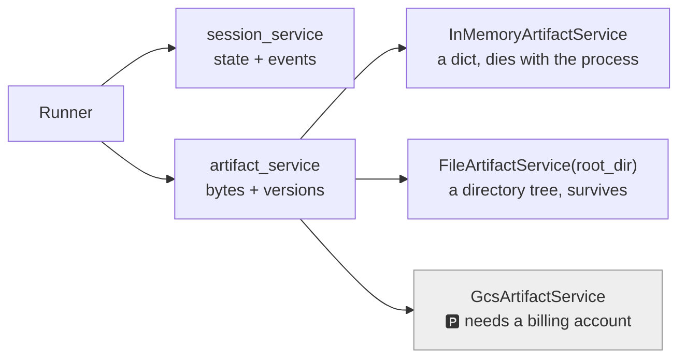

# 1.3 — A separate wire

## One-line answer

Artifacts come from their own service, wired onto the runner beside the session service — and if you
do not wire one, saving raises `ValueError: Artifact service is not initialized.` at the moment a tool
tries.

## The story

The printer nobody plugged into the network.

It is a good printer. It is on, the screen says ready, there is paper in it, and it is four steps from
your desk. You press print, the dialog closes, and you walk over to an empty tray.

Nothing on your machine said anything. The print went to a queue for a printer your laptop believes
exists, and the physical thing in the corridor has never been told about it. Both halves are working
perfectly and there is no wire between them.

Somebody eventually finds twenty copies of your document when the printer is finally connected, which
is its own kind of embarrassing.

## The idea in plain language

[Day 8](../../../day-08-sessions-and-services/LESSON.md) established the shape: a `Runner` is given
**services**, and each service owns one kind of storage. Session state comes from a session service.
Artifacts come from an **artifact service**, and it is a separate argument:

```
Runner(
    app_name="sutra",
    agent=agent,
    session_service=InMemorySessionService(),
    artifact_service=InMemoryArtifactService(),
)
```

Leave the second one out and everything still constructs. Agents build, runs run, tools are called —
until a tool calls `save_artifact`, at which point the context raises, because
`self._invocation_context.artifact_service is None`.

`google-adk` 2.7.1 ships three implementations of `BaseArtifactService`, and choosing between them is
an operational decision rather than a stylistic one:

| Service | Where the bytes go | Survives a restart | Sutra's use |
| --- | --- | --- | --- |
| `InMemoryArtifactService` | a dictionary in this process | no | every lab script today, and the tests |
| `FileArtifactService(root_dir=...)` | a directory tree on disk | **yes** | [6.3](../06-in-production/6.3-surviving-a-restart.md), and Phase 3's gate |
| `GcsArtifactService` | a Google Cloud Storage bucket | yes | 🅿️ **parked** — it needs a billing account (Addendum 02) |

The middle row is the one to notice, because it did not exist in the version of this framework most
tutorials were written against. A local filesystem service means Sutra can have **durable artifacts at
zero cost**, which is exactly the sort of thing Addendum 02 exists to look for: the cloud option is
parked, and the capability is not.

The interface is the same across all three — `save_artifact`, `load_artifact`, `list_artifact_keys`,
`list_versions`, `delete_artifact` — so swapping is a one-line change at the runner, and everything in
this day is true of whichever one you wire.

## Why Sutra needs it

Because Phase 3's gate is *state survives restarts*, and half of what Sutra will want to survive is
files.

The practical version arrives on Day 47, when the session service becomes persistent. If artifacts are
still in memory at that point, a restart leaves you with a conversation that remembers a note it can no
longer produce — the state says `note: "triage-4521.md"` and the store is empty. The two services have
to be chosen together, and knowing today that a free, local, durable option exists is what makes that
possible.

There is a nearer reason too: the missing wire is one of the day's two silent-failure shapes
([5.1](../05-failure-lab/5.1-the-artifact-with-no-service.md)), and you cannot recognise it without
knowing the wire exists.

## The mechanism

Two runners, identical except for one argument, and a tool that tries to save:

```python
# days/day-18-artifacts-that-survive/lab/the_wire.py
"""The artifact service is a separate wire on the runner. Zero model calls."""

from google.adk.agents import Agent
from google.adk.artifacts import InMemoryArtifactService
from google.adk.runners import Runner
from google.adk.sessions import InMemorySessionService
from google.adk.tools import ToolContext
from google.genai import types
from scripted import ScriptedModel, call, text

NOTE = b"# Triage 4521\nseverity: high\n"


async def save_note(tool_context: ToolContext) -> dict:
    """Write the triage note as a file the engineer can download."""
    part = types.Part(inline_data=types.Blob(data=NOTE, mime_type="text/markdown"))
    version = await tool_context.save_artifact("triage-4521.md", part)
    return {"saved": "triage-4521.md", "version": version}


agent = Agent(
    name="desk",
    model=ScriptedModel(model="scripted", replies=[[call("save_note")], [text("saved")]]),
    tools=[save_note],
)


def run(with_service: bool) -> None:
    runner = Runner(
        app_name="sutra",
        agent=agent,
        session_service=InMemorySessionService(),
        artifact_service=InMemoryArtifactService() if with_service else None,
    )
    session = runner.session_service.create_session_sync(app_name="sutra", user_id="u1")
    agent.model.calls = 0
    print(f"--- artifact_service configured: {with_service} ---")
    for event in runner.run(
        user_id="u1",
        session_id=session.id,
        new_message=types.Content(role="user", parts=[types.Part(text="go")]),
    ):
        if event.actions and event.actions.artifact_delta:
            print("artifact_delta:", event.actions.artifact_delta)
        for part in (event.content.parts if event.content else []) or []:
            if part.function_response is not None:
                print("tool said     :", part.function_response.response)


run(True)
run(False)
```

**Line by line:**

- `async def save_note(...)` — an **async** tool, because `tool_context.save_artifact` is a coroutine.
  ADK supports async tools directly; a synchronous tool cannot save an artifact without ceremony.
- `await tool_context.save_artifact("triage-4521.md", part)` — the context-level API:
  filename and payload, no app or user or session, because the context already knows all three.
- `artifact_service=InMemoryArtifactService() if with_service else None` — the whole experiment. `None`
  is also the default, so the second run is what you get by forgetting the argument.
- `agent.model.calls = 0` — resetting the scripted double between runs, because it walks its reply list
  by index.
- `event.actions.artifact_delta` — the artifact equivalent of Day 17's `state_delta`. Saving an
  artifact records `{filename: version}` on the event, so the history knows a file was produced
  ([4.1](../04-in-the-run/4.1-saving-from-a-tool.md)).
- The two calls at the bottom run the same agent twice, so the difference in output is attributable to
  one argument.

```bash
cd days/day-18-artifacts-that-survive/lab
uv run python the_wire.py
```

**Line by line:**

- The scripted model means no requests. The failure being demonstrated is structural, not a model
  behaviour.

Measured on `google-adk` 2.7.1 on 2026-09-03 (standard output only; the second run's traceback goes to
the log):

```text
--- artifact_service configured: True ---
artifact_delta: {'triage-4521.md': 0}
tool said     : {'saved': 'triage-4521.md', 'version': 0}
--- artifact_service configured: False ---
```

The second block is empty. Not an error at your call site, not a tool result saying it failed —
nothing. The run finished, the loop completed, and the traceback naming
`ValueError: Artifact service is not initialized.` went to the framework's logging, wrapped in a
`DynamicNodeFailError`. That is [5.1](../05-failure-lab/5.1-the-artifact-with-no-service.md), and it is
the third time this phase has met that shape.



## When it breaks

**`ValueError: Artifact service is not initialized.`**

The exact message, raised from `context.save_artifact` and `context.load_artifact` alike. Read where it
comes from: the context checks `self._invocation_context.artifact_service is None` before doing
anything. It is a good, specific error — and in a run it does not reach your code, which is what makes
it dangerous rather than annoying.

**The service is wired and the artifacts still vanish.** No error. `InMemoryArtifactService` is a
dictionary in the process, so a restart empties it, and so does a second process: two workers behind a
load balancer each have their own, and an artifact saved by one is missing from the other. That is not
a bug in the service; it is the service doing exactly what its name says, chosen for a job it was not
meant for.

**Two services, one runner, different lifetimes.** The subtler mismatch, and it is worth checking for
on day one of any deployment: a persistent session service with an in-memory artifact service produces
sessions that remember filenames of files that no longer exist. Choose both together
([6.3](../06-in-production/6.3-surviving-a-restart.md)).

## In production

**Pick the artifact service where you pick the session service, and never in a tool.**

The version a professional writes constructs both services in one place — the application's composition
root — and passes them to the runner. Nothing deeper in the system knows which implementation it is
using, which is what makes the choice reviewable and the swap a one-line change.

**What changes at scale** is that this becomes a storage decision with a bill, a region and a retention
policy attached. The interface hides the difference, and the differences that matter — durability,
concurrency, cost per gigabyte, how deletion actually works — are all on the other side of it. A team
that has only ever run the in-memory service has not yet made any of those decisions.

**What fails only under real traffic** is concurrency. Two invocations saving the same filename at the
same moment both read the current version count and both write; whether you end up with two versions or
one depends on the implementation. Where that matters, make the filename unique per producer rather
than relying on the store to arbitrate.

**The review comment**: *"the runner has a session service and no artifact service. The first tool that
saves a file will fail into a background thread — wire one, even in tests."*

**The interview question**: *"how does an agent framework store files?"* The answer that shows you have
wired one: *"a separate service on the runner, with the same interface over memory, a local directory
or cloud storage — and if it is missing, the failure is a `ValueError` raised inside the run rather
than at your call site."*

## Check yourself

```bash
cd days/day-18-artifacts-that-survive/lab
uv run python the_wire.py
```

Two runs, one argument of difference, and one of them prints nothing at all.

**Out loud, without scrolling up:** name the three artifact services ADK ships, say which one Sutra
uses for durability and why the cloud one is parked.
