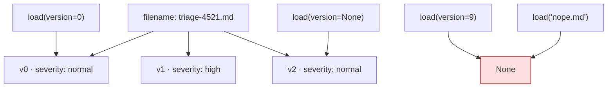

# 2.1 — Every save is a new version

## One-line answer

Saving the same filename again does not replace anything: it appends version 1 beside version 0 and
returns the new number, so an artifact is a **list of versions under a name** rather than a file you
can overwrite.

## The story

`report-final-v2-FINAL-actually-final.docx`.

Everybody has a folder like this. The versions exist because you needed the old one — the day somebody
asked what the original figure was, or the day the new draft turned out worse than the one before it —
and they are named the way they are because the filesystem does not have a concept of "the same
document, later".

So you invented one. Badly, in the filename, with a convention nobody else can read and that sorts
wrongly. And you kept doing it, because the alternative — one file, overwritten — is the version where
the question *"what did it say last week?"* has no answer at all.

## The idea in plain language

An artifact is not a file that a save replaces. It is a **name with a list of versions behind it**.

`save_artifact` returns an integer: `0` the first time, then `1`, then `2`. The base service's own
docstring says it plainly — *"The revision ID. The first version of the artifact has a revision ID of
0. This is incremented by 1 after each successful save."*

Reading follows from that:

- `load_artifact(filename)` with no version gives you the **latest**;
- `load_artifact(filename, version=0)` gives you the first;
- `list_versions(filename)` gives you every number on record;
- `list_artifact_keys()` gives you the **filenames**, not the versions — one entry per name, however
  many versions it has.

And two behaviours that are easy to assume wrongly, both measured below: asking for a version that does
not exist returns `None` rather than raising, and asking for a file that does not exist also returns
`None`. Those two very different situations are the same value, which is why
[1.2](../01-not-a-state-key/1.2-a-part-not-a-file.md)'s `AttributeError` is the commonest artifact
error in practice.

The versioning is not a feature you switch on. There is no `overwrite=True`. If you want an artifact to
have one version, you have to delete it and save again
([2.3](2.3-nothing-is-overwritten.md) measures what that does to the numbering).

## Why Sutra needs it

Because a triage note is exactly the kind of document that gets revised, and the revision is the
interesting part.

The concrete case: the desk writes `triage-4521.md` saying severity normal. Two turns later the
engineer supplies more detail and the desk rewrites it as high. Both of those are the truth at
different moments, and the pair is what somebody wants to see when they ask why the ticket was
escalated. This is the artifact equivalent of Day 17's audit trail
([17.7.3](../../../day-17-state-scopes-and-lifetimes/parts/07-in-production/7.3-state-as-a-trace.md)) —
state records that the severity changed, and the artifact store records what the document said each
time.

It matters again on Day 62, when a human approves an action. *"Approved"* has to mean *"approved this
version"*, and a store where saving overwrites cannot express that.

## The mechanism

Three saves of one filename, and then every way of reading them back:

```python
# days/day-18-artifacts-that-survive/lab/versions.py
"""Saving the same filename again does not replace anything. Zero model calls."""

import asyncio

from google.adk.artifacts import InMemoryArtifactService
from google.genai import types

APP, USER, SESSION = "sutra", "engineer_a", "s1"


def note(body: str) -> types.Part:
    return types.Part(inline_data=types.Blob(data=body.encode(), mime_type="text/markdown"))


async def main() -> None:
    service = InMemoryArtifactService()

    for body in ("severity: normal\n", "severity: high\n", "severity: normal\n"):
        version = await service.save_artifact(
            app_name=APP,
            user_id=USER,
            session_id=SESSION,
            filename="triage-4521.md",
            artifact=note(body),
        )
        print(f"saved {body.strip():18} -> version {version}")

    print(
        "versions on record :",
        await service.list_versions(
            app_name=APP, user_id=USER, session_id=SESSION, filename="triage-4521.md"
        ),
    )

    latest = await service.load_artifact(
        app_name=APP, user_id=USER, session_id=SESSION, filename="triage-4521.md"
    )
    first = await service.load_artifact(
        app_name=APP, user_id=USER, session_id=SESSION, filename="triage-4521.md", version=0
    )
    print("load(version=None) :", latest.inline_data.data)
    print("load(version=0)    :", first.inline_data.data)
    print(
        "load(version=9)    :",
        await service.load_artifact(
            app_name=APP, user_id=USER, session_id=SESSION, filename="triage-4521.md", version=9
        ),
    )
    print(
        "load(missing file) :",
        await service.load_artifact(
            app_name=APP, user_id=USER, session_id=SESSION, filename="nope.md"
        ),
    )
    print(
        "filenames          :",
        await service.list_artifact_keys(app_name=APP, user_id=USER, session_id=SESSION),
    )


asyncio.run(main())
```

**Line by line:**

- `def note(body)` — one helper so the three saves differ only in their text.
- The loop saves **the same filename** three times with three different bodies, printing the returned
  integer each time. That integer is the whole point of the part.
- The third body repeats the first (`severity: normal`), so the store now holds two identical versions
  with different numbers — which is correct, and is what a store that records history rather than state
  looks like.
- `list_versions(...)` — a service-level method, not on the context. Tools cannot call it directly,
  which is a real gap and one reason a filename is usually paired with a version in state.
- `load_artifact(..., version=9)` — deliberately out of range, to show what a missing version returns
  rather than what it raises.
- `load_artifact(..., filename="nope.md")` — a missing file, for the same reason. Compare the two
  results carefully.
- `list_artifact_keys(...)` last — one entry, not three, because it lists names.

```bash
cd days/day-18-artifacts-that-survive/lab
uv run python versions.py
```

**Line by line:**

- No model, no key, no network.

Measured on `google-adk` 2.7.1 on 2026-09-03:

```text
saved severity: normal   -> version 0
saved severity: high     -> version 1
saved severity: normal   -> version 2
versions on record : [0, 1, 2]
load(version=None) : b'severity: normal\n'
load(version=0)    : b'severity: normal\n'
load(version=9)    : None
load(missing file) : None
filenames          : ['triage-4521.md']
```

Three saves, three numbers, and nothing lost. The two `None`s are the finding: **a missing version and
a missing file are indistinguishable**, so code that loads an artifact has one branch for "not there"
and no way to know which kind of "not there" it met.



## When it breaks

**`AttributeError: 'NoneType' object has no attribute 'inline_data'`**

The consequence of the two `None`s above, and the error you will actually meet. The fix is a guard, and
the guard should say which case it is handling, because the two mean different things to a user: *"that
version does not exist"* is a bug in your code, and *"that file does not exist"* is often a bug in
somebody's expectations.

**You expected an overwrite and got a version.** No error, and it is a storage-cost surprise rather
than a correctness one — until you notice that a tool called on a loop has produced four hundred
versions of the same note. [2.3](2.3-nothing-is-overwritten.md) is that story.

**Two writers, one filename.** Two tools that both save `report.md` are appending versions to the same
artifact, with no warning that they are different documents. The store cannot tell; the filename is the
identity. If two producers can be active at once, put the producer in the name.

## In production

**Pair the filename with the version, and store the pair.**

The version a professional writes captures the integer that `save_artifact` returns and puts it in
session state beside the filename
([17.1.1](../../../day-17-state-scopes-and-lifetimes/parts/01-form-not-story/1.1-the-transcript-is-not-a-database.md)),
because *"the note"* is ambiguous the moment there are two of them. A later step that loads
`(filename, version)` is reading the document that was actually approved, not whatever the newest one
happens to be.

**What changes at scale** is that version numbers are per-artifact and per-scope, not global. There is
no ordering across two filenames, and — as [2.3](2.3-nothing-is-overwritten.md) measures — a delete
resets the numbering, so a version number is only meaningful next to the name and the moment it came
from. Nobody should be storing "version 3" on its own.

**What fails only under real traffic** is retention. A store that never overwrites is a store that only
grows, and the artifacts most likely to be saved repeatedly — a running note, a regenerated report —
are exactly the ones whose old versions are least interesting. That is a policy decision, and the store
will not make it for you.

**The review comment**: *"this saves the note on every turn. That is one version per turn for the life
of the conversation — is that what we want to keep?"*

**The interview question**: *"what happens when you save an artifact twice under the same name?"* The
answer that shows you have used it: *"you get a second version, not a replacement — `save` returns the
new number, `load` without a version gives the newest, and there is no overwrite. Which also means an
artifact's storage grows unless something deletes."*

## Check yourself

```bash
cd days/day-18-artifacts-that-survive/lab
uv run python versions.py
```

Compare the last two `None` lines and say what your code would have to do differently for each.

**Out loud, without scrolling up:** say what `save_artifact` returns and why, and name the two very
different situations that both come back as `None`.
