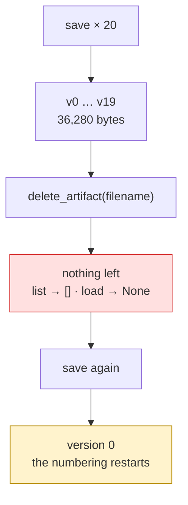

# 2.3 — Nothing is overwritten

## One-line answer

A store that never replaces anything only grows: twenty saves of one modest note hold twenty copies,
`delete_artifact` removes **every** version at once rather than the newest, and a save after a delete
starts again at version 0.

## The story

The loft.

Nothing goes up there because it is needed. It goes up because there is room and because deciding is
harder than climbing a ladder. The cot went up when the youngest outgrew it, then the boxes from the
old flat, then the exercise bike, then the box of cables for devices nobody in the house owns any more.

The system works beautifully for about eight years. It fails on the day you need one specific thing
that is definitely up there — you know it is, you can picture it — and finding it means moving
everything that arrived after it.

Nobody decided to fill the loft. Every single decision was *"this can go up there for now"*, and all of
them were reasonable.

## The idea in plain language

[2.1](2.1-every-save-is-a-new-version.md) established that saving never replaces. This part is the
consequence, and it has three parts.

**Storage is the sum of every version.** There is no compression, no diffing and no deduplication: two
identical saves are two copies. An agent that regenerates a document on each turn produces one version
per turn, for ever.

**`delete_artifact` is all-or-nothing.** The method takes a filename and no version, and it removes the
artifact entirely — every version, including the ones you wanted. There is no "delete old versions"
call in `google-adk` 2.7.1; if you need one, you write it, and the pieces are `list_versions` plus a
store-specific delete.

**Version numbers restart after a delete.** Delete an artifact that had reached version 19, save again,
and the new version is **0**. So a version number is only meaningful next to its filename *and* the
period it came from — which is why a stored reference to "version 3" with no other context is a
reference to nothing in particular.

Together those say something simple: **the store keeps what you give it and forgets nothing, so
deciding what to keep is your job and it has to be a decision you make when you write.**

## Why Sutra needs it

Because the natural shape of a Sutra tool is *"save the note"*, and the natural shape of a conversation
is many turns.

Concretely: a desk that rewrites `triage-4521.md` after each new piece of information produces a version
per exchange. On a twenty-turn ticket that is twenty copies of a document whose first nineteen versions
nobody will ever read, sitting in the store for as long as the store keeps anything. The measurement
below is exactly that case, and the number is not enormous — which is the point, because it is per
ticket and Sutra is meant to handle a lot of tickets.

It matters again at Day 47 and Day 86. The moment artifacts are on a disk or in a bucket, this is a
line on a bill and a directory that grows, and the policy that prevents it has to have existed before
the growth did.

## The mechanism

Twenty saves, a delete, and a save afterwards:

```python
# days/day-18-artifacts-that-survive/lab/the_loft.py
"""What a store that never overwrites costs, and what delete does. Zero model calls."""

import asyncio

from google.adk.artifacts import InMemoryArtifactService
from google.genai import types

APP, USER, SESSION = "sutra", "engineer_a", "s1"
NOTE = ("# Triage 4521\n" + "a paragraph of ticket detail. " * 60).encode()
TURNS = 20


async def main() -> None:
    service = InMemoryArtifactService()

    for _ in range(TURNS):
        await service.save_artifact(
            app_name=APP,
            user_id=USER,
            session_id=SESSION,
            filename="triage-4521.md",
            artifact=types.Part(inline_data=types.Blob(data=NOTE, mime_type="text/markdown")),
        )

    versions = await service.list_versions(
        app_name=APP, user_id=USER, session_id=SESSION, filename="triage-4521.md"
    )
    print(f"one note                : {len(NOTE)} bytes")
    print(
        f"after {TURNS} saves         : {len(versions)} versions, "
        f"{len(NOTE) * len(versions)} bytes held"
    )
    print(
        f"filenames listed        : "
        f"{await service.list_artifact_keys(app_name=APP, user_id=USER, session_id=SESSION)}"
    )

    await service.delete_artifact(
        app_name=APP, user_id=USER, session_id=SESSION, filename="triage-4521.md"
    )
    print(
        "after delete_artifact   :",
        await service.list_artifact_keys(app_name=APP, user_id=USER, session_id=SESSION),
    )
    print(
        "loading it now          :",
        await service.load_artifact(
            app_name=APP, user_id=USER, session_id=SESSION, filename="triage-4521.md"
        ),
    )

    again = await service.save_artifact(
        app_name=APP,
        user_id=USER,
        session_id=SESSION,
        filename="triage-4521.md",
        artifact=types.Part(inline_data=types.Blob(data=NOTE, mime_type="text/markdown")),
    )
    print("saving it again gives   : version", again)


asyncio.run(main())
```

**Line by line:**

- `NOTE` is about two kilobytes — a realistic triage note, not a straw man.
- `TURNS = 20` — one save per exchange on a ticket that goes back and forth. Ordinary.
- The loop saves **the identical bytes** every time, which is the worst case for a store with no
  deduplication and the common case for a tool that regenerates a document.
- `len(NOTE) * len(versions)` — the arithmetic, done in the open. The store does not report its own
  size, so this is the honest estimate of what is being held.
- `delete_artifact(...)` takes **no version argument**. That is the finding: it is not a way to prune.
- The final `save_artifact` after the delete prints the number that surprises people.

```bash
cd days/day-18-artifacts-that-survive/lab
uv run python the_loft.py
```

**Line by line:**

- No model, no key, no network. Storage growth is arithmetic.

Measured on `google-adk` 2.7.1 on 2026-09-03:

```text
one note                : 1814 bytes
after 20 saves         : 20 versions, 36280 bytes held
filenames listed        : ['triage-4521.md']
after delete_artifact   : []
loading it now          : None
saving it again gives   : version 0
```

Thirty-six kilobytes for one note on one ticket, of which one and a half kilobytes is the current
truth. Multiply by tickets rather than by turns and the shape becomes obvious.

And read the last three lines as one sentence: **delete takes everything, and the numbering starts
again.** A stored reference to `("triage-4521.md", 3)` from before the delete now points at a version
that exists, has that number, and is a different document.



## When it breaks

**A stale reference points at the wrong document.**

No error, and the worst outcome on this page. Something stored `("report.md", 3)`, the artifact was
deleted and regenerated, and version 3 now exists and is a different document. Nothing about the read
fails — you get bytes, they are just the wrong ones. If references outlive artifacts, store something
that does not get reused: the `canonical_uri`
([2.2](2.2-what-a-version-knows.md)) or a filename that is unique per production.

**Deleting to prune, and losing the history.** Also silent, and it is the mistake this part exists to
prevent: reading "delete" as "delete the old ones". There is no such call. Pruning means reading
`list_versions`, deciding what to keep, and re-saving — which restarts the numbering, so it is a
migration rather than a cleanup.

**The store that quietly fills.** With `InMemoryArtifactService` this ends as memory growth in a
long-lived process; with `FileArtifactService` it is a directory that grows without bound; in a bucket
it is a bill. None of them warn you, and the artifacts that grow fastest are the automatically
regenerated ones nobody is watching.

## In production

**Decide at the write, not at the cleanup.**

The version a professional writes asks one question before saving: *will anybody want the previous
version of this?* If yes, save and let it version. If no — a regenerated draft, a cached render, a
scratch export — then either do not save it at all, or give it a name that makes the churn visible, such
as one artifact per ticket rather than one per turn.

**What changes at scale** is that retention becomes a policy with an owner, and the policy needs a
mechanism that does not exist in the framework. Whatever you build — a nightly job, a size cap, a rule
that only the newest three versions survive — is yours to write, and it will be easier if the artifacts
carry metadata saying who made them and why
([2.2](2.2-what-a-version-knows.md)).

**What fails only under real traffic** is the loop. An agent that saves inside a retry, or on every
model callback, produces versions at a rate nobody predicted from reading the code. Day 22's structured
logging is where that becomes visible; the cheap defence today is to count artifact writes in the same
place you count model calls.

**The review comment**: *"this saves the note on every turn under one filename. That is a version per
turn, kept for ever — save on change, not on turn."*

**The interview question**: *"your artifact store is growing. What do you do?"* The answer that shows
you have read the API: *"first understand that nothing is ever overwritten and that delete removes the
whole artifact, not old versions — so pruning is something I write, not something I call. Then decide
what should have been saved in the first place, because the cheapest version to store is the one no
tool produced."*

## Check yourself

```bash
cd days/day-18-artifacts-that-survive/lab
uv run python the_loft.py
```

Change `TURNS` to `200` and read the second line again.

**Out loud, without scrolling up:** say what `delete_artifact` deletes, and what the next save's version
number will be.
