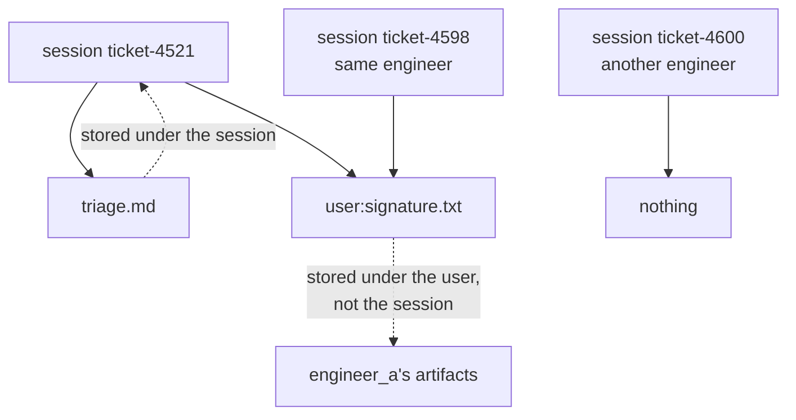

# 3.1 — The `user:` filename

## One-line answer

Artifacts have two scopes and the **filename** chooses between them: a plain name belongs to one
conversation, and a name beginning `user:` belongs to the person for the life of the application —
exactly the trick Day 17's state keys use, applied to files.

## The story

The coat on the back of your chair, and the coat in your wardrobe.

Both are yours and both are coats. The one on the chair belongs to today: it is where you left it, it
is in that room, and if you move desks next week it will not follow you — somebody will find it and
wonder whose it is.

The one in the wardrobe belongs to you rather than to a day. You do not think about where it is,
because it is where your things are. It is there in February and it is there in October, and it will be
there after you change jobs.

Nobody labels either of them. What decides which kind of coat it is, is where you put it down.

## The idea in plain language

[Day 17](../../../day-17-state-scopes-and-lifetimes/parts/02-four-lifetimes/2.1-the-prefix-is-the-lifetime.md)
established a rule that turns out to be a house style rather than a one-off: **the name carries the
scope**. State keys use `user:`, `app:` and `temp:` prefixes; artifact filenames use one of them.

- `triage.md` — session-scoped. It belongs to this conversation, and a different conversation with the
  same engineer cannot see it.
- `user:signature.txt` — user-scoped. Every conversation that engineer opens can see it, and a
  different engineer cannot.

There is no `app:` and no `temp:` for artifacts. Two scopes, one prefix, and the check in the installed
in-memory service is exactly `filename.startswith("user:")`.

The mechanism underneath is the same as for state: `save_artifact` takes a `session_id`, and the base
service's docstring says *"If `None`, the artifact is user-scoped."* When you call through a tool's
context the session id is always supplied — the context knows it — so the **prefix is how a tool asks
for the other scope**. The service sees the prefix, and files the artifact under the user rather than
under the session.

Two consequences worth having in mind before section 6:

- **A user-scoped artifact outlives the conversation that produced it**, so deleting a session does not
  delete it, exactly as with `user:` state keys
  ([17.2.3](../../../day-17-state-scopes-and-lifetimes/parts/02-four-lifetimes/2.3-where-user-and-app-live.md)).
- **`list_artifact_keys` shows both scopes together**, with the prefix still on the user-scoped ones.
  So a tool listing what it can see gets a mixed list, and the prefix is the only thing distinguishing
  *this ticket's note* from *this engineer's signature*.

## Why Sutra needs it

Because two of the files Sutra will produce have obviously different lifetimes, and there is no third
place to put them.

A triage note belongs to a ticket: another ticket for the same engineer should not see it, and the
scope should say so. A signature block, an engineer's preferred report template, an uploaded avatar —
those belong to the person, and copying them into every conversation would be both wasteful and wrong.

There is a sharper case coming on Day 62. When a human approves something, the artifact they approved
has to be reachable from a later conversation — the approval outlives the chat window it happened in.
User scope is what makes that possible without inventing a store of your own.

## The mechanism

One save of each kind, then the same store viewed from three places:

```python
# days/day-18-artifacts-that-survive/lab/two_scopes.py
"""One prefix on a filename, and the artifact stops belonging to the conversation."""

import asyncio

from google.adk.artifacts import InMemoryArtifactService
from google.genai import types

APP, USER = "sutra", "engineer_a"


def blob(text: str) -> types.Part:
    return types.Part(inline_data=types.Blob(data=text.encode(), mime_type="text/plain"))


async def main() -> None:
    service = InMemoryArtifactService()

    await service.save_artifact(
        app_name=APP,
        user_id=USER,
        session_id="ticket-4521",
        filename="triage.md",
        artifact=blob("this ticket"),
    )
    await service.save_artifact(
        app_name=APP,
        user_id=USER,
        session_id="ticket-4521",
        filename="user:signature.txt",
        artifact=blob("Kind regards, the desk"),
    )

    for label, session in (
        ("the same conversation", "ticket-4521"),
        ("a new conversation", "ticket-4598"),
    ):
        keys = await service.list_artifact_keys(app_name=APP, user_id=USER, session_id=session)
        print(f"{label:22}: {keys}")

    other = await service.list_artifact_keys(
        app_name=APP, user_id="engineer_b", session_id="ticket-4600"
    )
    print(f"{'another engineer':22}: {other}")

    same = await service.load_artifact(
        app_name=APP, user_id=USER, session_id="ticket-4598", filename="user:signature.txt"
    )
    print("loaded from the new conversation:", same.inline_data.data)


asyncio.run(main())
```

**Line by line:**

- Two saves into the **same** session, differing only in the prefix on the filename. Everything else —
  the app, the user, the session, the payload shape — is identical, so the difference in what follows is
  attributable to five characters.
- `session_id="ticket-4521"` — using the ticket number as the session id, which is how Sutra will
  actually run: one conversation per ticket.
- The loop asks the store what is visible from two different sessions belonging to the same engineer.
- The `engineer_b` line asks from a different **user**, which is the other axis.
- The final `load_artifact` reads the user-scoped file **from a session that never saved it**, with the
  prefix included in the filename — the prefix is part of the name at read time too, not just at write
  time.

```bash
cd days/day-18-artifacts-that-survive/lab
uv run python two_scopes.py
```

**Line by line:**

- No model, no key, no network.

Measured on `google-adk` 2.7.1 on 2026-09-03:

```text
the same conversation : ['triage.md', 'user:signature.txt']
a new conversation    : ['user:signature.txt']
another engineer      : []
loaded from the new conversation: b'Kind regards, the desk'
```

Three lists and a payload. The conversation that saved both sees both. A different conversation with
the same engineer sees only the user-scoped one. A different engineer sees nothing at all — not even
the user-scoped file, because it belongs to a person rather than to the application.



## When it breaks

**The note follows the engineer to the next ticket.**

No error. Someone saved `user:triage.md` when they meant `triage.md`, and now every conversation that
engineer opens can list — and load — the previous ticket's note. It is the artifact version of Day 17's
prefix bug, with a sharper edge, because the thing leaking is a document rather than a word.

**The signature vanishes between conversations.** The mirror image: `signature.txt` without the prefix
is session-scoped, so it exists in the conversation that created it and nowhere else. The tell is a
feature that works in testing — where everything happens in one session — and not in use.

**`AttributeError: 'NoneType' object has no attribute 'inline_data'`** — reading a user-scoped artifact
without the prefix. `user:signature.txt` and `signature.txt` are different filenames, so the load
returns `None` ([2.1](../02-versions/2.1-every-save-is-a-new-version.md)). The prefix is part of the
name in every call.

## In production

**Name the scope in a constant, next to the state keys.**

The version a professional writes puts artifact filenames where Sutra put state keys
([17.7.2](../../../day-17-state-scopes-and-lifetimes/parts/07-in-production/7.2-what-belongs-in-state.md)):
module constants, with the scope visible in a comment, and helper functions that build per-ticket names.
`SIGNATURE = "user:signature.txt"` and `def triage_note(ticket_id: int) -> str` are both worth having,
because a filename assembled inline is a filename somebody will assemble differently.

**What changes at scale** is that user-scoped artifacts become personal data with no expiry. They
outlive conversations by design, nothing clears them, and they are keyed on `user_id` — so the same
questions that Day 17 raised about `user:` state keys apply here with bytes attached: who deletes them,
when, and what happens when a user id changes shape.

**What fails only under real traffic** is the shared name. Two different features saving
`user:profile.png` are versions of one artifact, and since user scope spans every conversation the
collision is application-wide rather than conversation-local. Namespacing by feature —
`user:desk.signature.txt` — costs nothing now and is awkward later.

**The review comment**: *"this saves the ticket's note under `user:`. It will be visible in every other
ticket that engineer opens — did you mean that?"*

**The interview question**: *"how do you store a file that should follow a user across conversations?"*
The answer that shows you have used the API: *"prefix the filename with `user:` — the scope lives in the
name, exactly like session state's prefixes, and the same prefix is required when you read it back."*

## Check yourself

```bash
cd days/day-18-artifacts-that-survive/lab
uv run python two_scopes.py
```

Then remove the `user:` prefix from the second save and watch the second line lose its only entry.

**Out loud, without scrolling up:** name the two artifact scopes, say what chooses between them, and
give one Sutra file that belongs in each.
