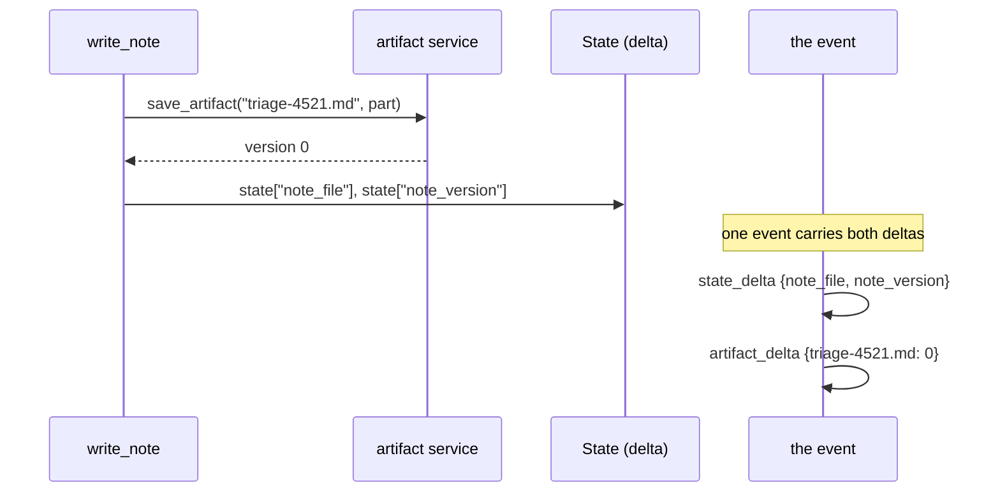

# 4.1 — Saving from a tool

## One-line answer

`await tool_context.save_artifact(filename, part)` writes the file, returns its version, and records
`{filename: version}` on the event as an **artifact delta** — the same mechanism as Day 17's state
delta, so one step can update both stores and the history knows about both.

## The story

The photocopy at reception.

You hand over your driving licence. The receptionist looks at it, takes it to the machine behind the
desk, and comes back with the licence and a warm sheet of paper. The paper goes into the folder for
today's visit; the licence goes back in your pocket.

Two records now exist and they are different in kind. There is a line in the visitors' book — a name, a
time, who you are here to see — and there is the photocopy, which is a *thing* rather than a fact. The
line in the book is what somebody reads at a glance. The photocopy is what somebody digs out if
anything goes wrong.

Both were made in the same thirty seconds, by the same person, as one action.

## The idea in plain language

Tools reach the artifact store through their context, exactly as they reach state
([17.3.1](../../../day-17-state-scopes-and-lifetimes/parts/03-three-safe-writes/3.1-writing-from-inside-a-tool.md)):

```
version = await tool_context.save_artifact("triage-4521.md", part)
```

Three things about that line:

- **It is `await`ed.** `save_artifact` is a coroutine, so the tool has to be `async def`. ADK supports
  async tools directly; this is the first day Sutra needs one.
- **It takes two arguments, not five.** No app name, no user id, no session id — the context knows
  them. Which is also why the `user:` prefix is how a tool asks for the other scope
  ([3.1](../03-two-scopes/3.1-the-user-filename.md)).
- **It returns the version**, and you should keep it
  ([2.1](../02-versions/2.1-every-save-is-a-new-version.md)).

And one thing about what happens around it. Look at the context's implementation and the last line
before the return is:

```
self._event_actions.artifact_delta[filename] = version
```

That is the artifact half of Day 17's story. Saving records `{filename: version}` on the event the step
is about to emit, so the session history says *a file was produced here, and this version of it*. Not
the bytes — the reference. The history stays small and still knows what happened.

Which makes the shape of a good artifact-producing tool obvious:

1. build the `Part`;
2. `await save_artifact(...)` and keep the returned version;
3. write the **filename and version into state**, so later steps can find the file without listing
   anything;
4. return something small for the model to read.

Steps 2 and 3 land in the *same event*, which is what the measurement below shows.

## Why Sutra needs it

Because the desk's output is about to become a file, and the file has to be findable in the next turn
without the model remembering its name.

The concrete flow: `write_note` generates the triage note, saves it as `triage-4521.md`, and puts
`note_file` and `note_version` into state. The next turn's instruction can say
*"the current note is {note_file}"*
([17.4.1](../../../day-17-state-scopes-and-lifetimes/parts/04-state-in-the-prompt/4.1-state-steers-the-next-turn.md)),
and a later tool can load exactly the version that was written rather than whatever is newest.

That pattern — bytes in the artifact store, the reference in state — is the one Phase 8's graph runs on
and the one Day 62's approval depends on.

## The mechanism

One tool, one turn, both stores:

```python
# days/day-18-artifacts-that-survive/lab/save_and_find.py
"""A tool saves a file and records where it put it. Zero model calls."""

import asyncio

from google.adk.agents import Agent
from google.adk.artifacts import InMemoryArtifactService
from google.adk.runners import Runner
from google.adk.sessions import InMemorySessionService
from google.adk.tools import ToolContext
from google.genai import types
from scripted import ScriptedModel, call, text

NOTE = b"# Triage 4521\nseverity: high\nlogins failing for a whole team\n"


async def write_note(ticket_id: int, tool_context: ToolContext) -> dict:
    """Write the triage note as a file, and record where it went."""
    filename = f"triage-{ticket_id}.md"
    part = types.Part(inline_data=types.Blob(data=NOTE, mime_type="text/markdown"))
    version = await tool_context.save_artifact(
        filename, part, custom_metadata={"written_by": "desk"}
    )
    tool_context.state["note_file"] = filename
    tool_context.state["note_version"] = version
    return {"saved": filename, "version": version}


agent = Agent(
    name="desk",
    model=ScriptedModel(
        model="scripted",
        replies=[[call("write_note", ticket_id=4521)], [text("Written up as triage-4521.md.")]],
    ),
    tools=[write_note],
)

sessions = InMemorySessionService()
artifacts = InMemoryArtifactService()
runner = Runner(app_name="sutra", agent=agent, session_service=sessions, artifact_service=artifacts)
session = sessions.create_session_sync(app_name="sutra", user_id="u1")

for event in runner.run(
    user_id="u1",
    session_id=session.id,
    new_message=types.Content(role="user", parts=[types.Part(text="triage 4521")]),
):
    if event.actions and (event.actions.artifact_delta or event.actions.state_delta):
        print(
            f"{event.author}: state_delta={event.actions.state_delta} "
            f"artifact_delta={event.actions.artifact_delta}"
        )

stored = sessions.get_session_sync(app_name="sutra", user_id="u1", session_id=session.id)
print("state after the run :", dict(stored.state))
print(
    "artifacts in the store:",
    asyncio.run(
        artifacts.list_artifact_keys(app_name="sutra", user_id="u1", session_id=session.id)
    ),
)
```

**Line by line:**

- `async def write_note(...)` — async, because of the `await` inside. A synchronous tool cannot save an
  artifact.
- `filename = f"triage-{ticket_id}.md"` — the name is **derived from an argument**, not fixed, which is
  how one tool serves every ticket. Note what it is not: it is not a name a customer supplied
  ([3.2](../03-two-scopes/3.2-where-it-actually-lives.md) is why that matters).
- `custom_metadata={"written_by": "desk"}` — the flyleaf from
  [2.2](../02-versions/2.2-what-a-version-knows.md), filled in at the only moment anybody knows the
  answer.
- `tool_context.state["note_file"] = filename` and `["note_version"] = version` — the reference,
  written to state in the same tool call. This is the line that connects the two stores.
- `return {"saved": filename, "version": version}` — small, for the model. The bytes never go through
  the conversation.
- The printed line shows `state_delta` and `artifact_delta` **together**, because they are both
  recorded on the event the step emits.
- The final `asyncio.run(...)` — calling an async service method from synchronous script code. Inside a
  tool you would `await` it.

```bash
cd days/day-18-artifacts-that-survive/lab
uv run python save_and_find.py
```

**Line by line:**

- The scripted model means no requests. Saving a file is not a model behaviour.

Measured on `google-adk` 2.7.1 on 2026-09-03 (framework log lines removed):

```text
desk: state_delta={'note_file': 'triage-4521.md', 'note_version': 0} artifact_delta={'triage-4521.md': 0}
state after the run : {'note_file': 'triage-4521.md', 'note_version': 0}
artifacts in the store: ['triage-4521.md']
```

One event, two deltas. The history records that this step produced version 0 of `triage-4521.md` **and**
that the session now points at it, and the two facts cannot drift apart because they were written
together.



## When it breaks

**`ValueError: Artifact service is not initialized.`**

The wire is missing ([1.3](../01-not-a-state-key/1.3-a-separate-wire.md)), and in a run this does not
reach your code — it is [5.1](../05-failure-lab/5.1-the-artifact-with-no-service.md).

**`TypeError: object int can't be used in 'await' expression`** — or the mirror image, a coroutine
warning. Forgetting the `await` leaves you with a coroutine object where the version should be, and
`state["note_version"]` then holds something unserializable
([17.1.2](../../../day-17-state-scopes-and-lifetimes/parts/01-form-not-story/1.2-what-may-live-in-state.md)).
The tell is a `RuntimeWarning: coroutine 'save_artifact' was never awaited` in the log and no artifact
in the store.

**The save succeeds and the state write does not.** If the tool raises after saving, the event may
never be emitted — so the file exists and nothing points at it
([17.3.1](../../../day-17-state-scopes-and-lifetimes/parts/03-three-safe-writes/3.1-writing-from-inside-a-tool.md)'s
rule: write state after the work that can fail). An orphaned artifact is not an error; it is a file
nobody will ever open.

## In production

**One tool owns the file, and it writes the reference in the same call.**

The version a professional writes never has one component saving the artifact and another recording
where it went. The two writes belong to one step precisely so that they land on one event, and so that
a failure leaves neither rather than half.

**What changes at scale** is that the artifact delta becomes the useful signal in tracing. Day 84 will
want to answer *"which turn produced this document?"*, and the answer is already on an event — as long
as saves go through the context rather than through a service handle somebody passed around, which
records nothing.

**What fails only under real traffic** is the filename derived from unstable input. `triage-{ticket_id}`
is stable; `report-{timestamp}` produces a new artifact every call and never versions; a name built
from model output is a name that can be anything at all. Derive names from identifiers your system owns.

**The review comment**: *"the tool saves the artifact but nothing records the filename. How does the
next turn find it?"*

**The interview question**: *"how does a tool produce a file the rest of the system can use?"* The
answer that shows you have built one: *"save it through the context — that records the filename and
version on the event — and write the same reference into state, in the same call, so the next step has
something to look up."*

## Check yourself

```bash
cd days/day-18-artifacts-that-survive/lab
uv run python save_and_find.py
```

One line with two deltas on it. Say which store each half is talking about.

**Out loud, without scrolling up:** name the four steps of a well-behaved artifact-producing tool, and
say which two of them must land on the same event.
