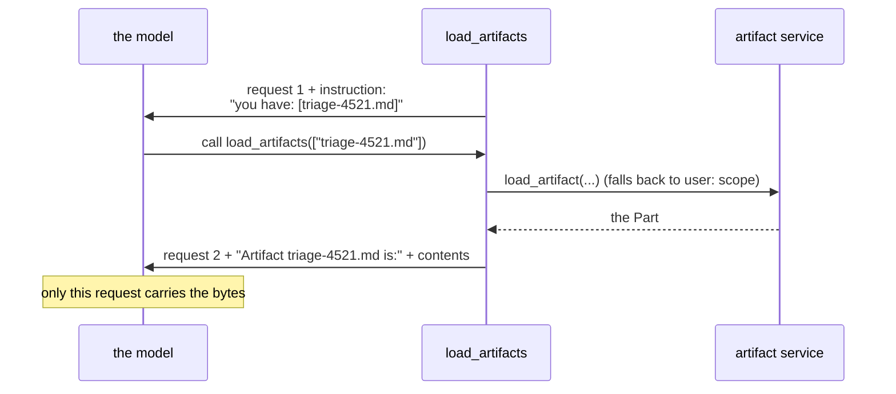

# 4.3 — What the model cannot see

## One-line answer

Saving an artifact does **not** put it in the model's context: ADK's `load_artifacts` tool advertises
the filenames on every request and inserts the contents only after the model asks for them, into that
one request and no further.

## The story

The attachment nobody opened.

You send the email with the document attached, and the reply comes back asking the question the
document answers. It is not that anybody was careless. The message body said *"see attached"*, the
attachment was there, and the person reading it was skimming forty messages on a phone.

The information was delivered. It was not *read*, because attachments are opt-in: a paperclip icon is
an offer, and somebody has to accept it.

## The idea in plain language

There is a natural assumption here, and it is wrong: that once a tool has saved an artifact, the model
knows about it. It does not. The artifact store is beside the conversation, not in it, and a model sees
only what is in its request.

ADK ships a tool for closing that gap: `load_artifacts`, imported from `google.adk.tools` and put on
the agent's `tools` list. Reading its implementation in `google-adk` 2.7.1, it works in two halves,
and the split is the whole subject of this part.

**Every request, it advertises.** Before each model call it lists the artifacts visible from this
session and appends a dynamic instruction naming them: *"You have a list of artifacts: […] When the
user asks questions about any of the artifacts, you should call the `load_artifacts` function…"*. So
the model learns that `triage-4521.md` exists — the paperclip icon.

**Only on request, it inserts.** When the model calls the tool with `artifact_names`, the framework
loads each one and appends it to the **request** as an extra content block: *"Artifact triage-4521.md
is:"* followed by the part. The tool's own return value says what is happening in plain words —
*"artifact contents temporarily inserted and removed. to access these artifacts, call load_artifacts
tool again."*

Three details from the same code that matter in practice:

- **It falls back to the user scope.** If a name is not found session-scoped, it retries with a `user:`
  prefix, so a model asking for `signature.txt` gets `user:signature.txt`
  ([3.1](../03-two-scopes/3.1-the-user-filename.md)).
- **Missing artifacts are skipped, not raised.** The log says `Artifact "…" not found, skipping` and
  the request goes out without it — so the model answers about a document it was never given.
- **The bytes are converted before the model sees them.** A helper called `as_safe_part_for_llm`
  extracts text from formats a model cannot read raw and replaces binary data with a placeholder
  description. That decision runs on the MIME type, which is why
  [1.2](../01-not-a-state-key/1.2-a-part-not-a-file.md) insisted on setting one.

The consequence worth carrying to tomorrow: **an artifact in the context window costs what its
contents cost.** The store lets you keep a large document cheaply; loading it into a request spends
tokens exactly as if you had pasted it. Day 19 is about which things earn that.

## Why Sutra needs it

Because customers attach files, and a desk that cannot read the attached log is a desk that asks the
customer to paste it.

The concrete shape: an intake step saves the attachment as an artifact
([17.3.3](../../../day-17-state-scopes-and-lifetimes/parts/03-three-safe-writes/3.3-writing-from-outside-a-run.md)'s
out-of-band write, with the file going to the artifact store), the desk holds `load_artifacts`, and the
model asks for the log when the ticket is about an error nobody has quoted. That is a genuinely useful
agent, and the difference between it and a useless one is a single entry on the `tools` list.

It matters again on Day 66, and in the opposite direction. Everything loaded this way is **content the
model treats as input**, and an attachment is text a stranger wrote. An artifact loaded into a prompt
is the same trust problem as a searched web page
([16.4.3](../../../day-16-built-in-tools-with-brakes/parts/04-newspaper-or-cabinet/4.3-the-question-that-left-the-building.md)),
arriving through a different door.

## The mechanism

A model that records what it was sent, an artifact saved before the run, and a scripted call to
`load_artifacts`:

```python
# days/day-18-artifacts-that-survive/lab/not_in_context.py
"""An artifact is not in the model's context until something puts it there. Zero model calls."""

import asyncio
from collections.abc import AsyncGenerator

from google.adk.agents import Agent
from google.adk.artifacts import InMemoryArtifactService
from google.adk.models import BaseLlm, LlmRequest, LlmResponse
from google.adk.runners import Runner
from google.adk.sessions import InMemorySessionService
from google.adk.tools import load_artifacts
from google.genai import types

NOTE = b"# Triage 4521\nseverity: high\n"


class Recorder(BaseLlm):
    """Answers with one scripted turn each time, and keeps what it was sent."""

    turns: list = []
    seen: list = []

    async def generate_content_async(
        self, llm_request: LlmRequest, stream: bool = False
    ) -> AsyncGenerator[LlmResponse, None]:
        self.seen.append(llm_request)
        index = min(len(self.seen) - 1, len(self.turns) - 1)
        yield LlmResponse(content=self.turns[index])


model = Recorder(
    model="recorder",
    turns=[
        types.Content(
            role="model",
            parts=[
                types.Part(
                    function_call=types.FunctionCall(
                        name="load_artifacts", args={"artifact_names": ["triage-4521.md"]}
                    )
                )
            ],
        ),
        types.Content(role="model", parts=[types.Part(text="read it")]),
    ],
)

agent = Agent(name="reader", model=model, tools=[load_artifacts])


async def main() -> None:
    artifacts = InMemoryArtifactService()
    sessions = InMemorySessionService()
    session = await sessions.create_session(app_name="sutra", user_id="u1")
    await artifacts.save_artifact(
        app_name="sutra",
        user_id="u1",
        session_id=session.id,
        filename="triage-4521.md",
        artifact=types.Part(inline_data=types.Blob(data=NOTE, mime_type="text/markdown")),
    )

    runner = Runner(
        app_name="sutra", agent=agent, session_service=sessions, artifact_service=artifacts
    )
    async for _ in runner.run_async(
        user_id="u1",
        session_id=session.id,
        new_message=types.Content(role="user", parts=[types.Part(text="what does the note say?")]),
    ):
        pass

    first, second = model.seen[0], model.seen[-1]
    print("requests made to the model:", len(model.seen))
    print("--- does request 1 mention the artifact name? ---")
    print("triage-4521.md" in str(first.config.system_instruction))
    print("--- do request 1's contents contain the bytes? ---")
    print(b"severity: high" in str(first.contents).encode())
    print("--- does the LAST request contain the bytes? ---")
    print("severity: high" in str(second.contents))


asyncio.run(main())
```

**Line by line:**

- `class Recorder(BaseLlm)` — the double from
  [17.4.1](../../../day-17-state-scopes-and-lifetimes/parts/04-state-in-the-prompt/4.1-state-steers-the-next-turn.md),
  extended to keep **every** request rather than the last, because this experiment is about the
  difference between two of them.
- `turns` — first a scripted call to `load_artifacts` with the artifact's name, then a plain answer.
  The model in this script is doing exactly what the dynamic instruction would tell a real model to do.
- `tools=[load_artifacts]` — the tool object imported from `google.adk.tools`, not a class to
  instantiate. One entry, and it brings its own declaration.
- The artifact is saved **before** the run and directly through the service, so nothing in the run
  produced it — the question is only whether the model can see it.
- `str(first.config.system_instruction)` — checking the instruction the tool appended.
- `str(first.contents)` against `str(second.contents)` — the same check on the first and last request.
  Comparing the two is the measurement.

```bash
cd days/day-18-artifacts-that-survive/lab
uv run python not_in_context.py
```

**Line by line:**

- No requests leave the machine: the model is a recorder.

Measured on `google-adk` 2.7.1 on 2026-09-03:

```text
requests made to the model: 2
--- does request 1 mention the artifact name? ---
True
--- do request 1's contents contain the bytes? ---
False
--- does the LAST request contain the bytes? ---
True
```

Four lines, and the middle two are the point. On the first request the model is **told the artifact
exists** and is **not given it**. Only after it asks do the bytes appear, in the next request, as an
extra content block.



## When it breaks

**The model answers about a document it never received.**

```text
Artifact "triage-4520.md" not found, skipping
```

A log line, not an exception. The model asked for a name that does not exist — a typo, a guess, a
number one off — the framework skipped it, and the request went out without it. The model then answers
from the instruction's *list of names* and its own imagination. This is the most dangerous artifact
failure there is, because the answer is fluent and the log line is somewhere else.

**The agent has no `load_artifacts` and nobody notices.** No error at all. Artifacts save fine, the
store fills up, and the model never mentions them because it does not know they exist. The tell is an
agent that ignores an attachment the user is obviously referring to.

**The context bill arrives.** Also no error. Every load puts the contents into a request, so an agent
that loads a large document on each turn pays for it on each turn. The tool's own status string is
explicit that contents are *"temporarily inserted and removed"*, which is a cost decision presented as
a mechanism: nothing accumulates, and nothing is cached either.

## In production

**Give the model names, not documents, and let it ask.**

That is what this tool does and it is the right default. The version a professional writes goes one
step further and does not rely on the model asking well: when the system already knows which document
matters — the ticket's own attachment, the note it just wrote — a tool loads it deliberately
([4.2](4.2-reading-it-back.md)) and returns the part that is relevant. `load_artifacts` is for the case
where *the user* refers to a file and the system cannot know which.

**What changes at scale** is that this becomes a retrieval problem. Ten artifacts in a session are a
list; two hundred are a list nobody can put in an instruction, and choosing which to offer is Phase 7's
subject. The listing itself grows the prompt on every single request, which is a cost that arrives long
before anybody notices it.

**What fails only under real traffic** is trusting what comes back. An artifact loaded into a request
is content, and content that came from a customer is untrusted text sitting in the model's context
next to your instructions. Day 66's defences apply, and the fact that ADK converts unsupported formats
into safe placeholders is a safety measure worth knowing about rather than a formatting nicety.

**The review comment**: *"the agent saves attachments and has no way to read them. Add `load_artifacts`,
or load the one we care about in a tool."*

**The interview question**: *"you saved a file for the agent — can it see it?"* The answer that shows you
have checked: *"not automatically. The store is beside the conversation. Either a tool loads it and
returns what matters, or you add the framework's `load_artifacts` tool, which advertises the names on
every request and inserts the contents only for the request where the model asks."*

## Check yourself

```bash
cd days/day-18-artifacts-that-survive/lab
uv run python not_in_context.py
```

Then remove `load_artifacts` from the agent's tools and watch the first `True` become `False`.

**Out loud, without scrolling up:** say what `load_artifacts` adds to every request and what it adds to
only one, and name the failure that happens when a model asks for a filename that does not exist.
