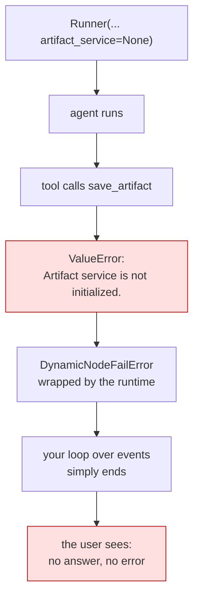

# 5.1 — 💥 The artifact with no service

## One-line answer

A runner with no `artifact_service` turns every save into a `ValueError` raised **inside the runtime**,
which never reaches your loop — so the turn produces no answer, no exception and no file, and the only
evidence is a traceback in a background thread.

## The story

The answering machine that was never plugged in.

It sat on the hall table for a year with its light blinking, because the light blinks when it is
powered and nobody had ever seen it do anything else. Messages were not being missed dramatically —
nobody in the house knew there was anything to miss.

Then somebody said *"I rang three times last week"*, and the machine was checked, and the socket behind
the table had never been switched on at the wall. The machine had done its job perfectly, in the sense
that it had done nothing incorrectly. It just had not been connected to the thing that would have made
it real.

## The idea in plain language

This is the day's deliberate failure, and it is the fourth time this phase has met the same shape.

The mistake is one missing argument. `Runner(...)` takes `artifact_service`, it defaults to `None`, and
nothing checks it at construction. Every tool that saves an artifact then runs into this, from
`context.save_artifact`'s first line:

```
if self._invocation_context.artifact_service is None:
    raise ValueError('Artifact service is not initialized.')
```

The `ValueError` is excellent: specific, findable, and it names the actual problem. Where it goes is
the failure.

The exception is raised inside the tool, inside the node, inside the runtime. ADK wraps it — the
traceback ends in `DynamicNodeFailError: Dynamic node desk failed` — and the code iterating over events
simply stops receiving them. The run ends. Nothing is raised at your call site. The user gets nothing.

### 🎬 The scene

Sutra's desk gains `save_note` ([4.1](../04-in-the-run/4.1-saving-from-a-tool.md)). It is tested in a
script that builds a runner with both services, works perfectly, and gets merged.

Somewhere else — a test helper, an API entry point written a week earlier, a second runner for a
scheduled job — a `Runner` is constructed with a session service and nothing else, because when it was
written there were no artifacts.

### 😬 The naive fix

*"The tool is fine, we have tested it. Something must be wrong with the model — it is not calling the
tool."*

### 💥 Why it fails

The model **is** calling the tool. The tool raises on its first line, the node fails, and the run ends
with no final response. From outside, an agent that is not calling a tool and an agent whose tool
explodes look identical: no answer either way.

### 💡 The insight

**A missing dependency that fails inside the runtime is indistinguishable from a model that did
nothing.** This is now a pattern rather than an incident — Day 17 met it three times (a state schema
violation, an `output_schema` mismatch, a missing placeholder) and today it is four. The lesson is not
about artifacts: it is that **the absence of an answer is a symptom with several causes, and you cannot
diagnose it from the outside.**

The two defences, and Sutra takes both: construct services in one place so a runner cannot be
half-wired ([1.3](../01-not-a-state-key/1.3-a-separate-wire.md)), and assert the wiring in a test
([6.1](../06-in-production/6.1-testing-artifacts-without-a-model.md)) rather than discovering it in a
turn.

## Why Sutra needs it

Because Sutra is about to have more than one runner.

Day 85's API server builds one. Day 73's nightly job builds another. Day 79's evals build one per
run. Each of those is a place where the services are assembled, and each is a place where somebody can
assemble them incompletely — with a failure that looks like a model problem and is reported as one.

There is a Day 21 connection too. That day is *error handling: surface, don't swallow*, and it is
aimed exactly at this: the four failures of this phase all surface somewhere that cannot act on them.
Meeting them first, deliberately, is what makes that day a fix rather than a lecture.

## The mechanism

The same agent, twice, with one argument of difference:

```python
# days/day-18-artifacts-that-survive/lab/the_wire.py  (from 1.3, run again here)
runner = Runner(
    app_name="sutra",
    agent=agent,
    session_service=InMemorySessionService(),
    artifact_service=InMemoryArtifactService() if with_service else None,
)
```

**Line by line:**

- `artifact_service=... if with_service else None` — the whole experiment, and `None` is also what you
  get by omitting the argument entirely.
- Everything else about the two runs is identical: same agent, same tool, same scripted model, same
  message.

Run it and read the two blocks against each other:

```bash
cd days/day-18-artifacts-that-survive/lab
uv run python the_wire.py
```

**Line by line:**

- No model calls; the failure has nothing to do with the model.

Measured on `google-adk` 2.7.1 on 2026-09-03, standard output only:

```text
--- artifact_service configured: True ---
artifact_delta: {'triage-4521.md': 0}
tool said     : {'saved': 'triage-4521.md', 'version': 0}
--- artifact_service configured: False ---
```

And the error, which appears on the **error stream** rather than in your program:

```text
    raise ValueError('Artifact service is not initialized.')
ValueError: Artifact service is not initialized.
    raise DynamicNodeFailError(
google.adk.workflow._errors.DynamicNodeFailError: Dynamic node desk failed
```

Four lines of nothing, and a traceback in a place your code cannot reach.



## When it breaks

The measurement above **is** the break. What is worth adding is how to tell this failure from its
neighbours, because they all look the same from the outside:

| What you see | Candidate causes met so far |
| --- | --- |
| a turn with no answer | a missing artifact service (today) |
| | a state-schema violation ([17.5.1](../../../day-17-state-scopes-and-lifetimes/parts/05-a-schema-for-state/5.1-declaring-the-boxes.md)) |
| | an `output_schema` mismatch ([17.3.2](../../../day-17-state-scopes-and-lifetimes/parts/03-three-safe-writes/3.2-the-carbon-copy.md)) |
| | a missing `{placeholder}` ([17.4.2](../../../day-17-state-scopes-and-lifetimes/parts/04-state-in-the-prompt/4.2-the-brace-that-raises.md)) |

All four are distinguishable in **the log**, and only there. Which is a statement about what you must
be capturing before any of this reaches a user: if the framework's logging is not going somewhere you
read, none of these has a diagnosis.

**The variant that is worse.** A runner wired correctly in production and incorrectly in tests fails
the other way round: the tests pass because they never save, and production works, and then a test
that *does* save starts failing for a reason that has nothing to do with the change being tested.

## In production

**Assemble services once, and assert them.**

The version a professional writes has one function that builds the application's services and one that
builds a runner from them. Nothing constructs a `Runner` by hand at three call sites. The assertion —
*this runner has an artifact service* — is then a two-line test that runs in CI
([6.1](../06-in-production/6.1-testing-artifacts-without-a-model.md)), which is cheaper than the
alternative by an enormous margin.

**What changes at scale** is that this class of failure is your top source of unexplained empty
responses, and the fix is not more validation — it is **log capture**. The traceback exists. Somebody
has to be reading it. Day 22's structured logging and Day 84's tracing are both, in part, about making
sure these are visible; today is the day you learn what you are looking for.

**What fails only under real traffic** is intermittency. A service that exists but is unhealthy — a
full disk with `FileArtifactService`, a bucket with the wrong permissions — fails on *some* saves, so
the symptom becomes "occasionally an answer does not arrive". That is much harder than today's total
failure, and the diagnostic habit is the same one: read the log for the turn that produced nothing.

**The review comment**: *"this builds a runner inline with only a session service. Use the factory —
the first tool that saves a file will fail invisibly."*

**The interview question**: *"an agent turn returns nothing at all and no exception. Where do you
look?"* The answer that shows scar tissue: *"the framework's log, not my code — several failures inside
the runtime are wrapped and never reach the caller, so 'no answer' is a symptom with a handful of
causes and the traceback is the only thing that separates them."*

## Check yourself

```bash
cd days/day-18-artifacts-that-survive/lab
uv run python the_wire.py 2>&1 | tail -5
```

The `2>&1` is the whole exercise: run it once without redirecting and once with, and notice how much
you were not seeing.

**Out loud, without scrolling up:** name the four failures this phase has met that produce a turn with
no answer, and say what all four have in common.
