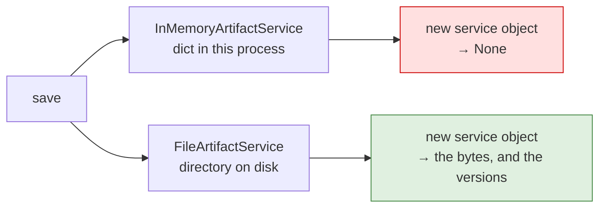

# 6.3 — Surviving a restart

## One-line answer

`FileArtifactService(root_dir=...)` makes artifacts outlive the process — a second service object on
the same directory reads what the first one wrote — which is the first half of Phase 3's gate proved
rather than promised, at zero cost.

## The story

Unplugging the freezer.

It runs in the garage and nobody thinks about it. There is a year of batch cooking in there, the
Christmas things, and a bag of ice from a party in July. It is the most valuable appliance in the house
by the weight of what it holds, and its entire claim on that value is a plug in a socket.

Somebody needs the socket for the pressure washer. It is twenty minutes of work. The plug goes back in
afterwards, or it does not, and the difference between those two futures is not visible for two days.

Everything in there was "saved" in the ordinary sense. What it actually was, was *powered*.

## The idea in plain language

Everything before this part used `InMemoryArtifactService`, which is a dictionary in the process. It is
the right choice for a lab and for tests, and it has one property that disqualifies it from anything
else: **stop the process and every artifact is gone.**

`FileArtifactService` is the same interface over a directory
([3.2](../03-two-scopes/3.2-where-it-actually-lives.md)). Point it at a root, and the tree it writes is
still there afterwards — after the run, after the process, after a reboot. Swapping is one line at the
runner ([1.3](../01-not-a-state-key/1.3-a-separate-wire.md)) because everything else in this day is
written against the base interface.

That matters more than it sounds, because of what Phase 3's gate says: **state survives restarts;
budgets enforced.** As of today, half of that clause is provable:

- **artifacts** — durable now, with a free, local service and a test that proves it
  ([6.1](6.1-testing-artifacts-without-a-model.md));
- **session state** — still in memory until Day 47 brings `DatabaseSessionService`.

Which produces the mismatch worth planning for. A durable artifact store under an in-memory session
store means files survive and the **references to them do not**: after a restart the store holds
`triage-4521.md` and no session remembers writing it. That is not a bug in either service; it is a
system with two half-lives, and choosing them together is the point.

Sutra's position today, written down so Day 47 can act on it: the lab and the tests use the in-memory
service, the file service is the one the eventual application uses, and the root is a gitignored
directory beside the session store — because a directory of customer attachments is exactly what
Principle 9 is about.

## Why Sutra needs it

Because a support desk that loses a customer's attachment on deploy has lost the customer's evidence,
and because Phase 3's gate has to be answerable with a command rather than an opinion.

The nearer reason is Day 47's shape. That day pairs a persistent session service with what artifacts
already have, and the work is much smaller if the artifact side is already durable, already tested and
already configured from one place. Doing it today costs one constructor argument.

## The mechanism

Save with one service object, throw it away, and read with another:

```python
# days/day-18-artifacts-that-survive/lab/after_the_restart.py
"""Artifacts that outlive the thing that wrote them. Zero model calls."""

import asyncio
import shutil
from pathlib import Path

from google.adk.artifacts import FileArtifactService, InMemoryArtifactService
from google.genai import types

ROOT = Path("artifact_store")
APP, USER, SESSION = "sutra", "engineer_a", "ticket-4521"
NOTE = b"# Triage 4521\nseverity: high\n"


def part() -> types.Part:
    return types.Part(inline_data=types.Blob(data=NOTE, mime_type="text/markdown"))


async def main() -> None:
    if ROOT.exists():
        shutil.rmtree(ROOT)

    memory = InMemoryArtifactService()
    await memory.save_artifact(
        app_name=APP, user_id=USER, session_id=SESSION, filename="note.md", artifact=part()
    )
    del memory
    fresh_memory = InMemoryArtifactService()
    print(
        "in memory, after a new service object:",
        await fresh_memory.load_artifact(
            app_name=APP, user_id=USER, session_id=SESSION, filename="note.md"
        ),
    )

    on_disk = FileArtifactService(root_dir=ROOT)
    await on_disk.save_artifact(
        app_name=APP, user_id=USER, session_id=SESSION, filename="note.md", artifact=part()
    )
    del on_disk
    fresh_disk = FileArtifactService(root_dir=ROOT)
    back = await fresh_disk.load_artifact(
        app_name=APP, user_id=USER, session_id=SESSION, filename="note.md"
    )
    print("on disk, after a new service object  :", back.inline_data.data)
    print(
        "versions still on record             :",
        await fresh_disk.list_versions(
            app_name=APP, user_id=USER, session_id=SESSION, filename="note.md"
        ),
    )


asyncio.run(main())
```

**Line by line:**

- The two halves are **identical** except for the service class, which is what makes the difference
  attributable.
- `del memory` and `del on_disk` — throwing away the service object is the closest thing to a restart
  that fits in one script. It is not a real restart, and it is enough: the in-memory service's
  dictionary went with the object.
- The in-memory `load_artifact` prints `None` — the whole point, and printed rather than asserted so
  you see it.
- `FileArtifactService(root_dir=ROOT)` twice, on the **same root**. The second object has never met the
  first and finds the file by reading the directory.
- `list_versions(...)` on the fresh object — proving that the version history survived too, not just
  the latest bytes.
- `shutil.rmtree(ROOT)` at the top so the script means the same thing on the second run. Point it at a
  directory you own, and add it to `.gitignore`.

```bash
cd days/day-18-artifacts-that-survive/lab
uv run python after_the_restart.py
ls artifact_store/apps/sutra/users/engineer_a/sessions/ticket-4521/artifacts
```

**Line by line:**

- The second command is the evidence outside the program: the file is on your disk and the shell can
  see it.
- No model, no key, no network.

Measured on `google-adk` 2.7.1 on 2026-09-03:

```text
in memory, after a new service object: None
on disk, after a new service object  : b'# Triage 4521\nseverity: high\n'
versions still on record             : [0]
```

Three lines and half a phase gate. The same code, the same calls, the same filename — and one of them
kept the bytes because the bytes were on a disk.



## When it breaks

**`FileNotFoundError` from deep inside the file service.**

```text
FileNotFoundError: [Errno 2] No such file or directory: 'C:\\...\\versions\\0\\triage-4521.md'
```

Measured on Windows on 2026-09-03 with the root under a long temporary path. The layout is six levels
deep before your filename ([3.2](../03-two-scopes/3.2-where-it-actually-lives.md)), so a long root plus
a long name crosses the classic path limit. Keep the root short and near the top of the tree — this is
the first thing to check when a store works on one machine and not another.

**The store survives and nothing points at it.** No error. Files outlive an in-memory session store, so
after a restart the artifacts are there and the state that named them is not
([17.7.2](../../../day-17-state-scopes-and-lifetimes/parts/07-in-production/7.2-what-belongs-in-state.md)).
Until Day 47, that is a known and accepted gap rather than a surprise — provided somebody wrote it
down, which is what this part is for.

**The store is committed to git.** Also no error, and the worst of the three. An artifact root inside
the repository will be picked up by `git add -A` unless it is ignored, and then customer files are in
history for ever. It belongs in `.gitignore` the moment the directory exists.

**Two processes, one root.** Nothing prevents it, and mostly it works, because writes go to distinct
version directories. What is not guaranteed is the version *number*: two writers can compute the same
next version at the same moment. If the deployment has more than one worker, the artifact store is
shared state and needs the same thinking as any other.

## In production

**Choose the artifact service and the session service together, from configuration.**

The version a professional writes has one factory: it reads configuration, builds both services and
returns a runner. Development gets both in memory; production gets both durable. What it never has is
a durable one and an ephemeral one chosen by two different people at two different times, which is the
mismatch this part is about.

**What changes at scale** is that a local directory stops being enough — several workers, several
machines, no shared disk — and the interface is what saves you. Swapping `FileArtifactService` for a
cloud implementation is a line in the factory, because everything else in Sutra was written against
`save_artifact` and `load_artifact` rather than against a filesystem. That is the whole argument for
the service abstraction, and it is only true if nobody reached around it.

**What fails only under real traffic** is disk. A store that never overwrites
([2.3](../02-versions/2.3-nothing-is-overwritten.md)) on a disk that is finite ends one way, and the
failure will be a write error in the middle of an ordinary turn, wrapped and invisible
([5.1](../05-failure-lab/5.1-the-artifact-with-no-service.md)). Monitor the directory's size from the
day it exists.

**The review comment**: *"this uses the in-memory artifact service in the deployed configuration. Files
will disappear on every deploy — point it at the volume."*

**The interview question**: *"what survives a restart in your agent?"* The answer that shows you have
checked rather than assumed: *"today, artifacts do — the file service is a directory tree and I have a
test that saves with one service object and reads with another. Session state does not yet, which is a
known gap, and the pair has to be chosen together or you get files nothing points at."*

## Check yourself

```bash
cd days/day-18-artifacts-that-survive/lab
uv run python after_the_restart.py && ls artifact_store/apps/sutra/users/engineer_a/sessions/ticket-4521/artifacts
```

Then run it a second time and confirm the store is rebuilt from scratch — and say which line does that.

**Out loud, without scrolling up:** say which half of *state survives restarts* is true today, which is
not, and what goes wrong if you make one durable without the other.
