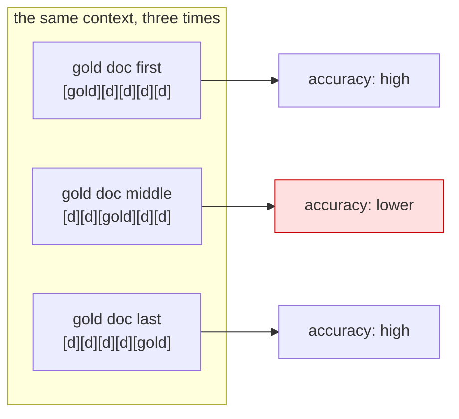

# Paper 01 — Lost in the Middle: How Language Models Use Long Contexts

> **Lost in the Middle: How Language Models Use Long Contexts**
> `arXiv:2307.03172` · 2023
> <https://arxiv.org/abs/2307.03172>
> Record opened and title copied on 2026-09-03.

**Read this after the parts.** Section 3 asked you to select what goes in the window, and
[3.3](../parts/03-selection/3.3-position-is-not-presence.md) claimed that *where* a fact sits changes
whether it is used. This is the paper that measured that, and the half of its finding that has aged
differently from the other half.

## One-line answer

It measured what happens when the position of the relevant information inside a long context is moved,
and found performance highest at the **beginning and the end** and significantly degraded in the
**middle** — even for models built for long contexts.

## The story

Reading a phone number back to somebody.

They say it once, eleven digits, and you repeat it. The first three come out right because you started
there. The last four come out right because you have just heard them. The four in the middle are the
ones you get wrong, and you get them wrong in a specific way — not blank, but *plausible*: a 6 where
there was an 8.

Nobody has ever been surprised by this about people. For a long time everybody was surprised by it
about models, because a model's context does not look like memory. It looks like a file, and files do
not have a middle you skim.

## The idea in plain language

By 2023 the interesting number in a model's specification was the size of its context window, and it
was growing fast. The implicit promise of a bigger window is *put more in and the model will use it* —
and nobody had checked the second half of that sentence.

The paper's own framing: *"While recent language models have the ability to take long contexts as
input, relatively little is known about how well they use longer context."*

So it checked, on two tasks where the answer is unambiguous: multi-document question answering, where
one of several documents contains the answer; and key-value retrieval, where the model is asked to
return the value for a given key from a list. In both, the position of the relevant item can be moved
without changing anything else — same documents, same question, same length.

The result, in the paper's words: *"performance is often highest when relevant information occurs at
the beginning or end of the input context, and significantly degrades when models must access relevant
information in the middle of long contexts, even for explicitly long-context models."*

Two terms worth defining, because the paper's own title uses them:

- **long context** — an input large enough that the relevant part is a small fraction of it. The number
  moves every year; the shape does not.
- **lost in the middle** — the finding as a picture: plot accuracy against the position of the answer
  and you get a curve that is high at both ends and sags in the middle, like a U.

The reason this matters for engineering rather than for research is that **you do not control position
directly**. In an agent, position is decided by *when* something arrived and *how much* has happened
since — measured in [3.3](../parts/03-selection/3.3-position-is-not-presence.md), where a fact given on
turn two slid from 81% of the way through the request to 11% by turn twelve, passing through the middle
on the way.

## Why Sutra needs it

Because it is the evidence behind three of this day's rules, and without it they are opinions.

[1.1](../parts/01-the-binder/1.1-room-is-not-free.md) claims that adding relevant information can make
an answer worse. [3.3](../parts/03-selection/3.3-position-is-not-presence.md) claims that presence is
not use. [6.3](../parts/06-in-production/6.3-the-heaviest-organ.md) argues for compaction partly
because a long history pushes early facts into the weakest region. All three of those rest on this
paper.

It also shapes what Sutra does with facts. Promoting a fact out of the transcript into a templated
state key ([17.4.1](../../day-17-state-scopes-and-lifetimes/parts/04-state-in-the-prompt/4.1-state-steers-the-next-turn.md))
is not only bookkeeping: it moves the fact from a drifting position in the middle of the history to a
fixed one at the front of every request.

## The mechanism

The method, written out, because it is the part that transfers.

**1. Build a context whose length is held constant.** For multi-document question answering: *k*
documents, exactly one of which contains the answer, and *k−1* distractors that are relevant to the
topic but do not answer the question. Distractors matter: irrelevant nonsense is easy to ignore, and
the realistic case is text that looks like it might be the answer.

**2. Move the answer, change nothing else.** Put the gold document first, or in the middle, or last.
The token count is identical, the question is identical, the model is identical. Position is the only
variable.

**3. Measure accuracy at each position.** Plot it. The curve is the finding.

**4. Repeat with different context lengths.** The sag deepens as the context grows, which is what turns
the result from a curiosity into a scaling law of sorts: the bigger the window, the more of it is
"middle".

The paper runs the same design on **key-value retrieval**, where there is no reasoning at all — just
*find this key, return its value* — and finds the same shape. That second experiment is the important
one for engineers, because it rules out the comfortable explanation that the model was struggling with
the reasoning rather than with the retrieval.



## The paper in one demo

The paper's design, stripped to nothing but itself: ten short knowledge-base articles, one of which
answers the question, moved to the start, the middle or the end.

```text
days/day-19-context-engineering-selection/lab/papers/lost-in-the-middle/
├── corpus.py      # nine distractors, three questions and their answers
└── positions.py   # the same context at three positions, scored
```

Two files. No framework, no plotting, no statistics — the ablation switch is an environment variable
that moves one document.

```python
# corpus.py
"""Nine distractor articles, three answers, and the questions they answer.

Every article is the same shape and roughly the same length, so that position is the
only thing that varies between runs. The DISTRACTORS are true, plausible and about
something else; none of them answers any of the questions, which is what makes the
scoring meaningful.
"""

from __future__ import annotations

DISTRACTORS: list[str] = [
    "KB-101: Password reset links expire after fifteen minutes and can be reissued twice.",
    "KB-102: The status page is published from a separate account and lags by a minute.",
    "KB-103: Bulk exports are queued and run overnight in the customer's own region.",
    "KB-105: Attachments over twenty megabytes are rejected at the gateway, not the app.",
    "KB-106: Tenant names are case-insensitive but are stored exactly as first entered.",
    "KB-108: Seat counts are reconciled nightly; a removed user frees a seat the next day.",
    "KB-109: Webhook retries use exponential backoff and stop after eight attempts.",
    "KB-113: Invoices are issued on the first working day of the month, in the account currency.",
    "KB-114: Search indexes rebuild weekly; new articles appear within an hour of publishing.",
]

# question -> (the one article that answers it, a word a correct answer must contain)
ANSWERS: dict[str, tuple[str, str]] = {
    "Why are users being logged out on redirect?": (
        "KB-104: A SameSite cookie change logs users out whenever a redirect crosses domains.",
        "samesite",
    ),
    "How long does the audit log keep entries?": (
        "KB-111: The audit log retains entries for ninety days before they are removed.",
        "ninety",
    ),
    "What blocks a custom domain's certificate from being issued?": (
        "KB-112: A custom domain's certificate is blocked until its verification record exists.",
        "verification",
    ),
}
```

**Line by line:**

- Nine distractors and three answers, all in the same house style — a KB number, a colon, one sentence.
  If the gold article looked different, the model could find it by shape rather than by reading, and
  the experiment would measure formatting.
- The distractors are **about the same product** and answer nothing. That is the paper's design: a
  distractor that is obviously irrelevant makes the task too easy.
- `ANSWERS` maps a question to the article that answers it **and a keyword** a correct answer must
  contain. The keyword is the scoring function: crude, deterministic and identical across positions,
  so the ablation cannot be decided by the grader.
- Three questions rather than one, because one question is an anecdote.

```python
# positions.py
"""Lost in the Middle (arXiv:2307.03172) in one file: the same context, three positions."""

from __future__ import annotations

import os

from corpus import ANSWERS, DISTRACTORS
from google import genai
from google.genai.errors import ClientError

from sutra.config import load_env, require_free_tier

MODEL = "gemini-3.7-flash"
POSITION = os.environ.get("POSITION", "middle")

PROMPT = """You are answering from the knowledge base below and from nothing else.

{articles}

Question: {question}
Answer in one short sentence, quoting the article number you used."""


def place(needle: str, position: str) -> list[str]:
    """The same ten articles, with the answer at the start, the middle or the end."""
    articles = list(DISTRACTORS)
    index = {"start": 0, "middle": len(articles) // 2, "end": len(articles)}[position]
    articles.insert(index, needle)
    return articles


def main() -> None:
    load_env()
    require_free_tier()
    client = genai.Client()

    correct = 0
    print(f"POSITION={POSITION}  model={MODEL}")
    try:
        for question, (needle, keyword) in ANSWERS.items():
            articles = place(needle, POSITION)
            prompt = PROMPT.format(articles="\n".join(articles), question=question)
            reply = client.models.generate_content(model=MODEL, contents=prompt)
            text = (reply.text or "").strip()
            hit = keyword in text.lower()
            correct += hit
            print(f"\n  Q: {question}")
            print(f"  A: {text}")
            print(
                f"  needle at index {articles.index(needle)} of {len(articles)} | "
                f"expected '{keyword}' | {'OK' if hit else 'MISSED'}"
            )
    except ClientError as error:
        if error.code == 429:
            print("429: the free tier is spent for today. No score, and none invented.")
            raise SystemExit(1) from error
        raise

    print(f"\nscore with the answer at the {POSITION}: {correct}/{len(ANSWERS)}")


if __name__ == "__main__":
    main()
```

**Line by line:**

- `POSITION = os.environ.get("POSITION", "middle")` — **the ablation switch**. One environment variable,
  and it changes exactly one thing: where `insert` puts the gold article.
- `place(...)` inserts into a **copy** of the distractor list, so the three runs are independent and the
  list cannot accumulate needles.
- `index = {"start": 0, "middle": len // 2, "end": len}` — `insert` at `len(articles)` appends, which is
  why "end" needs no special case.
- The prompt says *"and from nothing else"* — pinning the model to the supplied context, so a correct
  answer from memory does not count as retrieval.
- `keyword in text.lower()` — deterministic scoring, no model judging a model, and the same rule for
  every position.
- `articles.index(needle)` printed with the total — so the transcript itself proves where the needle
  was, rather than trusting the label.
- The `except ClientError` block is this curriculum's standing 429 handler: report, exit non-zero,
  invent nothing.

Run all three:

```bash
cd days/day-19-context-engineering-selection/lab/papers/lost-in-the-middle
POSITION=start  uv run python positions.py
POSITION=middle uv run python positions.py
POSITION=end    uv run python positions.py
```

**Line by line:**

- Three runs, three questions each: nine requests of the free tier's twenty, so this is a whole
  afternoon's budget and worth planning.

**What actually happened on 2026-09-03**, with the free tier's daily allowance running out partway
through — the first question of each run, at each of the three positions:

```text
POSITION=start  model=gemini-3.7-flash

  Q: Why are users being logged out on redirect?
  A: According to KB-104, users are logged out due to a SameSite cookie change whenever a redirect crosses domains.
  needle at index 0 of 10 | expected 'samesite' | OK
429: the free tier is spent for today. No score, and none invented.
```

```text
  Q: Why are users being logged out on redirect?
  A: According to KB-104, a SameSite cookie change logs users out whenever a redirect crosses domains.
  needle at index 4 of 10 | expected 'samesite' | OK
```

```text
  Q: Why are users being logged out on redirect?
  A: According to KB-104, a SameSite cookie change logs users out whenever a redirect crosses domains.
  needle at index 9 of 10 | expected 'samesite' | OK
```

**Read that honestly, because the honest reading is the lesson.** One question, three positions, three
correct answers — including at index 4 of 10, which is exactly the middle. On this task, with this
model, in 2026, **the effect did not appear.** The runs then hit the daily quota, so the other two
questions were not asked at any position.

`TODO(me)` — finish it on a day with quota: run all three positions, all three questions, and record
the nine results. Then make it harder in the way the paper says matters — thirty distractors instead of
nine — and record those too. The paper's own scaling result predicts that the sag appears as the
context grows, and ten short articles is not a long context by 2026 standards.

That is the demo's real finding today, and it is worth more than a reproduction would have been: **the
mechanism is easy to test and the effect size is a property of the model and the length.** A 2023
result on a 2023 model does not automatically hold on a 2026 one, and the way to find out is the
fifteen lines above rather than an opinion.

## When it breaks

**It was measured on two synthetic tasks.** Multi-document question answering and key-value retrieval
both have a single unambiguous target. Real agent contexts are not like that: the "answer" is often
spread over several turns, and there is no gold document to move. The finding transfers as a *warning
about position*, not as a formula.

**It was measured on the models of its day.** The paper is explicit that it included models built for
long contexts, which was the striking part at the time. It cannot say anything about models trained
afterwards — including, as the demo above suggests, ones that handle a small ten-document context
without difficulty.

**The distractors do the work.** The result depends on the non-answer documents being plausible. A
context padded with obviously irrelevant text is an easier task, and a benchmark built that way would
under-report the effect.

**And it says nothing about what to do.** The paper measures; it does not prescribe re-ranking, or
summarisation, or putting the important thing last. Everything in
[3.3](../parts/03-selection/3.3-position-is-not-presence.md) about promoting facts to a fixed position
is engineering practice built on the finding, not a claim the paper makes.

## In production

**What survived: the question.** *"Is it in the context?"* stopped being sufficient the moment this
paper landed, and *"where is it, and how much is around it?"* became a normal thing to ask in a design
review. That change of question is the durable contribution, and it is why this day exists.

**What survived: the practice.** Put the important thing where the model looks — near the end, or in a
fixed position such as the instruction — rather than trusting a long context to be uniformly read.
Every serious retrieval system today re-ranks so that the best candidates are nearest the question,
and the reason is in this paper.

**What survived: the argument against padding.** The finding is the mechanism behind
[1.1](../parts/01-the-binder/1.1-room-is-not-free.md)'s claim that adding relevant text can make an
answer worse. Before this, that claim sounded like folklore.

**What did not survive: the effect size.** Models have improved at exactly this. The demo above — one
question, ten documents, three positions, all correct — is a small piece of evidence that on short
contexts with a current model the sag can be absent. The honest position is that the *shape* is a
property of attention and the *magnitude* is a property of a particular model and a particular length,
and it has to be measured rather than assumed in either direction.

**What did not survive: the fear.** In 2023 this result was read as *long contexts do not work*. That
reading did not last, and it was never what the paper said. The finding is about uniformity, not
capability: a long context works, and it does not work *evenly*.

**What the field added: retrieval and re-ranking as standard.** If position matters, then choosing what
goes in and in what order is a design decision rather than a formatting one — which is Day 49's
subject, and which is exactly this day's rule at a larger scale.

**The interview question** this paper answers well: *"the fact is in the context and the model ignored
it — is that possible?"* The answer that shows you have read rather than heard of it: *"yes, and it was
measured in 2023: accuracy is highest when the relevant information is at the beginning or the end and
sags in the middle, on retrieval tasks with no reasoning at all. Current models are better at it, but
the practice stands — put what matters where the model looks, and do not rely on a big window being
read evenly."*

## Check yourself

```bash
cd days/day-19-context-engineering-selection/lab/papers/lost-in-the-middle
POSITION=middle uv run python positions.py
```

Then open the paper's abstract and find the phrase *"even for explicitly long-context models"* — that
clause is why the result was surprising when it was published.

**Out loud, without scrolling up:** what did this paper actually claim, and what do we do differently
now? A complete answer names the two tasks it measured, the shape of the curve, and the one thing
today's own demo could not reproduce.
