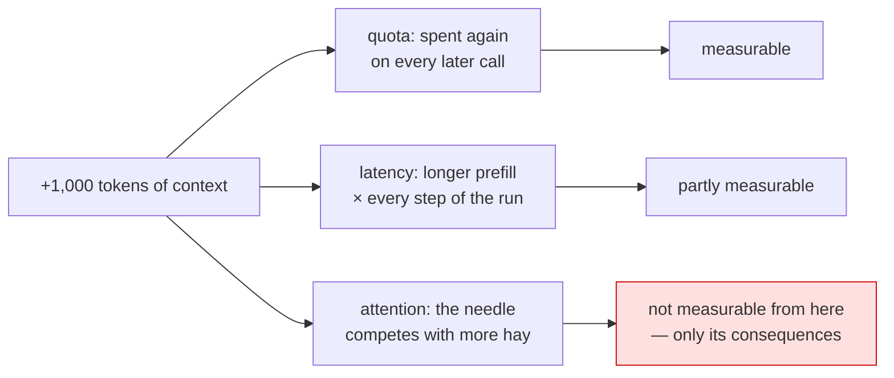

# 1.2 — Three costs in one scene

## One-line answer

Every token you add is billed on **every** call, delays the first word of the answer, and competes
for the model's attention — and only the first of those three has a number you can look up.

## The story

The taxi from the airport.

The meter is running, and you can see it. That is the cost everybody watches: it goes up, you know the
rate, and at the end there is a number.

The second cost is the one you feel and do not count. The driver took the ring road because you said
you were not in a hurry, and it is fifteen minutes longer, and you are now going to be late for the
thing you were early for.

The third cost is the one nobody notices until it goes wrong. You have been talking the whole way —
directions, the road works, a story about the flight — and at the junction where it actually mattered
the driver was listening to you instead of reading the sign. You are now on the wrong side of the
river, and none of the three costs were on the meter.

## The idea in plain language

[1.1](1.1-room-is-not-free.md) named the three costs. This part is what each one actually is, because
they behave differently and only one of them is measurable from where you are standing.

**Quota and money: linear, per call, and countable.** Every input token is counted by the provider on
every request. On Sutra's free tier the meter is requests per day rather than tokens
([Addendum 02](../../../../docs/02_ADDENDUM_ZERO_BUDGET_MODELS.md)), which hides the token cost right
up until the moment you pay for a tier where it does not. `count_tokens`
([1.1](1.1-room-is-not-free.md)) is the instrument, and it is exact.

**Latency: also roughly linear, and yours to feel.** Before a model can produce its first output token
it has to read the whole input — the *prefill*. More input, longer wait. On a single call that is
milliseconds you may not care about; on a run with six model calls, each carrying a growing history,
it is the difference between an answer that feels immediate and one that does not.

**Attention: not linear, not measurable from here, and the reason this day exists.** A model does not
read your context the way a database reads a row. Relevant facts compete with irrelevant ones; the
*position* of a fact changes how reliably it is used; and text that looks like an instruction gets
treated like one wherever it came from. The evidence for the position effect is the paper this day
cites ([3.3](../03-selection/3.3-position-is-not-presence.md)), and the practical statement is
uncomfortable: **adding correct, relevant information to a prompt can make the answer worse.**

That third cost is what makes context engineering a craft rather than a compression exercise. If
tokens were only money, the answer would be "buy more tokens". They are also attention, and you cannot
buy more of that.

| Cost | Grows how | Measurable today | What it looks like |
| --- | --- | --- | --- |
| quota / money | linearly, per call | **yes** — `count_tokens` | the day ends early; a bill |
| latency | roughly linearly | partly — wall clock | slow answers, multiplied per step |
| attention | not linearly | **no** | a confident wrong answer, no error |

## Why Sutra needs it

Because Sutra's own numbers make the first cost concrete and the third one likely.

Twenty requests a day means a grounded, tool-using conversation is a handful of turns long before the
quota is the binding constraint
([16.4.4](../../../day-16-built-in-tools-with-brakes/parts/04-newspaper-or-cabinet/4.4-two-meters-one-call.md)).
Anything you pack into every call spends that budget faster.

And Sutra's inputs are exactly the shape that triggers the third cost. A support ticket arrives with a
pasted stack trace, a log excerpt, a screenshot's worth of text. All of it is *relevant* in the loose
sense; almost none of it is what the current step needs; and the model will read all of it and produce
something fluent either way.

## The mechanism

The first cost is countable, so count it — including the part people never think about, which is what
the *same information* costs in different shapes:

```python
# days/day-19-context-engineering-selection/lab/three_costs.py
"""The countable cost, and how much the shape of text changes it."""

import time

from google import genai

from sutra.config import load_env

MODEL = "gemini-3.7-flash"

FACT_AS_PROSE = "The user was logged out because a SameSite cookie change breaks the redirect."
FACT_AS_LOG = (
    "2026-09-03T09:12:41.221Z WARN auth.session tenant=northwind-prod "
    "user=8f21c3ee-1b40-4a55-9f0e-0f9c9c1a77b2 event=cookie_rejected samesite=lax redirect=true\n"
)


def weigh(client: genai.Client, label: str, text: str) -> int:
    started = time.perf_counter()
    tokens = client.models.count_tokens(model=MODEL, contents=text).total_tokens
    elapsed = (time.perf_counter() - started) * 1000
    print(f"{label:22} {len(text):>6} chars {tokens:>6} tokens   counted in {elapsed:>6.0f} ms")
    return tokens


def main() -> None:
    load_env()
    client = genai.Client()
    prose = weigh(client, "the fact, in prose", FACT_AS_PROSE)
    one_line = weigh(client, "the fact, as one log line", FACT_AS_LOG)
    hundred = weigh(client, "a hundred log lines", FACT_AS_LOG * 100)
    print()
    print(f"same fact, {one_line / prose:.1f}x the tokens as a log line")
    print(f"a hundred lines is {hundred / prose:.0f}x the fact, for one more piece of information")


main()
```

**Line by line:**

- `FACT_AS_PROSE` and `FACT_AS_LOG` carry **the same information**. One is a sentence a person would
  write; the other is the machine's version of the same event, with a timestamp, a tenant, a UUID and
  key-value pairs.
- `time.perf_counter()` around the call — measuring the round trip, which is *not* the model's prefill
  time but is the only latency this script can honestly observe. It is here to make the point that
  latency is measurable in principle and that this is not the measurement.
- `weigh(...)` returns the count, so the ratios at the end are computed rather than asserted.
- `FACT_AS_LOG * 100` — the shape a pasted log actually takes: the same line, over and over, with one
  useful line somewhere in it.
- The two printed ratios are the finding. Neither is a round number and neither is a guess.

```bash
cd days/day-19-context-engineering-selection/lab
uv run python three_costs.py
```

**Line by line:**

- Three `count_tokens` calls, no generations.

```text
TODO(me) — paste the real output here. It is three lines and two ratios, and the numbers on
your machine will differ from anyone else's in the millisecond column and not in the token
columns.
```

This document does not ship a transcript for this one on purpose: it is a two-command exercise whose
whole value is that **you** see the ratio for text you chose, and the numbers in
[1.1](1.1-room-is-not-free.md) already establish the shape (prose about 3.5 characters per token,
machine output about 2.4).



## When it breaks

**The quota cost, when it finally speaks:**

```text
429 RESOURCE_EXHAUSTED. {'error': {'code': 429, 'message': 'You exceeded your current quota, please check your plan and billing details. ...'}}
```

Measured on 2026-09-03 and reproduced in full on
[Day 16](../../../day-16-built-in-tools-with-brakes/parts/07-failure-lab/7.1-the-spare-that-does-not-fit.md).
Note what it does not say: which call was expensive, or that any of them were. It is a counter hitting
a limit, and the packing decisions that got you there are invisible in it.

**The latency cost, when somebody complains.** No error. A conversation that felt quick at turn three
and slow at turn twenty is the history organ growing
([1.3](1.3-the-organ-that-grows-by-itself.md)), and the only way to see it is to record the size of
each request as you make it.

**The attention cost, when the answer is wrong.** No error, no slowdown, and the model sounds exactly
as confident as it did when it was right. This is the failure that makes people distrust agents in
general, and the honest diagnosis usually starts with printing what was actually in the request
([2.1](../02-anatomy/2.1-opening-the-envelope.md)).

## In production

**Measure the one you can, and design against the one you cannot.**

Every serious system logs the input token count of every model call. It is one number, it is available
from the response's usage metadata, and it turns "the prompts got bigger" from an argument into a
graph. What it will not tell you is whether the model is being confused by what you sent — for that
there is no counter, only evals (Day 79) and the discipline of sending less.

**What changes at scale** is that input tokens dominate. An agent's output is a few hundred tokens; its
input is everything you packed, on every step, of every run, for every user. Teams that graph the two
side by side stop arguing about which to optimise.

**What fails only under real traffic** is the pasted artefact. One customer attaches a 4,000-line log,
one tool returns an unusually large result, one conversation runs to sixty turns — and each of those is
a single request that costs fifty times the median. Averages hide this completely; the interesting
number is the ninety-fifth percentile of input tokens, and it is worth knowing before somebody else
finds it.

**The review comment**: *"this adds the full tool result to the context every turn. What is the p95
size of that result?"*

**The interview question**: *"what does adding context actually cost you?"* The answer that shows
experience: *"money and quota, linearly, on every call; latency, through prefill, multiplied by the
number of steps; and attention, which is not linear and not measurable — it shows up as an answer that
is worse for a reason nothing logs."*

## Check yourself

```bash
cd days/day-19-context-engineering-selection/lab
uv run python three_costs.py
```

Then change `FACT_AS_LOG` to a line from a log you have actually seen, and compare the ratio.

**Out loud, without scrolling up:** name the three costs, say which one you can put on a dashboard, and
say what you use instead for the one you cannot.
