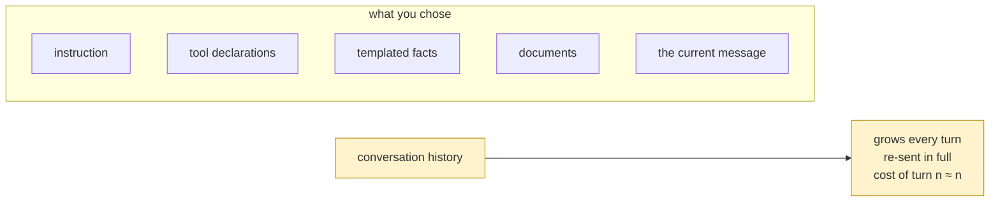

# 1.3 — The organ that grows by itself

## One-line answer

Every part of a request is a size **you** chose, except one: the conversation history grows on its
own, gets re-sent in full on every call, and by turn ten costs twenty-one times what turn one cost —
measured.

## The story

The email thread with everything quoted underneath.

The first message was four lines. The reply quoted it and added two. Somebody looped in two more
people, who each replied to a different part, and now the thread is eleven messages long and every
single one of them contains a copy of all the ones before it.

Scroll to the bottom of the last reply and you can read the entire history of the discussion, four
times over, in progressively deeper indentation, including two versions of a sentence somebody
corrected.

Nobody decided this. Nobody would have chosen it. It is what happens when the default behaviour of
every step is *keep everything and add a bit*.

## The idea in plain language

Section 2 opens the envelope and finds six organs. Five of them are sizes you decided: the
instruction, the tool declarations, the templated facts, any documents you pasted, and the user's
current message. Change your mind and they change.

The sixth is the **conversation history**, and it is different in kind: it grows because time passes.
Every turn appends the user's message, the model's reply, and any tool calls and results in between —
and the whole accumulated thing is re-sent on the next call, because the model has no memory
([Day 2](../../../day-02-llm-mechanics/LESSON.md)) and a *conversation* is an illusion your process
maintains by resending the transcript
([Day 3](../../../day-03-loop-hand-rolled/LESSON.md)).

That produces an arithmetic worth internalising, because it is unlike anything else in the anatomy:

- turn *n* carries roughly *n* turns' worth of text;
- so the **cost of one turn grows linearly** with the conversation;
- and the **cost of the whole conversation grows with the square** of its length.

The measurement below shows both, and the second number is the one that surprises people: ten
identical turns do not cost ten turns. They cost about eleven times a single turn, because turn one is
paid for ten times, turn two nine times, and so on.

This is also why history is the only organ that gets a whole day of its own tomorrow. You can fix a
long instruction by editing it. You cannot fix history by editing it, because it is not something you
wrote — it is something that happened. The fix is **compaction**: replacing what happened with a
shorter true account of it, which is Day 20.

## Why Sutra needs it

Because Sutra's conversations are the kind that go long, and its quota is the kind that does not.

A support thread is not three turns. The engineer pastes the ticket, asks for a hypothesis, supplies
the detail Sutra asked for, asks about the vendor, asks for the note to be rewritten. That is five
turns before anything unusual happens, and each one is carrying everything before it.

There is a Phase 8 reason too. In a graph, several nodes run inside one invocation, and each of them
makes its own model call carrying its own view of the history
([17.2.2](../../../day-17-state-scopes-and-lifetimes/parts/02-four-lifetimes/2.2-an-invocation-is-not-a-session.md)).
The multiplier stops being "turns" and becomes "turns times nodes", which is how a system that felt
cheap in testing becomes expensive in production without anybody adding a feature.

## The mechanism

Ten identical turns against a model that records what it was sent:

```python
# days/day-19-context-engineering-selection/lab/history_grows.py
"""The one organ that grows on its own, and what it costs by turn ten. Zero generate calls."""

import asyncio
from collections.abc import AsyncGenerator

from google.adk.agents import Agent
from google.adk.models import BaseLlm, LlmRequest, LlmResponse
from google.adk.runners import Runner
from google.adk.sessions import InMemorySessionService
from google.genai import types

ANSWER = "Noted. The likely cause is a cookie change; check the redirect."


class Recorder(BaseLlm):
    """Answers the same short sentence every turn, and keeps every request."""

    seen: list = []

    async def generate_content_async(
        self, llm_request: LlmRequest, stream: bool = False
    ) -> AsyncGenerator[LlmResponse, None]:
        self.seen.append(llm_request)
        yield LlmResponse(content=types.Content(role="model", parts=[types.Part(text=ANSWER)]))


model = Recorder(model="recorder")
agent = Agent(name="desk", model=model, instruction="You are Sutra, the triage desk.")


async def main() -> None:
    service = InMemorySessionService()
    session = await service.create_session(app_name="sutra", user_id="u1")
    runner = Runner(app_name="sutra", agent=agent, session_service=service)

    running = 0
    print("turn  messages  this request  paid so far")
    for turn in range(1, 11):
        async for _ in runner.run_async(
            user_id="u1",
            session_id=session.id,
            new_message=types.Content(
                role="user", parts=[types.Part(text=f"question {turn}: what about the redirect?")]
            ),
        ):
            pass
        request = model.seen[-1]
        size = len(str(request.contents))
        running += size
        print(f"{turn:>4}  {len(request.contents):>8}  {size:>12}  {running:>11}")

    first = len(str(model.seen[0].contents))
    last = len(str(model.seen[-1].contents))
    print()
    print(f"turn 10 costs {last / first:.1f}x turn 1")
    print(f"ten turns cost {running / (first * 10):.1f}x what ten turn-1s would have cost")


asyncio.run(main())
```

**Line by line:**

- `ANSWER` is a fixed short sentence, so the model contributes the same amount every turn and the
  growth in the output is entirely the accumulation, not the model being chatty.
- The agent has **no tools and a one-line instruction**, deliberately: this measures the history organ
  on its own, with the other five as small as they can be.
- `len(str(request.contents))` — characters as a stand-in for tokens. Characters are free to measure
  and the *ratios* are what this part is about;
  [1.1](1.1-room-is-not-free.md) has the conversion to real tokens.
- `len(request.contents)` — the number of **messages**, which grows by two per turn: the user's and the
  model's.
- `running` — the cumulative total. This is the number nobody computes and it is the one that decides
  what a long conversation costs.
- The two ratios at the end are computed from the measurements rather than asserted.

```bash
cd days/day-19-context-engineering-selection/lab
uv run python history_grows.py
```

**Line by line:**

- The recorder means ten turns and **zero** requests to a provider.

Measured on `google-adk` 2.7.1 on 2026-09-03:

```text
turn  messages  this request  paid so far
   1         1           108          108
   2         3           352          460
   3         5           596         1056
   4         7           840         1896
   5         9          1084         2980
   6        11          1328         4308
   7        13          1572         5880
   8        15          1816         7696
   9        17          2060         9756
  10        19          2305        12061

turn 10 costs 21.3x turn 1
ten turns cost 11.2x what ten turn-1s would have cost
```

Three things in that table.

**The middle column is a straight line.** Each turn adds about 244 characters and the request grows by
the same amount every time. Linear, per turn, exactly as described.

**The right-hand column is not.** By turn ten the conversation has cost 12,061 characters of input to
have exchanged about 2,300 — because the early turns have been paid for again and again.

**And the two ratios are the sentence to remember.** Turn ten costs twenty-one times turn one, and the
conversation as a whole cost eleven times what its first turn suggested. Neither of those is a
pathology. It is the default behaviour of every conversational agent ever built, including the one you
hand-rolled on Day 3.



## When it breaks

**Nothing breaks. It gets slower and more expensive, and then one day:**

```text
429 RESOURCE_EXHAUSTED. {'error': {'code': 429, 'message': 'You exceeded your current quota, ...'}}
```

The daily ceiling, arriving earlier than it did last month because conversations got longer. There is
nothing in that message about history, and the fix is not in the message either.

**The window itself fills**, eventually, on a long enough conversation, and the failure is a hard
error from the provider naming a token limit. It is rarer than people fear — modern windows are large
— and when it happens the cause is usually one pasted document rather than accumulated turns.

**The answer degrades before either of those.** The third cost from
[1.2](1.2-three-costs-in-one-scene.md), and the one with no signal at all: forty turns of history is a
lot of hay, and the needle for *this* question is somewhere in the middle of it
([3.3](../03-selection/3.3-position-is-not-presence.md)).

## In production

**Record the input size of every call, and watch its distribution rather than its average.**

The graph that matters is input tokens per request over conversation length. It tells you two things
nothing else does: how long your conversations actually get, and what the tail costs. Both are needed
before you can decide *when* to compact, which is tomorrow's decision.

**What changes at scale** is that the multiplier stops being turns. A graph with four nodes per
invocation multiplies the history cost by four; a retry doubles it; a callback that makes a second
model call to check something doubles it again. The history is a shared cost that every component pays
in full.

**What fails only under real traffic** is the outlier conversation. The median session is short and
the ninety-ninth percentile one is enormous, and it is the enormous one that hits limits, times out and
produces the support ticket. Designing for the median is designing for the case that was never going to
be a problem.

**The review comment**: *"this adds the full tool result to the history every turn. It will be re-sent
on every later turn of the conversation — does the model need it after this step?"*

**The interview question**: *"why does a long conversation with an agent get expensive?"* The answer
that shows you have measured it: *"the history is re-sent in full on every call, so turn cost grows
linearly and total cost grows with the square. Ten turns cost about eleven times one turn, not ten."*

## Check yourself

```bash
cd days/day-19-context-engineering-selection/lab
uv run python history_grows.py
```

Change the range to 40 and read the last two lines again.

**Out loud, without scrolling up:** say which organ grows by itself, why it is re-sent every time, and
what the total cost of a ten-turn conversation is relative to its first turn.
