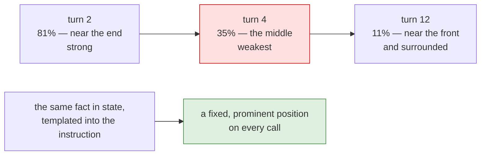

# 3.3 — Position is not presence

## One-line answer

A fact in the window is not a fact the model will use: **where** it sits changes how reliably it is
found, and its position is not something you chose — it drifts as the conversation grows, from the
end, through the middle, towards the beginning.

## The story

The middle of a long meeting.

An hour and a half, twelve people, and everybody can tell you what happened at the start — the agenda,
the awkward thing about the deadline — and what happened at the end, because the end is where somebody
said *"so, to summarise"* and people wrote things down.

The middle is a fog. Something was agreed about the reporting line. Somebody raised a risk. There was
a decision that everybody nodded at and nobody has acted on, and when it comes up three weeks later
four people remember it four different ways.

Nobody left the room. Everything was said in front of everyone. Presence was never the problem.

## The idea in plain language

Everything so far has treated the context window as a set: a fact is in it or it is not. That is not
how models read.

A model attends over its input, and attention is not uniform. The measured finding — from the paper
this part cites — is that performance is **highest when the relevant information is at the beginning or
the end of the context, and degrades in the middle**, and that this holds even for models explicitly
built for long contexts. Put the same fact in the same window in a different place and the answer
changes.

Which turns a question you were not asking into an important one: *where does a given fact end up?*

For an agent, the answer is uncomfortable, and the measurement below shows it. You do not place facts.
Facts arrive **when they arrive**, and their position is decided afterwards by everything that happens
next. A detail the engineer gives you on turn two is at the end of the request on turn two — the best
place — and by turn twelve it has slid to eleven per cent of the way through, having spent the middle
of the conversation in the middle of the window.

Two practical consequences, and they are the two halves of this day's craft:

- **Recency is a lever you already have.** The current message is at the end, always. Anything you
  restate there is in the strongest position, which is why *"the ticket's severity is high"* placed in
  the instruction or repeated near the question outperforms the same fact buried in turn three.
- **Length is a position problem, not only a cost problem.** Every turn you add pushes older facts
  further into the middle. That is a second, independent argument for compaction (Day 20) alongside the
  arithmetic in [1.3](../01-the-binder/1.3-the-organ-that-grows-by-itself.md).

## Why Sutra needs it

Because the facts Sutra cares about most arrive early and are needed late.

The ticket's identifier, the tenant, the version the customer is running, the thing they already tried:
all of that arrives in the first two turns and matters for the whole conversation. By turn ten it is
exactly where the paper says it will be used least reliably.

Sutra has an answer available and has already built it: **state**. A fact worth remembering is written
to a state key when it arrives
([17.3.1](../../../day-17-state-scopes-and-lifetimes/parts/03-three-safe-writes/3.1-writing-from-inside-a-tool.md))
and templated into the instruction on every later call
([17.4.1](../../../day-17-state-scopes-and-lifetimes/parts/04-state-in-the-prompt/4.1-state-steers-the-next-turn.md)).
That moves it from the middle of the history to a fixed, prominent position — which is a *context
engineering* reason for a mechanism Day 17 introduced for bookkeeping reasons.

## The paper behind it

> **Lost in the Middle: How Language Models Use Long Contexts**
> `arXiv:2307.03172` · 2023
> <https://arxiv.org/abs/2307.03172>

It measured what happens when the position of the relevant information inside a long context is moved,
and found that performance is highest at the beginning and the end and **degrades significantly in the
middle** — even for models built for long contexts.

That is the evidence behind this part's claim, and it is taught in
[the paper part](../../papers/01-lost-in-the-middle.md) — read it after the parts.

## The mechanism

Where does a fact actually sit? Watch one drift:

```python
# days/day-19-context-engineering-selection/lab/where_it_lands.py
"""A fact does not stay where you put it: it drifts into the middle. Zero generate calls."""

import asyncio
from collections.abc import AsyncGenerator

from google.adk.agents import Agent
from google.adk.models import BaseLlm, LlmRequest, LlmResponse
from google.adk.runners import Runner
from google.adk.sessions import InMemorySessionService
from google.genai import types

NEEDLE = "the tenant is northwind-prod"


class Recorder(BaseLlm):
    seen: list = []

    async def generate_content_async(
        self, llm_request: LlmRequest, stream: bool = False
    ) -> AsyncGenerator[LlmResponse, None]:
        self.seen.append(llm_request)
        yield LlmResponse(
            content=types.Content(
                role="model", parts=[types.Part(text="noted, thank you for the detail")]
            )
        )


model = Recorder(model="recorder")
agent = Agent(name="desk", model=model, instruction="You are Sutra, the triage desk.")


async def main() -> None:
    service = InMemorySessionService()
    session = await service.create_session(app_name="sutra", user_id="u1")
    runner = Runner(app_name="sutra", agent=agent, session_service=service)

    questions = ["logins are failing", f"one more detail: {NEEDLE}"] + [
        f"turn {i}: what else could it be?" for i in range(3, 13)
    ]
    print("turn  request chars  needle at  fraction through")
    for turn, question in enumerate(questions, start=1):
        async for _ in runner.run_async(
            user_id="u1",
            session_id=session.id,
            new_message=types.Content(role="user", parts=[types.Part(text=question)]),
        ):
            pass
        body = str(model.seen[-1].contents)
        if NEEDLE in body:
            at = body.index(NEEDLE)
            print(f"{turn:>4}  {len(body):>13}  {at:>9}  {at / len(body):>16.0%}")


asyncio.run(main())
```

**Line by line:**

- `NEEDLE` is an ordinary detail an engineer would actually supply on turn two, not a marker: the point
  is that important facts arrive in the middle of ordinary conversation.
- The remaining questions are deliberately uninformative — *"what else could it be?"* — so the growth is
  conversation rather than content, exactly as in
  [1.3](../01-the-binder/1.3-the-organ-that-grows-by-itself.md).
- `body.index(NEEDLE)` — the **absolute** character position, which never changes, because nothing
  rewrites history.
- `at / len(body)` — the **relative** position, which changes on every turn. Those two numbers next to
  each other are the whole finding: the fact did not move, the window grew around it.
- `str(model.seen[-1].contents)` — characters as a stand-in for tokens again. The fraction is what
  matters and it is the same either way.

```bash
cd days/day-19-context-engineering-selection/lab
uv run python where_it_lands.py
```

**Line by line:**

- Twelve turns, zero requests to a provider.

Measured on `google-adk` 2.7.1 on 2026-09-03:

```text
turn  request chars  needle at  fraction through
   2            311        253               81%
   3            517        253               49%
   4            723        253               35%
   5            929        253               27%
   6           1135        253               22%
   7           1341        253               19%
   8           1547        253               16%
   9           1753        253               14%
  10           1960        253               13%
  11           2167        253               12%
  12           2374        253               11%
```

Column three never changes. Column four never stops changing.

On the turn it was given, the tenant was **81% of the way through** the request — near the end, the
strongest position. One turn later it was at the halfway mark, which is precisely where the paper
measured the largest degradation. By turn twelve it had passed through the middle and settled near the
front, still competing with eight times as much surrounding text as when it arrived.

Nobody moved it. It was pushed.



## When it breaks

**The agent forgets something it was told.**

No error, and the sentence users actually say: *"I told you that already."* They did. It is in the
window. It is thirty per cent of the way through a request that is now eight times longer than it was
when they said it, surrounded by turns about something else.

Before blaming the model, check three things in order: is the fact actually in the request
([2.1](../02-anatomy/2.1-opening-the-envelope.md)), where is it
(this part), and is there a shorter version of it in a stronger position (state, templated).

**The fix that makes it worse.** The instinctive response is to add *"remember the tenant is
northwind-prod"* to the instruction — permanently, for every ticket
([2.4](../02-anatomy/2.4-a-subscription-not-a-purchase.md)). That is a per-ticket fact in the
subscription organ. The right shape is a state key, templated, so the *current* ticket's tenant appears
and last week's does not.

**The needle that was never there.** Worth ruling out first, and it is the failure lab
([5.1](../05-failure-lab/5.1-in-state-and-not-in-the-window.md)): a fact recorded in state but never
templated is not in the window at all, and no amount of repositioning helps.

## In production

**Promote facts out of the history and into a fixed position.**

The version a professional builds does not rely on the model finding things in the transcript. When a
fact matters beyond its turn, a tool writes it to state as it arrives, and the instruction templates the
handful that matter now. The transcript keeps the conversation; the instruction carries the facts. That
is the same division of labour Day 17 argued for on bookkeeping grounds, and this part is the second,
independent reason for it.

**What changes at scale** is that ordering becomes a design decision with evidence behind it. Once you
know the ends are strong, the assembly in
[3.1](3.1-a-rule-for-each-organ.md) gets an ordering rule too: standing rules first, the distilled
document next, the current question last — and anything critical restated close to the question.

**What fails only under real traffic** is the long conversation with an early constraint. *"Do not
email the customer directly"* said in turn one, on a thread that runs to forty turns, is exactly the
shape this part describes: a rule at eleven per cent, competing with everything since. Constraints that
matter belong where they cannot drift.

**The review comment**: *"this relies on the model remembering something from turn two. Write it to
state when it arrives and template it — otherwise its position is whatever the conversation does to
it."*

**The interview question**: *"your agent ignores something the user said earlier. What is happening?"*
The answer that shows you have read the evidence: *"presence is not use. The fact is in the context but
it has drifted into the middle as the conversation grew, and models use the beginning and the end more
reliably than the middle. The fix is to promote it out of the transcript into a fixed position, not to
add another sentence telling the model to pay attention."*

## Check yourself

```bash
cd days/day-19-context-engineering-selection/lab
uv run python where_it_lands.py
```

Two columns: one that never changes and one that always does. Say which one the model cares about.

**Out loud, without scrolling up:** state the position finding in one sentence, and say what Sutra does
with a fact that arrives early and matters late.
