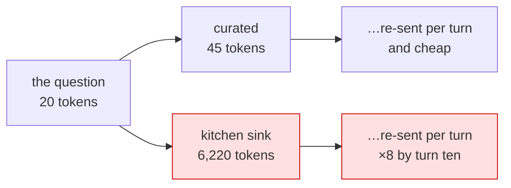

# 4.2 — Curated against kitchen sink

## One-line answer

The same question, packed two ways: **45 tokens against 6,220** — and the expensive version contains
no fact the cheap one lacks, which is what makes the comparison an argument rather than a trade-off.

## The story

The referral letter and the photocopied file.

One doctor writes half a page: what the patient came in with, what has been tried, what the results
were, and the specific question being asked. The specialist reads it in a minute and knows what they
are looking at.

Another sends the whole file. Fourteen years of appointments, two house moves, an old address, three
identical repeat prescriptions, and the relevant test result on page nine.

Both are complete. Only one of them is a referral. And the second one is *more* work for the person
receiving it, not less, which is the opposite of what the sender intended.

## The idea in plain language

Everything in this day has been building to one comparison, and it is worth making explicitly because
the numbers are larger than people expect.

Take a real Sutra question — *"users keep getting logged out, what is the likely cause?"* — and pack it
twice:

- **curated**: the question, plus two facts a tool or state already knows — the severity, and the
  knowledge-base article about the cookie change;
- **kitchen sink**: the question, plus the log somebody pasted.

[1.1](../01-the-binder/1.1-room-is-not-free.md) measured them at 45 and 6,220 tokens.

The important thing about that measurement is **not** the ratio. It is that the curated package
contains everything the kitchen-sink package contains *that bears on the question*. The 6,175 extra
tokens are two hundred copies of a line saying the system was working normally.

That is the shape of almost every over-packed prompt in practice. Not a difficult trade-off between
completeness and cost — a large volume of text that is genuinely irrelevant, included because
selecting was work and including was not.

There is an honest caveat and it belongs here rather than in a footnote: **the curated version is only
better if it contains the answer.** Curating badly is worse than not curating, because the model cannot
ask for what you left out ([3.2](../03-selection/3.2-facts-not-blobs.md) said the same thing from the
other side). Which is why the practice is *distil and keep* — send the finding, keep the evidence
addressable as an artifact
([18.1.1](../../../day-18-artifacts-that-survive/parts/01-not-a-state-key/1.1-the-thing-state-cannot-hold.md)) —
rather than *distil and discard*.

## Why Sutra needs it

Because this comparison is the justification for every rule in section 3, and because Sutra will be
asked to justify them.

The rules cost something: writing a distiller, choosing which facts to template, deciding what a step
needs. The way that cost gets approved is a number, and this is the number. It also makes the
counter-argument concrete — *"but the model might need the rest"* — which is answered by keeping the
rest one artifact fetch away rather than in every request.

And it sets the budget. [6.2](../06-in-production/6.2-a-budget-per-organ.md) has to pick a limit per
organ; the curated package is what a healthy request looks like, and the kitchen-sink one is what the
limit exists to catch.

## The mechanism

The two packages, weighed on the provider's own scale:

```python
# days/day-19-context-engineering-selection/lab/weigh.py
"""Two packages for the same question, weighed on the provider's own scale."""

from google import genai

from sutra.config import load_env

MODEL = "gemini-3.7-flash"
QUESTION = "Ticket 4521: users keep getting logged out. What is the likely cause?"
CURATED = (
    "Known context: severity=high. KB-104: a SameSite cookie change logs users out on redirect."
)
LOG_LINE = "2026-09-03T09:12:41Z INFO auth session refreshed for tenant northwind-prod\n"
KITCHEN_SINK = LOG_LINE * 200


def weigh(client: genai.Client, label: str, text: str) -> None:
    tokens = client.models.count_tokens(model=MODEL, contents=text).total_tokens
    print(
        f"{label:16} {len(text):>7} chars  {tokens:>6} tokens  ({len(text) / tokens:.1f} chars/token)"
    )


def main() -> None:
    load_env()
    client = genai.Client()
    weigh(client, "the question", QUESTION)
    weigh(client, "curated", f"{CURATED}\n\n{QUESTION}")
    weigh(client, "kitchen sink", f"{KITCHEN_SINK}\n\n{QUESTION}")


main()
```

**Line by line:**

- `QUESTION` is identical in both packages, and it is the only thing the model is actually being asked.
- `CURATED` is two facts, in the form a state template or a tool result would supply them
  ([3.2](../03-selection/3.2-facts-not-blobs.md)). Note that it includes the **answer's ingredients**:
  this is a fair comparison only because the curated package can actually answer.
- `LOG_LINE * 200` — the pasted log, and deliberately the *easy* case: two hundred identical lines. A
  real log with varied noise is harder for the model, not easier, so this understates the attention
  cost.
- `weigh(...)` prints three numbers per package, and the third one — chars per token — is the finding
  from [4.1](4.1-a-scale-for-prompts.md) restated: machine output is denser in tokens per character.
- Three `count_tokens` calls, no generations.

```bash
cd days/day-19-context-engineering-selection/lab
uv run python weigh.py
```

**Line by line:**

- Needs a key. Costs no generation quota.

Measured against `gemini-3.7-flash` on 2026-09-03:

```text
the question          69 chars      20 tokens  (3.5 chars/token)
curated              161 chars      45 tokens  (3.6 chars/token)
kitchen sink       15071 chars    6220 tokens  (2.4 chars/token)
```

Now put that next to the free tier. Sutra has **20 requests a day**, and no per-token limit that binds
before the request limit does — so on this tier the token difference costs *latency and attention*
rather than money. The moment Sutra runs anywhere with a token bill, the same conversation costs 138
times as much per call, for information that was already there.

And put it next to [1.3](../01-the-binder/1.3-the-organ-that-grows-by-itself.md), which is where it
becomes serious: a pasted log lands in the **history**, so it is re-sent on every later turn. Pasting
it once at turn three of a ten-turn conversation means paying 6,220 tokens eight times.



## When it breaks

**The curated package leaves out the answer.**

No error, and the one real risk of this whole practice: the model answers from what it was given, which
no longer contains the cause. It is a bug in the distiller
([3.2](../03-selection/3.2-facts-not-blobs.md)) and it is a *findable* bug, unlike the alternative,
where the fact is present and unused ([3.3](../03-selection/3.3-position-is-not-presence.md)).

The mitigation is to keep the evidence reachable. Sutra saves it as an artifact and puts the filename in
state, so *"show me the full log"* is a tool call rather than a lost cause
([18.4.2](../../../day-18-artifacts-that-survive/parts/04-in-the-run/4.2-reading-it-back.md)).

**Somebody optimises the wrong 5%.** Also no error, and common: a week spent shortening the instruction
from 145 characters to 90 while the same request carries a 15,000-character paste
([2.2](../02-anatomy/2.2-six-organs-and-who-packed-them.md)). Measure per organ, then optimise the
largest.

**The comparison is unfair and nobody notices.** If the curated package is missing something the
kitchen-sink one has, the ratio is meaningless and the argument collapses on the first counter-example.
Building the comparison honestly — same question, same answerability — is what makes it usable in a
design discussion.

## In production

**Pick the healthy shape first, then set the limit around it.**

The version a professional builds knows what a normal request for each step looks like — a number per
organ, measured on real traffic — and sets the budget as a multiple of that, not as a round number
somebody liked. The budget is then a detector for the abnormal case rather than a constraint on the
normal one ([6.2](../06-in-production/6.2-a-budget-per-organ.md)).

**What changes at scale** is that the kitchen-sink request becomes a small fraction of calls and a large
fraction of cost. Ninety-five per cent of requests are curated-shaped; the other five per cent carry
somebody's paste and dominate the bill and the latency graph. Optimising the median is optimising the
case that was never a problem.

**What fails only under real traffic** is that people paste. Whatever your interface, somebody will put
a whole log in it, and the right response is not to forbid it — it is to distil it on the way in and
keep the original where it can be fetched.

**The review comment**: *"this sends the whole tool result to the model. What does the step need out of
it, and can the rest be an artifact?"*

**The interview question**: *"how much does over-packing a prompt actually cost?"* The answer that has a
number in it: *"on our own measurement, the same question with two curated facts was 45 tokens and with
a pasted log was 6,220 — and the log contained nothing that bore on the question. The ratio is the
easy part; the discipline is making sure the small version still contains the answer."*

## Check yourself

```bash
cd days/day-19-context-engineering-selection/lab
uv run python weigh.py
```

Then replace `KITCHEN_SINK` with a real log you have to hand, and see whether the ratio is better or
worse than two hundred identical lines.

**Out loud, without scrolling up:** quote the two numbers, and then state the caveat that makes the
comparison honest.
