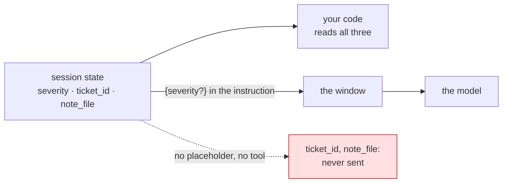

# 5.1 — 💥 In state, and not in the window

## One-line answer

A fact written to session state is in **your code's** memory and not in the model's: unless a
placeholder names it or a tool returns it, it is absent from the request — measured, with no error and
no warning anywhere.

## The story

*"I already gave you that."*

You typed the reference number into the form before the call. It is on the screen in front of you, in
the confirmation email, and — you are fairly sure — in whatever the company's system shows about you.
Then the person on the phone asks for the reference number.

They are not being obtuse. The form you filled in went to one system and the person is looking at
another one, and nothing in their view of the world contains what you typed. From your side it is
obviously there. From theirs it does not exist.

The frustrating part is that both of you are right, and neither of you can see the other's screen.

## The idea in plain language

This is the day's deliberate failure and it is a **belief** rather than a bug.

Day 17 built session state and made it excellent: durable within the conversation, scoped, versioned in
the history, written safely from three places. It is very easy to finish that day believing that state
is what the agent *knows*.

It is not. State is what **your code** knows. The model knows exactly what is in the request, and
[2.1](../02-anatomy/2.1-opening-the-envelope.md) measured what that is: an instruction, tool
declarations, and the conversation. A state key reaches the model through exactly two doors:

1. a **placeholder** in the instruction names it —
   `{severity}` ([17.4.1](../../../day-17-state-scopes-and-lifetimes/parts/04-state-in-the-prompt/4.1-state-steers-the-next-turn.md));
2. a **tool** reads it and returns it, so it arrives in the tool result and lands in the history.

Any other state key — however carefully written, however correctly scoped — is invisible. Not
truncated, not summarised, not deprioritised: **absent**.

### 🎬 The scene

Sutra's intake writes three facts when a ticket arrives: `severity`, `ticket_id` and `note_file`
([18.4.1](../../../day-18-artifacts-that-survive/parts/04-in-the-run/4.1-saving-from-a-tool.md)).

The desk's instruction templates the first one. Nobody templates the other two, because they are for
the *code* — the note's filename is how a later tool finds the file.

Then an engineer asks: *"what did you call the note?"*

### 😬 The naive fix

*"The filename is in state, so the model has it. It must be ignoring the question — tighten the
instruction."*

### 💥 Why it fails

The model has never seen `note_file`. The instruction that was tightened is now longer, is re-sent on
every call for ever ([2.4](../02-anatomy/2.4-a-subscription-not-a-purchase.md)), and cannot possibly
help — because the fact it is telling the model to use is not in the request. The model will answer
anyway, from the conversation, and it will guess a plausible filename.

### 💡 The insight

**Two stores, two readers.** State is for your code; the window is for the model; and the crossing
points are a placeholder and a tool result. Every "the agent has forgotten something it knows" bug
starts with checking which side of that line the fact is on — and the check is one line of code, not an
argument.

## Why Sutra needs it

Because Sutra now has three stores and every one of them tempts this mistake in a slightly different
way.

State tempts it hardest, because it is right there and the code reads it constantly. Artifacts tempt it
too — a saved file is *not* in the model's context until something loads it, which
[18.4.3](../../../day-18-artifacts-that-survive/parts/04-in-the-run/4.3-what-the-model-cannot-see.md)
measured with the same shape of result. And the session's own history tempts it in reverse: things the
model *has* seen and can no longer use well
([3.3](../03-selection/3.3-position-is-not-presence.md)).

Getting this straight is what makes Day 20's compaction safe. If you believe state is context, then
summarising the history looks like forgetting; once you know they are separate, compaction is obviously
the right move — the facts live in state, and the transcript can be shortened.

## The mechanism

Two state keys, one templated, one not, and one line that settles it:

```python
# days/day-19-context-engineering-selection/lab/not_in_the_window.py
"""What the model can see of your state. Zero generate calls."""

import asyncio
from collections.abc import AsyncGenerator

from google.adk.agents import Agent
from google.adk.events import Event, EventActions
from google.adk.models import BaseLlm, LlmRequest, LlmResponse
from google.adk.runners import Runner
from google.adk.sessions import InMemorySessionService
from google.genai import types


class Recorder(BaseLlm):
    seen: list = []

    async def generate_content_async(
        self, llm_request: LlmRequest, stream: bool = False
    ) -> AsyncGenerator[LlmResponse, None]:
        self.seen.append(llm_request)
        yield LlmResponse(content=types.Content(role="model", parts=[types.Part(text="noted")]))


model = Recorder(model="recorder")
agent = Agent(
    name="desk",
    model=model,
    instruction="You are Sutra, the triage desk. This ticket is severity {severity?}.",
)


async def main() -> None:
    service = InMemorySessionService()
    session = await service.create_session(app_name="sutra", user_id="u1")
    await service.append_event(
        session=session,
        event=Event(
            author="intake",
            actions=EventActions(
                state_delta={
                    "severity": "high",
                    "ticket_id": 4521,
                    "note_file": "triage-4521.md",
                }
            ),
        ),
    )
    runner = Runner(app_name="sutra", agent=agent, session_service=service)
    async for _ in runner.run_async(
        user_id="u1",
        session_id=session.id,
        new_message=types.Content(
            role="user", parts=[types.Part(text="what did you call the note?")]
        ),
    ):
        pass

    stored = await service.get_session(app_name="sutra", user_id="u1", session_id=session.id)
    request = model.seen[-1]
    window = str(request.config.system_instruction) + str(request.contents)

    print("state the code can read :", dict(stored.state))
    print()
    for key, value in dict(stored.state).items():
        print(f"  {key:12} in state: yes   in the window: {str(value) in window}")


asyncio.run(main())
```

**Line by line:**

- Three state keys written by an out-of-band event
  ([17.3.3](../../../day-17-state-scopes-and-lifetimes/parts/03-three-safe-writes/3.3-writing-from-outside-a-run.md)),
  the way a real intake step would write them.
- The instruction templates **one** of the three. That asymmetry is the experiment.
- `window = str(system_instruction) + str(contents)` — everything the model was sent, as one string.
  Crude, and exactly right for the question being asked: *is this value anywhere in what we sent?*
- `str(value) in window` — a substring test per key. It over-reports if anything: a value that appears
  by coincidence counts as present. Even so, two of the three come back `False`.
- The agent has **no tools**, deliberately, to close the second door: a tool returning the filename
  would put it in the window legitimately, and the point here is what happens without one.

```bash
cd days/day-19-context-engineering-selection/lab
uv run python not_in_the_window.py
```

**Line by line:**

- One turn, zero requests to a provider.

```text
TODO(me) — paste the real output here. Then add `{note_file?}` to the instruction, run it
again, and note which line changed.
```

The measurement is deliberately left for you, because this one has to be *seen* rather than read —
and the closely related fact is already measured in
[2.1](../02-anatomy/2.1-opening-the-envelope.md), where the same `note_file` key produced
`is note_file (a state key) anywhere in the request? False`.



## When it breaks

**There is no error text. That is the finding.**

Nothing raises, nothing warns, and the model answers. What you get is an agent that appears to have
forgotten something it obviously knows, and a natural instinct to fix it in the instruction — which
makes the prompt longer and cannot possibly work.

The diagnostic order that does work, and it takes about a minute:

1. **Is the value in the request at all?** One substring test against the recorded request. If no, stop
   here: this part is your bug.
2. **If it is in the request, where?** [3.3](../03-selection/3.3-position-is-not-presence.md) — a fact
   at eleven per cent of a long context is present and weak.
3. **Only then**, consider the instruction.

**The variant with artifacts.** Identical shape, one store along: a file saved by a tool is not in the
model's context until `load_artifacts` or a reading tool puts it there
([18.4.3](../../../day-18-artifacts-that-survive/parts/04-in-the-run/4.3-what-the-model-cannot-see.md)).
*"It is saved, so the agent can see it"* is the same false belief about a different store.

**The variant that is nearly right.** A placeholder that is misspelled — `{note_files?}` — silently
resolves to an empty string, because the question mark makes it optional
([17.4.2](../../../day-17-state-scopes-and-lifetimes/parts/04-state-in-the-prompt/4.2-the-brace-that-raises.md)).
The instruction *looks* like it templates the fact. It does not, and there is no error.

## In production

**Decide, per key, whether it is for the code or for the model — and write the decision down.**

The version a professional writes annotates the state keys
([17.7.2](../../../day-17-state-scopes-and-lifetimes/parts/07-in-production/7.2-what-belongs-in-state.md)'s
module is the right place) with which ones are templated. Two or three are; the rest are plumbing. A
reader of that module can then answer *"does the model know this?"* without running anything, which is
the question that will be asked in every future debugging session.

**What changes at scale** is that the two sets drift. A key gets added for code, an instruction gets
rewritten and drops a placeholder, a node in a graph templates a different subset than its neighbour.
The assertion in [6.1](../06-in-production/6.1-testing-what-goes-in-the-window.md) — *these keys are in
the window, those are not* — is what stops the drift being discovered by a user.

**What fails only under real traffic** is the confident guess. A model asked about a filename it has
never seen does not say *"I do not know"* unless the instruction told it to
([Day 6](../../../day-06-instructions-and-personas/LESSON.md)'s honesty rule earns its place here).
It produces something plausible, and plausible filenames are exactly the sort of thing nobody
double-checks.

**The review comment**: *"the model is expected to use `note_file`, and nothing templates it. Add the
placeholder or a tool that returns it — the instruction cannot help."*

**The interview question**: *"your agent ignores a fact that is definitely in its session state. What is
your first check?"* The answer that shows the mental model: *"whether the fact is in the request at
all. State is my code's memory; the model only sees what was sent, and state reaches it through a
placeholder or a tool result and nowhere else."*

## Check yourself

```bash
cd days/day-19-context-engineering-selection/lab
uv run python not_in_the_window.py
```

Three keys, one `True`. Then template a second one and re-run.

**Out loud, without scrolling up:** name the only two ways a state key reaches the model, and say what
the agent does when a fact it needs is missing from the window.
