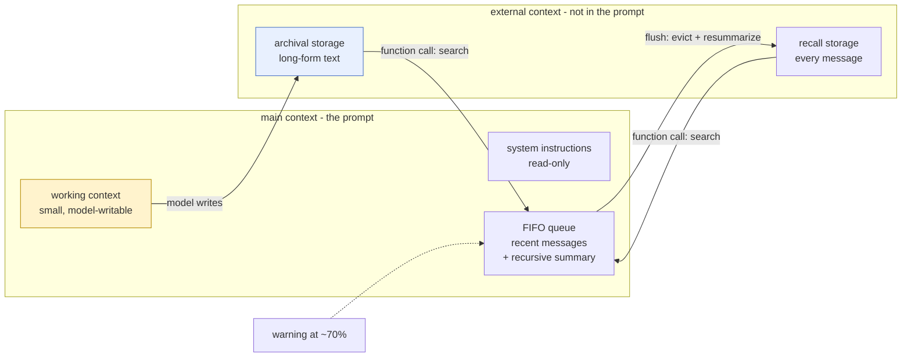

# MemGPT: Towards LLMs as Operating Systems

> **Read this after the parts.** You have now built compaction by hand, watched it shrink a window,
> and watched it lose a constraint the user actually gave. This paper is the proposal that says the
> loss did not have to be permanent.

## One-line answer

It proposed treating the context window as **memory** rather than as a container: a small fast tier
the model reads directly, a large slow tier it cannot, and function calls that let the model **move
things between them itself** when it turns out to need something it no longer has.

## The story

You have a small desk and a filing cabinet behind you.

The desk holds what you are working on right now. It is not big. When somebody hands you a new folder
and there is no room, something goes off the desk — that is not a failure of the desk, it is what
desks are.

The thing that makes the arrangement work is not the size of the desk. It is that you can turn
around. When a phone call goes somewhere you were not expecting and you need the file from March, you
swivel, you open the drawer, and you put it back on the desk.

Now imagine the same desk with the cabinet welded shut. Everything that goes off the desk is gone.
You would work completely differently: you would try to guess, in advance, everything the afternoon
might need, and you would keep it all in front of you, and the desk would be useless because it would
be covered.

Before 2023, agents had the welded cabinet.

## The idea in plain language

The paper's claim is that this is a problem computing has already solved once.

A computer's memory works the same way as the desk. There is a small, fast tier the processor can use
directly, and a large, slow tier it cannot. The operating system moves data between them, and the
program is written as though it had one large memory, because the movement is handled for it. That
illusion is called **virtual memory**, and it is why a program can work on more data than physically
fits.

MemGPT applies the analogy to a language model, and names the parts:

| Tier | What is in it | Can the model read it directly? |
| --- | --- | --- |
| **main context** | the prompt: system instructions, a small read/write **working context**, and a **FIFO queue** of recent messages carrying a recursive summary | yes — this *is* the window |
| **external context** | **archival storage**, a read/write store of long-form text, and **recall storage**, the full message database | no — only through a function call |

Three things in that table are worth slowing down on.

**The working context is a fixed-size block the model can rewrite.** Not the conversation, not a
document — a small scratchpad, in the prompt, holding the facts the agent has decided are important
about this user and this task. That is
[1.4](../parts/01-notes-not-transcript/1.4-what-must-never-be-summarized.md)'s rule proposed as
architecture: the things that must survive live somewhere the summarizer does not reach.

**The recursive summary is compaction.** When the queue fills, older messages are replaced by a
summary — and the *next* summary is generated from the previous summary plus the newly evicted
messages, so it folds forward rather than being rewritten from scratch. That is what you built today,
and ADK's default summarizer prompt admits the same recursion when it opens with *"It may or may not
start from a compacted history"*.

**And the model manages its own memory.** This is the part that is genuinely new. The model is given
function calls that read and write the external tiers, so when a question needs something that is no
longer in the window, it can go and fetch it — rather than answering from what happens to be in front
of it, which is exactly what your agent did in
[4.2](../parts/04-failure-lab/4.2-the-fact-that-was-true-and-is-now-gone.md).

The control flow is the last piece. The system is driven by **events** — a user message, a timer, or
a warning from the system itself — and the model can either produce an answer or call a function and
keep going. The paper describes this as **interrupts**, on the same analogy: the processor is
interrupted, handles the condition, and returns.

## Why Sutra needs it

Because today's mechanism has exactly one gap, and it is the gap this paper is about.

ADK's compaction decides what to keep **once, in advance, forever**. The summarizer reads a stretch
of turns, writes a paragraph, and the detail it dropped is unavailable from that point on — measured
in [4.2](../parts/04-failure-lab/4.2-the-fact-that-was-true-and-is-now-gone.md), where a constraint
the user typed left the window with no error and no way back.

This paper's answer is that the decision does not have to be permanent if the model can reach the
archive. Sutra already has the archive: the session's event log holds every message, uncompacted and
whole ([3.3](../parts/03-reading-the-record/3.3-the-archive-is-still-whole.md) counted it). What
Sutra does not yet have is a way for the agent to look in it.

Phase 7 builds that. Day 46 onwards is memory — a store, a retrieval step, and the tools that let an
agent search its own past — and every design decision there is a descendant of this paper. Reading it
now, having felt the loss, is the point of reading it now.

## The mechanism

The size of the window is a policy question, and the policy has thresholds.

**Warning.** When the prompt reaches a *warning token count* — the paper's example is 70% of capacity
— the queue manager inserts a system message into the queue telling the model that an eviction is
coming. The model can act on that warning: write something important into working context, or push it
to archival storage, before it is lost.

**Flush.** At 100% — the *flush token count* — the queue manager evicts a batch of messages (the
paper's example is 50% of the window) and generates a new recursive summary from the existing summary
plus the messages being evicted. The evicted messages are not destroyed; they remain in recall
storage.

**Retrieval.** Later, if the model needs something that was evicted, it calls a function to search
the external tiers and the result is placed back into the window.

The paper describes these function calls as the interface by which the model manages its own memory
without user intervention; it does not name them in the main text, so this document does not either.
Naming them would be inventing a fact about somebody's paper, and the demo below picks its own name
for its own function.



The claim the diagram makes, and the one to carry away: **every arrow into the prompt is a decision
the model made**, not a rule the framework applied. That is the whole difference from what you built
today.

## The paper in one demo

Two files. A tiered memory with a fixed-size main context, and one function that pages a fact back in
— and nothing else. No framework, no agent loop, no second feature.

The question is *"What is my account id?"*, and the account id was mentioned in the first line of a
conversation that has since scrolled out of a deliberately tiny window.

```text
days/day-20-context-engineering-compaction/lab/papers/memgpt/
├── memory.py   # the two tiers, and the one function that moves a fact between them
└── run.py      # one question, with PAGING on or off
```

```python
# days/day-20-context-engineering-compaction/lab/papers/memgpt/memory.py
"""Two tiers of memory and the one function that moves a fact from the slow tier to the fast one."""

WINDOW_CHARS = 420


class TieredMemory:
    """Main context is small and bounded. Archival storage is large and out of sight."""

    def __init__(self, paging: bool) -> None:
        self.paging = paging
        self.main: list[str] = []
        self.archive: list[str] = []
        self.evictions = 0

    def add(self, line: str) -> None:
        """Append to main context, then page out until main context fits again."""
        self.main.append(line)
        while len(" ".join(self.main)) > WINDOW_CHARS and len(self.main) > 1:
            evicted = self.main.pop(0)
            self.evictions += 1
            if self.paging:
                self.archive.append(evicted)

    def search_archival(self, query: str) -> str:
        """Page a fact back in: the interrupt the paper is about."""
        if not self.paging:
            return "archival storage is disabled"
        hits = [line for line in self.archive if query.lower() in line.lower()]
        return "\n".join(hits) if hits else "no match in archival storage"

    def prompt(self) -> str:
        return "\n".join(self.main)
```

**Line by line:**

- `WINDOW_CHARS = 420` is the whole point of the file. A real window is a million tokens
  ([5.1](../parts/05-in-production/5.1-budgeting-the-minute-taker.md) has the measured limit), and a
  demo that used a real window would need an enormous conversation to prove anything. Shrinking the
  window is the honest way to reproduce memory pressure on a laptop.
- `self.main` is the **FIFO queue** of the table above, and `self.archive` is **archival storage**.
  Two lists is the smallest structure that can hold the paper's claim.
- `while ... and len(self.main) > 1` — evict from the front until it fits, never below one line. The
  guard prevents an infinite loop if a single line is longer than the window, which is the degenerate
  case every real implementation has to handle too.
- `if self.paging: self.archive.append(evicted)` is the **ablation switch**, and it is placed exactly
  here on purpose. With paging off, the eviction still happens — the fact still leaves the window —
  and the only difference is that nothing catches it. That isolates the paper's contribution from the
  ordinary fact that windows overflow.
- `search_archival` is the function the model is allowed to call: substring search over the archive.
  Crude, and correct for this demo — the paper's contribution is that the model can *reach* the slow
  tier, not how the slow tier is indexed. Embeddings would be a second feature, and Day 49 is where
  they belong.
- `search_archival` returns a **string in every branch**, including the failure branches. A function
  the model can call has to answer even when it has nothing, or the loop has no way to continue.

```python
# days/day-20-context-engineering-compaction/lab/papers/memgpt/run.py
"""Ask about a fact that has scrolled out of the window. PAGING=1 can fetch it; PAGING=0 cannot."""

import os
import sys
import time

from google import genai
from google.genai import types
from google.genai.errors import ClientError

from memory import TieredMemory

MODEL = "gemini-3.7-flash"
PAGING = os.environ.get("PAGING", "1") == "1"

TRANSCRIPT = [
    "user: My account id is SUTRA-4521 and my recovery email is priya@example.org.",
    "user: I am getting logged out every few minutes on the web app.",
    "agent: That is usually a cookie problem. Which browser are you using?",
    "user: Safari 17 on an old iPad.",
    "agent: Thanks. I have logged that against the ticket.",
    "user: Also the refund on that order is still waiting for finance sign-off.",
    "agent: Understood, I will not close the ticket.",
    "user: I tried clearing the cache and it did not help.",
    "agent: Noted. We are treating it as the SameSite cookie change in KB-104.",
]
QUESTION = "What is my account id?"

SEARCH_TOOL = types.Tool(
    function_declarations=[
        types.FunctionDeclaration(
            name="search_archival",
            description="Search older conversation text that is no longer in the context window.",
            parameters=types.Schema(
                type=types.Type.OBJECT,
                properties={"query": types.Schema(type=types.Type.STRING)},
                required=["query"],
            ),
        )
    ]
)


def ask(client: genai.Client, contents: list[types.Content]) -> types.GenerateContentResponse:
    """One call, with the backoff Addendum 02 requires."""
    for attempt in range(4):
        try:
            return client.models.generate_content(
                model=MODEL,
                contents=contents,
                config=types.GenerateContentConfig(tools=[SEARCH_TOOL] if PAGING else None),
            )
        except ClientError as exc:
            if exc.code != 429:
                raise
            wait = 2**attempt
            print(f"[429] retrying in {wait}s", file=sys.stderr)
            time.sleep(wait)
    raise RuntimeError("gave up after 4 attempts: free-tier quota exhausted")


def main() -> None:
    memory = TieredMemory(paging=PAGING)
    for line in TRANSCRIPT:
        memory.add(line)

    print(
        f"PAGING={'1' if PAGING else '0'}  main context: {len(memory.prompt())} chars, "
        f"{len(memory.main)} lines, {memory.evictions} evicted, "
        f"{len(memory.archive)} in archival storage"
    )
    print(f"account id still in main context? {'SUTRA-4521' in memory.prompt()}")

    client = genai.Client()
    contents = [
        types.Content(
            role="user",
            parts=[types.Part(text=f"Conversation so far:\n{memory.prompt()}\n\n{QUESTION}")],
        )
    ]
    response = ask(client, contents)

    call = None
    for part in response.candidates[0].content.parts or []:
        if part.function_call:
            call = part.function_call
    if call is None:
        print(f"answer: {response.text.strip()}")
        return

    found = memory.search_archival(call.args["query"])
    print(f"[interrupt] model called search_archival(query={call.args['query']!r}) -> {found!r}")
    contents.append(response.candidates[0].content)
    contents.append(
        types.Content(
            role="user",
            parts=[
                types.Part.from_function_response(
                    name="search_archival", response={"result": found}
                )
            ],
        )
    )
    print(f"answer: {ask(client, contents).text.strip()}")


main()
```

**Line by line:**

- `MODEL = "gemini-3.7-flash"` — Sutra's pinned free-tier model, confirmed on the live model listing
  on 2026-09-03. Addendum 02: free tier only, model string looked up rather than remembered.
- `PAGING = os.environ.get("PAGING", "1") == "1"` — the ablation switch as an environment variable, so
  both arms are one shell command apart and neither requires editing the file.
- `TRANSCRIPT[0]` carries the account id, and it is **first**, so it is the first thing evicted. The
  fact the demo needs is guaranteed to be out of the window by the time the question is asked.
- `tools=[SEARCH_TOOL] if PAGING else None` — with paging off, the model is not merely denied the
  archive, it is not told the function exists. That is the honest ablation: the paper's contribution is
  the model *being able to* fetch, so turning it off has to remove the ability, not just the data.
- `except ClientError as exc: if exc.code != 429: raise` — catch the one status that means "slow down"
  and re-raise everything else. Swallowing other errors here would be Principle 10's exact violation.
- `wait = 2**attempt` — 1, 2, 4, 8: exponential backoff, then give up. `raise RuntimeError(...)` rather
  than returning a placeholder, because a fabricated answer is worse than no answer.
- `for part in ...: if part.function_call` — the model may return text and a function call in the same
  response, so this scans the parts rather than assuming the first one.
- `types.Part.from_function_response(...)` — the result is sent back as a typed function response, not
  as a user message pretending to be one. The model asked a question in a structured way and gets a
  structured answer.
- `ask(client, contents)` a **second** time is the interrupt completing: the first call decided it
  needed the fact, the second answers with it. Two calls, which is the cost the paper's approach adds
  and the reason it is not free.

Run both arms:

```bash
cd days/day-20-context-engineering-compaction/lab/papers/memgpt
PAGING=1 uv run python run.py
PAGING=0 uv run python run.py
```

**Line by line:**

- Run from **inside the demo folder**, because `run.py` imports `memory` by bare name.
- `PAGING=1` first: it is the arm that works, and seeing it work makes the other arm mean something.
- Two model calls in the paging arm, one in the ablation arm — three requests of the day's budget.

**`PAGING=1`, run live against `gemini-3.7-flash` on 2026-09-03:**

```text
PAGING=1  main context: 406 chars, 7 lines, 2 evicted, 2 in archival storage
account id still in main context? False
[interrupt] model called search_archival(query='account id') -> 'user: My account id is SUTRA-4521 and my recovery email is priya@example.org.'
answer: Your account ID is **SUTRA-4521**.
```

Read the second line and the fourth line together. **The account id was not in the window**, and the
model answered with it correctly anyway. Nothing about the window changed: it is still 406 characters,
still seven lines, and the fact is still not in it. What changed is that the model noticed it did not
know, asked for the missing piece by name, and continued.

That is the paper in four lines of output. The window did not get bigger. The agent got a drawer.

**`PAGING=0`, the ablation arm, same day:**

```text
PAGING=0  main context: 406 chars, 7 lines, 2 evicted, 0 in archival storage
account id still in main context? False
```

Two evictions and **zero** in archival storage — the same two lines left the window, and this time
nothing caught them. The account id is equally absent, and there is no function to go and get it.

The model's answer for this arm is missing, and it is missing honestly: the day's free-tier quota for
`gemini-3.7-flash` was exhausted at this point, and the run ended with the backoff giving up rather
than inventing anything:

```text
RuntimeError: gave up after 4 attempts: free-tier quota exhausted
```

`TODO(me)`: complete the ablation on a day with quota. The exact command is

```bash
cd days/day-20-context-engineering-compaction/lab/papers/memgpt && PAGING=0 uv run python run.py
```

**Line by line:**

- `cd` into the demo folder first, for the same reason as every other run of this demo: `run.py`
  imports `memory` by bare name.
- `PAGING=0` is the ablation arm — the one where the model is not told the function exists.
- One generation, on `gemini-3.7-flash`. Run it on a day whose quota has not already gone.

and the line to record is the `answer:` line. What it will say is not the interesting part — the
model has no way to know the account id, so it will say so or guess. **The interesting part is that
you will have watched it, rather than been told.** An invented transcript here would be undetectable
and would poison the one section of this document that is supposed to be evidence.

## When it breaks

The paper is explicit about where its own approach stops working, and the limitation is the one that
matters most for a curriculum running on free models.

**It needs a model that is good at function calling.** The paper reports that MemGPT's performance
degrades significantly with GPT-3.5, attributing it to that model's limited function-calling
capability. The whole architecture rests on the model correctly deciding *when* it does not know
something and issuing the right call. A model that does not reliably do that does not get a smaller
effective window — it gets the same window plus wasted calls.

**And retrieval does not scale to nested reasoning.** On the nested key-value retrieval task, the
paper reports that MemGPT outperforms the corresponding baselines but still begins to drop off at two
levels of nesting. One lookup works. A lookup whose answer tells you what to look up next starts to
fail, which is a real limit on "just let it fetch what it needs".

**The two evaluation domains bound the claim.** Conversational agents were measured on the
Multi-Session Chat dataset (deep memory retrieval, and conversation openers), and document analysis on
multi-document question answering over NaturalQuestions-Open plus the nested key-value task, against
GPT-3.5 Turbo, GPT-4 and GPT-4 Turbo baselines with document truncation. That is what was measured.
Anything else — agents that write code, agents that call twenty tools, agents in a graph — is
extrapolation, and the honest reading of any paper stops where its evaluation stopped.

**There is a cost limit the paper does not dwell on**, and today's parts make it concrete. Every page-in
is an extra model call. [1.3](../parts/01-notes-not-transcript/1.3-you-spend-calls-to-save-calls.md)
measured what extra calls cost on a quota denominated in requests: this demo's paging arm cost two
requests to answer one question. Self-managed memory is not free, and it is least free exactly where
budgets are tightest.

## In production

**What survived, and it survived completely: the tiering.** Every serious agent framework now
distinguishes what is in the prompt from what is in a store the agent can query, and gives the agent
tools to reach the store. ADK has a `MemoryService` alongside sessions and artifacts; Sutra meets it
in Phase 7. The idea that an agent's memory is a hierarchy rather than a buffer is now so ordinary
that it is hard to remember it was a proposal.

**What survived: the working-context scratchpad.** A small, model-writable block of facts, pinned in
the prompt, outside the conversation. That is exactly what
[1.4](../parts/01-notes-not-transcript/1.4-what-must-never-be-summarized.md) recommends as a rule and
what Sutra implements with session state and instruction templating. The specific insight — that the
*agent* should be able to write to it, not only your code — is the part still being figured out.

**What survived: recursive summarization**, which is what you configured today. The summary that folds
the previous summary forward is now the default implementation everywhere, ADK included.

**What did not survive: the operating system as a literal architecture.** Warning thresholds at 70%,
flush at 100%, eviction of half the window, interrupts as a control-flow primitive — the vocabulary
stayed and the machinery did not. Frameworks compact on a turn count or a token threshold, which is
what [2.2](../parts/02-the-config/2.2-the-turn-count-trigger.md) and
[2.3](../parts/02-the-config/2.3-the-size-trigger.md) configure, and they do it *after* an invocation
rather than by interrupting one. Simpler, more predictable, and easier to reason about under
concurrency.

**What did not survive: fully self-managed memory as the default.** The paper's most striking idea is
that the model decides what to remember and when to look. In practice most production systems do the
deciding themselves — deterministic compaction, deterministic retrieval — and give the model a search
tool as an *addition* rather than as the mechanism. The reason is the paper's own limitation: it works
when the model reliably knows what it does not know, and models are less reliable at that than at
almost anything else. Determinism is testable; judgement is not.

**And the thing that changed underneath the paper entirely: windows got enormous.** MemGPT was written
against models with a few thousand tokens of context. `gemini-3.7-flash` reports an input limit of
1,048,576 — read from the live model record on 2026-09-03. The acute problem the paper solved,
*the conversation does not fit*, has largely gone away for conversations. What has not gone away is
everything today measured: room is not free, every token is paid for on every call, and the fact you
dropped is the one the next question needed. The paper solved a capacity problem and turns out to have
been about an economics problem, which is why it is still worth reading in 2026.

## Check yourself

```bash
cd days/day-20-context-engineering-compaction/lab/papers/memgpt
PAGING=1 uv run python run.py
```

Then change `WINDOW_CHARS` to `2000` so nothing is ever evicted, and run it again. The model answers
without calling the function at all — and that is the paper's mechanism correctly deciding it is not
needed.

**Out loud:** what did this paper actually claim, and what do we do differently now? The answer has
two halves: it claimed a small window plus a model-managed store behaves like a big window, and we
kept the store while taking the management away from the model.
