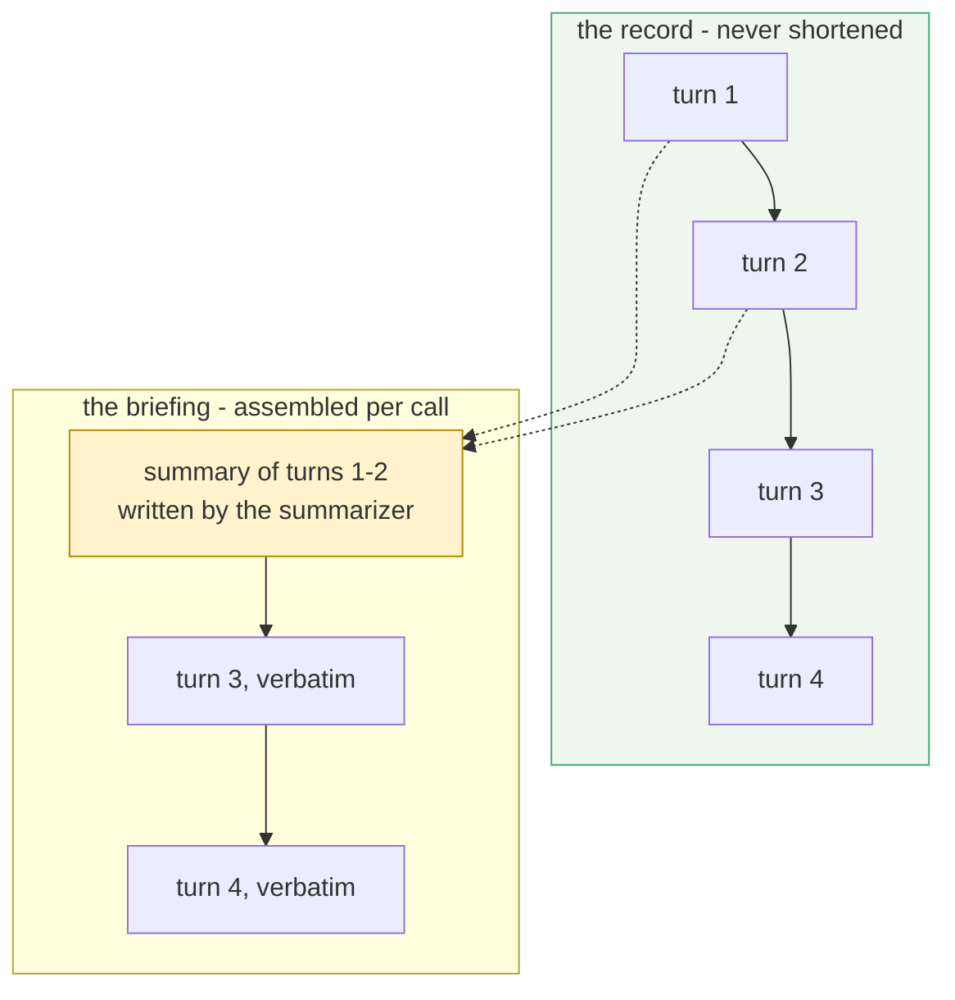

# 1.1 — The archive and the briefing are not the same thing

## One-line answer

**Compaction** is replacing a stretch of what happened with a shorter true account of it, for the
purpose of the next model call only — the full record is kept, and only the *briefing* gets shorter.

## The story

The residents' association meets on the first Saturday of the month.

Somebody records the whole meeting on their phone. Nobody has ever listened to it. What everybody
actually reads is the one page the secretary types up afterwards: the lift repair was approved, the
gate code changes on the fifteenth, the question about the parking bays is still open, and the
treasurer will bring figures next time.

When a new person joins the committee, they are not handed six years of audio. They are handed the
last page of notes and told the two things still unresolved. They are up to speed before the tea
goes cold.

And the recording is still there. When two people disagree in March about what was actually agreed
in January, somebody goes and listens to the tape. That has happened twice in six years, and both
times it mattered.

Two different objects. The tape is the record. The page is what you read before you speak.

## The idea in plain language

Yesterday ended on a measurement: the conversation history is the one part of a request that grows
on its own, it is re-sent in full on every call, and by turn ten it costs about twenty-one times
what turn one cost
([19.1.3](../../../day-19-context-engineering-selection/parts/01-the-binder/1.3-the-organ-that-grows-by-itself.md)).

The obvious fix is to throw old turns away. That fix is wrong, and it is worth being precise about
why, because the reason is the whole idea of today.

**A session's event log is a record.** Day 17 built session state on top of it precisely because it
is complete: every user message, every model reply, every tool call and every result, in order, with
timestamps ([Day 17](../../../day-17-state-scopes-and-lifetimes/LESSON.md)). Deleting from it is
deleting evidence. When a support engineer asks *"why did Sutra tell the customer that?"*, the answer
is in the log or it is nowhere.

**The context window is a briefing.** It is assembled fresh for every single call, out of whatever
you decide to put in it, and it exists for about as long as the call does
([19.2.1](../../../day-19-context-engineering-selection/parts/02-anatomy/2.1-opening-the-envelope.md)).
Nothing about it is permanent, and nothing about it is evidence.

These two have been the same thing on every day of this curriculum so far, because the simplest
possible policy — *send the whole history* — makes the briefing a copy of the record. Today they
come apart. **Compaction** is the name for taking a stretch of the record, asking a model to write a
short true account of it, and putting that account in the briefing *instead of* the turns it covers.

Three words to fix now, because the rest of the day uses them constantly.

| Word | What it means | Who chooses it |
| --- | --- | --- |
| the **summary** | the short account that stands in for a stretch of turns | a model writes it |
| the **summarizer** | the model that writes the summary | you, explicitly — see [4.1](../04-failure-lab/4.1-the-minute-taker-you-did-not-hire.md) |
| the **verbatim window** | the recent stretch that is *not* summarized and is sent word for word | you, as a number |

The claim to hold on to is narrow and exact: **compaction changes what the model sees, never what
the system remembers.**

## Why Sutra needs it

Because Sutra's conversations are the long kind, and its quota is the small kind.

A real triage thread is not three turns. The engineer pastes the ticket, asks for a hypothesis,
supplies the detail Sutra asked for, checks the vendor's status, and asks for the note to be
rewritten for the customer. That is five turns before anything unusual happens, and yesterday's
arithmetic says the fifth costs about five times the first.

There is a Phase 8 reason too, and it is the one that turns an annoyance into a design problem. In a
graph, several nodes run inside a single invocation and each makes its own model call carrying its
own view of the history
([17.2.2](../../../day-17-state-scopes-and-lifetimes/parts/02-four-lifetimes/2.2-an-invocation-is-not-a-session.md)).
The multiplier stops being *turns* and becomes *turns times nodes*. A conversation that is merely
expensive today is the one that will not run at all once it has four nodes in it.

And there is a Phase 7 reason, which is the honest one: memory. Day 46 onwards builds Sutra's
long-term memory, and every design there assumes a conversation can be reduced to something smaller
than itself without becoming false. Today is where that assumption gets tested on one session, in
one file, while you can still see all of it.

## The paper behind it

> **MemGPT: Towards LLMs as Operating Systems**
> `arXiv:2310.08560` · 2023 · <https://arxiv.org/abs/2310.08560>

It claimed that a model with a small fixed context window can behave as though it had a much larger
one, if the system around it moves information between a small fast tier and a large slow tier the
way an operating system moves pages between memory and disk.

That is the split this part just made — a briefing you can afford and a record you keep — taken
several steps further, and it is taught in [the paper part](../../papers/01-memgpt.md). Read it
after the parts.

## The mechanism

At the level of one session, compaction is three decisions and one substitution.



The three decisions are *when* to do it, *how much* to keep verbatim, and *who writes the summary*.
Section 2 is those three decisions as ADK configuration. Before that, here is the substitution
itself with nothing else in the room — no framework, no live model, and a fixed summary so the
result is identical every time you run it.

```python
# days/day-20-context-engineering-compaction/lab/briefing.py
"""Compaction with the machinery removed: a list of turns, a rule, and a substitution."""

TURNS = [
    "user: Ticket 4521 - customers are being logged out.",
    "agent: That is usually a cookie problem. Which browser?",
    "user: Safari 17 on an old iPad.",
    "agent: Logged against the ticket.",
    "user: What severity would you assign it?",
]
SUMMARY = "Earlier: ticket 4521, logout loop, Safari 17 on iPad, suspected cookie change."


def briefing(turns: list[str], keep_verbatim: int, compact: bool) -> list[str]:
    """The record goes in; what the model should be sent comes out."""
    if not compact or len(turns) <= keep_verbatim:
        return list(turns)
    return [SUMMARY, *turns[-keep_verbatim:]]


for compact in (False, True):
    lines = briefing(TURNS, keep_verbatim=2, compact=compact)
    print(f"compact={str(compact):<5} {len(lines)} lines, {len(' '.join(lines))} chars")
    for line in lines:
        print(f"    {line}")
    print()

print(f"the record itself is still {len(TURNS)} turns long")
```

**Line by line:**

- `TURNS` is the record. Nothing in this file ever removes anything from it — that is the point the
  last `print` exists to make.
- `briefing()` **returns a new list**. It does not mutate `turns`, because the record and the
  briefing are two objects and confusing them is the mistake this whole part is about.
- `keep_verbatim=2` is the verbatim window. Everything older is eligible to be replaced.
- `if not compact` is the **ablation switch** — the same function with the idea turned off, so the
  two outputs can be put side by side. Every measurement in this day is built this way, because a
  number with nothing to compare it against is not evidence.
- `len(turns) <= keep_verbatim` is the guard that makes short conversations free. If everything is
  already inside the verbatim window there is nothing older to summarize, and compacting anyway
  would spend a model call to achieve nothing. ADK's triggers exist to make exactly this decision,
  and section 2 is how they make it.
- `[SUMMARY, *turns[-keep_verbatim:]]` is the substitution, in one line. The summary goes **first**,
  where the oldest turns used to be, and the recent turns follow in order. Position is not
  accidental;
  [19.3.3](../../../day-19-context-engineering-selection/parts/03-selection/3.3-position-is-not-presence.md)
  measured what position does to whether a fact gets used.
- `SUMMARY` is a constant so this file needs no key and no network. In ADK a model writes it, and
  [2.1](../02-the-config/2.1-one-config-on-the-app.md) is where that starts.

```bash
cd days/day-20-context-engineering-compaction/lab
uv run python briefing.py
```

**Line by line:**

- No key, no network, no quota. This script is arithmetic about lists.

Measured on 2026-09-03:

```text
compact=False 5 lines, 214 chars
    user: Ticket 4521 - customers are being logged out.
    agent: That is usually a cookie problem. Which browser?
    user: Safari 17 on an old iPad.
    agent: Logged against the ticket.
    user: What severity would you assign it?

compact=True  3 lines, 153 chars
    Earlier: ticket 4521, logout loop, Safari 17 on iPad, suspected cookie change.
    agent: Logged against the ticket.
    user: What severity would you assign it?

the record itself is still 5 turns long
```

Read the last line first. **Five turns, before and after.** The briefing went from five lines to
three and from 214 characters to 153; the record did not move. That is the sentence this part exists
to install, and everything else today is engineering underneath it.

Notice also what the saving is *not*. Twenty-eight per cent, on a five-turn conversation, is
unimpressive — and it should be, because the summary itself takes room. The saving grows with the
length of what it replaces, which is why the interesting question is not *whether* to compact but
*when*, and that is [1.3](1.3-you-spend-calls-to-save-calls.md).

## When it breaks

Nothing in this part can raise an exception — it is a list and a slice. What breaks is the *belief*,
and it breaks with no error attached at all.

🎬 **The scene:** you turn compaction on for Sutra, the token numbers drop, and you are pleased.
😬 **The naive fix:** you assume the record got smaller too, and you tell the support team that old
conversations are now "cleaned up".
💥 **Why it fails:** they are not. The record grows exactly as fast as it did before, because
compaction **appends** a summary rather than deleting anything —
[3.3](../03-reading-the-record/3.3-the-archive-is-still-whole.md) proves this by counting. Your
storage bill is unchanged, your retention policy is unchanged, and the sentence you told the support
team is false.
💡 **The insight:** compaction is a **cost control for inference**, not a data-retention policy.
Those are different problems with different owners, and today only solves the first.

## In production

**The record and the briefing usually end up owned by different people**, and that is the sign the
distinction has landed. The briefing is tuned by whoever owns latency and quota. The record is
governed by whoever owns retention, audit and privacy, and their requirement is often the opposite
of the first one, because a regulator's question is answered from the record.

**What changes at scale** is that the record stops being free to keep. `InMemorySessionService` from
[Day 17](../../../day-17-state-scopes-and-lifetimes/LESSON.md) makes the archive look costless
because it evaporates when the process exits. A database-backed session service does not, and a year
of full transcripts is a real line item. Compaction does not help with that line item at all, which
surprises people who switched it on expecting it to.

**The failure that only appears with real traffic** is the conversation that never ends — a chat
widget that holds one session open for weeks. The briefing stays flat, which is the whole point, and
the record grows without bound underneath it. Nothing alerts, because the number you put on the
dashboard is the one that looks healthy.

**The review comment a senior engineer leaves:** *"this says we're 'trimming history' — trimming
what? If it's the prompt, say prompt. If it's the stored events, that's a retention conversation to
have with legal before this merges."*

**The interview question:** *"if you summarize a conversation to save tokens, what have you lost?"*
The answer that shows you have run it: *"nothing from the record — the summary is appended, not
substituted in storage. What is lost is only from the next prompt, and only the detail the
summarizer judged unimportant. Those are two different risks and I would not manage them the same
way."*

## Check yourself

```bash
cd days/day-20-context-engineering-compaction/lab
uv run python briefing.py
```

Change `keep_verbatim` to `4` and run it again. Watch the saving shrink to almost nothing, and say
why that is correct behaviour rather than a bug.

**Out loud, without scrolling up:** say what compaction changes and what it leaves alone, and name
one question about Sutra that can only be answered from the record.
