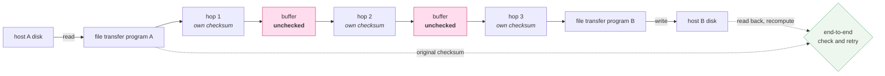

# End-to-end arguments in system design

> **Read this after the parts.** You have now put the error policy in a plugin instead of in eleven
> tools, and measured what happens when a tool handles its own failures. This paper is the argument
> for *why* the layer matters, written in 1984 about file transfers, and it is the same argument.

## One-line answer

It argued that a function implemented at a low level of a system is often **redundant or
insufficient** — because only the endpoints know enough to get it right — and that low-level versions
are justified as *performance improvements*, never as correctness.

## The story

The parcel arrives and the box is intact.

Every carrier who touched it did their job. It was scanned out of the warehouse, scanned onto the
van, scanned at the depot, scanned onto the second van, and scanned at your door. Five checks, five
green ticks, and a tracking page that says the whole journey went perfectly.

You open it and the mug is in pieces.

Nobody lied on the tracking page. The scans confirmed that the *box* moved from each place to the
next, which is what a scan can confirm. The mug was broken by the drop between the second van and
the doorstep, which is not a leg of the journey — it is the handover *between* legs, and nobody
scans a handover.

The only check that would have caught it is the one you just did: opening the box at the end.

## The idea in plain language

The paper's own summary of the argument, from its abstract:

> *"The principle, called the end-to-end argument, suggests that functions placed at low levels of a
> system may be redundant or of little value when compared with the cost of providing them at that
> low level."*

Two words in that sentence are doing all the work, and they are two different criticisms.

**Redundant.** If the endpoints have to check anyway, a check in the middle has not removed any work,
only added some. You still open the box.

**Of little value.** Worse than redundant: the low-level check *cannot* cover the whole problem,
because the problem includes things that happen where the low level cannot see. A per-hop scan cannot
detect a drop between hops.

The paper's worked example is **careful file transfer**: moving a file from one machine's disk to
another's without damage. It enumerates five threats a careful designer would worry about — quoted
here rather than paraphrased, because the specific list is the argument:

| # | The threat, as the paper states it |
| --- | --- |
| 1 | *"The file, though originally written correctly onto the disk at host A, if read now may contain incorrect data, perhaps because of hardware faults in the disk storage system."* |
| 2 | *"The software of the file system, the file transfer program, or the data communication system might make a mistake in buffering and copying the data of the file, either at host A or host B."* |
| 3 | *"The hardware processor or its local memory might have a transient error while doing the buffering and copying, either at host A or host B."* |
| 4 | *"The communication system might drop or change the bits in a packet, or lose a packet or deliver a packet more than once."* |
| 5 | *"Either of the hosts may crash part way through the transaction after performing an unknown amount..."* |

Now look at which threats a reliable network protects you from. **Number four. Only number four.**
Threats one, two, three and five all happen outside the communication system entirely — on a disk, in
a buffer, in a processor, in a crash. A perfectly reliable network leaves four of the five untouched,
and the paper notes that countering threat two in particular *"requires writing correct programs,
which task is quite difficult, and not all the programs that must be correct are written by the file
transfer application programmer."*

So the paper proposes the alternative it calls **"end-to-end check and retry"**: store a checksum with
the file, transfer it, have the receiving end read the file *back off its own disk*, recompute the
checksum, compare with the original, and only then declare the transaction committed. If the
comparison fails, retry from the beginning.

That check is the only one positioned to catch all five threats, because it is the only one that
compares what finally exists against what originally existed.

## Why Sutra needs it

Because [5.1](../parts/05-in-production/5.1-one-policy-not-a-hundred.md) made a placement decision
and gave a maintenance argument for it. This paper supplies the *correctness* argument, which is
stronger.

The maintenance case for a plugin was about line counts and new tools inheriting policy. Real, and
somebody can disagree with it. The end-to-end case is that a tool **cannot** implement the policy
correctly, because the policy needs knowledge the tool does not have:

- whether this failure is worth retrying depends on the whole request's remaining budget, which the
  tool cannot see ([3.1](../parts/03-policy/3.1-which-429-is-it.md));
- whether the user may see the detail is a decision about *this* caller, which the tool does not know
  ([3.3](../parts/03-policy/3.3-giving-up-honestly.md));
- whether a substitute is acceptable depends on what the rest of the conversation is doing
  ([3.2](../parts/03-policy/3.2-a-substitute-must-say-so.md)).

And it explains the exact shape of trap #4. A tool that catches its own exception is a *low-level
mechanism implementing a high-level function*, and the paper predicts precisely what
[4.1](../parts/04-failure-lab/4.1-the-swallowed-exception.md) measured: it does not remove the need
for the check above it, it removes the *information* the check above it needed.

The forward reference is Phase 6. Day 43's stateless MCP servers, Day 60's durability and Day 64's
approval gates are all decisions about which layer owns a guarantee, and this is the paper that framed
that question for the field.

## The mechanism

The method, written out as the paper describes it, for a three-hop transfer:



The two pink boxes are the point. Each hop verifies its own leg and reports success honestly. The
handovers between hops are threats two and three from the table above — buffering and copying, in
software or in memory — and no hop's checksum covers them, because they are not on any hop.

The dotted line is the end-to-end check: read back from the destination disk, recompute, compare with
the original. It is the only edge in the diagram that spans the whole journey.

## The paper in one demo

Two files. Three hops, each with its own checksum, a corruption injected in a handover buffer, and one
environment variable that turns the end-to-end check on and off.

```text
days/day-21-errors-surface-not-swallow/lab/papers/end-to-end-arguments/
├── link.py       # a hop that checksums its own leg, and the buffer between hops
└── transfer.py   # the transfer, with END_TO_END on or off
```

```python
# days/day-21-errors-surface-not-swallow/lab/papers/end-to-end-arguments/link.py
"""One hop with its own error checking, and the buffer between hops that nobody checks."""

import zlib


class CorruptedInFlight(Exception):
    """Raised by a hop when its own checksum does not match."""


class Hop:
    """A link that checksums what it carries - and reports success when its check passes."""

    def __init__(self, name: str) -> None:
        self.name = name
        self.checks_passed = 0

    def send(self, payload: bytes) -> bytes:
        """Carry the payload, verifying it arrived as it left this hop."""
        sent_crc = zlib.crc32(payload)
        received = payload  # the wire itself is fine; this hop is doing its job
        if zlib.crc32(received) != sent_crc:
            raise CorruptedInFlight(f"{self.name}: crc mismatch on the wire")
        self.checks_passed += 1
        return received


def buffer_copy(payload: bytes, corrupt_at: int | None) -> bytes:
    """Hand the payload from one hop to the next, through memory no hop checksums."""
    if corrupt_at is None:
        return payload
    data = bytearray(payload)
    data[corrupt_at] ^= 0x20  # one bit: 'S' becomes 's'
    return bytes(data)
```

**Line by line:**

- `Hop.send` computes the checksum, "transmits", and verifies — and `received = payload` is deliberate:
  **the hop is not faulty.** The wire genuinely works. Making the hops unreliable would be a different
  paper; the whole point is that correct low-level checks are not enough.
- `self.checks_passed += 1` records the hop's honest success. This is the tracking page in the story:
  accurate, and about the wrong thing.
- `buffer_copy` is where the damage happens, and it is a **free function rather than a method**,
  because it does not belong to any hop. That is the structural claim of the paper expressed as code:
  the corruption is in a place no hop owns, so no hop can check it.
- `data[corrupt_at] ^= 0x20` is a single-bit flip — the smallest possible corruption, and the kind
  threats two and three actually produce. `0x20` is the bit that distinguishes upper from lower case in
  ASCII, which makes the damage visible in the output rather than a control character.
- `bytearray` then `bytes` because `bytes` is immutable; the mutable copy is the only way to flip a
  byte in place.
- `CorruptedInFlight` is defined and, in this demo, **never raised** — which is itself the result. A
  reader who expects the hop to catch this is exactly the reader the paper was written for.

```python
# days/day-21-errors-surface-not-swallow/lab/papers/end-to-end-arguments/transfer.py
"""Every hop checks its own work. END_TO_END=1 adds the one check that actually decides."""

import os
import zlib

from link import Hop, buffer_copy

END_TO_END = os.environ.get("END_TO_END", "1") == "1"
CORRUPT_AT = 4  # inside the word "ticket", in a buffer no hop looks at

ORIGINAL = b"ticket 4521: Safari 17 on iPad; do not close until finance signs off"
HOPS = ("client->gateway", "gateway->relay", "relay->server")


def transfer(payload: bytes) -> tuple[bytes, list[str]]:
    """Carry the payload across every hop, corrupting it once in between."""
    report = []
    carried = payload
    for index, name in enumerate(HOPS):
        hop = Hop(name)
        carried = hop.send(carried)
        report.append(f"{name}: check passed")
        # The handover into the next hop happens in memory that no hop protects.
        corrupt_here = CORRUPT_AT if index == 0 else None
        carried = buffer_copy(carried, corrupt_here)
    return carried, report


received, report = transfer(ORIGINAL)

print(f"END_TO_END={'1' if END_TO_END else '0'}")
for line in report:
    print(f"    {line}")
print(f"  every hop reported success: {len(report)}/{len(HOPS)}")

if END_TO_END:
    expected = zlib.crc32(ORIGINAL)
    actual = zlib.crc32(received)
    if actual != expected:
        print(f"  END-TO-END CHECK FAILED: crc {actual} != {expected}")
        print("  accepted: no  (retransmit)")
    else:
        print("  end-to-end check passed")
        print("  accepted: yes")
else:
    print("  no end-to-end check performed")
    print("  accepted: yes")

print(f"\n  sent    : {ORIGINAL.decode()}")
print(f"  received: {received.decode()}")
print(f"  identical: {received == ORIGINAL}")
```

**Line by line:**

- `ORIGINAL` is a Sutra ticket line rather than "hello world", so the corruption lands in something
  whose damage you can judge. It also carries *"do not close until finance signs off"* — a callback to
  [Day 20](../../day-20-context-engineering-compaction/parts/04-failure-lab/4.2-the-fact-that-was-true-and-is-now-gone.md),
  where the same sentence went missing a different way.
- `corrupt_here = CORRUPT_AT if index == 0 else None` corrupts **once**, in the first handover. One
  event, three honest hops — the minimum configuration that makes the point.
- The `expected`/`actual` comparison is the paper's *"end-to-end check and retry"*, reduced to its
  smallest form: the checksum of what was originally sent, against the checksum of what finally
  arrived.
- `zlib.crc32` is stdlib, which matters: this demo has **no dependencies, no model and no network**, so
  it is zero-budget in the strictest sense available — there is nothing to spend. Addendum 02's 429
  handling has nothing to handle here, and saying so is more honest than adding a model to satisfy a
  template.
- `accepted: no (retransmit)` rather than raising, because *retry from the beginning* is what the paper
  prescribes and the demo should say what it would do next.
- The final three lines print sent, received and `identical`, so the reader can see the damage rather
  than take the checksum's word for it.

```bash
cd days/day-21-errors-surface-not-swallow/lab/papers/end-to-end-arguments
END_TO_END=1 uv run python transfer.py
END_TO_END=0 uv run python transfer.py
```

**Line by line:**

- Run from **inside the demo folder**, because `transfer.py` imports `link` by bare name.
- Two runs, one variable. No key, no network, no quota, nothing to configure.

Measured on 2026-09-03:

```text
END_TO_END=1
    client->gateway: check passed
    gateway->relay: check passed
    relay->server: check passed
  every hop reported success: 3/3
  END-TO-END CHECK FAILED: crc 1535517903 != 3156789940
  accepted: no  (retransmit)

  sent    : ticket 4521: Safari 17 on iPad; do not close until finance signs off
  received: tickEt 4521: Safari 17 on iPad; do not close until finance signs off
  identical: False

END_TO_END=0
    client->gateway: check passed
    gateway->relay: check passed
    relay->server: check passed
  every hop reported success: 3/3
  no end-to-end check performed
  accepted: yes

  sent    : ticket 4521: Safari 17 on iPad; do not close until finance signs off
  received: tickEt 4521: Safari 17 on iPad; do not close until finance signs off
  identical: False
```

**`3/3` in both arms.** Every hop's own check passed, in both runs, truthfully. There is no faulty
component anywhere in this system, and the data is still wrong.

**`identical: False` in both arms.** The corruption is not a property of the checking policy — it
happened, once, in a buffer, and it is present either way. What changes is whether anyone finds out.

**And the last line of each arm is the paper's whole thesis.** `accepted: no (retransmit)` against
`accepted: yes`. The identical corrupted payload is rejected by a system with an end-to-end check and
committed by a system with three correct low-level ones.

**`tickEt`.** One bit, and it is right there in the output where a summary would have hidden it.

## When it breaks

The paper is careful about its own limits, and the section is titled *Performance aspects*:

> *"It would be too simplistic to conclude that the lower levels should play no part in obtaining
> reliability, however."*

The argument it makes there is quantitative and it constrains the principle sharply. On a network
dropping one message in a hundred, end-to-end check-and-retry alone *"would perform more poorly as
the length of the file increases"* — because the probability of every packet arriving correctly falls
exponentially with length, so the expected transfer time grows exponentially. A file long enough never
completes.

So low-level reliability is not redundant in practice; it is what makes the end-to-end check
*affordable*. The paper's formulation of the limit is the sentence worth memorising:

> *"But the key idea here is that the lower levels need not provide 'perfect' reliability."*

Three further limits are worth naming honestly.

**It is an argument about placement, not a prohibition.** *"Justified only as performance
enhancements"* is not *"never do it"*. Retries in a plugin, connection pooling, per-hop checksums —
all fine, all valuable, none of them a substitute for the check at the end.

**Its examples are 1984's.** Bit error recovery, encryption, duplicate message suppression, crash
recovery, delivery acknowledgement. Not a language model in sight. Everything this day applies it to
is extrapolation from a principle, which is legitimate and is not the same as being measured.

**And "the endpoint" is not always obvious.** The paper assumes you can identify the application's
ends. In an agent system the honest question is whether the endpoint is the plugin, the runner, the
calling service, or the human reading the answer — and
[3.3](../parts/03-policy/3.3-giving-up-honestly.md)'s two audiences are that ambiguity showing up as a
design decision.

## In production

**What survived: the argument itself, almost completely.** *Put the check where the knowledge is* is
now the default instinct in distributed systems, and the reasoning is routinely rehearsed in design
reviews without anybody citing the source. TCP does not guarantee your data is correct on disk;
applications checksum. Message queues do not guarantee exactly-once; consumers are made idempotent.
Every one of those is this paper.

**What survived: end-to-end encryption**, which is the paper's *"security using encryption"* example
taken to its conclusion. The argument that encryption belongs at the endpoints rather than in the
network is now a consumer expectation with a marketing name, which is an unusual fate for a 1984
systems principle.

**What survived, in agents specifically: idempotency and verification at the caller.** The reason a
well-built agent re-reads a record after writing it, or asks a second model to check the first, is this
argument. So is trap #4: the framework's insistence that the *runtime* handle errors rather than the
tool is ADK putting the function at the layer with the knowledge.

**What did not survive: the strong reading.** *"Low level mechanisms are justified only as performance
enhancements"* was taken by some as an argument for a maximally dumb network, and that is not how
anything got built. Middleboxes, CDNs, TLS termination, load balancers, retrying gateways and
service meshes are all function in the middle, and they exist because the performance justification the
paper allowed for turns out to cover almost everything anybody wanted to do. The principle was not
refuted; its exception clause swallowed the field.

**And what changed underneath it: the layers moved.** In 1984 the low level was a wire and the endpoint
was an application. In 2026 the "low level" is often somebody else's managed service with more
engineers on it than your entire company, and the endpoint is a function you wrote on a Tuesday.
Deciding where the knowledge lives is harder than it was, and the paper's question — *does this layer
know enough to do this correctly and completely?* — is the part that still does the work.

## Check yourself

```bash
cd days/day-21-errors-surface-not-swallow/lab/papers/end-to-end-arguments
END_TO_END=1 uv run python transfer.py
```

Now set `CORRUPT_AT = None` so nothing is damaged, and run both arms. Both accept, both are identical,
and the end-to-end check costs a checksum for nothing — which is the *"redundant"* half of the paper's
claim, and the reason the performance section exists.

**Out loud:** what did this paper actually claim, and what do we do differently now? The two halves:
it claimed a function belongs at the layer with enough knowledge to complete it, and that lower layers
earn their place on performance alone — and we now build enormous amounts of function into the middle,
justified by exactly the performance exception it granted.
