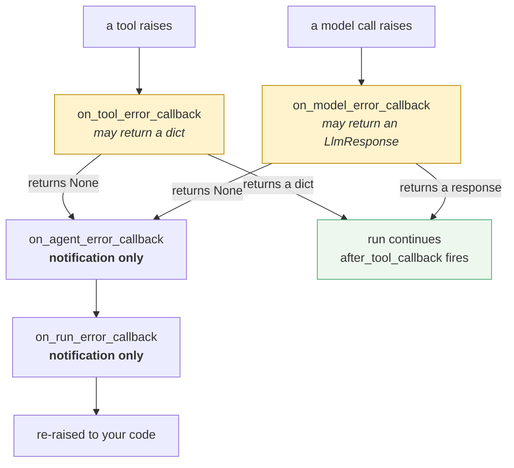

# 2.4 — The ladder — which hooks fire, and in what order

## One-line answer

An exception climbs outwards from where it happened: a tool failure goes **tool → agent → run**, a
model failure goes **model → agent → run**, and the first hook that returns a value ends the climb —
so where you intervene decides who else ever finds out.

## The story

The complaint about the noisy extractor fan goes to the shift supervisor first.

If she can sort it, that is where it stops. Nobody above her hears about it, which is usually right
and is occasionally how a plant runs for a year with a fan nobody has budget to replace, because it
has been "sorted" eleven times.

If she cannot, it goes to the plant manager. If he cannot, it goes to head office, and at that point
it is on a list that somebody reviews on a Monday.

Each level can settle it. Each level that settles it also stops everyone above from knowing it
happened.

## The idea in plain language

Sections 2.2 and 2.3 covered the four hooks one at a time. This part is about the shape they make
together, which is the thing you actually design against.

An exception starts at the point of failure and climbs. There are two entry points, because there are
two kinds of call an agent makes:



Three rules read off that diagram, and they are the whole of ADK's error model.

**The first rung is specific, the rest are general.** Only the entry hook knows *what* failed — which
tool, with which arguments, or which model request. By the agent level that has been reduced to "an
exception", and by the run level to "the invocation failed". Information is lost going up, which is
why classification belongs at the bottom.

**Only the first rung can stop the climb.** The two hooks that can rescue are the two entry points,
and a rescue means the agent and run hooks never fire at all. That is not a bug to work around; it is
the design. But it has a consequence people are surprised by: **a system that rescues well has a
run-level error rate of nearly zero, including during an outage.**

**Everything above the first rung always fires, in order, and then it re-raises.** No configuration,
no ordering to declare. If the exception gets past the entry hook, both witnesses see it.

The practical shape of a policy follows directly: **classify and decide at the entry hooks; record at
the witness hooks.** Anything else is either deciding without information or recording in a place that
only sees some of the failures.

## Why Sutra needs it

Because Sutra is about to have both entry points live at once, and they need different policies.

A knowledge-base timeout is a *tool* failure and it should usually be substituted — the conversation
can continue without that article. A daily quota exhaustion is a *model* failure and it should usually
end the turn honestly, because there is no answer to give. Same plugin, same run, opposite decisions,
and the only thing that distinguishes them at the moment of the decision is which entry hook was
called.

It also sets up the graph work directly. In Phase 8 an invocation contains several agents, so the
middle rung stops being decoration: `on_agent_error_callback` is the only hook that can tell you
*which node* failed, and a system that has never used it will not have the field in its logs when it
first needs it.

## The mechanism

Two failures, two entry points, the same plugin listening at all four rungs.

First, a **tool** failure, with the tool hook declining to rescue:

```bash
cd days/day-21-errors-surface-not-swallow/lab
RESCUE=0 uv run python rescue.py
```

**Line by line:**

- `RESCUE=0` makes `on_tool_error_callback` return `None`, so the climb continues.
- Recording models throughout: no key, no network, no quota.

Measured on `google-adk` 2.7.1 on 2026-09-03:

```text
RESCUE=0
    on_tool_error_callback   TimeoutError
    on_agent_error_callback  TimeoutError
    on_run_error_callback    TimeoutError
  the run raised: TimeoutError: kb.internal:8080 timed out after 5s
```

Now a **model** failure, in a different file, with the model hook declining to rescue:

```python
# days/day-21-errors-surface-not-swallow/lab/model_error.py


class Flaky(BaseLlm):
    """Returns 429 for the first FAILURES calls, then answers."""

    async def generate_content_async(
        self, llm_request: LlmRequest, stream: bool = False
    ) -> AsyncGenerator[LlmResponse, None]:
        global FAILURES
        if FAILURES > 0:
            FAILURES -= 1
            LOG.append(f"model call -> 429 (remaining failures: {FAILURES})")
            raise RuntimeError(
                "429 RESOURCE_EXHAUSTED. {'error': {'code': 429, 'message': "
                "'You exceeded your current quota', 'status': 'RESOURCE_EXHAUSTED'}}"
            )
        LOG.append("model call -> 200")
        yield LlmResponse(
            content=types.Content(role="model", parts=[types.Part(text="Severity 2.")])
        )
```

**Line by line:**

- `Flaky` raises **inside** `generate_content_async`, which is how a real provider error arrives: the
  SDK raises out of the call rather than returning an error response.
- `global FAILURES` with a countdown makes the failure exhaustible, so the same file can show both a
  transient failure that clears and a permanent one that does not, by changing one environment
  variable.
- The message text is the shape of a real 429 body, so the classification in
  [3.1](../03-policy/3.1-which-429-is-it.md) is being written against something realistic rather than
  against the word `"error"`.
- It raises `RuntimeError` rather than the provider's own exception class, because this file must run
  with no network. The classification under test is on the *message*, which is what the real one would
  carry too.
- `yield` after the failure branch, not `return` — `generate_content_async` is an async generator, and
  a `BaseLlm` that returns instead of yielding produces a confusing empty-response failure rather than
  an error.

```bash
cd days/day-21-errors-surface-not-swallow/lab
POLICY=propagate FAILURES=1 uv run python model_error.py
```

**Line by line:**

- `POLICY=propagate` makes `on_model_error_callback` return `None`, so this is the same experiment as
  the tool one with a different entry point.
- `FAILURES=1` means exactly one failed call, so the ladder is walked once.

Measured on `google-adk` 2.7.1 on 2026-09-03:

```text
POLICY=propagate
    model call -> 429 (remaining failures: 0)
    on_model_error_callback  retryable=True
    on_agent_error_callback  RuntimeError
    on_run_error_callback    RuntimeError
  the run raised: RuntimeError: 429 RESOURCE_EXHAUSTED. {'error': {'code': 429, 'message': '...
  the user was told: None
```

Put the two outputs side by side and the ladder is unmistakable.

| | tool failure | model failure |
| --- | --- | --- |
| rung 1 | `on_tool_error_callback` | `on_model_error_callback` |
| rung 2 | `on_agent_error_callback` | `on_agent_error_callback` |
| rung 3 | `on_run_error_callback` | `on_run_error_callback` |
| ending | re-raised unchanged | re-raised unchanged |

**The bottom rung differs and the top two do not.** That is the design in one observation: the entry
point is where you know what happened, and everything above it is generic. A policy that only
implements `on_run_error_callback` is a policy that can log and cannot decide.

**And the exception type survives the whole climb.** `TimeoutError` in, `TimeoutError` out;
`RuntimeError` in, `RuntimeError` out. ADK does not wrap your exceptions on the way past — which is
what makes `isinstance` checks in your own `try` still work, and what makes the wrapped
`RuntimeError` from [2.2](2.2-the-two-that-can-rescue.md)'s *When it breaks* so conspicuous when it
does appear: a wrapped error means the wrapping happened in a *plugin*, not in the runtime.

Compare with the rescued run from [2.2](2.2-the-two-that-can-rescue.md), where the same tool failure
produced **one** hook line instead of three. Same failure, same plugin, one `return` — and two levels
of the system never heard about it.

## When it breaks

There is no exception to show here; the ladder does not fail. What breaks is a monitoring assumption,
and the four-beat is exact.

🎬 **The scene:** you implement a good tool-level rescue for the knowledge base. Errors stop appearing
in the dashboard, which is what you wanted.
😬 **The naive fix:** none, because nothing looks wrong. The run-level error rate is flat at zero.
💥 **Why it fails:** the run-level error rate is flat at zero *because the rescue works*. The knowledge
base has been down for six hours. Every answer in those six hours has been *"I could not reach the
knowledge base"*, every one of them counted as a success, and the graph you built to notice outages is
measuring the rung the exception no longer reaches.
💡 **The insight:** rescuing moves the signal, it does not remove the incident. Anything you rescue at
rung one has to be *counted* at rung one, because no higher rung will ever see it again.

## In production

**Emit a metric from the entry hooks, not only from the witnesses.** One counter per rescue, tagged
with the tool name and the error type. It is three lines in the hook you are already writing, and it
is the only number that moves during a well-handled outage.

**What changes at scale** is that the middle rung earns its place. A single-agent system can ignore
`on_agent_error_callback` with almost no loss. A graph with six nodes cannot: *which node* is the
first thing an on-call engineer asks, the run hook does not know, and retrofitting the field into your
log schema during an incident is not when you want to be doing it.

**The failure that only appears with real traffic** is the rescue that hides a *different* failure than
the one it was written for. A tool hook written for `TimeoutError` that returns a dict for any
exception will also rescue the `KeyError` from a typo in your own tool code — and because rescuing
ends the climb, that bug never reaches the run hook, never reaches your exception tracker, and shows
up only as a slow drift in answer quality.

**The review comment a senior engineer leaves:** *"the tool hook rescues everything, so nothing ever
reaches the run hook. Our error dashboard has been flat since that shipped. Narrow the rescue by
exception type and add a counter where you rescue."*

**The interview question:** *"walk me through what happens when a tool inside your agent throws."* The
answer that shows you have traced it: *"it climbs — the tool hook first, then the agent hook, then the
run hook, then it's re-raised to my code. The tool hook is the only one that knows which tool it was
and the only one that can substitute a result. If it does substitute, the other two never fire, so
anything I rescue I also have to count, or an outage looks like a clean run."*

## Check yourself

```bash
cd days/day-21-errors-surface-not-swallow/lab
RESCUE=0 uv run python rescue.py
POLICY=propagate FAILURES=1 uv run python model_error.py
RESCUE=1 uv run python rescue.py
```

Three runs, three ladders: two full climbs from different entry points and one that stops at the first
rung. Count the hook lines in each before reading the rest of the output.

**Out loud, without scrolling up:** give the two entry points and the two rungs they share, and say
what a well-implemented rescue does to your run-level error rate during an outage.
