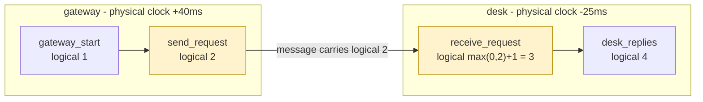

# Time, clocks, and the ordering of events in a distributed system

> **Read this after the parts.** You have now watched forty log lines land in one millisecond and
> fixed it with a counter. This is the 1978 paper that says what to do when the counter is not enough
> because the lines came from two machines.

## One-line answer

It argued that physical clocks cannot order the events of a distributed system, defined an ordering
built from **what could have caused what**, and showed that a single counter per process plus one rule
for messages is enough to produce it.

## The story

Two site offices on a big job, half a mile apart, each keeping a diary.

The groundworks foreman writes: *Tuesday, poured the slab.* The steel foreman writes: *Tuesday, set
the columns.* Head office reads both diaries in January and cannot tell which happened first, and it
matters, because you cannot set columns on a slab that has not gone off.

Somebody suggests both offices set their watches by the radio. It helps and it does not settle it —
the watches drift, one office is an hour behind on the paperwork, and a diary entry is written up at
the end of the day anyway.

What actually settles it is a sheet that travels with the delivery note. The groundworks foreman
writes his entry number on the note. The steel foreman, receiving it, starts his next entry after
that number. Neither watch matters any more, because the *paper* carries the order.

## The idea in plain language

The paper starts by rejecting the thing everybody reaches for. In a system of separate processes there
is no observer with a true clock, so *"which happened first"* cannot be answered by comparing
readings. Two clocks differ, and no amount of setting them fixes it in general.

So it asks a different question. Instead of *when* did these happen, ask: **could one have affected
the other?** That gives a relation the paper writes as `→` and calls **"happened before"**, defined
by three rules:

| Rule | If… | then |
| --- | --- | --- |
| same process | `a` comes before `b` in one process | `a → b` |
| a message | `a` is the sending of a message and `b` is its receipt | `a → b` |
| transitivity | `a → b` and `b → c` | `a → c` |

And if neither `a → b` nor `b → a`, the two events are **concurrent** — which does not mean they
happened at the same instant. It means *nothing in the system could tell*, because no chain of
messages connects them. That is the paper's sharpest move: concurrency stops being a statement about
time and becomes a statement about information.

Then it makes the relation computable. Each process keeps a counter — a **logical clock** — and the
requirement is that the numbers respect `→`: if `a → b`, then `a`'s number is smaller than `b`'s. Two
implementation rules achieve it, and the paper labels them **IR1** and **IR2**:

- **IR1.** A process increments its counter between successive events of its own.
- **IR2.** A sender puts its counter value in the message. On receipt, the receiver sets its counter
  to **greater than both** its own current value and the number in the message — in practice
  `max(own, received) + 1`.

That is the whole mechanism. One integer per process and one line in the message handler.

Two things about it are worth stating precisely, because both matter for logs.

**It gives you a partial order, not a total one.** Concurrent events can share a number. The paper
then shows you can force a **total** order by breaking ties with an arbitrary but fixed ordering of
the processes — sort by `(counter, process_name)`. That total order is not "what really happened"; it
is *a* consistent order that never contradicts causality, which is what you need to reason about a
merged log.

**And the numbers say nothing about elapsed time.** A counter of 7 does not mean seven of anything.
It is a rank, and the paper's later sections deal separately with physical clocks for when you
genuinely need to know *when*.

## Why Sutra needs it

Because [1.4](../parts/01-a-line-you-can-query/1.4-timestamps-are-not-an-order.md)'s fix has a
boundary and Sutra is about to cross it.

That part added `itertools.count(1)` and it works — inside one process. It is IR1, exactly, and it is
the reason the log can be ordered today. What it cannot do is compare two processes' counters: both
start at 1, both increment, and `seq: 3` from a gateway means nothing next to `seq: 3` from a worker.

Sutra crosses that line in Phase 5. An MCP server is a separate process, possibly on another machine
([Addendum 01's stateless core](../../../docs/01_MASTER_PLAN_ADDENDUM_GAPS.md)), and Sutra will be
logging on both sides of the call. Phase 8's graph work multiplies the events per invocation, and Day
84's tracing is this paper's idea with industrial plumbing: a trace id and a span hierarchy is a
causal order carried in the request, which is IR2 with better ergonomics.

Reading it now, having felt one millisecond swallow forty lines, is the point of reading it now.

## The mechanism

Two processes with wrong clocks, one message between them, and the two orderings that result.



The two highlighted boxes are IR2 in action. `send_request` puts its counter, 2, into the message.
`receive_request` sets its own counter to `max(0, 2) + 1 = 3`, which is greater than both — so the
receipt is numbered after the send **no matter what either machine's clock says**.

Note what the desk's counter did: it jumped from 0 to 3, skipping 1 and 2 entirely. Logical clocks are
not counts of anything; they are ranks, and gaps in them are normal and meaningless.

## The paper in one demo

Two files. Two processes with deliberately skewed physical clocks, one causal chain, and one
environment variable that chooses which field the merged log is ordered by.

```text
days/day-22-structured-logging/lab/papers/time-clocks-ordering/
├── clock.py     # the counter, and the two rules
└── run.py       # four events across two processes, ordered two ways
```

```python
# days/day-22-structured-logging/lab/papers/time-clocks-ordering/clock.py
"""A counter that respects 'happened before'. Three rules and no reference to real time."""


class LogicalClock:
    """One counter per process. Rules IR1 and IR2 from the paper, and nothing else."""

    def __init__(self, process: str, skew_ms: int) -> None:
        self.process = process
        self.skew_ms = skew_ms  # this machine's physical clock is wrong by this much
        self.counter = 0

    def local(self) -> int:
        """IR1: increment before each event in this process."""
        self.counter += 1
        return self.counter

    def on_receive(self, sent_at: int) -> int:
        """IR2: on receipt, jump past the sender's stamp, then increment."""
        self.counter = max(self.counter, sent_at) + 1
        return self.counter

    def physical(self, true_ms: int) -> int:
        """What this machine's own clock reads - which is not the true time."""
        return true_ms + self.skew_ms
```

**Line by line:**

- `self.counter = 0` and nothing else in `__init__` that relates to time. A logical clock has no
  reference to a real clock at all, which is the property that makes it immune to skew.
- `local()` is **IR1**, in two lines: increment, return. It is called once per event in this process,
  and the increment happens *before* the event is stamped so no two events share a number.
- `on_receive(sent_at)` is **IR2**, in one line: `max(self.counter, sent_at) + 1`. The `max` is what
  makes the receipt later than the send; the `+ 1` is what makes it later than the receiver's own
  previous event too. Drop the `+ 1` and a receipt can tie with the send, which breaks the strict
  inequality the paper requires.
- `physical(true_ms)` exists purely to be **wrong**. It adds this machine's skew to the true time, so
  the demo has a realistic bad clock to compare against. Nothing in the ordering uses it.
- `skew_ms` is a constructor argument rather than a global, so the two processes can be wrong in
  opposite directions — which is the case that produces an inversion rather than merely an offset.

```python
# days/day-22-structured-logging/lab/papers/time-clocks-ordering/run.py
"""Two machines, two wrong clocks, one merged log. LOGICAL=1 orders it; LOGICAL=0 does not."""

import os

from clock import LogicalClock

LOGICAL = os.environ.get("LOGICAL", "1") == "1"

# The gateway's clock runs 40ms ahead of true time; the desk's runs 25ms behind.
gateway = LogicalClock("gateway", skew_ms=+40)
desk = LogicalClock("desk", skew_ms=-25)

log: list[dict[str, object]] = []


def record(proc: LogicalClock, true_ms: int, event: str, stamp: int) -> None:
    log.append(
        {
            "proc": proc.process,
            "event": event,
            "physical": proc.physical(true_ms),
            "logical": stamp,
        }
    )


# The one causal chain that matters: the gateway sends, the desk receives.
record(gateway, 100, "gateway_start", gateway.local())
sent = gateway.local()
record(gateway, 110, "send_request", sent)
record(desk, 150, "receive_request", desk.on_receive(sent))
record(desk, 160, "desk_replies", desk.local())

key = "logical" if LOGICAL else "physical"
ordered = sorted(log, key=lambda r: (r[key], r["proc"]))

print(f"LOGICAL={'1' if LOGICAL else '0'}  ordering the merged log by {key!r}\n")
print(f"  {'#':<3} {'proc':<8} {'event':<18} {'physical':>9} {'logical':>8}")
for i, r in enumerate(ordered, start=1):
    print(f"  {i:<3} {r['proc']:<8} {r['event']:<18} {r['physical']:>9} {r['logical']:>8}")

send_at = next(i for i, r in enumerate(ordered) if r["event"] == "send_request")
recv_at = next(i for i, r in enumerate(ordered) if r["event"] == "receive_request")
print(f"\n  send_request at position {send_at + 1}, receive_request at position {recv_at + 1}")
print(f"  causality respected (send before receive): {send_at < recv_at}")
```

**Line by line:**

- `skew_ms=+40` and `skew_ms=-25` are **opposite signs**, which is what makes the physical ordering
  actually wrong rather than merely shifted. A uniform offset would preserve order; disagreement does
  not.
- The `true_ms` values — 100, 110, 150, 160 — are the *real* times, in order, and they never appear in
  the output. They exist so the reader knows the ground truth that neither machine can see.
- `sent = gateway.local()` is stored in a variable before being recorded, because the same value has to
  go into the log **and** into the message. That single value crossing the boundary is the whole of
  IR2.
- `desk.on_receive(sent)` is the receive rule applied to the number that travelled. Note the desk's
  counter was 0 and becomes 3: it skips past the sender's 2.
- `sorted(log, key=lambda r: (r[key], r["proc"]))` sorts by the chosen field and **breaks ties with the
  process name** — which is the paper's own recipe for turning its partial order into a total one. An
  arbitrary but fixed tiebreak, so the result is deterministic.
- The last two lines compute the **positions** of the send and the receive and compare them. That is
  the assertion, and putting it in the program rather than in the prose is what makes this a
  measurement rather than a claim.
- No model, no network, no dependency: `os` and one import. Addendum 02's budget rules have nothing to
  handle here because there is nothing to spend.

```bash
cd days/day-22-structured-logging/lab/papers/time-clocks-ordering
LOGICAL=0 uv run python run.py
LOGICAL=1 uv run python run.py
```

**Line by line:**

- Run from **inside the demo folder**, because `run.py` imports `clock` by bare name.
- `LOGICAL=0` first: the physical clocks, so the failure is visible before the fix.

Measured on 2026-09-03:

```text
LOGICAL=0  ordering the merged log by 'physical'

  #   proc     event               physical  logical
  1   desk     receive_request          125        3
  2   desk     desk_replies             135        4
  3   gateway  gateway_start            140        1
  4   gateway  send_request             150        2

  send_request at position 4, receive_request at position 1
  causality respected (send before receive): False
```

**The reply is first and the request is last.** Read that merged log top to bottom and the desk
received a request and answered it before the gateway had started. Every number in the `physical`
column is what a real machine's clock would have said, and every one of them is honest.

**`causality respected: False`** — computed from the positions, not asserted. That is the failure the
paper opens with, reproduced in four events.

```text
LOGICAL=1  ordering the merged log by 'logical'

  #   proc     event               physical  logical
  1   gateway  gateway_start            140        1
  2   gateway  send_request             150        2
  3   desk     receive_request          125        3
  4   desk     desk_replies             135        4

  send_request at position 2, receive_request at position 3
  causality respected (send before receive): True
```

**Correct, and look at the `physical` column while it is correct.** 140, 150, 125, 135 — it goes *down*
in the middle. The ordering that is right disagrees with the wall clocks, and the ordering that agrees
with the wall clocks is wrong. That is the paper's claim in one table.

**One integer in one message did that.** No clock synchronisation, no NTP, no assumption about
network delay. The desk never learns what time it is at the gateway; it learns only that the message
it received happened after the sender's event number 2, which is the only fact it needs.

## When it breaks

The paper is careful about what its logical clocks do and do not give you, and the limits matter as
much as the mechanism.

**The order is not "what really happened".** The total order produced by tie-breaking on process name
is *a* consistent order — it never contradicts causality — but for genuinely concurrent events it is
arbitrary. Two events with the same counter, in two processes, are put in an order by the alphabet.
Treating that as a fact about the world is the most common misreading.

**Concurrency is invisible in the output.** Once you have sorted by `(counter, process)`, a
concurrent pair looks exactly like a causally ordered one. The information that they were
*unordered* is destroyed by the sort, and if you need it you have to keep the counters and compare
them yourself. Vector clocks — later work, not this paper — are the answer when you must be able to
tell.

**It requires every relevant interaction to be a message the system sees.** The paper's own later
sections deal with this: if two processes communicate outside the system — a person reads a number off
one screen and types it into another — the logical clocks know nothing about it, and the ordering can
contradict what an outside observer saw. That is why the paper goes on to physical clocks and
synchronisation bounds at all, rather than stopping at counters.

**And nothing here measures duration.** *"How long did the tool call take?"* has no answer in logical
time. Latency needs physical clocks, and a system needs both for different questions — which is the
practical conclusion for a log: keep the timestamp *and* the counter, as
[1.4](../parts/01-a-line-you-can-query/1.4-timestamps-are-not-an-order.md) recommends.

## In production

**What survived: the definition of "happened before".** It is now simply how distributed systems are
reasoned about. The word *concurrent* meaning *not causally ordered* rather than *simultaneous* is
this paper, and it is in every textbook and every design review without attribution.

**What survived: the counter, everywhere, under many names.** Kafka offsets, database log sequence
numbers, `etag` and version fields in optimistic concurrency, the `seq` field in
[1.4](../parts/01-a-line-you-can-query/1.4-timestamps-are-not-an-order.md) — all monotonic ranks
standing in for time because time will not do the job. Whenever you see a system order things by a
number that is not a timestamp, this is why.

**What survived, and became an industry: propagating the rank with the request.** IR2's *"put your
counter in the message"* is, structurally, what a trace context is. W3C `traceparent`, OpenTelemetry
spans, ADK's invocation id crossing into an MCP call — every one is an identifier and an ordering
carried in the payload so the far side can place its own events relative to yours. Day 84 is where
Sutra adopts it.

**What did not survive: scalar logical clocks as the general answer.** The partial-order limitation
bit hard, and vector clocks — one counter per process, carried as a vector — replaced them wherever
detecting concurrency actually matters, which is most replicated data stores. Scalar Lamport clocks
survive for the narrower job of *producing a consistent total order*, which is exactly the job a
merged log needs.

**And what did not survive: the mutual-exclusion algorithm the paper builds on top.** The distributed
locking scheme it presents as the application of its own idea is not how anybody does distributed
locking now — later consensus work superseded it comprehensively. The ordering primitive outlived the
thing it was introduced to demonstrate, which is a common fate for a good primitive.

**The thing that changed underneath the paper** is that clocks got much better. Modern NTP holds
milliseconds; specialised infrastructure holds microseconds with a bounded error, and some systems now
*do* use physical time as a total order because they can put a bound on the uncertainty. The paper's
question is unchanged and the answer has more options — and none of them help a log written by two
processes on ordinary machines, which is the case Sutra has.

## Check yourself

```bash
cd days/day-22-structured-logging/lab/papers/time-clocks-ordering
LOGICAL=0 uv run python run.py
```

Now set both `skew_ms` values to `0` — perfectly synchronised clocks — and run the `LOGICAL=0` arm
again. It comes out correct, which is the trap: the physical ordering works whenever the clocks happen
to agree, and nothing in the output tells you whether they did.

**Out loud:** what did this paper actually claim, and what do we do differently now? Two halves: it
claimed that ordering in a distributed system must come from causality rather than from clocks, and
that a counter plus one message rule is enough — and we still do exactly that, except we call it a
trace context and we carry a vector when we need to detect concurrency rather than merely order it.
